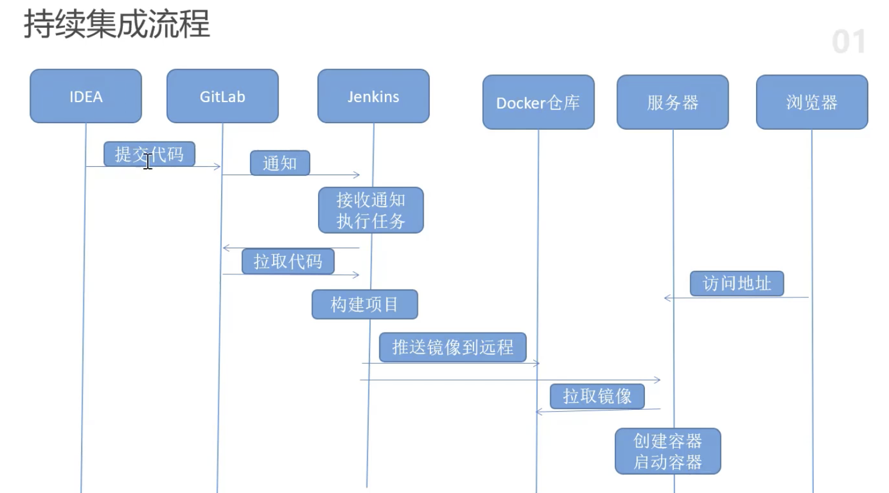

* What Is Spark And Why Performance Matters

> time is money
>
> Learning to unserstand you particular use case and system and how spark will interact with it is a must. to solve the most complex data science problems with spark

* What You Can Expect to Get from This Book

> Help and take you. Spark queries and. Make them. Faster

---

* 安装

> ```javascript
> wget -O /etc/yum.repos.d/jenkins.repo http://pkg.jenkins.io/redhat-stable/jenkins.repo
> rpm --import http://pkg.jenkins.io/redhat-stable/jenkins.io.key
> 
> yum clean all
> yum makecache
> 
> yum install jenkins
> 
> # 检查Jenkins服务状态
> sudo systemctl status jenkins
> # 设置为开机自启动
> sudo systemctl enable jenkins
> # 启动Jenkins服务
> sudo systemctl start jenkins
> ```
>
> 第一次启动的时候遇到问题：
>
> `Failed to start LSB: Jenkins Automation Server`
>
> 是因为`$JAVA_HOME/bin/java` 路径没有添加到`jenkins` 的配置中`vi /etc/rc.d/init.d/jenkins `
>
> 然后配置进去，然后重启就OK了
>
> `note: ` 第一次就算将`JAVA_HOME` 配置进去，也 还是 会报错，使用`yum remome jenkins` 卸载之后，然后在安装一遍，并将`$JAVA_HOME` 添加到配置中成功启动了。

* 第一次登陆之后`http://192.168.99.102:8080/`，需要输入密码，页面中也给出密码所在的位置，进去将密码复制过来，粘进去就可以了。
* 然后点进去就是安装很多很多的东西， 这个比较费时间，等待较长时间。

---

* Docker 安装

> ```bash
> #查看你当前的内核版本
> uname -r
> 
> #安装 Docker
> yum -y install docker
> 
> #启动 Docker 后台服务
> service docker start
> 
> # 配置加速器
> sudo mkdir -p /etc/docker
> sudo tee /etc/docker/daemon.json <<-'EOF'
> {
>   "registry-mirrors": ["https://b7m3tfaq.mirror.aliyuncs.com"]
> }
> EOF
> sudo systemctl daemon-reload
> sudo systemctl restart docker
> 
> 
> # 安装私有仓库
> docker pull registey
> 
> docker run -d -p 5000:5000 --restart always --name registry 708bc6af7e5e
> 
> # 访问： http://192.168.99.102:5000/v2/_catalog
> # 查看到空的一个 {"repositories":[]}
> 
> # 进行配置
> {
>   "registry-mirrors": ["https://b7m3tfaq.mirror.aliyuncs.com"],
>    "insecure-registry":[192.168.99.102:5000]
> }
> 
> # 执行
> systemctl daemon-reload
> systemctl restart docker
> ```

---

* Gitlab 安装

> ```bash
> docker pull gitlab/gitlab-ce
> 
> # 运行
> docker run --name gitlab \
>   --hostname gitlab.example.com \
>   --publish 8443:443 --publish 8880:80 \
>   --restart always \
>   --volume /gitlab/config:/etc/gitlab \
>   --volume /gitlab/logs:/var/log/gitlab \
>   --volume /gitlab/data:/var/opt/gitlab \
>   --privileged=true \
>   gitlab/gitlab-ce:latest
>   
> # 修改一些配置型之后才能使用
> # 文件中配置：
> # vi gitlab.rb
> # external_url 'http://192.168.99.102'
> 
> # /gitlab/data/gitlab-rails/etc
> #   gitlab:
> #    ## Web server settings (note: host is the FQDN, do not include http://)
> #    host: 192.168.99.102
> #    port: 80
> #    https: false
> # 这个配置用于后期 clone pull 等操作
> 
> # 访问gitlab
> # http://192.168.99.102:8880
> # 首次登陆默认有一个 root 账号，然后需要手动输入密码，
> # 确认密码之后，就可以使用 root + 密码登录
> 
> # create project  -> internal -> 项目克隆到本地
> 
> # 机器上安装 git
> git version
> ```

* Jenkins 安装

> 

[DevOps]()




`DevOps` 是一种思想或者方法论，涵盖开发、测试。运维的整个过程，强调三者之间有效的沟通和协作，强调通过自动化的方法管理软件的变更、集成，使得软件从构建到测试。发布更加快捷，可靠，最终按时交付软件

---

* 克隆到本地的工程中创建一个springboot 工程，然后推到 gitlab
* 代码中创建可以打包的插件，为制作镜像准备 

在虚拟机上先创建镜像，先上传jar包

```shell
scp demo-0.0.1-SNAPSHOT.jar root@192.168.99.102:/home/code
```

在jar 的相同目录下创建`Dockerfile`

```dockerfile
from java:8

volume /tmp
add demo-0.0.1-SNAPSHOT.jar app.jar

run bash -c 'touch /app.jar'
entrypoint ["java","-jar","/app.jar"]
```

这样创建比较麻烦，需要一部一部的创建，当然还是you自动化的方法去做，添加 docker 的maven 插件

---

* Maven 插件构建

> 删除上面手动创建的 镜像
>
> ```scala
> docker stop 5f12ad4fdea8
> docker rm 5f12ad4fdea8
> ```
>
> 添加maven 插件
>
> ```xml
> 			<plugin>
> 				<groupId>com.spotify</groupId>
> 				<artifactId>docker-maven-plugin</artifactId>
> 				<version>1.0.0</version>
> 				<configuration>
> 					<imageName>${project.artifactId}</imageName>
> 
> <!--					<dockerDirectory>${project.basedir}/src/main/resources</dockerDirectory>
> 					dockerfile 所在地方
> -->
> 					<dockerDirectory>${project.basedir}/</dockerDirectory>
> 					<imageTags>
> 						<imageTag>${project.version}</imageTag>
> 					</imageTags>
> 
> 					<resources>
> 						<resource>
> 							<targetPath>/</targetPath>
> 							<directory>${project.build.directory}</directory>
> 							<include>
> 								${project.artifactId}-${project.version}.jar
> 							</include>
> 						</resource>
> 					</resources>
> 				</configuration>
> 			</plugin>
> ```
>
> 执行
>
> `mvn -f pom.xml clean package -DskipTests docker:build`
>
> 在这里通过一行命令，就将打包和打镜像完成了。

---

* 在jenkins 首页plugins 安装 `github integration ` 插件


