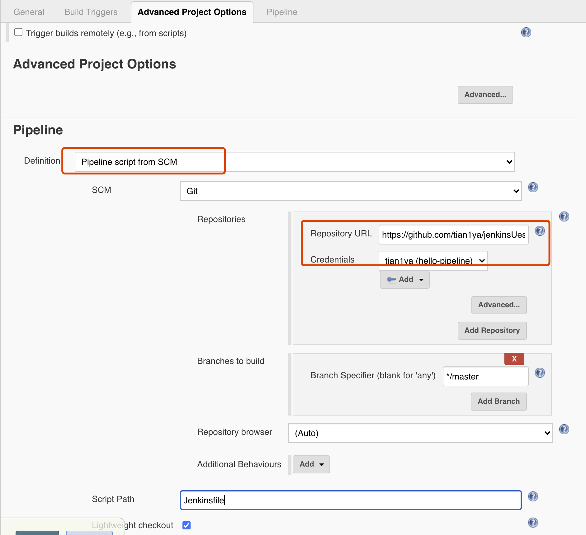
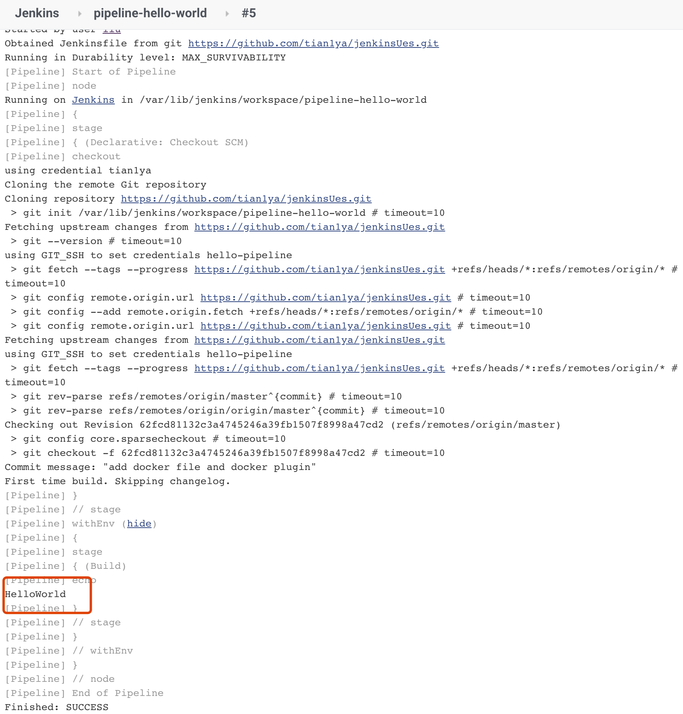

**Jenkins 2.x终于支持pipeline as code**

Jenkinsfile就是一个文本文件,所有部署流水线的逻辑都写在Jenkinsfile中。

pipeline插件从2.5版本开始，才同时支持两种格式的语法。

* 声明式： 脚本式语法的确灵活、可扩展，但是也意味着更复杂
* Grooy 编程

---

**我们让Jenkins从Git仓库拉取pipeline并执行。**

> * 首先需要安装Git插件，然后使用SSH的clone方式拉取代码。所以，需要将Git私钥放到Jenkins上，这样Jenkins才有权限从Git仓库拉取代码。
>
> * Git私钥放到Jenkins
>
>   * Jenkins→Credentials→System→Global credentials
>   * Kind -> SSH Username with private key
>
>   
>
>   Build 之后就出现一下输出，先去拉代码，然后执行Jenkinfile
>
>   
>
>   

