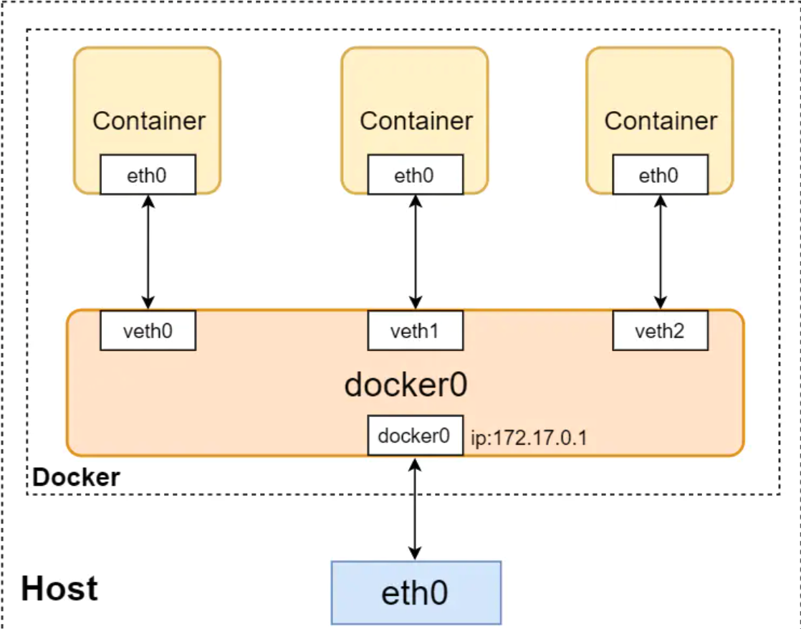

[文章来源](https://juejin.cn/post/6844903847383547911)

几天前，为了解决日常在本地进行日常工作和开发测试之间的矛盾，利用docker在Windows系统中搭建了基于Linux的测试环境：[借助Docker，在win10下编码，一键在Linux下测试](https://juejin.im/post/6844903845374476295)。在这边文章里主要介绍了如何在本地通过docker构建与生产环境基本一致的环境并一键运行、测试我们的代码。Docker官方建议每个容器中只运行一个服务[[1\]](#fn1)，但是我们的项目可能是由多个服务组成，在服务中可能会需要mysql、redis等中间件的支持，所以通常我们将一个项目的不同服务划分到不同容器中。这种做法虽然具有低耦合、高隔离性等优点，但是也增加了服务之间通信的复杂度。

`Docker`容器间的通信方式根据媒介可以分为：`volume共享通信`、`网络通信`等；根据通信范围也可以分为：`同主机通信`和`跨主机通信`等。而本文主要针对容器间的网络通信方法进行讨论。

### 1. Docker的网络驱动模型

Docker的网络驱动模型分类：

- **bridge**：Docker中默认的网络驱动模型，在启动容器时如果不指定则默认为此驱动类型；
- **host**：打破Docker容器与宿主机之间的网络隔离，直接使用宿主机的网络环境，该模型仅适用于Docker17.6及以上版本；
- **overlay**：可以连接多个docker守护进程或者满足集群服务之间的通信；适用于不同宿主机上的docker容器之间的通信；
- **macvlan**：可以为docker容器分配MAC地址，使其像真实的物理机一样运行；
- **none**：即禁用了网络驱动，需要自己手动自定义网络驱动配置；
- **plugins**：使用第三方网络驱动插件；

以上是Docker支持的几种网络驱动模型，它们都具有独特的特点和应用范围，为了更加详细地了解Docker的网络运行原理，下面挑选几种较为重要的网络模型进行研究。

### 2. bridge

#### 2.1 docker的默认网桥



如上图所示为Docker中`bridge`驱动模式的示意图，其中蓝色的模块表示主机上的网卡。当Docker启动时会自动在主机上创建一个虚拟网桥`docker0`，使用默认网络模式创建docker容器时会自动创建一对儿`veth pair`接口，一端连接在docker容器中（如图容器中的`eth0`），一端连接在虚拟网桥`docker0`上（如图`veth`）。这种`veth pair`是一种虚拟网络设备，主要用于不同namespace中（意味着网络隔离）的网络通信，它总是成对存在的。在这里可以把它想象成一对儿靠虚拟网线连接起来的两个虚拟网卡，一端连接着docker容器，一端连接着虚拟网桥`docker0`。

通过这种方式，不同docker容器之间可以通过ip地址互相通信，也可以通过虚拟网桥访问主机上的网络`eth0`（添加iptables规则，将docker容器对目标地址发出的访问通过**地址伪装**的方式修改为主机对目标地址进行访问）。

如果想要外界网络访问docker容器时，需要在docker容器启动时加上参数'-p [主机端口]:[容器端口]'进行端口映射，原理也是通过修改iptables规则将访问[主机端口]的数据转发到docker容器的[容器端口]中，但是这种做法也存在着占用主机有限的端口资源的缺点。


在主机上通过命令`docker network ls`可以查看docker中存在的网络：

```shell
NETWORK ID     NAME      DRIVER    SCOPE
565817c51319   bridge    bridge    local
896c5b089f13   host      host      local
b1d83cd8439c   none      null      local
```

然后通过命令`docker network inspect bridge`查看bridge网络的详细配置：

```shell
xuxliu@Xus-MacBook-Pro ~ % docker network inspect bridge
[
    {
        "Name": "bridge",
        "Id": "565817c51319aa6e1a9b23b4ef1bfbfe56159d56134b576cebc40b0e22572a1d",
        "Created": "2021-06-26T05:22:49.054083476Z",
        "Scope": "local",
        "Driver": "bridge",
        "EnableIPv6": false,
        "IPAM": {
            "Driver": "default",
            "Options": null,
            "Config": [
                {
                    "Subnet": "172.17.0.0/16",
                    "Gateway": "172.17.0.1"
                }
            ]
        },
        "Internal": false,
        "Attachable": false,
        "Ingress": false,
        "ConfigFrom": {
            "Network": ""
        },
        "ConfigOnly": false,
        "Containers": {
            "02a8aa4052cc5db0f9cb50e450921317dc69bf7fb7e44d3b7935cf30d985ada4": {
                "Name": "nginx",
                "EndpointID": "4bc1a57065800bb822f02f02bceb675312efc9f45ca530c54951d7d78fedc26f",
                "MacAddress": "02:42:ac:11:00:03",
                "IPv4Address": "172.17.0.3/16",
                "IPv6Address": ""
            },
            "8aebc4727537e30e7f5e81139da38a540eeed8a05e6dff57623c5a8306a9061a": {
                "Name": "sweet_wright",
                "EndpointID": "167f709ed4bb873d2e32a6a1e84929262c6cb8791edefa153771a0d0dec21f5d",
                "MacAddress": "02:42:ac:11:00:02",
                "IPv4Address": "172.17.0.2/16",
                "IPv6Address": ""
            }
        },
        "Options": {
            "com.docker.network.bridge.default_bridge": "true",
            "com.docker.network.bridge.enable_icc": "true",
            "com.docker.network.bridge.enable_ip_masquerade": "true",
            "com.docker.network.bridge.host_binding_ipv4": "0.0.0.0",
            "com.docker.network.bridge.name": "docker0",
            "com.docker.network.driver.mtu": "1500"
        },
        "Labels": {}
    }
]
```

由上述配置信息可以看出，`docker`网桥的网关的IP为`172.17.0.1`，也即`docker0`，而docker的子网为`172.17.0.0/16`，`docker`将会为容器在`172.17.0.0/16`中分配`IP`，如其中的`sweet_wright容器`的IP为"172.17.0.2/16"、nginx的IP为`172.17.0.3/16`。由于不同容器通过`veth pair`连接在虚拟网桥`docker0`上，所以容器之间可以通过IP互相通信，但是无法通过容器名进行通信：

```shell
# ping 172.17.0.3/16
ping: 172.17.0.3/16: Name or service not known
# ping 172.17.0.3   
PING 172.17.0.3 (172.17.0.3) 56(84) bytes of data.
64 bytes from 172.17.0.3: icmp_seq=1 ttl=64 time=0.201 ms
64 bytes from 172.17.0.3: icmp_seq=2 ttl=64 time=0.133 ms
64 bytes from 172.17.0.3: icmp_seq=3 ttl=64 time=0.134 ms

64 bytes from 172.17.0.3: icmp_seq=4 ttl=64 time=0.215 ms
64 bytes from 172.17.0.3: icmp_seq=5 ttl=64 time=0.172 ms
^C
--- 172.17.0.3 ping statistics ---
5 packets transmitted, 5 received, 0% packet loss, time 65ms
rtt min/avg/max/mdev = 0.133/0.171/0.215/0.033 ms
# 
#         
# ping nginx
ping: nginx: Name or service not known
```

所以，默认的网桥`bridge`上的容器只能通过IP互连，无法通过DNS解析名称或别名。假如我们在container1中部署了Web服务，在container2中部署了mysql，container1中的Web服务往往需要连接container2的mysql，这是只能靠IP进行连接，但是docker也无法保证容器重启后的IP地址不变，所以更好的方式是通过别名进行互联，在网络中加入DNS服务器，将容器名与IP地址进行匹配，省去了手动修改Web服务中连接mysql的IP的过程。

为了实现不同容器通过容器名或别名的互连，docker提供了以下几种：

1. 在启动docker容器时加入`--link`参数，但是目前已经被废弃，废弃的主要原因是需要在连接的两个容器上都创建`--link`选项，当互连的容器数量较多时，操作的复杂度会显著增加；
2. 启动docker容器后进入容器并修改`/etc/host`配置文件，缺点是手动配置较为繁杂；
3. 用户自定义`bridge`网桥，这是目前解决此类问题的主要方法；

#### 2.2 用户自定义bridge

用户自定义bridge可以在容器化的应用程序提供更好的**隔离效果**和更好的**互通性**： 这段话看似有些矛盾，但是其中`更好的隔离效果`是针对外界网络，而`更好的互通性`则是指同一`bridge`下的不同容器之间。还是以之前的分别部署了Web服务和mysql服务的两个容器container1、container2为例，container1只需要对外界网络暴露Web服务的`80`端口，而负责后端的container2只需与container1互连，不需要对外暴露，有效地保护了后端容器的安全性，提高了容器对外的隔离效果。而同属于用户自定义`bridge`的容器container1、container2之间自动将所有端口暴露，方便容器间进行无障碍的通信，而不会遭受到外界的意外访问。

**用户自定义bridge在容器之间提供了自动DNS解析**： 这也是本文讨论的重点，不同于默认bridge只能通过IP互连的限制，用户自定义的bridge自动提供了容器间的DNS解析功能，容器间可以通过容器名或别名进行通信。

---

##### 2.2.1 如何使用用户自定义bridge

创建用户自定义bridge

```shell
xuxliu@Xus-MacBook-Pro ~ % docker network create my-network
364eb01dcc6a0f728142209d6edd0f9f6c0031154d9359fc1a8619553417cd93
```

将Web服务容器和mysql服务容器加入到"my-net"中，并观察变化：

```shell
docker network connect my-network nginx  			# 将Web服务加入my-net网络中
docker network connect my-network sweet_wright
```

```shell
xuxliu@Xus-MacBook-Pro ~ % docker network inspect my-network
[
    {
        "Name": "my-network",
        "Id": "364eb01dcc6a0f728142209d6edd0f9f6c0031154d9359fc1a8619553417cd93",
        "Created": "2021-07-05T11:29:48.1298225Z",
        "Scope": "local",
        "Driver": "bridge",
        "EnableIPv6": false,
        "IPAM": {
            "Driver": "default",
            "Options": {},
            "Config": [
                {
                    "Subnet": "172.18.0.0/16",
                    "Gateway": "172.18.0.1"
                }
            ]
        },
        "Internal": false,
        "Attachable": false,
        "Ingress": false,
        "ConfigFrom": {
            "Network": ""
        },
        "ConfigOnly": false,
        "Containers": {
            "02a8aa4052cc5db0f9cb50e450921317dc69bf7fb7e44d3b7935cf30d985ada4": {
                "Name": "nginx",
                "EndpointID": "b6f0d3f169badf42780636822c4cee849ccfe83c7d19fa923a27555fc06a635e",
                "MacAddress": "02:42:ac:12:00:02",
                "IPv4Address": "172.18.0.2/16",
                "IPv6Address": ""
            },
            "8aebc4727537e30e7f5e81139da38a540eeed8a05e6dff57623c5a8306a9061a": {
                "Name": "sweet_wright",
                "EndpointID": "c5545bec04c87214b64dfe1c31e1fc3f03f3ce86eddc77df1401f35e6b6acd52",
                "MacAddress": "02:42:ac:12:00:03",
                "IPv4Address": "172.18.0.3/16",
                "IPv6Address": ""
            }
        },
        "Options": {},
        "Labels": {}
    }
]
```

如上所示，用户自定义网络`my-network`的子网为`172.18.0.0/16`，所以两docker容器在`my-network`网络中的`IP`分别为`172.18.0.3/16`、`172.18.0.2/16`，与之前的`172.17.0.2/16`、`172.17.0.3/16`不同。

```shell
# ping nginx
PING nginx (172.18.0.2) 56(84) bytes of data.
64 bytes from nginx.my-network (172.18.0.2): icmp_seq=1 ttl=64 time=0.149 ms
64 bytes from nginx.my-network (172.18.0.2): icmp_seq=2 ttl=64 time=0.183 ms
64 bytes from nginx.my-network (172.18.0.2): icmp_seq=3 ttl=64 time=0.183 ms
```

断开网络： 由于我们的容器仍然连接着默认bridge`docker0`，而现在我们已经不需要它，所以应该将容器与`docker0`的连接断开，执行以下操作：

```
docker network disconnect bridge test_demo
docker network disconnect bridge mysqld5.7
```

