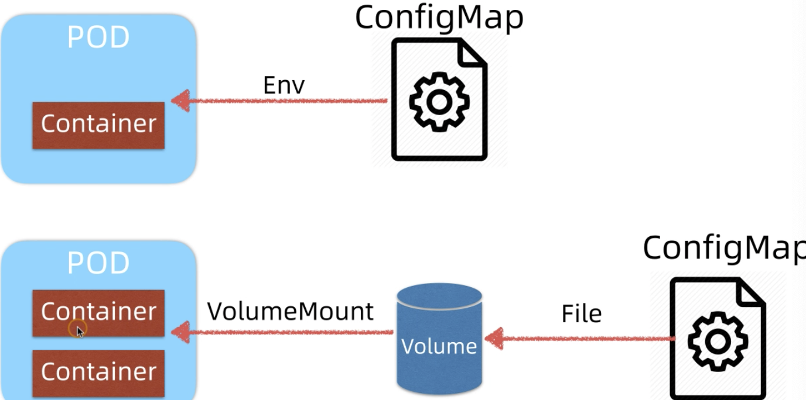

* cm: 容器中注入配置文件
* secret: 存储需要加密的配置，存储的是 base64加密后的数据
* volume: 为 pod 提供共享存储卷能力
* Pv/pvc: 持久卷

cm 配置管理机制

* 原理
* 演示
* cm配置更新传播

---

当`Pod` 起来之后，`cm` 以环境变量的方式，注入到 `pod` 中，也可以将配置注入到 `volume`， 从 `colume` 读入配置



```yaml
apiVersion: v1
kind: ConfigMap
metadata:
	name: petclinic-config
data:
	SPRING-PROFILES_ACTIVE: mysql
	DATASOUREC_URL: jdbc:mysql://mysql/petclinic
	DATASOURCE_USERNAME: root
	DATASOURCE_PASSWORD: petclinic
	DATASOURCE_INIT_MODE: always
	TEST_CONFIG: test_config_v1
```

```yaml
apiVersion: apps/v1
kind: Deployment
metadata:
	name: petclinic
spec:
	selector:
		matchLabels:
			app: petclinic
	replicas: 1
	template:
		metadata:
			labels:
				app: petclinic
		spec:
			containers:
				- name: petclinic
					image: spring2go/spring-petclinic:1.0.1.RELEASE
					envFrom:
						- configMapRef:
							name: petclinic-config
```

```yaml
apiVersion: v1
kind: Service
metadata:
	name: mysql
spec:
	seletor:
		app: mysql
	type: ClusterIP
	ports:
		- name: tcp
			port: 3306
			targetPort: 3306
```

```yaml
apiVersion: v1
kind: Service
metadata:
	name: petclinic
spec:
	selector: 
		app: petclinic
	type: NodePort
	ports:
		- name: http
			port: 8080
			targetPort: 8080
			nodePort: 31080
```

`kubectl get cm` 查看配置

`kubectl describe cm configName`： 可以查看到里面的内容。

`kubectl exec pod/servicceName printEnv`  打印出环境变量

---

正在运行的 `Pod` 当修改了其的 `cm`， 加入这个时候修改了 `cm` 并且 `apply` 了`cm` 这个是 `Pod` 中的 `Env` 并没有马上更新到`Pod` 中，那么如何才能立刻更新 `Pod` 中的环境变量呢？

1. 删除 `Pod` ，当`Pod` 重新拉起来之后就会重新读 `cm`
2. `cm` 修改 `metadata` 中的 `name`,  也修改 `pod` 中的 `configMapRef` 名字，然后重新将2个文件 `apply` 就可以更新读。

---

使用CM

* 环境变量注入到 Pod 中

  上面的例子所示， 这样是将所有的数据全部以环境变量的方式导入进来

  ```yaml
  ...
  envFrom:
  	- configMapRef:
  	name: petclinic-config
  ...
  ```

  也可以只读一个变量进来，然后在当前 Pod 中重新完成复制

  ```yaml
  ...
  env:
  # 定义环境变量
  - name: PLAYER_INITIAL_LIVES # 请注意这里和 ConfigMap 中的键名是不一样的
  	valueFrom:
  		configMapKeyRef:
  			name: game-demo           # 这个值来自 ConfigMap
  			key: player_initial_lives # 需要取值的键
  - name: UI_PROPERTIES_FILE_NAME
  	valueFrom:
  		configMapKeyRef:
  			name: game-demo
  			key: ui_properties_file_name
  ...
  ```

  第三种方式就是通过挂载卷方式

  ```yaml
  apiVersion: v1
  kind: ConfigMap
  metadata:
  	name: game-demo
  data:
  	player_initial_lives: "3"
    ui_properties_file_name: "user-interface.properties"
  
  ---
  
  apiVersion: v1
  kind: Pod
  metadata:
  	name: cm-demo-pod
  spec:
  	containers:
  		- name: demo
  			image: spring2go/spring-petclinic:1.0.0.RELEASE
  			volumeMounts:
  				- name: config-demo
  					mountPath: /etc/config
  	volumes:
  		- name: config-demo
  			configMap:
  				name: game-demo	
  ```

  进入到 `Pod` 中就可以看到配置了

  `kubectl exec -it cm-demo-pod /bin/bash`

  三种方式是可以同时使用的，达到不同键，但是值相同的结果

  [官方文档例子，三种方式同时使用](https://kubernetes.io/zh/docs/concepts/configuration/configmap/)

  **热更新**

  `kubectl edit cm game-demo` 

  进入编辑模式，然后修改配置

  


