#### 主要概念

* service
  * 反向代理
  * 负载均衡： 可以在 4层或者7层
  * NodePort：其中一种 `service`
  * `CclusterIP`： 集群内部调用 `Servicce`
* Label
* Selector

---

```yaml
apiVersion: v1
kind: Service
metadata:
	name: petclinic
spec:
	selector: 
		app: petclinic
	type: NodePort
	ports:
		- name: http
			port: 8080
			targetPort: 8080
			nodePort: 31080
```

Pod

```yaml
apiVersion: v1
kind: Pod
metadata:
  name: petclinic
  labels:
  	app: petclinic
spec:
  containers:
    - name: petclinic
      image: spring2go/spring-petclinic:1.0.0.RELEASE
```

`kubectl apply -f .`

将当前目录下所有的 yaml 文件进行创建

由于 `Pod` 是部署在了 `node2` 的节点上，所以在 `Node2` 的机器上开了端口

`http://192.168.99.102:31080/` 就可以访问到了

---

#### 蓝绿发布

##### 基本原理

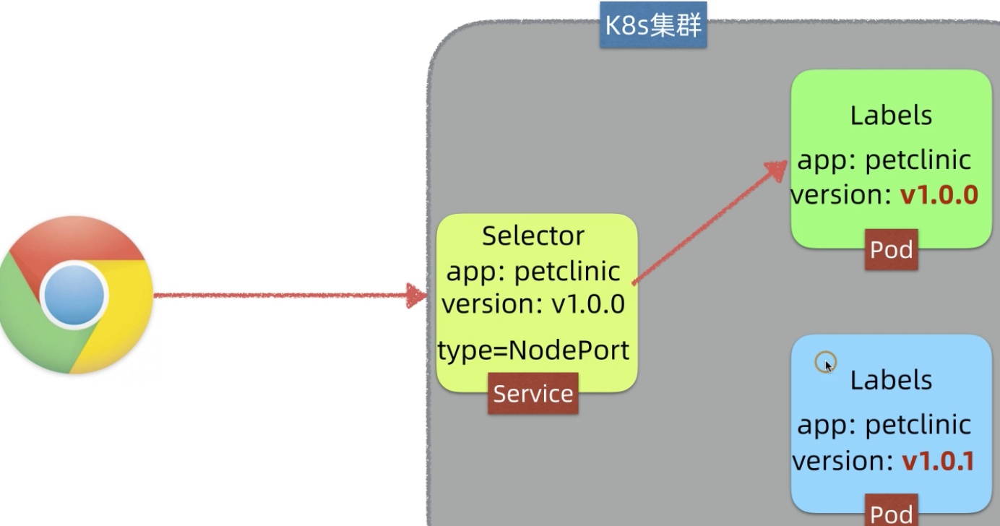

`pod` 添加 `version` 的 `label`

目前 `service` 指向老版本(绿色)，那么现在将新的 `pod` 推到集群，然后打上标签 `version:v1.0.1` 现在要 `service` 指向新的版本。修改 `serviec` 的label，那么 `service` 就会指向新的`Pod`

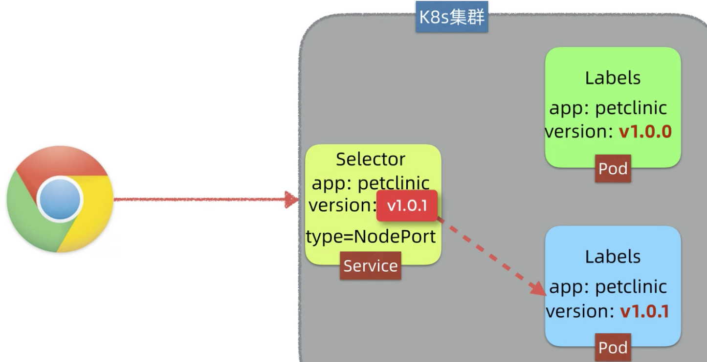

```yaml
apiVersion: v1
kind: Pod
metadata:
	name: petclinic-v1.0.0
	labels:
		app: petclinic
		version: v1.0.0
spec:
	containers:
		- name: petclinic
			image: spring2go/spring-petclinic:1.0.0.RELEASE
```

```yaml
apiVersion: v1
kind: Pod
metadata:
	name: petclinic-v1.0.1
	labels:
		app: petclinic
		version: v1.0.1
spec:
	containers:
		- name: petclinic
			image: spring2go/spring-petclinic:1.0.1.RELEASE
```

```yaml
apiVersion: v1
kind: Service
metadata:
	name: petclinic
spec:
	selector: 
		app: petclinic
		version: v1.0.0
	type: NodePort
	ports:
		- name: http
			port: 8080
			targetPort: 8080
			nodePort: 31080
```

```yaml
apiVersion: v1
kind: Service
metadata:
	name: petclinic
spec:
	selector: 
		app: petclinic
		version: v1.0.1
	type: NodePort
	ports:
		- name: http
			port: 8080
			targetPort: 8080
			nodePort: 31080
```

`kubectl get pods --show-labels` 查看 `所有的labels`

在 `v1.0.0` 版本之后，对文件进行修改 `version: v1.0.1`  然后直接执行 `kubectl apply -f 文件名`

---

#### 内部反向代理 ClusterIP

> 使用 `ClusterIP` 类型的  `servicce` 完成集群内部的访问，这样的场景如 `web` 访问其 `db`， 微服务直接的访问。在集群内部可以完成基于`域名`的访问。

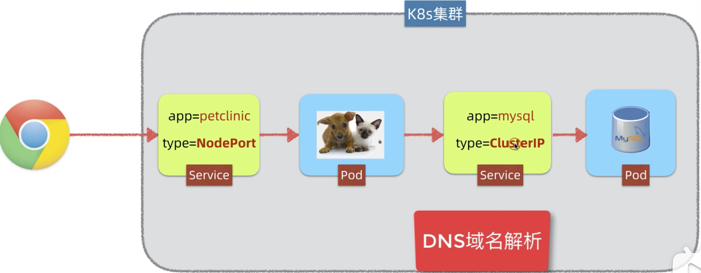

```yaml
apiVersion: V1
kind: Pod
metadata:
	name: mysql
	labels:
		app: mysql
spec:
	containers:
		- name: mysql
			image: mysql:5.7
			env:
				- name: MYSQL_ROOT_PASSWORD
					value: petclinic
				- name: MYSQL_DATABASE
					value: petclinic
```

```yaml
apiVersion: v1
kind: Service
metadata:
	name: mysql
spec:
	seletor:
		app: mysql
	type: ClusterIP
	ports:
		- name: tcp
			port: 3306
			targetPort: 3306
```

```yaml
apiVersion: apps/v1
kind: Deployment
metadata:
	name: petclinic
spec:
	selector:
		matchLabels:
			app: petclinic
	replicas: 1
	template:
		metadata:
			labels:
				app: petclinic
		spec:
			containers:
				- name: petclinic
					image: spring2go/spring-petclinic:1.0.1.RELEASE
					env:
						- name: SPRING_PROFILES_ACTIVE
							value: mysql
						- name: DATASOUREC_URL
							value: jdbc:mysql://mysql/petclinic
						- name: DATASOURCE_USERNAME
							value: root
						- name: DATASOURCE_PASSWORD
							value: petclinic
						- name: DATASOURCE_INIT_MODE
							value: always
```

`jdbc:mysql://mysql/petclinic` 第二个 `mysql` 是使用的 `mysql` 服务的域名，集群会直接去调 `mysql` 数据库服务。

```yaml
apiVersion: v1
kind: Service
metadata:
	name: petclinic
spec:
	selector: 
		app: petclinic
	type: NodePort
	ports:
		- name: http
			port: 8080
			targetPort: 8080
			nodePort: 31080
```

注意上述的创建时有依赖过程的，先创建 `mysql` 的服务

---

#### Service 网络

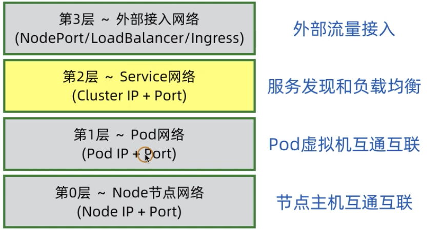

`k8s` 中的`Pod`	在整个集群上可以看做是在一个水平的层次，都可以相互访问。

* `IP` 访问

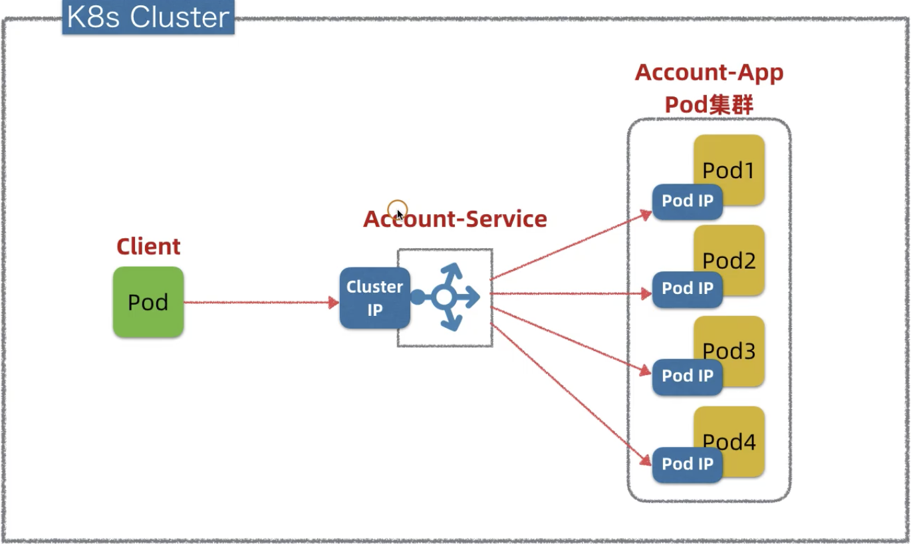

* 通过域名访问： 古老的 DNS 技术

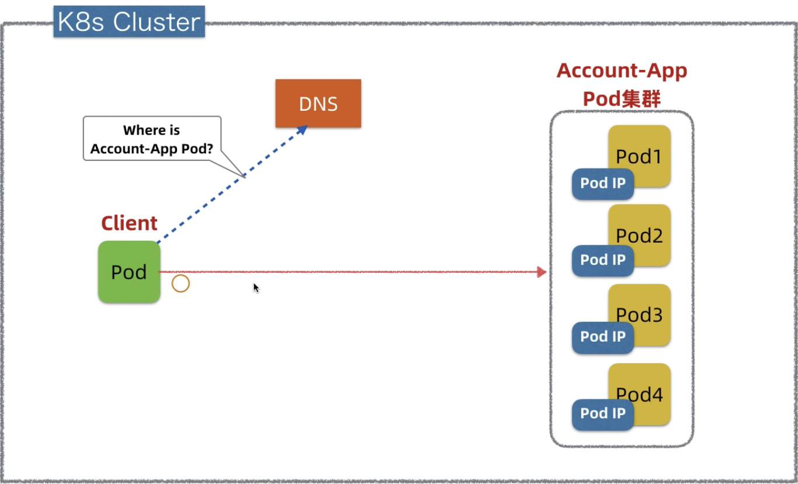

* 服务注册

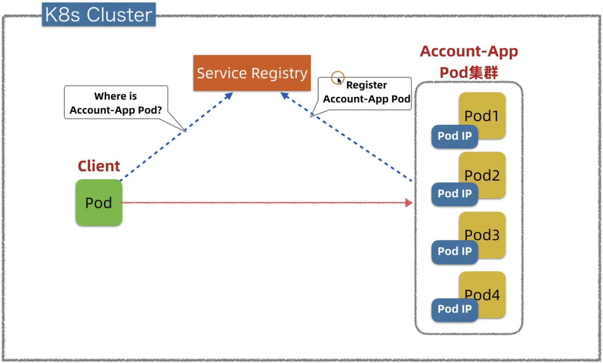

`注册中心`存储着 `Pod` 的名字以及 `IP`

* 服务 发现

`Pod`  发布的是，将其`IP` 注册到注册中心(`k8s master`)

`Service` 发布的时候，配置的 `clusterIP` 也进行注册

`kube-proxy` 监听注册中心，发现服务 和 `IP`，` Pod` 和`IP` 之间的隐射表，修改本地的 linux 转发规则

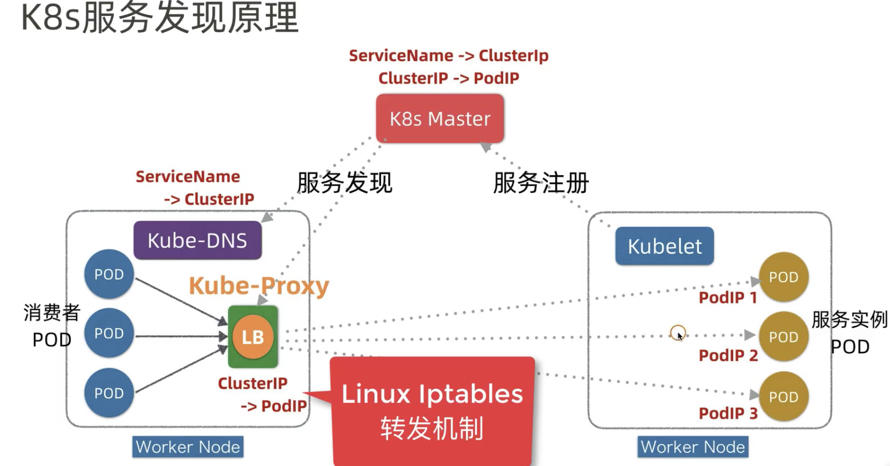

`kube-DNS` 也监听 `k8s master` 中配置，获取到域名和`IP`之间的关系,  这样可以通过域名就能访问`Pod`

---

#### 对外暴露服务的方案

* `NodePort`

* `LoadBalance`

* `Ingress`

  这里就是`k8s` 网络的第4层网络, 在4层网络中 ，只有第 1层网络是物理网络。`kube-proxy` 每个节点上都有，掌握节点上的所有网络`IP`， 在节点上暴露一个端口，这个端口让`kube-proxy` 知道，当这个端口来流量了，`kube-proxy` 将流量流向`Pod`

  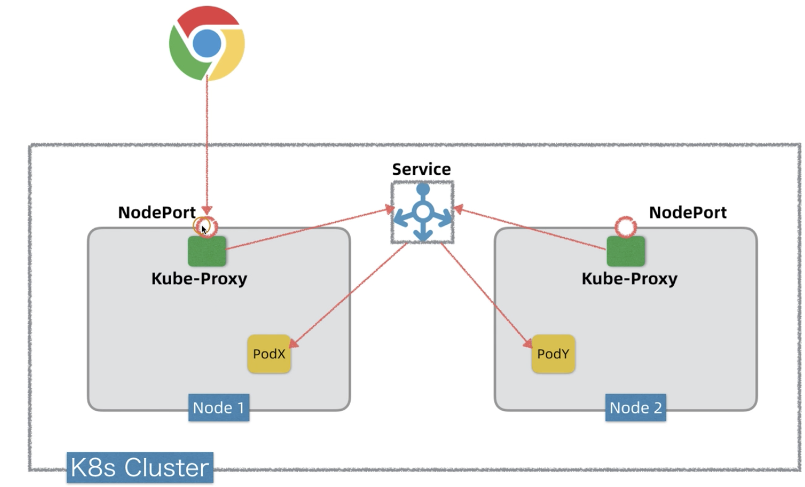

  * 用户访问 `NodePort`
  * `kube-proxy` 监听端口，将流量转发到 `service`
  * `service`转到 `Pod`

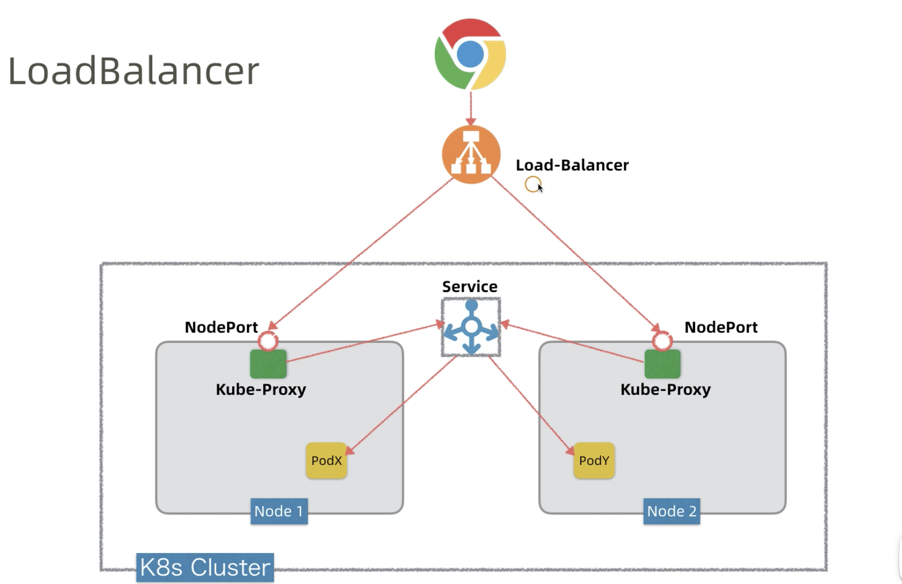

`Load-Balancer` 将请求转发到`NodeIP:NodePort`

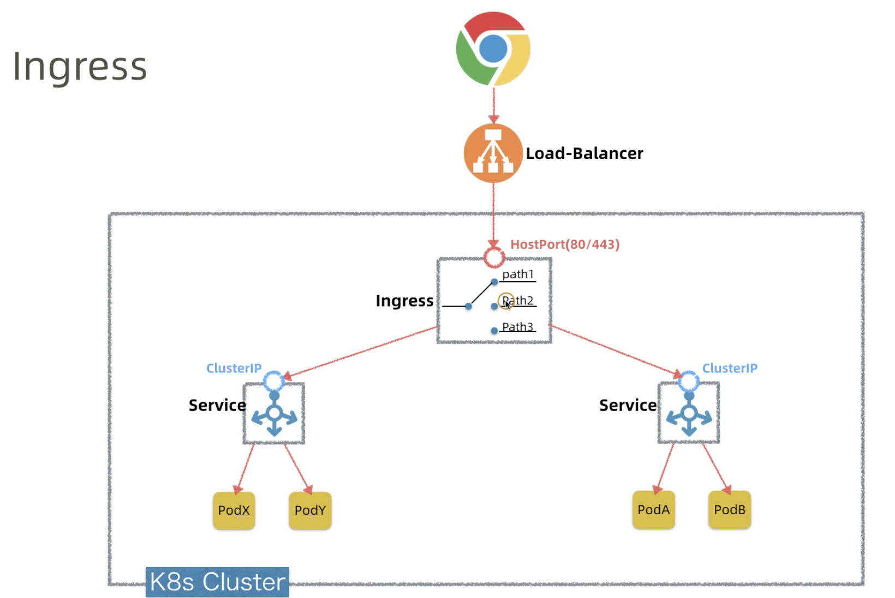

Ingress exposes HTTP and HTTPS routes from outside the cluster to services within the cluster. Traffic routing is controlled by rules defined on the Ingress resource.

可以认为 `Ingress` 为一个特殊的 `service`， 其可以根据 `path` 或者是 `域名` 转发，其提供了**7层反向代理**，可以`ssl证书、限流、监控`等和 `nginx` 类似的功能。通过 `80/443` 向外暴露。

---

采用 `裸机 bare-metal` 的方式安装，查看安装后：

`kubectl get pods -n ingress-nginx`

`kubectl get svc -n ingress-nginx`

> `ingress-nginx-controller NodePort 10.97.230.182 <none> 80:31887/TCP,443:30453/TCP   5m10s`
>
> 启动一个  `service` 它开放出来2个端口，30453和 31887，分别对应node 的443和80端口

```yaml
apiVersion: apps/v1
kind: Deployment
metadata:
	name: petclinic
spec:
	selector:
		matchLabels:
			app: petclinic
	replicas: 3
	template:
		metadata:
			labels:
				app: petclinic
		spec:
			containers:
				- name: petclinic
					image: spring2go/spring-petclinic:1.0.1.RELEASE
					imagePullPolicy: IfNotPresent

---

apiVersion: v1
kind: Service
metadata:
	name: petclinic
spec:
	selector: 
		app: petclinic
	ports:
		- name: http
			port: 8080
			targetPort: 8080
```

ingress

```yaml
apiVersion: networking.k8s.io/v1
kind: Ingress
metadata:
	name: ingress-nginx
spec:
	rules:
		- host: foo.bar.com
			http:
				paths:
					- path: /
						pathType: Prefix
						backend:
							service:
								name: petclinic
								port: 
									number: 8080
```

创建会遇到问题

`error when creating "ingres.service.yaml": Internal error occurred: failed calling webhook "validate.nginx.ingress.kubernetes.io": Post "https://ingress-nginx-controller-admission.ingress-nginx.svc:443/networking/v1beta1/ingresses?timeout=10s": context deadline exceeded`

[解决方法:把Webhook删了](https://my.oschina.net/u/4263597/blog/4656382)

`kubectl delete -A ValidatingWebhookConfiguration ingress-nginx-admission`

**Note:** 使用 `ingress` 访问的时候必须使用域名，需要在 `/etc/hosts` 中进行配置，然后使用 `ingress` 的端口映射就可以访问了,

 配置

> 192.168.99.101 foo.bar.com

`http://foo.bar.com:31887/`

查看 `ingress` 的详情

`kubectl describe ingress ingress-nginx`

查看 `ingress` 的端口隐射

`kubectl get svc -n ingress-nginx`

---

`ingress` 访问多个后端 `service`

还是保持上面的 `deployment` 和 `service` 另外再创建

```yaml
apiVersion: apps/v1
kind: Deployment
metadata:
	name: petclinic-v0
spec:
	selector:
		matchLabels:
			app: petclinic-v0
	replicas: 3
	template:
		metadata:
			labels:
				app: petclinic-v0
		spec:
			containers:
				- name: petclinic
					image: spring2go/spring-petclinic:1.0.0.RELEASE
					imagePullPolicy: IfNotPresent

---

apiVersion: v1
kind: Service
metadata:
	name: petclinic-v0
spec:
	selector: 
		app: petclinic-v0
	ports:
		- name: http
			port: 8080
			targetPort: 8080
```

更新 `ingress`

```yaml
apiVersion: networking.k8s.io/v1
kind: Ingress
metadata:
	name: ingress-nginx
spec:
	rules:
		- host: foo.bar.com
			http:
				paths:
					- path: /oups
						pathType: Prefix
						backend:
							service:
								name: petclinic
								port: 
									number: 8080
					- path: /owners/find
						pathType: Prefix
						backend:
							service:
								name: petclinic-v0
								port: 
									number: 8080
```

也就是完成：

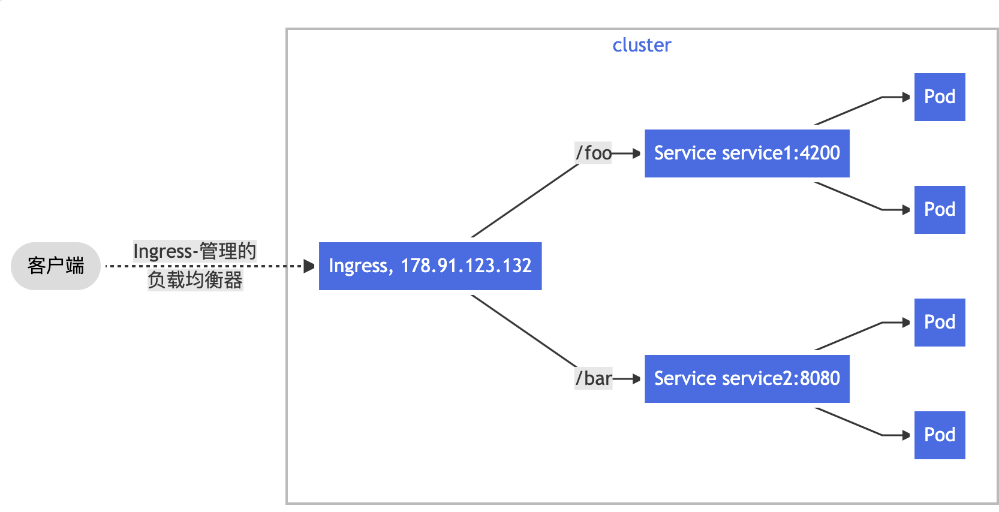

**note:**

> 通过host和path定位到某一个service，同时该path 必须是该service中存在的一个路径

也可以配置不同的域名，访问到不同的 `Serviec`

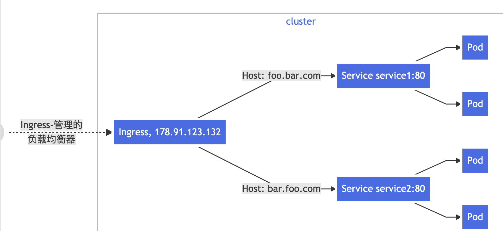

---

[在官网](https://kubernetes.github.io/ingress-nginx/user-guide/nginx-configuration/) 还有很多 `HTTPS`等的访问配置

