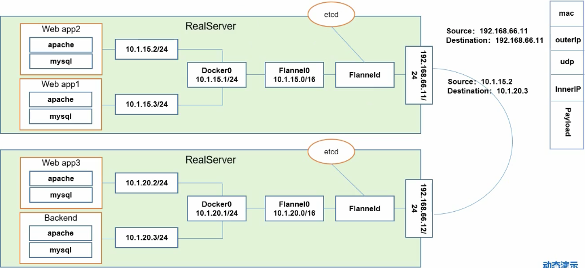

K8s 的网络模型假定所有的Pod 都在一个可以直接连通的**扁平的网络空间**中。

flunnel 可以实现这个假设

> 它功能是让集群中的不同节点主机创建的Docker 容器都具有全集群**唯一的虚拟IP地址**，而且它还能在这些IP地址之间建立一个覆盖网络，通过这个覆盖网络，将数据包原封不动的传递到目的容器内。
>
> 每个Pod 均向flannel申请一个IP，然后这个IP存储在etcd 中。后面每次其他pod向flannel 申请的时候先去etcd访问看是否ip重复。
>
> 然后后续pod 之间通信的时候，也会去etcd查ip

---

网络通信方式主要解决三个问题

* 同一个Pod 内的多个容器之间： 

  >  通过 pause 共享网络栈通信(Docker0网桥，在同一个网段内)。

* 各个Pod 之间的通信，Overlay Network

  > Pod1 和 Pod2 不在同一个主机，Pod 的地址是和 docker0在同一个网段的，但是docker0网段和宿主网卡是两个完全不同的IP 网段，**并且不同Node 之间的通信只能通过宿主机的物理网卡进行**，将Pod 的IP和所在Node 的Ip 关联起来，通过这个关联让Pod 可以互相访问(给ip1给ip2 容器发送信息，那么可以根据ip1和ip2找到其对应的物理网卡的ip11和ip22，先将数据包ip11发送到ip22，然后在ip22所在的物理机器找node 上的容器ip1，数据就发送达到了。)
  >
  > Pod1 和 Pod2 在同一台机器，**通过docker0 网桥直接转发到 pod2**，不需要经过 flannel

* Pod 个 Service 之间的通信，各个节点的 Iptables 规则

---

* Flannel 是CoreOS 对K8s 设计的一个网络规划服务，简单来说，**它的功能是让集群中的不同节点主机创建的Docker 容器都全局唯一的一个虚拟IP地址，而且它能在这些IP 地址之间建立一个覆盖网络Overlay network，通过这个覆盖网络，将数据包原封不动的传递到目标容器中**。

> 
>
> (右侧上角Destination 的值应该是 192.168.66.12)
>
> 1. 在node 服务器上会安装一个 flanneld 的守护进程,它会去监听一个服务器端口，这个端口用于后期转发/接收数据包
> 2. 当 flanneld 开启之后会其开启 flanneld0 的网桥，这个网桥去收集/捕获 Docker0 发出来的数据包/数据报文。
> 3. 当 flanneld 收集到 app2 的报文之后会去简析报文，去etcd 中查看要去的路径(etcd中存储所有ip以及node的mac物理网卡地址，以及flannel分配的ip以及node 的物理ip)，然后 flannel 会封装为自己的报文，然后转发到目的Node(从etcd中可以查到分配的ip和node的物理ip对应关系)
> 4. 目的地的 flanneld 会对其报文进行解析，然后到达目的 容器
>
> note: k8s 中的容器的ip 需是唯一的。
>
> etcd 为 Flannel 提供的信息
>
> > 存储管理Flannel 可分配的 IP 地址段资源
> >
> > 监控 ETCD 中每个 Pod 的实际地址，并在内存中建立维护 Pod 节点路由表（封装信息的时候不止封装了Node 的地址，而且还有Pod 的目的地址）

---

**三层网络**

> 
>
> 其中service 和 pod 的网络都是虚拟的，其中pod网络就是上面提到的 扁平网络 假设。
>
> 节点网络是物理网络。
>
> Pod 和 Pod 通信，逻辑上理解是Pod 扁平网络之间交换数据，实际上是Pod - 节点网络 - Pod 三者之间数据交换

---

**Kube-proxy**

Kube-proxy是一个简单的网络代理和负载均衡器，它的作用主要是负责Service的实现，具体来说，就是实现了内部从Pod到Service和外部的从NodePort向Service的访问。

- 在这种模式下，kube-proxy监视Kubernetes主服务器添加和删除服务和端点对象。对于每个服务，它安装iptables规则，捕获到服务的clusterIP（虚拟）和端口的流量，并将流量重定向到服务的后端集合之一。对于每个Endpoints对象，它安装选择后端Pod的iptables规则。

**Kube-dns**

Kube-dns用来为kubernetes service分配子域名，在集群中可以通过名称访问service；通常kube-dns会为service赋予一个名为“service名称.namespace.svc.cluster.local”的A记录，用来解析service的clusterip。

---

**Flannel**

Flannel之所以可以搭建kubernets依赖的底层网络，是因为它可以实现以下两点：

- 它给每个node上的docker容器分配相互不想冲突的IP地址；
- 它能给这些IP地址之间建立一个覆盖网络，同过覆盖网络，将数据包原封不动的传递到目标容器内。

- Flannel是CoreOS团队针对Kubernetes设计的一个网络规划服务，简单来说，它的功能是让集群中的不同节点主机创建的Docker容器都具有全集群唯一的虚拟IP地址。
- 在默认的Docker配置中，每个节点上的Docker服务会分别负责所在节点容器的IP分配。这样导致的一个问题是，不同节点上容器可能获得相同的内外IP地址。并使这些容器之间能够之间通过IP地址相互找到，也就是相互ping通。
- Flannel的设计目的就是为集群中的所有节点重新规划IP地址的使用规则，从而使得不同节点上的容器能够获得“同属一个内网”且”不重复的”IP地址，并让属于不同节点上的容器能够直接通过内网IP通信。
- Flannel实质上是一种“覆盖网络(overlaynetwork)”，也就是将TCP数据包装在另一种网络包里面进行路由转发和通信，目前已经支持udp、vxlan、host-gw、aws-vpc、gce和alloc路由等数据转发方式，默认的节点间数据通信方式是UDP转发。

