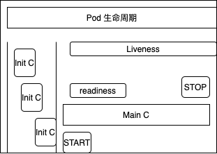

资源清单：剧本，写好了k8s 每一步怎么去做。

---

* k8s 中的资源
* 资源清单
* 常使用字段解释
* 容器生命周期

---

#### k8s 中的资源

* 名称空间级别
* 集群级别
* 元数据

K8s 中所有的内容都被抽象为资源，资源实例化之后，叫做对象。

##### 名称空间级别

> Pod、RS、Deploment、StatefulSet、DaemonSet、Job、CronJob
>
> 服务发现及负载均衡， service， ingress
>
> 存储卷、CSI
>
> 特殊类型的存储卷：ConfigMap、Secret
>
> 这里的资源不受现在，会使用集群的最大资源

##### 集群级别

> Namespace、Node、Role、ClusterRole：校长、RoleBinding：角色绑定、ClusterRoleBinding：角色绑定权限

##### 元数据资源

> HPA、PodTemplate、LimitRange

---

**YAML**

* 基本语法

  > - 大小写敏感
  > - 使用缩进表示层级关系
  > - 缩进不允许使用tab，只允许空格
  > - 缩进的空格数不重要，只要相同层级的元素左对齐即可
  > - '#'表示注释

* 数据类型

  > - 对象：键值对的集合，又称为映射（mapping）/ 哈希（hashes） / 字典（dictionary）
  > - 数组：一组按次序排列的值，又称为序列（sequence） / 列表（list）
  > - 纯量（scalars）：单个的、不可再分的值

* 对象

  > 对象键值对使用冒号结构表示 **key: value**，冒号后面要加一个空格。
  >
  > 也可以使用 **key:{key1: value1, key2: value2, ...}**。
  >
  > 还可以使用缩进表示层级关系；
  >
  > ```shell
  > key: 
  >     child-key: value
  >     child-key2: value2
  > ```

* 数组

  > 以 **-** 开头的行表示构成一个数组：
  >
  > ```shell
  > - A
  > - B
  > - C
  > ```
  >
  > YAML 支持多维数组，可以使用行内表示：
  >
  > ```
  > key: [value1, value2, ...]
  > ```
  >
  > ```
  > -
  >  - A
  >  - B
  >  - 
  > ```
  >
  > ```
  > companies:
  >     -
  >         id: 1
  >         name: company1
  >         price: 200W
  >     -
  >         id: 2
  >         name: company2
  >         price: 500W
  > ```
  >
  > ```json
  > companies: [{id: 1,name: company1,price: 200W},{id: 2,name: company2,price: 500W}]
  > ```

---

#### 必须存在 的属性

* version: k8s api 的版本，目前基本上是v1，可以使用 `kebectl api-version` 查询 
* apiVersion: group/apiVersion 如果没有给定group 名称，那么久默认为core，可以使用 `kubectl apt-versions` 获取当前k8s 版本上所有的 apiVersiob 版本信息
* kind: yaml 文件定义的资源类型和角色，如Pod
* metadata: 元数据对象，固定值就写 metadata
  * name 元数据对象迷你给自己，如命名Pod 的名字
  * namespace: 对象的命名空间，我们自己定义
  * labels
  * annotations
* Spec: 详细定义对象

```shell
kubectl explain pod 查看其解释
 
kubectl explain pod.metadata 查看其元数据

kubectl explain pod.spec

kubectl get pod -n kube-system kube-proxy -o yaml 查看yaml 文件
```


这里指定`command` 启动命令之后就会覆盖镜像本身带的启动命令

#### 一些指令

```shell
kubectl get pod --show-labels
kubectl get pod -l app 筛选出key=app 的pod

kubecl get pod -o wide 详细信息展示

kubecl get pod -w 监控，当里面的资源发生变化的时候打印

kubectl get pod test -o yaml/json pod 的所有属性按照 yaml 打印

kubectl describe pod app-demo 更加详细信息，k8s 对pod 的描述信息

kubectl exec -it <podName> -c [containName]

kubectl logs podName 容器本身的日志信息

kubectl create -f filename 
kubectl explain pod.spec 查询文档说明

kubectl exec -it podName -c containName 命令
```

#### Pod 探究

```yaml
apiVersion: v1
kind: Pod
metadata:
  name: pod-demo
  namespace: default
  labels:
    app: myapp
spec:
  containers:
  - name: myapp-1
    image: wangyanglinux/myapp:v1
  - name: busybox-1
  	image: busybox:1.34.1
  	command:
  	- "/bin/sh"
  	- "-c"
  	- "sleep 3600"
```

```shell
# 获取pod 所在node ip 
kubectl get pod -o wide

# 发送请求, 打印出返回
curl 10.244.1.6

# 进入pod 修改 容器内html信息，使得上一步骤返回的信息发生变化
# 镜像中的html 所在目录 usr/share/nginx/html/index.html
kubectl exec -it pod-demo -c myapp-1 -- /bin/sh

# 重新执行，打印修改后的内容
curl 10.244.1.6

```

#### 容器生命周期

重启策略

1. `Always： 默认： 无论任务情况终止的，都将重启`
2. `OnFailure` 容器正常结束(退出码为0)，不会重启
3. `Never`

`pause` 先启动

iniC(会有0个或多个iniC 初始化串行工作，第一次initc结束后续的initC才能继续)：ini C 容器执行失败，pod重启。initc 执行全部成功，并且执行结束，全部 退出之后，所以initC 是一个批处理，开始执行 mainC。

Main C(主容器镜像)：Start 到 Stop，在这个过程中有  Readiness 和 liveness，MainC 执行结束 Pod 就 Stop 了。中间会有多个Main C，直接是没有明显的前后顺序，同一个进行需要不同的port。

mainC 会有2个钩子，

1. 镜像启动前执行的命令：
2. 镜像启动后执行的命令：

Readiness: 容器不仅仅是起来了，而且里面的服务以及就绪可以向外提供服务了，当它执行成功之后容器的状态才会更新为 `RUNNING`

liveness: 生存检测，服务有可能是假死，不能正常向外提供访问。



Pod 能够有多个容器，应用运行在容器里面，但是它也可能有一个或者多个先于应用启动的Init 容器，

Init 容器和普通的容器非常相似，除了一下2点

* Init 容器总是运行到成功完成为止
* 每个Init 容器都必须在下一个 Init 容器启动之前成功完成

如果Pod 的Init 容器失败，K8s 会不断的重启该Pod，知道Init 容器蔡成功为止，然后如果Pod 对应的 restartPolicy 为 Never，它不会重新启动。

因为initC 容器具有和应用程序容器分离的单独镜像，所以在启动的时候相关代码具有如下优势

1. 可以包含并行使用工具，但是出于安全考虑，不建议在应用程序容器中包含这些使用工具
2. 应用程序进行可以分离出创建和部署的角色，二没有必要联合他们创建一个单独的镜像
3. init 容器使用 linux namespace 所以相对应用程序容器来说具有不同的文件系统视图，所以能够具有访问secret 的权限，二应用程序则不能
4. 它们必须在应用程序容器启动之前完成，而应用程序是并行运行的，所以init 容器能够提供了一种简单的阻塞或者延迟应用容器的启动的方法，直到满足一组先决条件

####  探针

对容器执行的初期诊断，要执行诊断 kubectl 调用由容器实现的 handler， 有3种类型的处理程序

* ExecAction:  在容器执行指定命令，如果命令的 返回退出是返回码为0， 则诊断为成功
*  HTTPGetAction: 对指定的端口上的容器的IP 地址进行HTTP Get请求，如果响应的状态200-400之间则成功
* TCPSocketActiion: 对指定的端口上的容器的IP 地址进行tcp 检测，如果端口打开，而诊断认为是成功的。
* livenessProbe： 存活探测，还活着没
* readunessProbe：就绪探测

```yaml
apiVersion: v1
kind: Pod
metadata:
  labels:
    app: myapp
  name: myapp-pod
spec:
  containers:
  - name: myapp-container
    image: busybox:1.34.1
  	command:['/bin/sh','-c','echo the app is running && sleep 3600']
  initContainers:
  - name: init-myservice
    image: busybox:1.34.1
  	command:['/bin/sh','-c','until nslookup myservice; do echo waiting for myservice;sleep 2; done;'] 
  - name: init-mydb
    image: busybox:1.34.1
  	command:['/bin/sh','-c','until nslookup mydb; do echo waiting for myservice;sleep 2; done;'] 
```

`until`:  while 循环，只不过until 是为假的时候继续循环

`until nsloop myservice; do echo waiting for myservice;sleep 2; done;`

> 解析 `myservice` 域名，没解析成功，打印消息，休眠2s

只要在k8s集群中创建`myservice` 和 `mydb` 的svc，就可以域名解析成功

到目前为值上面的pod 是一直处于init 阶段

创建2个空 svc

```shell
kind: Service
apiVersion: v1
metadata:
  name: myservice
spec:
  ports:
  - protocol: TCP
    port: 80
    targetPort: 9376  
---
kind: Service
apiVersion: v1
metadata:
  name: mydb
spec:
  ports:
  - protocol: TCP
    port: 80
    targetPort: 9377
```

pod 的状态会从`Init` 到 `PodInitializing` 最后`Running`


就绪检测

```yaml
apiVersion: v1
kind: Pod
metadata:
  name: readiness-httpget-pod
  labels:
    app: myapp
spec:
  containers:
  - name: myapp-container
    image: busybox:1.34.1
  	imagePullPolicy: IfNotPresent
  	readinessProbe:
  	  httpGet:
  	    port: 80
  	    path: /index.html
  	  initialDelaySeconds: 1
  	  periodSeconds: 3
```

就绪检测成功之后，pod 才会起来


存活探测

```yaml
apiVersion: v1
kind: Pod
metadata:
  name: liveness-httpget-pod
  labels:
    app: myapp
spec:
  containers:
  - name: myapp-container
    image: wangyanglinux/myapp:v1
    imagePullPolicy: IfNotPresent
    command: ['/bin/sh','-c','touch /tmp/live; sleep 10;rm -rf /tmp/live; sleep 3600']
    livenessProbe:
      exec:
        command: ['test', '-e', '/temp/live']
      initialDelaySeconds: 1
      periodSeconds: 3
```

`['/bin/sh','-c','touch /tmp/live; sleep 60;rm -rf /tmp/live; sleep 3600']`

创建文件，然后10s之后删除，最后休眠 2600s

`['test', '-e', '/temp/live']`

检测文件是否存在，存在返回0

所以在pod 启动10内，pod是好的，然后pod就失败了，然后重启


存活检测，基于http

```yaml
apiVersion: v1
kind: Pod
metadata:
  name: liveness-httpget-pod
  labels:
    app: myapp
spec:
  containers:
  - name: myapp-container
    image: wangyanglinux/myapp:v1
    imagePullPolicy: IfNotPresent
    command: ['/bin/sh','-c','touch /tmp/live; sleep 10;rm -rf /tmp/live; sleep 3600']
    livenessProbe:
      httpGet:
  	    port: 80
  	    path: /index.html
      initialDelaySeconds: 1
      periodSeconds: 3
      timeoutSeconds: 3
```

如果进入pod 将目录下的index 文件重命名，然后就会发现pod 会重启，然后继续正常允许

重写运行之后，启动一个新的容器，pod中的文件会恢复。

> initialDelaySeconds: 5 # 告诉 kubelet 在执行第一次探测前应该等待 5 秒(pod启动后等5s)
> periodSeconds: 5 # 指定了 kubelet 应该每 5 秒执行一次存活探ce
>
> timeoutSeconds: 3 超时时间，允许请求发出到返回3s 的超时
>
> 在进行探针的时候，执行了2种命令
>
> 1. exec: 执行一段命令
> 2. http: 发送HTTP 请求


> 当容器启动时，执行如下的命令：
>
> ```shell
> /bin/sh -c "touch /tmp/healthy; sleep 30; rm -rf /tmp/healthy; sleep 600"
> ```
>
> 这个容器生命的前 30 秒， `/tmp/healthy` 文件是存在的。 所以在这最开始的 30 秒内，执行命令 `cat /tmp/healthy` 会返回成功代码。 30 秒之后，执行命令 `cat /tmp/healthy` 就会返回失败代码。

> `kubectl describe pod libeness-exec`
>
> ```shell
> Events:
>   Type     Reason     Age                From               Message
>   ----     ------     ----               ----               -------
>   Normal   Scheduled  78s                default-scheduler  Successfully assigned default/libeness-exec to kube-node-1
>   Normal   Pulled     72s                kubelet            Successfully pulled image "k8s.gcr.io/busybox" in 3.269953507s
>   Normal   Created    72s                kubelet            Created container liveness
>   Normal   Started    72s                kubelet            Started container liveness
>   Warning  Unhealthy  30s (x3 over 40s)  kubelet            Liveness probe failed: cat: can't open '/tmp/healthy': No such file or directory
>   Normal   Killing    30s                kubelet            Container liveness failed liveness probe, will be restarted
>   Normal   Pulling    0s (x2 over 75s)   kubelet            Pulling image "k8s.gcr.io/busybox"
> ```
>
> 可以看到在30s 的时候出现了一次问题(Unhealthy状态)，然后将pod又重新拉起来(Pulled 状态)
>
> `kubectl get pod libeness-exec`
>
> 容器被拉起来了2次
>
> ```shell
> [root@kube-master pod]# kubectl get pod libeness-exec
> NAME            READY   STATUS    RESTARTS   AGE
> libeness-exec   1/1     Running   2          3m43s
> ```

* 存活HTTP  请求接口 liveness 

> ```yaml
> apiVersion: v1
> kind: Pod
> metadata:
>   labels:
> 		test: liveness
> 	name: liveness-http
> spec:
> 	containers:
> 	- name: liveness
> 		image: k8s.gcr.io/liveness
> 		args:
> 		- /server
> 		livenessProbe:
> 			httpGet:
> 				path: /healthz
> 				port: 8080
> 				httpHeaders:
> 				- name: Custom-Header
> 					value: Awesome
> 			initialDelaySeconds: 3
> 			periodSeconds: 3
> ```
>
> pod 中的代码
>
> kubelet 在容器启动之后 3 秒开始执行健康检测。所以前几次健康检查都是成功的。 但是 10 秒之后，健康检查会失败，并且 kubelet 会杀死容器再重新启动容器。
>
> ```shell
> kubectl describe pod liveness-http
> ```

* TCP 存活探测 + 生存检测， 二者是可以配合使用的

> 探测是使用 TCP 套接字。 通过配置，kubelet 会尝试在指定端口和容器建立套接字链接。 如果能建立连接，这个容器就被看作是健康的，如果不能则这个容器就被看作是有问题的。
>
> ```yaml
> apiVersion: v1
> kind: Pod
> metadata:
> 	name: goproxy
> 	labels:
> 		app: goproxy
> spec:
> 	containers:
> 	- name: goproxy
> 		image: k8s.gcr.io/goproxy:0.1
> 		ports:
> 			- containerPort: 8080
> 		readinessProbe:
> 			tcpSocket:
> 				port: 8080
> 			initialDelaySeconds: 5
> 			periodSeconds: 10
> 		livenessProbe:
> 			tcpSocket:
> 				port: 8080
> 			initialDelaySeconds: 15
> 			periodSeconds: 20
> ```

* 保护启动慢的容器

> ```yaml
> ports:
> - name: liveness-port
>   containerPort: 8080
>   hostPort: 8080
> 
> livenessProbe:
>   httpGet:
>     path: /healthz
>     port: liveness-port
>   failureThreshold: 1
>   periodSeconds: 10
> 
> startupProbe:
>   httpGet:
>     path: /healthz
>     port: liveness-port
>   failureThreshold: 30
>   periodSeconds: 10
> ```
>
> 这样容器的启动时间就变成了 30 * 10 = 5 min

进入容器 `kubectl exec readiness-http-pod -it --/bin/sh`

`kubectl get pods -w` 可以检测pod 的状态的变化

---

* 启动退出动作(事件)

生命周期钩子

1. lifecycle.postStart 容器启动命令前执行
2. lifecycle.preStop pod停止前

> ```yaml
> apiVersion: v1
> kind: Pod
> metadata:
>   name: lifecycle-demo
> spec:
>   containers:
>   - name: lifecycle-demo-container
>     image: nginx
>     lifecycle:
>       postStart:
>         exec:
>           command: ["/bin/sh", "-c", "echo Hello from the postStart handler > /usr/share/message"]
>       preStop:
>         exec:
>           command: ["/bin/sh","-c","nginx -s quit; while killall -0 nginx; do sleep 1; done"]
> ```

---


#### Pod 状态

> * Pending: 以及被k8s 系统介绍，但是有一个或者多个容器还没有创建成功，等待时间包括调度Pod的实际和通过网络下载你镜像时间
> * Running： Pod 已经绑定到一个节点上， Pod  上所有 的容器都已经被创建，至少有一个容器正在运行
> * Succceeded: Pod 中所有容器都被成功终止 ，并且不再重启
> * Failed: Pod 中所有容器都已经终止，至少有一个容器是因为失败终止，容器以非0状态退出或者被系统终止
> * Unknow: 无法取得 Pod 的状态，通常是因为和Pod 所在的机器通信失败

---

