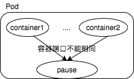
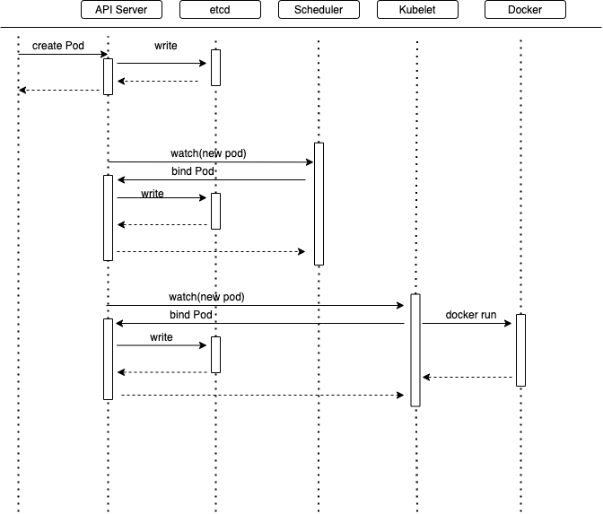
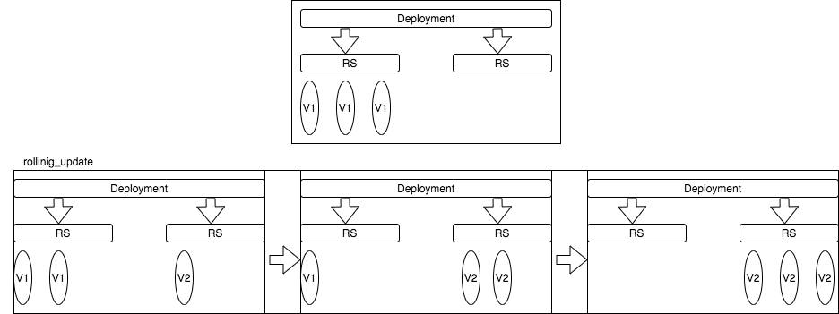
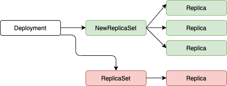

#### Pod 的分类

* 自主式 Pod: 死亡后不会被拉起
* 控制器管理的 Pod

---

#### Pod



##### 自主式 Pod

在同一个pod里面的多个容器共享：

* 网络栈： 所以容器中的服务所暴露的端口是不能一样的，共享网络命名空间
* 存储

这些共享的内容在`pause` 根容器中存在

Pod 是K8s 最基本的单元，其他的资源对象都是用来支撑扩展Pod 对象的，k8s 不会直接处理容器，而是 Pod，Pod 是由一个或者多个 container 组成

**Pod 存在的意义(为什么不是 容器为最小单元)**

> 现在创建容器，一个容器运行一个应用，是单进程的方式，一容器一个进程跑多个应用，管理不好
>
> Pod 是多进程的方式，可以运行多个应用程序
>
> Pod 的存在为了亲密性而应用
>
> * 多个应用之间进行交互，放在一个Pod 中调用更加方便(同一个网络命名空间中)

**镜像拉取策略**

> * IfNotPresent: 默认，镜像在宿主机上不存在拉取
> * Always: 每次创建 Pod 都会重新拉取一次次镜像
> * Never: Pod 永远都不会主动拉取这个镜像
>
> ```yaml
> apiVersion: v1
> kind: Pod
> metadata:
> 	name: mypod
> spec:
> 	containers:
> 		- name: nginx
> 		  mage: nginx:1.14
> 		  imagePullPolicy: Always
> ```

**资源限制**

> * Request: 调度的时候需要的资源大小
> * limits: 最大限制
>
> ```yaml
> apiVersion: v1
> kind: Pod
> metadata:
> 	name: frontend
> spec:
> 	containers:
> 	- name: db
> 	  image: mysql
> 	  env:
> 	  - name: MYSQL_ROOT_PASSWORD
> 	    value: "password"
> 	  resource:
> 	  	requests:
> 	  		memory: "64Mi"
> 	  		cpu: "250m"
> 	  	limits:
> 	  		memory: "128Mi"
> 	  		cpu: "500m"
> 	 restartPolicy: Never
> ```

**容器重启逆策略**

> * Always: 每次 容器终止，总是会去重启容器
> * Never: 容器终止退出，不重启，一般使用在批任务
> * OnFailure: 容器异常退出(推出码为 0)，才重启容器

**容器状态检查**

> livenessProbe: 存活检查：如果检查失败，将杀死容器，根据 Pod的 restartPolicy 来重新拉起 Pod
>
> readinessProbe：就绪检测，如果检测失败，会将Pod 从 service endpoint 中剔除
>
> Probe: 支持三种检测方式
>
> * httpGet：发送HTTP 请求，返回200-400 的状态为成功
> * exec：执行shell 命令返回0为成功
> * tcpSocket: 发起tcp socket 建立成功
>
> ```yaml
> apiVersion: v1
> kind: Pod
> metadata:
> 	labels:
> 		test:liveness
> 	name: liveness-exec
> spec:
> 	containers:
> 	- name: liveness
> 	  image: busy_box
> 	  args:
> 	  	= /bin/sh
> 	  	- -c
> 	  	- touch /temp/healthy; sleep 30; rm -rf /temp/healthy
> 	  livenessProbe:
> 	  	execc:
> 	  	 command:
> 	  		 - ccat
> 	  		 - /temp/healthy
> 	  	initiialDelaySeconds: 5
> 	  	periodSeconds: 5
> ```

**Pod调度策略**

> 如何将一个 Pod 创建在哪一个Node 上。
>
> 
>
> Master 节点
>
> > Created pod apiserver 将创建节点这个请求写到 etcd 中
> >
> > scheduler 会去监控 etcd，当有创建新的 pod 请求之后，通过调度算法将调度创建一个 Pod 的任务通过apiserver写到 etcd
>
> Node 节点
>
> > Node 也会去监控etcd，当调度器给某个 node 节点分发了创建 pod 的任务之后，调度器使用本地的 docker 创建pod，并且将创建的 pod 的一些信息会写到 etcd 中。
>
> 影响到调度的一些属性
>
> > 1. Pod 的 资源限制，resource 中的资源清单，根据request 找到足够 node 节点进行调度
> >
> > 2. 节点选择器标签影响Pod 调度  `nodeSelector` 选择一个Node 去创建 Pod， 可以通过米尼古拉在某台机器上给你某个Node 一个标签，`kubectl label node kube-node-1 env_role=prod` 通过命令 `kubecctl get nodes kube-node-1 --show-labels` 查看node 的label
> >
> > 3. 节点**亲和性** `nodeAffinity` 和 `nodeSelector` 基本一样，根据节点上标签约束来绝对Pod 调度到那些节点上。支持常用操作符号： `In NotIn Exists Gt Lt DoesNotExists`
> >
> >    1. 硬亲和性：约束条件必须满足
> >    2. 软亲和性：尝试满足，不保证
> >
> > 4. 污点和污点容忍
> >
> >    1. `nodeSelector 和 NodeAffinity` Pod 调度到某个节点上，是属于Pod的属性，调度的时候实现
> >
> >       `Taint污点` 节点不做普通分配调度，是节点属性，节点不做普通分配调度，是节点属性
> >
> >    2. 使用场景
> >
> >       1. 专用节点
> >       2. 配置特点硬件节点
> >       3. 基于Taint 驱逐
> >
> >    3. 查看节点污点
> >
> >       `kubectl describe node kube-node-1 | grep Taint`
> >
> >       会有三个值 
> >
> >       `NoSchedule: 一定不被调度`
> >
> >       `PreferNotSchedule` 尽量不被调度，和软亲和性类似
> >
> >       `NoExecute` 不会被调度，并且会驱逐Node 已有Node
> >
> >    4. 为节点添加污点
> >
> >       `kubectl taint node [node] key=value:[污点的那三个值]`
> >
> >    5. 删除污点
> >
> >    6. 污点容忍
> >
> >       就算是配置了`NoSchedule: 一定不被调度` pod 也被调度到
> >
> >       配置 `tolerations`

---

#### 控制器控制的 Pod

* 什么是 controller
* controller 和 node 关系
* controller 的种类
* Deployment 控制器部署
* 升级回滚
* 弹性伸缩

---

##### 什么是 controller

> 集群上管理和运行容器的对象， 控制Pod 的具体的状态和行为
>
> pod 和 controller 关系：(pod 通过 controller 实现应用的运维)
>
> * 确保预期的 pod数量
> * 有状态应用部署
> * 无状态应用部署
> * 确保所有的 node 运行在同一个 pod
> * 一次性任务和定时任务
>
> pod 和 controller 通过 **label 标签建立关系**
>
> controller 又被称为是 `工作负载`

----

* ReplicationController & ReplicaSet & Deployment

  > * ReplicationController 控制 pod 的副本数不能多不能少(ReplicaSet 取代ReplicationController )
  >
  > * ReplicaSet：和ReplicationController一样的功能，而且支持集合式的 selector(通过labels 匹配)
  >
  > * Deployment：部署无状态应用
  >
  >   支持rolling-update(创建一个删除一个，而不是全部删除，然后在创建)，虽然ReplicaSet 是可以独立使用的，但是一般还是建议使用 Deployment 来自动管理  ReplicaSet，这样就无序担心和 其他机制的不兼容问题（ReplicaSet不支持 rolling-update)。
  >
  > 
  >
  > Deployment： 可以查看升级历史各个版本，而且还可以回到某个版本 `kubectl rollout history deployment web`,  回滚到上个版本`kubectl rollout undo deployment web`，回滚到指定版本`kubectl rollout undo deployment web --to-revision=2`
  >
  > 弹性伸缩：改变副本数量
  >
  > `kubectl scale deployment web --repliccas=10` 由原来的副本数创建到现在的副本数
  >
  > **deployment 并不是直接管理的 Pod，而是通过RS 管理Pod**

* HPA(Horizontal Pod Autosccaling) 仅适合用于 Deployment 和 ReplicaSet， 在V1 版本中仅支持根据Pod 的 CPU 利用率扩容，在 v1aplha 版本中，支持根据内存和用户自定义的 metric 扩容

  > 

* StatefullSet

  > 解决有状态服务的问题，对应Deployment 和 ReplicaSets 是为了无状态服务而设计，其应用场景
  >
  > * 稳定的持久化存储，基于PVC 实现
  > * 稳定的网络标志： Pod 重新调度之后其 PodName 和 HostName 不变，基于Headless Service(没有Cluster IP 的 service) 来实现
  > * 有序部署，有序扩展，既Pod 是有顺序的，在部署或者扩展的时候要依据定义的顺序依次进行
  > * 有序收缩，有序删除(倒序的，从N-1 到 0)

* DeamonSet:

  >  确保全部或者一些 Node 上运行一个Pod 的副本，当有Node 加入集群时，也会为他们新增一个Pod，当有Node 从集群移除时，这些Pod 也会被回收，删除DaemonSet 将会删除它创建的所有的Pod。
  >
  > 使用DaemonSet 的一些典型用法
  >
  > * 运行集群存储 daemon，例如在每个Node 上运行 glusterd、 ceph
  > * 在每个Node 上运行日志收集 daemon、如 fluentd、logstash
  > * 在每个 Node 上运行监控 daemon，如Prometheus Node Exporter

* Job

  > 负责批处理你任务，既仅执行一次的任务，它保证批处理任务的一个或多个Pod 成功结束

* Cron Job

  > 管理基于时间的 Job
  >
  > * 在给定时间点只运行一次
  > * 周期性在给定时间点运行

---

```yaml
apiVersion: apps/v1
kind: Deployment
metadata:
	name: nginx-deployment
	
# 这里指定的是一个 Deployment 语法
spec:
	selector:
		matchLabels:
			app: nginx
	replicas: 2
# 在 Deployment 中嵌套 Pod 的语法
	template:
		metadata:
			labels:
				app: nginx
		spec:
			containers:
			- name: nginx
				image: nginx:1.14.2
				ports:
				- containerPort: 80
```

> RS 中嵌套了一个 pod
>
> 副本监控是根据 app 标签定完成的。
>
> 
>
> Deployment 通过 rs  管理 pod
>
> 查看RS `kubectl get rs`

Deployment 的扩容

> `kubectl scale deployment nginx-deployment --replicas 3`

Deployment 更新镜像

> `kubectl set image deployment/nginx-deployment nginx=nginx:1.18.0-alpine` 

Deployment 回滚

> `kubectl rollout undo deployment/nginx-deployment`

Deployment 可以保证在升级时候只有一定数量的Pod 是 down  的，默认的，他会确保至少有 比期望的Pod 数量少一个是 up 状态(最多一个不可用)。

在更新的过程中，每次是删除一个旧的然后创建出来一个新的，新版本的k8s 是可以配置比例的，如每次新创建 30%的Pod，然后在 删除 30%数量的pod。

Deployment 其他操作

> 查看回滚状态`kubectl rollout status deployment/nginx-deployment`
>
> 查看回滚状态`kubectl rollout history deployment/nginx-deployment` 
>
> 回滚到指定的版本 kubectl rollout undo deployment/nginx-deployment --to-revision=2` 

---

**DeamonSet**

```yaml
apiVersion: apps/v1
kind: Daemondet
metadata:
	name: daemondet-example
	labels:
		k8s-app: daemonset
spec:
	selector:
		matchLabels:
			name: daemonset-example
	template:
		metadata:
			labels:
				name: daemonset-example
		spec:
			containers:
			- name: nginx
			  image: nginx:1.14.2
```

默认 的情况下 主容器(master)  不会去创建daemon  容器。删除一个node 上的 pod，然后也会创建出来一个pod，一直保证一个node 上有一个 pod。

---

Job

> Job 会创建一个或者多个 Pods，并确保指定数量的 Pods 成功终止。 随着 Pods 成功结束，Job 跟踪记录成功完成的 Pods 个数。 当数量达到指定的成功个数阈值时，任务（即 Job）结束。 删除 Job 的操作会清除所创建的全部 Pods。

```yaml
apiVersion: batch/v1
kind: Job
metadata:
	name: pi
spec:
	template:
		spec:
			containers:
			- name: pi
				image: perl
				command: ["perl", "-Mbignum=bpi", "wle", "print bpi(2000)"]
			restartPolicy: Never
	backoffLimit: 4
```

> `kubectl get job`
>
> `kubectl describe pod pi-bplms`

CronJob  基于时间管理的 Job

> 注意：
>
> * Spec.template 格式和 pod 一样
> * restartPolicy 仅仅支持 Never 和 OnFailure
> * 单个 pod 时，默认Pod 成功运行后 Job 及结束
> * .spec.completions 标志 job 运行结束需要成功运行的 pod 个数，默认为1
> * .spec.parallelism 标志并行运行的pod 个数，默认为1
> * .spec.失败pod 的重试最大时间，超过这个 时间不会继续重试


