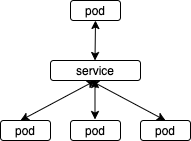
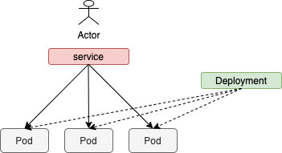
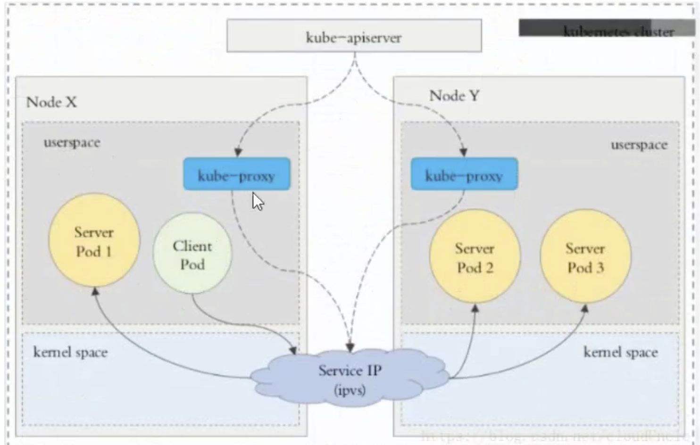
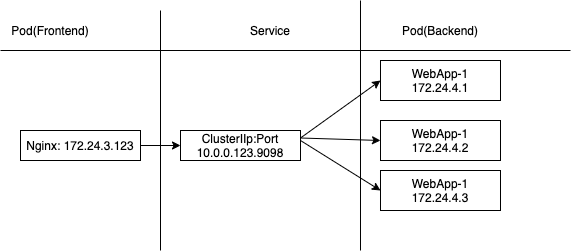
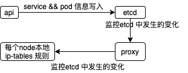

Service: 定义一组Pod 的访问规则

#### service 存在意义

> 因为 pod 的 ip 是不是固定的，经常性的重启，升级等操作，pod 会将其信息注册到 service
>
> * 防止 pod 失联(服务发现)
> * 定义pod 的访问策略，负载均衡
>
> 
>
> 也是通过 label 和 selector 建立 pod 和 service 建立标签，service 有一个虚拟 IP
>
> service 类型
>
> * clusterIP： 集群内部使用(默认)，自动分配一个仅仅 cluster 内部可以访问的虚拟的 IP
> * NodePort： 对外访问应用使用，在ClusterIP 基础上为Service 在每台机器上绑定一个端口，这样就可以通过 `<NodeIp>`:NodePort 访问服务了。
> * LoadBalancer:  对外访问应用使用，共有云，公有云
>
> 无头servicec:
>
> * External Name

---



`svc` 一组 `pod` 的抽象

`svc`  能够提供负载均衡的 能力，但是在使用上有以下限制 ：

* 只提供 4 层负载均衡能力，而没有7层功能(不能通过主机名/域名去访问)，但是有时需要更多的匹配规则来转发请求，这 点 上4层负载均衡是不支持的。

> Service 中有策略去负责将访问分发到 哪个 Pod 中



将 `ipvs` 换为 `iptables` 就是通过该种方式的网络

---

* **ClusterIP**



> clusterIP 主要在每个node 节点 使用 iptables(ipvs)， 将发向 clusterIP  对应端口的数据转发到kube-proxy 中，然后kube-proxy 自己内部实现有负载均衡的方法，并可以查询到这个 service 下对应的 pod 的地址和端口，进而将数据转发给对应的  pod 的地址和端口。
>
> 为了实现上述的过程，需要 几个组件协同工作：
>
> * apiserver：通过 kubectl命令向 apiserver 发送创建 service 的命令，apiserver 接收到请求之后，将数据存储到 etcd 中
> * kube-proxy 感知 service 中pod 的变化，并将变化的想逆袭啊写入到本地的 iptables 规则中。
> * iptables： 使用NAT 等技术，将 virtualIP 的流量转到 endpoint 中
>
> 上述三点的过程如下：
>
> 

---

```yaml
apiVersion: apps/v1
kind: Deployment
metadata:
	name: myappdeploy
	namespace: default
spec:
	replicas: 3
	selector:
		matchLabels:
			app: myapp
			release: stable
	template:
		metadata:
			labels:
				app: myapp
				release: stable
				env: test
		spec:
			containers:
			- name: myapp
				image: nginx:1.14.2
				imagePullPolicy: IfNotPresent
				ports:
				- name: http
					containerPort: 80
```

```yaml
apiVersion: v1
kind: Service
metadata:
	name: myapp
	namespace: default
spec:
	type: ClusterIP
	selector:
		app: myapp # 和上面的 标签匹配
		release: stable 
	ports:
	- name: http
		port: 80
		targetPort: 80
```

查看 service 到 pod 的映射关系

`kubectl get endpoints`

`kubectl get pods -o wide`

可以看到 `service` -> `pod` 三者之间的路由关系

---

**Headless Service**

> 有时候不需要负载均衡 ，以及单独的 `service IP` , 遇到这种情况，可以通过制定 `ClusterIP(spec.clusterIP)` 的值为 'None' 来创建 `Headless Service` 这类 Serviice 并不会分配 `clusterIP`  `kube-proxy` 不会处理他们，而且平台也不会为它们进行负载均衡和路由。
>
> 为statefulSet 而使用，做域名解析

```yaml
apiVersion: v1
kind: Service
metadata:
	name: myapp-headless
	namespace: default
spec:
	selector:
		app: myapp
	clusterIP: "None"
	ports:
	- port: 80
		targetPort: 80
```

**NodePort**

> 对外访问应用使用，在ClusterIP 基础上为Service 在每台机器上绑定一个端口，这样就可以通过 `<NodeIp>`:NodePort 访问服务了。
>
> 同时也会分陪一个内部ClusterIP

```yaml
apiVersion: v1
kind: Service
metadata:
	name: myapp
	namespace: default
spec:
	type: NodePort
	selector:
		app: myapp 
		release: stable 
	ports:
	- name: http
		port: 80
		targetPort: 80
```
