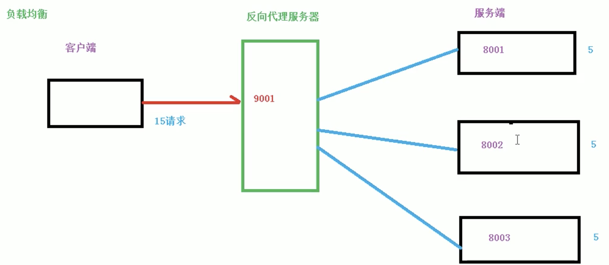

#### 基本概念

* `nginx` 是什么，做什么事情
* 反向代理
* 负载均衡
* 动静分离

---

#### `nginx` 是什么

轻量级、高性能`HTTP` 和反向代理的`web` 服务器，热部署，几乎做到 7*24小时不间断运行。

#### 反向代理

##### 什么是正向代理


##### 反向代理

客户端对代理是无感知的，**因为客户端不需要任何配置就可以访问，我们值需要将请求发送到反向代理服务器**，由反向代理服务器去选择模板服务器获取数据后，在返回给客户端，此时反向代理服务器和目标服务器对外就是一个服务器，**暴露的是代理服务器地址，隐藏了真实服务器IP 地址。**

---

#### 负载均衡

客户端发送多个请求到服务器，服务器处理请求，有一些可能需要和数据库进行交互，服务器处理完毕之后，在将结果返回给客户端，这种架构模式对于早期的系统相对单一，并发请求相对较少的情况下是比较合适的，成本低，但是随着信息数量的不断增长，访问量和数据量的增加，以及系统复杂度的增加，这种架构会造成服务器相对应客户端的请求日志缓慢，并发量大的，还统一服务器直接崩溃。

那么横向增加服务器数量，然后将请求分发到各个服务器上，将原先请求集中到单个服务器上，然后该服务器将请求发发到处理服务器上，也就是我们的负载均衡。



#### 动静分离

将动态资源和静态资源分离


#### 高可用

----

#### `Docker` 启动 `nginx`

`ps -ef | grep nginx`

```shell
docker run --name nginx -p 80:80 -d nginx

# 配置文件在 /etc/nginx/nginx.conf
# 将配置文件， data 等均挂载在本地
# 创建本地目录
mkdir -p nginx/mydata
mkdir www logs conf

# docker 中的文件复制出来
docker cp ac851c1792f5:/etc/nginx/nginx.conf conf
docker cp ac851c1792f5:/usr/share/nginx/html/index.html www 

# 停止容器，然后再启动的时候将容器内文件和本地文件挂载
docker ps -a
docker rm 76bb58d1e1f1

docker run -d -p 80:80 --name nginx -v /Users/xuxliu/Downloads/nginx/mydata/www:/usr/share/nginx/html -v /Users/xuxliu/Downloads/nginx/mydata/conf/nginx.conf:/etc/nginx/nginx.conf -v /Users/xuxliu/Downloads/nginx/mydata/logs:/var/log/nginx nginx
```

---

#### 常用命令

```shell
# 需要进入到 nginx 的

# 查看 nginx 版本
nginx -v
nginx version: nginx/1.21.0

# 启动 nginx
nginx

# 关闭 nginx
nginx -s stop

# 重新加载 nginx
# 在修改配置之后执行重加载
nginx -s reload
```

---

#### 配置文件

```shell
# 配置文件存放位置
/etc/nginx/nginx.conf

# -------------------------------------------------
# --------       默认配置文件内容       ------------
# -------------------------------------------------
# 配置文件包含3部分
# 1. 全局块：设置一些影响 nginx 服务器整体运行的配置指令，只要包括配置运行nginx 的用户组、日志路径、用户组等
# 2. event 块： 服务器和用户的网络连接，
# 3. http 块包括 http 全局块
# 和 server 块：虚拟主机密切关系，虚拟主机主要从用户角度看，和一台独立的硬件是完全一样的，每个http 可以包含多个
# server 块，每个 server 就相当于是一个虚拟主机，每个 server 也分为 server 块和 location 块


# -------------------------------------------------
# -------------       head块       ----------------
# -------------------------------------------------
user  nginx;
worker_processes  auto;
# nginx 服务器并发处理值，可以制定具体的进程数，值越大可以支持的并发处理量越多。

# 指定错误日志的路径和日志级别，此指令可以在全局块、http块、server块以及location块中配置
# 其中debug级别的日志需要编译时使用--with-debug开启debug开关
# error_log [path] [debug | info | notice | warn | error | crit | alert | emerg

error_log  /var/log/nginx/error.log notice;
pid        /var/run/nginx.pid;


# -------------------------------------------------
# -------------      events 块     ----------------
# -------------------------------------------------
events {
    worker_connections  1024; #最大连接数，指定4个工作线程
}

# http块是Nginx服务器配置中的重要部分，代理、缓存和日志定义等绝大多数的功能和第三方模块的配置都可以放在这个模块中。
# 常用的浏览器中，可以显示的内容有HTML、XML、GIF及Flash等种类繁多的文本、媒体等资源，浏览器为区分这些资源，
# 需要使用MIME Type。换言之，MIME Type是网络资源的媒体类型。Nginx服务器作为Web服务器，必须能够识别前端请求的资源类型。

# -------------------------------------------------
# -------------      http 块     ----------------
# -------------------------------------------------
http {
		# 用于包含其他的配置文件，可以放在配置文件的任何地方，但是要注意你包含进来的配置文件一定符合配置规范，
		# 下面的指令将mime.types包含进来，mime.types和nginx.conf同级目录，不同级的话需要指定具体路径
    include       /etc/nginx/mime.types; 
    # 配置默认类型，如果不加此指令，默认值为text/plain。
		# 此指令还可以在http块、server块或者location块中进行配置
    default_type  application/octet-stream;

    log_format  main  '$remote_addr - $remote_user [$time_local] "$request" '
                      '$status $body_bytes_sent "$http_referer" '
                      '"$http_user_agent" "$http_x_forwarded_for"';

		# access_log配置，此指令可以在http块、server块或者location块中进行设置
		# access_log path [format [buffer=size]]
		# 如果你要关闭access_log,你可以使用下面的命令
		# access_log off;
    access_log  /var/log/nginx/access.log  main;

    sendfile        on;
    #tcp_nopush     on;
		
		# 配置连接超时时间,此指令可以在http块、server块或location块中配置。
		# 与用户建立会话连接后，Nginx服务器可以保持这些连接打开一段时间
		# timeout，服务器端对连接的保持时间。默认值为75s;header_timeout，可选项，在应答报文头部的Keep-Alive域设置超时时间：
		# Keep-Alive:timeout= header_timeout。报文中的这个指令可以被Mozilla或者Konqueror识别。
		# keepalive_timeout timeout [header_timeout]
    keepalive_timeout  65;

    #gzip  on;

    include /etc/nginx/conf.d/*.conf;
   }
# -------------------------------------------------
# ------ conf.d下有default.conf 配置文件	-----------
# -------------------------------------------------
# 将一台服务器的某项或者全部服务内容逻辑划分为多个服务单位，对外表现为多个服务器，
# 从而充分利用服务器硬件资源。从用户角度来看，一台虚拟主机和一台独立的硬件主机是完全一样的。
# 每个server块就相当于一台虚拟主机
server {
		# listen 127.0.0.1:8000;  #只监听来自127.0.0.1这个IP，请求8000端口的请求
		# listen 127.0.0.1; #只监听来自127.0.0.1这个IP，请求80端口的请求（不指定端口，默认80）
		# listen 8000; #监听来自所有IP，请求8000端口的请求
		# listen *:8000; #和上面效果一样
		# listen localhost:8000; #和第一种效果一致
    listen       80; # 本地监听端口
    listen  [::]:80; 
    
    # 对于name 来说，可以只有一个名称，也可以由多个名称并列，之间用空格隔开。每个名字就是一个域名，
    # 由两段或者三段组成，之间由点号“.”隔开。比如
    server_name  localhost; # 主机名称

    #access_log  /var/log/nginx/host.access.log  main;

		# 每个server块中可以包含多个location块
		# location块的主要作用是，基于Nginx服务器接收到的请求字符串（例如， server_name/uri-string），
		# 对除虚拟主机名称（也可以是IP别名，后文有详细阐述）之外的字符串（前例中“/uri-string”部分）进行匹配，
		# 对特定的请求进行处理。地址定向、数据缓存和应答控制等功能都是在这部分实现。
		# 语法 location [ = | ~ | ~* | ^~ ] uri { ... }
		# = 表示精确匹配
		# ~ 表示该规则是使用正则定义的，区分大小写
		# ~* 表示该规则是使用正则定义的，不区分大小写
		# ^~ 表示如果该符号后面的字符是最佳匹配，采用该规则，不再进行后续的查找。
    location / {
    		# 这个指令用于设置请求寻找资源的跟目录
        root   /usr/share/nginx/html;
        
        #请求转向mysvr 定义的服务器列表
        proxy_pass  http://mysvr ;
        
        # 定义首页索引文件的名称
        index  index.html index.htm;
    }

    #error_page  404              /404.html;

    # redirect server error pages to the static page /50x.html
    #
    error_page   500 502 503 504  /50x.html;
    location = /50x.html {
        root   /usr/share/nginx/html;
    }

    # proxy the PHP scripts to Apache listening on 127.0.0.1:80
    #
    #location ~ \.php$ {
    #    proxy_pass   http://127.0.0.1;
    #}

    # pass the PHP scripts to FastCGI server listening on 127.0.0.1:9000
    #
    #location ~ \.php$ {
    #    root           html;
    #    fastcgi_pass   127.0.0.1:9000;
    #    fastcgi_index  index.php;
    #    fastcgi_param  SCRIPT_FILENAME  /scripts$fastcgi_script_name;
    #    include        fastcgi_params;
    #}

    # deny access to .htaccess files, if Apache's document root
    # concurs with nginx's one
    #
    #location ~ /\.ht {
    #    deny  all;
    #}
}
```

---

#### Nginx 配置实例

##### 反向代理

> 输入`www.123.com` 跳转到`linux 中 tomcat` 的主页面 


```shell
# -------------------------------------------------
# -------------       head块       ----------------
# -------------------------------------------------
user  nginx;
worker_processes  auto;
# nginx 服务器并发处理值，值越大可以支持的并发处理量越多。

error_log  /var/log/nginx/error.log notice;
pid        /var/run/nginx.pid;


# -------------------------------------------------
# -------------      events 块     ----------------
# -------------------------------------------------
events {
    worker_connections  1024; #最大连接数
}

# -------------------------------------------------
# -------------      http 块     ----------------
# -------------------------------------------------
http {
    include       /etc/nginx/mime.types; #
    default_type  application/octet-stream;

    log_format  main  '$remote_addr - $remote_user [$time_local] "$request" '
                      '$status $body_bytes_sent "$http_referer" '
                      '"$http_user_agent" "$http_x_forwarded_for"';

    access_log  /var/log/nginx/access.log  main;

    sendfile        on;

    keepalive_timeout  65;

    #gzip  on;

    #include /etc/nginx/conf.d/*.conf;
    
    server {
    	listen       80; # 本地监听端口 
    	server_name  192.168.99.100; # 主机名称

    	#access_log  /var/log/nginx/host.access.log  main;

      # 请求跳转
      location / {
          root   /usr/share/nginx/html;
          proxy_pass http://127.0.0.1:8080 # 访问 / 时候则转发到 tomcat 的页面中去了
          index  index.html index.htm;
      }    
 	}	
 	
 	server {
    	listen       9001; # 本地监听端口 
    	server_name  192.168.99.100; # 主机名称

    	#access_log  /var/log/nginx/host.access.log  main;

      # 请求跳转
      location ~/edu/ {
          proxy_pass http://127.0.0.1:8001 # 访问 / 时候则转发到 tomcat 的页面中去了
      }
      
      location ~/vod/ {
          proxy_pass http://127.0.0.1:8002 # 访问 / 时候则转发到 tomcat 的页面中去了
      }
 	}	
} 
```

---

##### 负载均衡

> 在浏览器中输入地址 `http://192.168.17.129/edu/a.html` 产生负载均衡效果，将请求平均分担到 `8081和8080 的tomcat 中去`

```shell
# -------------------------------------------------
# -------------       head块       ----------------
# -------------------------------------------------
user  nginx;
worker_processes  auto;
# nginx 服务器并发处理值，值越大可以支持的并发处理量越多。

error_log  /var/log/nginx/error.log notice;
pid        /var/run/nginx.pid;


# -------------------------------------------------
# -------------      events 块     ----------------
# -------------------------------------------------
events {
    worker_connections  1024; #最大连接数
}

# -------------------------------------------------
# -------------      http 块     ----------------
# -------------------------------------------------
http {
    include       /etc/nginx/mime.types; #
    default_type  application/octet-stream;

    log_format  main  '$remote_addr - $remote_user [$time_local] "$request" '
                      '$status $body_bytes_sent "$http_referer" '
                      '"$http_user_agent" "$http_x_forwarded_for"';

    access_log  /var/log/nginx/access.log  main;

    sendfile        on;

    keepalive_timeout  65;

    #gzip  on;

    #include /etc/nginx/conf.d/*.conf;
    
    # 负载均衡服务列表
    upstream myserver {
    	# 根据访问客户端ip的hash值分配，这样同一客户端的请求都会被分配到同一个server上，
    	# 如果牵扯到session的问题，用这个是最好的选择
    	# least_conn：把请求分配到连接数最少的server
    	# weight默认值为1，值越大则代表被访问的几率越大
    	# 轮询：默认方式 
    	# fair: 第三方，按照后端服务器响应时间分配，响应时间越短分配越多
    	ip_hash;
    	server 192.168.99.100:8080 weight=1;
    	server 192.168.99.100:8081 weight=2
    }
    
    server {
    	listen       80; # 本地监听端口 
    	server_name  192.168.99.100; # 主机名称

    	#access_log  /var/log/nginx/host.access.log  main;

      # 请求跳转
      location / {
          root   /usr/share/nginx/html;
          proxy_pass http://myserver # 访问负载均衡列表
          index  index.html index.htm;
      }    
 	}	
 	
 	server {
    	listen       9001; # 本地监听端口 
    	server_name  192.168.99.100; # 主机名称

    	#access_log  /var/log/nginx/host.access.log  main;

      # 请求跳转
      location ~/edu/ {
          proxy_pass http://127.0.0.1:8001 # 访问 / 时候则转发到 tomcat 的页面中去了
      }
      
      location ~/vod/ {
          proxy_pass http://127.0.0.1:8002 # 访问 / 时候则转发到 tomcat 的页面中去了
      }
 	}	
} 
```

---

##### 动静分离


一下配置将动态文件和静态均放在一起


下面的将动态和静态资源分别放在不同的机器上

```shell
upstream    static  {
        server 192.168.69.113:80;
}

upstream    java    {
        server 192.168.69.113:8080;
}

server  {
        listen 80;
        server_name 192.168.69.112;
        location / {
            root  /soft/code;
            index index.html;
        }
        location ~.*\.(png|jpg|gif)$  {
            proxy_pass http://static;
            include proxy_params;
        }
        location ~.*\.jsp$    {
            proxy_pass      http://java;
            include proxy_params;
        }
}
```

