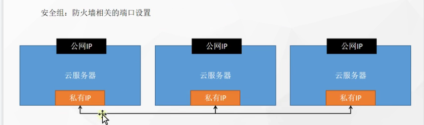
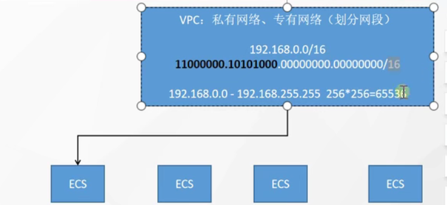
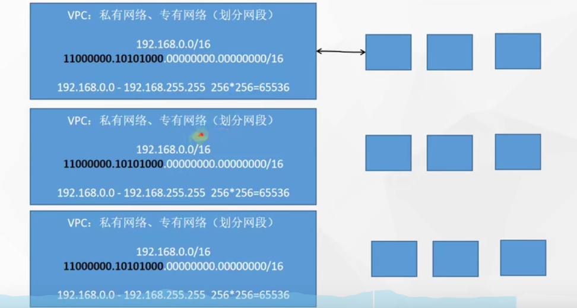
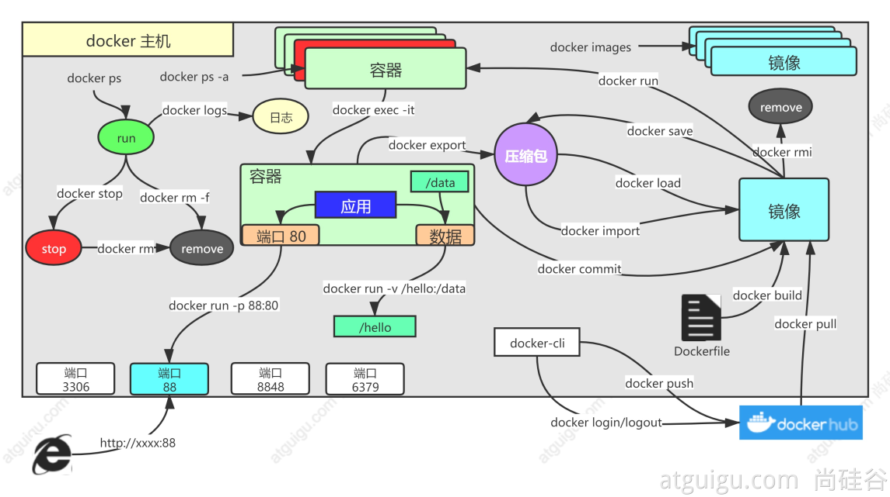
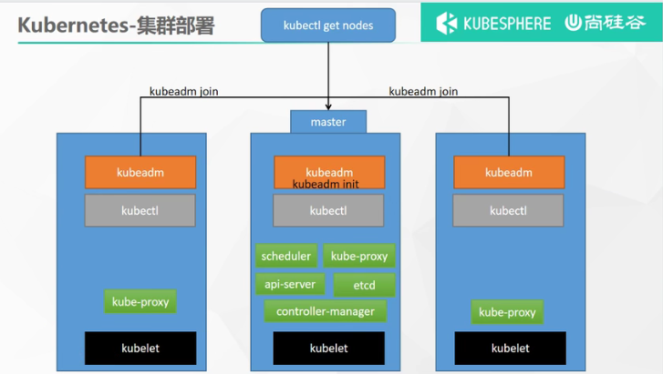

安全组：就相当于是防火墙，需要进行设置开端口，外网才能访问，会受公网带宽影响。

公网IP： 每次启动都会变化。

私有IP: 集群内通信 IP，不会发生变化，不受带宽影响。

私网IP 是可以自己规划的，在阿里云中成为是VPC：专有网络/私有网络(划分网段)。

可以设置网段/



如上定义个VPC转有网络，该网络指定网段为`192.168` 后面的`0.0` 是可以分配的网络IP,`/16` 表示说前16位(二进制)是掩码部分。后16为是可以变化的分配的IP，该VPC 总共可以挂`256*256` 台机器。

`ECS: 阿里云服务器名称`

还可以划分子转有网络。


VPC 下面托的服务器是隔离的。即使是网段一样。物理上进行了隔离。




如上可以创建生产、测试、开发环境服务器集群。

---






```json
echo "172.31.0.4  cluster-endpoint" >> /etc/hosts

kubeadm init \
--apiserver-advertise-address=172.31.0.4 \
--control-plane-endpoint=cluster-endpoint \
--image-repository registry.cn-hangzhou.aliyuncs.com/lfy_k8s_images \
--kubernetes-version v1.20.9 \
--service-cidr=10.96.0.0/16 \
--pod-network-cidr=192.168.0.0/16


To start using your cluster, you need to run the following as a regular user:

  mkdir -p $HOME/.kube
  sudo cp -i /etc/kubernetes/admin.conf $HOME/.kube/config
  sudo chown $(id -u):$(id -g) $HOME/.kube/config

Alternatively, if you are the root user, you can run:

  export KUBECONFIG=/etc/kubernetes/admin.conf

You should now deploy a pod network to the cluster.
Run "kubectl apply -f [podnetwork].yaml" with one of the options listed at:
  https://kubernetes.io/docs/concepts/cluster-administration/addons/

You can now join any number of control-plane nodes by copying certificate authorities
and service account keys on each node and then running the following as root:

  kubeadm join cluster-endpoint:6443 --token iqsxeg.2k1zdqxw8iaqo4n9 \
    --discovery-token-ca-cert-hash sha256:32a3811f414f95c36a876ce54e0b0382c2448a0991d538ea97cd64c67ab0ea1f \
    --control-plane

Then you can join any number of worker nodes by running the following on each as root:

kubeadm join cluster-endpoint:6443 --token iqsxeg.2k1zdqxw8iaqo4n9 \
    --discovery-token-ca-cert-hash sha256:32a3811f414f95c36a876ce54e0b0382c2448a0991d538ea97cd64c67ab0ea1f
```

---

#### 命令

```shell
kubectl get pods -A

eyJhbGciOiJSUzI1NiIsImtpZCI6InRwdWJwWWw3N3FYaFd1MjBSMFN5andEdGU2a21Lb1F0Q2l0dXJQenEwRHcifQ.eyJpc3MiOiJrdWJlcm5ldGVzL3NlcnZpY2VhY2NvdW50Iiwia3ViZXJuZXRlcy5pby9zZXJ2aWNlYWNjb3VudC9uYW1lc3BhY2UiOiJrdWJlcm5ldGVzLWRhc2hib2FyZCIsImt1YmVybmV0ZXMuaW8vc2VydmljZWFjY291bnQvc2VjcmV0Lm5hbWUiOiJhZG1pbi11c2VyLXRva2VuLTlmYzhqIiwia3ViZXJuZXRlcy5pby9zZXJ2aWNlYWNjb3VudC9zZXJ2aWNlLWFjY291bnQubmFtZSI6ImFkbWluLXVzZXIiLCJrdWJlcm5ldGVzLmlvL3NlcnZpY2VhY2NvdW50L3NlcnZpY2UtYWNjb3VudC51aWQiOiJmYjU5MTc0OC0zNGQ5LTRjNzQtYjMxNi04ZjgyOWEzZGJmMGQiLCJzdWIiOiJzeXN0ZW06c2VydmljZWFjY291bnQ6a3ViZXJuZXRlcy1kYXNoYm9hcmQ6YWRtaW4tdXNlciJ9.saraCSKFW_jYT8Z9fFg69u8jUOcDliXDV-xm1Fdu9nR3tvVdNRQZFqTS-PENvWTQuSwOVylFv93XCXVpJ-gIwbFCcsofD9fFmkkha-de6vFJS6Mcd9uHYGAjOQ1Z8PT8fyGr2Nij29Z-OoK58LCOgAcy4L9nGf7tGrazr_pS2v2io0pafkAiz5zFT_-pOBvDIkdaKtc8mChNOsfm2BxzukBDBmSMwFFvsjlHuVw6E06bfGhPYq-XD9OjuwVmmDGHKLRkGHF7dJlraU0vjinXfPpHRW4fT5yTTA4himp34DmtLC2Vf_PVV5G6c_5URUfTCwHG_-e5dCHSyQz-DSZsAA
```

