初始化集群的时候

```sh
#主节点初始化
kubeadm init \
--apiserver-advertise-address=172.31.0.4 \
--control-plane-endpoint=cluster-endpoint \
--image-repository registry.cn-hangzhou.aliyuncs.com/lfy_k8s_images \
--kubernetes-version v1.20.9 \
--service-cidr=10.96.0.0/16 \
--pod-network-cidr=192.168.0.0/16 // Pod 网络域范围
```


##### 创建命名空间

```yaml
apiVersion: v1
kind: Namespace
metadata:
	name: hello
```

删除

```sh
kubectl delete ns hello
```

---

#### Pod

> 是k8s 的最小单位，将运行时容器封装为一个 Pod。对应用的启动/删除都是对Pod 的操作。
>
> Pod 是一组容器，Pod 直接是隔离的，在Pod 中的多个容器是共享Pod 的网络/存储。

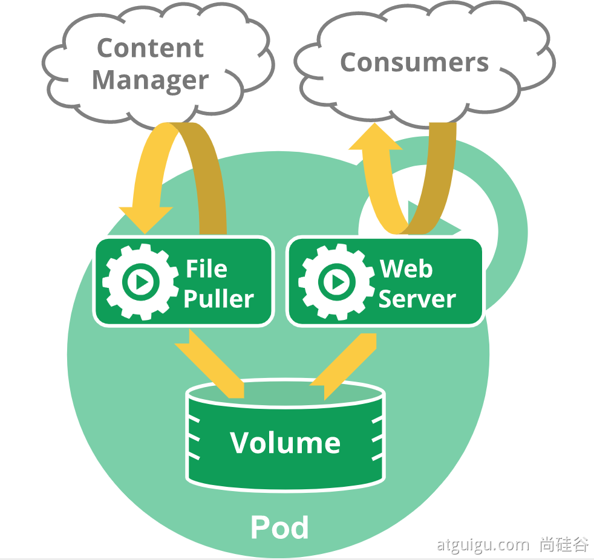

#### Pod命令

```sh
// 创建
kubectl run mynginx --image=nginx

// 查看当前pod
kubectl get pod

// 查看更详细信息
kubectl get pod -owide
// 查看倒pod 的IP，然后可以访问pod

// 查看 pod 的生命所有的事件
kubectl describe pod {podName}

// 删除
kubectl delete pod mynginx [-n {名称空间}]
```

##### 配置文件创建Pod

```yaml
apiVersion: v1
kind: Pod
metadata:
  labels:
    run: mynginx
  name: mynginx
spec:
  containers:
  - image: nginx
    name: mynginx
```

一个Pod 中创建多个容器

```yaml
apiVersion: v1
kind: Pod
metadata:
  labels: 
    run: myapp
  name: myapp
spec:
  containers:
  - image: nginx
    name: nginx
  - image: tomcat:8.5.68
    name: tomcat
```

访问的时候2个容器均是同一个IP，二者不同的Port。在Pod 内部直接人通过 localhost 就能访问。同一个Pod 中共享网络空间，镜像不能有相同的Port。

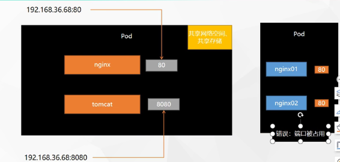


##### 删除配置文件建立的pod

```sh
kubectl delete -f mynginx
```

##### 界面创建：

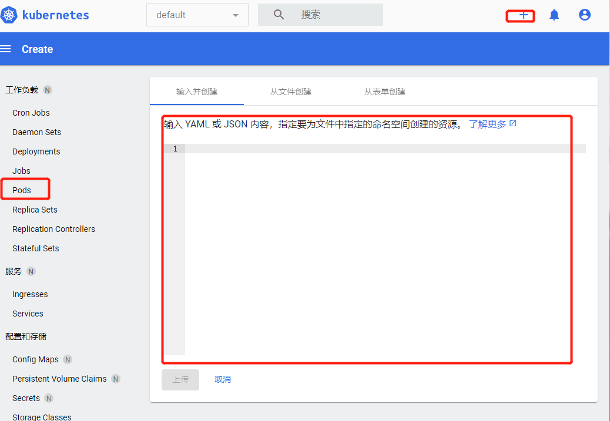

##### 查看日志

```sh
kubectl logs -f mynginx
```

##### 进入pod

```sh
kubectl exec -it mynginx -- /bin/bash
```

可视化界面

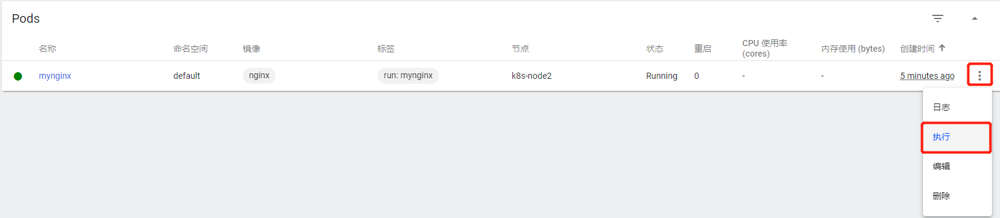

直接可以进入pod 中 terminal

---

#### Deployment

> 控制Pod，使得Pod有多副本，自愈，扩容等能力

##### 创建部署

```sh
kubectl create deployment mytomcat --image=tomcat:8.5.68
```

然后再另外一个窗口中监控 pod 

```sh
watch -n 1 kubectl get pod
```

当删除了pod

```sh
kubectl delete pod mytomcat
```

此时监控那边会暂时删除tomcat 的Pod，然后紧接着就又出现一个。

这就是Deployment 的自愈作用，当Pod 挂了之后，会自动拉起来。

##### 删除Deployment

```sh
kubectl delete deploy myapp
```

除了自愈能力，Deployment 还有副本能力。一下将Pod 部署3份

```sh
kubectl create deployment mytomcat --image=tomcat:8.5.68 --replicas=3
```

此时如果删除了其中的一个部署，那么Deployment 还会拉起删除的哪个，满足此时有3份Pod

##### 配置文件创建

```yaml
apiVersion: apps/v1
kind: Deployemnt
metadata:
  labels:
    app: my-dep
  name: my-dep
spec:
  replicas: 3
  selector:
    matchLabels:
      app: my-dep
  template:
    metadata:
      labels:
        app: my-dep
    spec:
      containers:
      - image: nginx
        name: nginx
```

##### Deployment 扩缩容

在访问请求过高得时候，增加Pod，请求量下了了，然后将Pod 数量降低

```sh
kubectl scale --replicas=5 deployment/my-dep
```

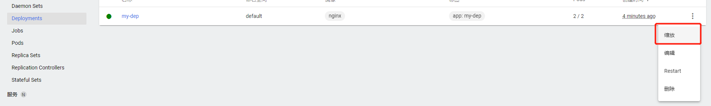

##### 自愈-故障转移功能

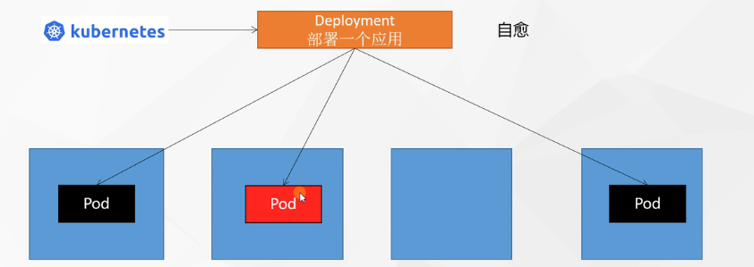

自愈：当一个Pod 挂了，那么企图重启该Pod。

故障转移：当Pod无法启动，那么在另外一个Node 上启动Pod

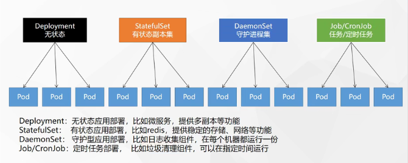

##### 查看deployment 创建文件

```sh
kubectl get deploy my-dep -oyaml
```

#####  滚动更新

```sh
kubectl set image deployment/my-dep nginx=nginx:1.16.1 --record
// 会先保留新启动得镜像，当新起得Pod 启动后才会将旧得杀气
// 始终要保证3个副本得存在
```

##### 回滚

```sh
#历史记录
kubectl rollout history deployment/my-dep


#查看某个历史详情
kubectl rollout history deployment/my-dep --revision=2

#回滚(回到上次)
kubectl rollout undo deployment/my-dep

#回滚(回到指定版本)
kubectl rollout undo deployment/my-dep --to-revision=2
```

除了Deployment，k8s还有 `StatefulSet` 、`DaemonSet` 、`Job`  等 类型资源。我们都称为 `工作负载`。

有状态应用使用  `StatefulSet`  部署，无状态应用使用 `Deployment` 部署

---

#### Service

> 服务发现，负责均衡
>
> 将一组Pods 公开为网络服务得抽象方法。service 统一将Pod 暴露一个地址，负载均衡机制外面访问 Pod


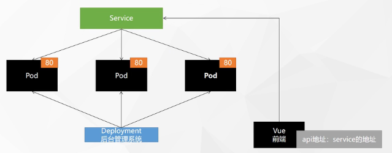

##### 暴露服务

```sh
kubectl expose deployment my-dep --port=8000 --target-port=80
```

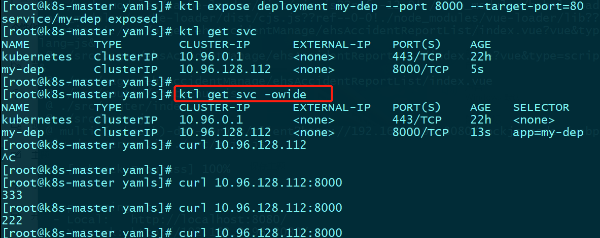

##### yaml 创建服务

```yaml
apiVersion: v1
kind: Service
metadata:
  labels:
    app: my-dep
  name: my-dep
spec:
  selector:
    app: my-dep
  ports:
  - port: 8000
    protocol: TCP
    targetPort: 80
```

并且svc 还有服务发现的功能，当my-dep 有新的pod 上线，那么自动会被加入倒 svc。

以上的方式等同于

```sh
kubectl expose deployment my-dep --port=8000 --target-port=80 --type=ClusterIP
```

```yaml
apiVersion: v1
kind: Service
metadata:
  labels:
    app: my-dep
  name: my-dep
spec:
  ports:
  - port: 8000
    protocol: TCP
    targetPort: 80
  selector:
    app: my-dep
  type: ClusterIP
```


默认集群IP，只能在集群中访问。

如果想要在外网中访问，那么需要是

```sh
kubectl expose deployment my-dep --port=8000 --target-port=80 --type=NodePort
```

节点端口，也就是在k8s 的每个节点中都开一个端口，外网访问，`节点IP:port` 就可以访问了。

```yaml
apiVersion: v1
kind: Service
metadata:
  labels:
    app: my-dep
  name: my-dep
spec:
  ports:
  - port: 8000
    protocol: TCP
    targetPort: 80
  selector:
    app: my-dep
  type: NodePort

```

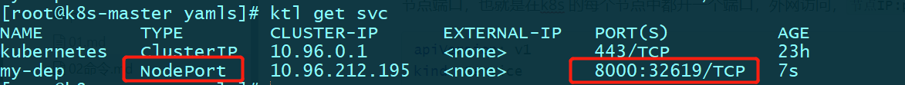

以及k8s 直接暴露一个32619端口。

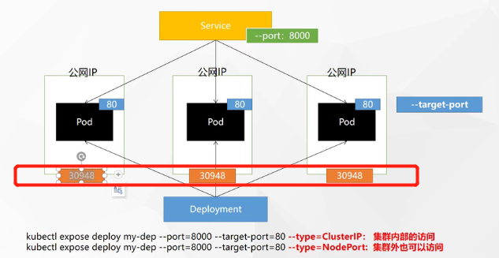

然后再外网就可以根据 Node:port 访问k8s 集群了。


#### Ingress

Service 的统一网关入口，所有请求先倒Ingress，然后到 Service

其中在初始化master 的时候

```sh
kubeadm init \
--apiserver-advertise-address=172.31.0.4 \
--control-plane-endpoint=cluster-endpoint \
--image-repository registry.cn-hangzhou.aliyuncs.com/lfy_k8s_images \
--kubernetes-version v1.20.9 \
--service-cidr=10.96.0.0/16 \ // service 的IP 范围域
--pod-network-cidr=192.168.0.0/16 // Pod 的IP 范围域
```

理解Ingress 就是一个 nginx

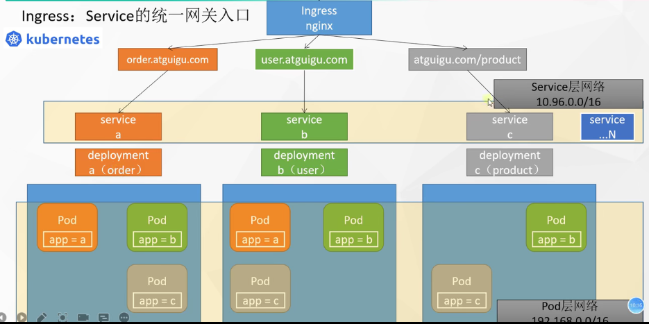

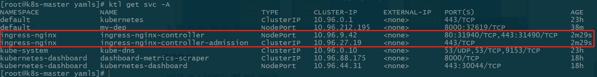

默认开了2个端口80：http 端口。443： https 端口。且开启了NodePort 类型，公网也是可以访问的。

```yaml
apiVersion: apps/v1
kind: Deployment
metadata:
  name: hello-server
spec:
  replicas: 2
  selector:
    matchLabels:
      app: hello-server
  template:
    metadata:
      labels:
        app: hello-server
    spec:
      containers:
      - name: hello-server
        image: registry.cn-hangzhou.aliyuncs.com/lfy_k8s_images/hello-server
        ports:
        - containerPort: 9000
---
apiVersion: apps/v1
kind: Deployment
metadata:
  labels:
    app: nginx-demo
  name: nginx-demo
spec:
  replicas: 2
  selector:
    matchLabels:
      app: nginx-demo
  template:
    metadata:
      labels:
        app: nginx-demo
    spec:
      containers:
      - image: nginx
        name: nginx
---
apiVersion: v1
kind: Service
metadata:
  labels:
    app: nginx-demo
  name: nginx-demo
spec:
  selector:
    app: nginx-demo
  ports:
  - port: 8000
    protocol: TCP
    targetPort: 80
---
apiVersion: v1
kind: Service
metadata:
  labels:
    app: hello-server
  name: hello-server
spec:
  selector:
    app: hello-server
  ports:
  - port: 8000
    protocol: TCP
    targetPort: 9000
```

设置域名访问

```yaml
apiVersion: networking.k8s.io/v1
kind: Ingress  
metadata:
  name: ingress-host-bar
spec:
  ingressClassName: nginx
  rules:
  - host: "hello.atguigu.com"
    http:
      paths:
      - pathType: Prefix
        path: "/"
        backend:
          service:
            name: hello-server
            port:
              number: 8000
  - host: "demo.atguigu.com"
    http:
      paths:
      - pathType: Prefix
        path: "/nginx"  # 把请求会转给下面的服务，下面的服务一定要能处理这个路径，不能处理就是404
        backend:
          service:
            name: nginx-demo  ## java，比如使用路径重写，去掉前缀nginx
            port:
              number: 8000
```

然后再 hosts 文件中设置好 以上域名到 master 节点的 IP 映射。

并通过 `kubectl get svc -A`

查看 `ingress` 暴露出去的端口。再网页中就可以访问了。

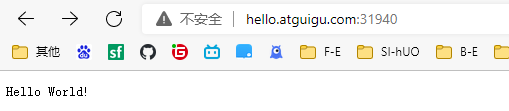

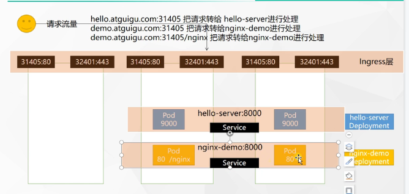

##### 网络

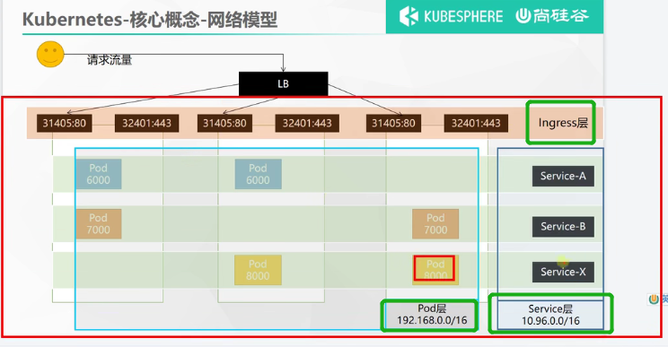

#### 存储抽象

##### 原生挂载

```yaml
apiVersion: apps/v1
kind: Deployment
metadata:
  labels:
    app: nginx-pv-demo
  name: nginx-pv-demo
spec:
  replicas: 2
  selector:
    matchLabels:
      app: nginx-pv-demo
  template:
    metadata:
      labels:
        app: nginx-pv-demo
    spec:
      containers:
      - image: nginx
        name: nginx
        volumeMounts:
        - name: html
          mountPath: /usr/share/nginx/html
      volumes:
        - name: html
          nfs:
            server: 139.198.14.107
            path: /nfs/data/nginx-pv
```

问题：

1. Pod 删除之后，挂载再磁盘的内容是不会删除的
2. Pod 对于磁盘的占用没有限制，当多个Pod 挂载同一个磁盘，就会出现一个Pod 拿走全部磁盘资源

##### PV/PVC

*PV：持久卷（Persistent Volume），将应用需要持久化的数据保存到指定位置， 将磁盘抽象*

*PVC：持久卷申明（**Persistent Volume Claim**），申明需要使用的持久卷规格： 定义磁盘，用资源大小， 相当于是使用资源的申请书，安装申请书的内容，去决定PV 的规格*

> 一个PVC 和一个空间进行绑定，删除PVC 那么删除空间。
>
> PV 存储数据。
>
> PV 是提前已经开辟好的。一个PV 池子中有很多的资源(静态供应)
>
> 然后当Pod 中需要挂载数据，然后再Pod 中写一个PVC，然后再池子中按照最小原则找一个符合PVC 的需求的PV 返回给使用。

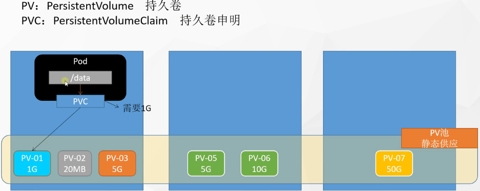

以上除了静态供应，还有动态供应，按需创建。


#### Config

> 挂载配置文件
>
> 抽取应用配置，并且可以自动更新
>
> 简称CM

```yaml
apiVersion: v1
data:    #data是所有真正的数据，key：默认是文件名   value：配置文件的内容， | 代表接下来是一个大文本
  redis.conf: |
    appendonly yes
kind: ConfigMap
metadata:
  name: redis-conf
  namespace: default
  
---
apiVersion: v1
kind: Pod
metadata:
  name: redis
spec:
  containers:
  - name: redis
    image: redis
    command:
      - redis-server
      - "/redis-master/redis.conf"  #指的是redis容器内部的位置
    ports:
    - containerPort: 6379
    volumeMounts:
    - mountPath: /data
      name: data
    - mountPath: /redis-master
      name: config
  volumes:
    - name: data
      emptyDir: {}
    - name: config
      configMap:
        name: redis-conf
        items:
        - key: redis.conf
          path: redis.conf
```


#### 其他命令

```sh
watch -n 1 kubectl get pod 0owide
// 每隔1s，执行命令
```

