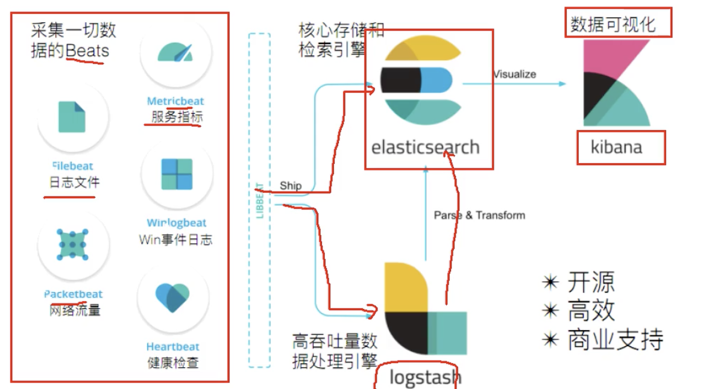

#### ELK(ElasticStack)

日志分析技术栈

* `elasticsearch`

> 数据存储
>
> 是一个开源分布式搜索引擎，特点有：分布式、零配置、自动发现、索引自动分片、索引副本机制、restful 风格接口，多数据源，自动搜索负载等

* `logstash`

> 可以对数据做数据处理
>
> 开源的数据搜集、分析和处理，早期，没有beats 的时候使用它做收集数据

* `kibana`

> 可视化
>
> 可以汇总、分析和搜索中要是数据日志。

* `beats`

> 采集一切数据
>
> 有很多的子项目，每一个子项目用于收集一类数据
>
> Filebeats: 监控、收集服务器日志数据
>
> Packetbeat： 网络数据包分析器，用于监控、收集网络流量
>
> Metribeats：定期获取外部系统的指标信息，可以监控、收集等服务

