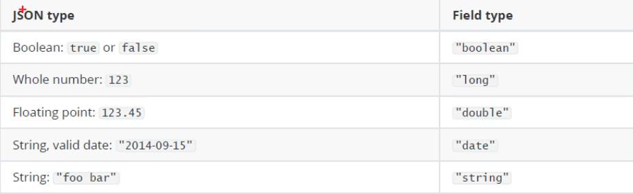
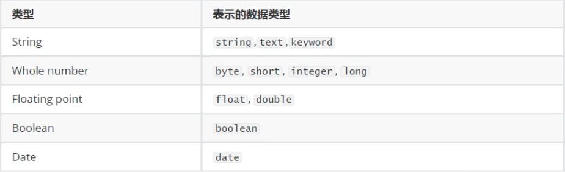
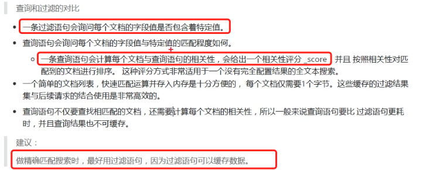
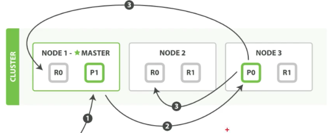

#### 安装

```shell
docker pull elasticsearch:6.5.4

docker run -d -p 9200:9200 -p 9300:9300 -e "discovery.type=single-node" -e "ES_JAVA_OPTS=-Xms256m -Xmx256m" elasticsearch:6.5.4

# 访问 http://0.0.0.0:9200/
# es-head， es 的管理界面进行查看相关信息
docker pull mobz/elasticsearch-head:5
docker run -d --name es_admin -p 9100:9100 mobz/elasticsearch-head:5

# 刚开始输入 es 地址 es-head 并不能链接上去，需要进入到 es 容器中进行配置
docker exec -it es /bin/bash
# 如果没有目录则创建
vi config/elasticsearch.yml
# 添加
http.cors.enabled: true
http.cors.allow-origin: "*"

# 重启 es 容器

```

#### 基本概念

##### 索引

可以看做是关系型数据库中的表，是逻辑数据的逻辑存储，可以分为更小的部分。索引结构是为快速有效的全文索引准备的，特别是它不存储原始值，`es` 可以把索引存放在一台或者多台服务器上，每个分片可以有多个副本。

##### 文档

存储在`es` 中的主要实体叫文档，用关系型数据库来类比的话，一个文档就相当于是数据库中的一行数据。

和`mongoDB` 优点类似，但是在`es` 中相同字段必须有相同的类型。

文档是由多个字段组成，每个字段可能多次出现在一个文档中，这样的字段加多只字段。

每个字段的类型，可以是文档，数值，日期等，字段类型也可以是复杂类型，一个字段包含在其他子文档或者数组中。

##### 映射

所有文档写进索引之前都会先进行分析，如何将输入的文本分割为词条，哪些词条又会被过滤，这种行为叫做映射，一般用户自己定义。

##### 文档类型

每个`es` 中，一个索引对象可以存储很多不同用途的对象。

每个文档可以有不同的结构

不同的文档类型不能为相同的属性设置不同的类型，如，在同一个索引中的所有文档类型中，一个叫 `title`的字段必须具有相同的类型。

#### RESTful API

`es` 中有丰富的`API`

##### 创建索引

`PUT /{索引名字}`

```json
{
  "setting": {
    "index": {
      "number_of_shards": "2", // 分片数
      "number_of_replicas": "0" // 副本数
    }
  }
}

// 或者
{
  "setting": {
      "number_of_shards": "2", // 分片数
      "number_of_replicas": "0" // 副本数
  }
}
```

##### 删除索引

`DELETE /{索引名字}`

```json
不需要 body
```

##### 插入数据

`POST /{索引}/类型/{id}`

> `id` 是文档的唯一标识符合

`http://0.0.0.0:9200/haoke1/user/1001`

```json
{
    "id": 1001,
  "name": "001",
  "age":10,
  "sex": "男"
}

// 返回
{
    "_index": "haoke1",
    "_type": "user",
    "_id": "1001",
    "_version": 1, // 版本信息
    "result": "created", // 响应结果
    "_shards": {
        "total": 2,
        "successful": 1,
        "failed": 0
    },
    "_seq_no": 0,
    "_primary_term": 1
}
```

以上就是所谓的 **非结构化的索引**

> 也就是只创建了索引，文档结构不定义，在创建数据的时候，构建文档结构。

如果在创建的时候没有给额唯一标识符， 那么会自动创建id

`POST http://0.0.0.0:9200/haoke1/user/`

```json
{
    "id": 1002,
  "name": "002",
  "age":20,
  "sex": "女"
}

// 返回结果
{
    "_index": "haoke1",
    "_type": "user",
    "_id": "tNz_v3kBv9ztisov255i", // es 自动创建一个索引
    "_version": 1,
    "result": "created",
    "_shards": {
        "total": 2,
        "successful": 1,
        "failed": 0
    },
    "_seq_no": 1,
    "_primary_term": 1
}
```

##### 更新数据

> 文档数据是不能修改的，但是可以通过覆盖的方式进行更新。

`PUT http://0.0.0.0:9200/haoke1/user/1001`

```json
{
  "id": 1001,
  "name": "111",
  "age":21,
  "sex": "男"
}

// 返回结果
{
    "_index": "haoke1",
    "_type": "user",
    "_id": "1001",
    "_version": 3,
    "result": "updated",
    "_shards": {
        "total": 2,
        "successful": 1,
        "failed": 0
    },
    "_seq_no": 3,
    "_primary_term": 1
}
```

局部更新

1. 旧的文档中检索 JSON
2. 修改它
3. 删除旧
4. 索引新文档

`post http://0.0.0.0:9200/haoke1/user/1001/_update`

```json
{
  "doc" :{
    "age": 23
  }
}

// 返回
{
    "_index": "haoke1",
    "_type": "user",
    "_id": "1001",
    "_version": 4,
    "result": "updated",
    "_shards": {
        "total": 2,
        "successful": 1,
        "failed": 0
    },
    "_seq_no": 4,
    "_primary_term": 1
}
```

##### 删除数据

`DELETE http://0.0.0.0:9200/haoke1/user/1001 ` 

返回

```json
{
    "_index": "haoke1",
    "_type": "user",
    "_id": "1001",
    "_version": 5,
    "result": "deleted",
    "_shards": {
        "total": 2,
        "successful": 1,
        "failed": 0
    },
    "_seq_no": 5,
    "_primary_term": 1
}
```

删除不存在的文档，返回`404`

删除数据，并不会立马从磁盘中移除，它只会被标记为已删除，`es` 将在添加更多的索引只会才会在后台进行删除内容。

##### 搜索数据

根据 `id` 进行数据搜索

`GET http://0.0.0.0:9200/haoke1/user/tNz_v3kBv9ztisov255i`

```json
{
    "_index": "haoke1",
    "_type": "user",
    "_id": "tNz_v3kBv9ztisov255i",
    "_version": 1,
    "found": true,
    "_source": {
        "id": 1002,
        "name": "002",
        "age": 20,
        "sex": "女"
    }
}
```

##### 查询全部

`GET http://0.0.0.0:9200/haoke1/user/_search`

```json
{
    "took": 128,
    "timed_out": false,
    "_shards": {
        "total": 5,
        "successful": 5,
        "skipped": 0,
        "failed": 0
    },
    "hits": {
        "total": 1,
        "max_score": 1.0,
        "hits": [
            {
                "_index": "haoke1",
                "_type": "user",
                "_id": "tNz_v3kBv9ztisov255i",
                "_score": 1.0,
                "_source": {
                    "id": 1002,
                    "name": "002",
                    "age": 20,
                    "sex": "女"
                }
            }
        ]
    }
}
```

##### 关键字查询

`GET http://0.0.0.0:9200/haoke1/user/_search?q=age:20`

```json
// 返回和上面内容一样
```

---

#### DSL 搜索

> 允许构建复杂、强大的查询

`POST http://0.0.0.0:9200/haoke1/user/_search`

```json
{
  "query": {
    "match": {
      "age": 20
    }
  }
}

// ----
// 检索年龄大于30岁的，男性
{
  "query": {
    "bool": {
      "filter": {
        "range": {
          "age": {
            "gt": 29
          }
        }
      },
      "must": {
        "match" : {
          "sex": "男"
        }
      }
    }
  }
}
// 返回
{
    "took": 5,
    "timed_out": false,
    "_shards": {
        "total": 5,
        "successful": 5,
        "skipped": 0,
        "failed": 0
    },
    "hits": {
        "total": 1,
        "max_score": 0.6931472,
        "hits": [
            {
                "_index": "haoke1",
                "_type": "user",
                "_id": "1004",
                "_score": 0.6931472,
                "_source": {
                    "id": 1004,
                    "name": "小明",
                    "age": 30,
                    "sex": "男"
                }
            }
        ]
    }
}

// -- 搜索张三或者李四
{
  "query": {
     "match": {
        "name": "小明 王五"
    }
  }
}

//-- 高亮显示
{
  "query": {
     "match": {
        "name": "小明 王五"
    }
  },
  "highlight": {
    "fields": {
      "name":{}
    }
  }
}

// -- 聚合，类似于 groupBy
{
  "aggs": {
    "all_interests": {
      "terms": {
        "field": "age" // 年龄做聚合
      }
    }
  }
}

// 索引结果
{
    "took": 6,
    "timed_out": false,
    "_shards": {
        "total": 5,
        "successful": 5,
        "skipped": 0,
        "failed": 0
    },
    "hits": {
        "total": 6,
        "max_score": 1.0,
        "hits": [
            {
                "_index": "haoke1",
                "_type": "user",
                "_id": "tNz_v3kBv9ztisov255i",
                "_score": 1.0,
                "_source": {
                    "id": 1002,
                    "name": "002",
                    "age": 20,
                    "sex": "女"
                }
            },
            {
                "_index": "haoke1",
                "_type": "user",
                "_id": "1004",
                "_score": 1.0,
                "_source": {
                    "id": 1004,
                    "name": "小明",
                    "age": 30,
                    "sex": "男"
                }
            },
            {
                "_index": "haoke1",
                "_type": "user",
                "_id": "1006",
                "_score": 1.0,
                "_source": {
                    "id": 1006,
                    "name": "小话22",
                    "age": 24,
                    "sex": "女"
                }
            },
            {
                "_index": "haoke1",
                "_type": "user",
                "_id": "1005",
                "_score": 1.0,
                "_source": {
                    "id": 1005,
                    "name": "小话2",
                    "age": 35,
                    "sex": "女"
                }
            },
            {
                "_index": "haoke1",
                "_type": "user",
                "_id": "1002",
                "_score": 1.0,
                "_source": {
                    "id": 1002,
                    "name": "王五",
                    "age": 24,
                    "sex": "男"
                }
            },
            {
                "_index": "haoke1",
                "_type": "user",
                "_id": "1003",
                "_score": 1.0,
                "_source": {
                    "id": 1003,
                    "name": "小花",
                    "age": 29,
                    "sex": "女"
                }
            }
        ]
    },
    "aggregations": {  // 聚合结果
        "all_interests": {
            "doc_count_error_upper_bound": 0,
            "sum_other_doc_count": 0,
            "buckets": [
                {
                    "key": 24,
                    "doc_count": 2
                },
                {
                    "key": 20,
                    "doc_count": 1
                },
                {
                    "key": 29,
                    "doc_count": 1
                },
                {
                    "key": 30,
                    "doc_count": 1
                },
                {
                    "key": 35,
                    "doc_count": 1
                }
            ]
        }
    }
}
```

返回的数据中还包含一些其他的元数据。

`_index`: 文档存储的地方，相当于是关系型数据库中的一张表。

> 我们的数据被存储和索引在分片(shards) 中，索引只是一个把一个或者多个分片分组在一起的逻辑空间，然而，这只是一些内部细节，是一些内部细节。 只需要关心，文档存储在所有中。

`_type`: 文档代表的对象的类型

> 在关系型数据库中，经常将相同类的对象存储在一个表中，因为它们有着相同的结构，同理`es` 中的`type` 就是这样的作用，表示相同的`事物`，这里的相同，理解为结构相同。
>
> `_type` 名字可以是大写或者小写，不能包含下划线或者逗号
>
> 每个类型都可以有自己的映射`mapping`/结构定义，就像是传统数据库中的列一样。

`_id`: 文档的唯一标识

> 仅仅是一个字符串，当和 `_index,_type` 组合时候，在`es` 中唯一表示一个文档，当创建一个文档，你可以自定义`_id`, 也可以让`es` 自动生成。

##### 指定响应字段

`GET http://0.0.0.0:9200/haoke1/user/tNz_v3kBv9ztisov255i?_source=id,name`

```json
{
    "_index": "haoke1",
    "_type": "user",
    "_id": "tNz_v3kBv9ztisov255i",
    "_version": 1,
    "found": true,
    "_source": {
        "name": "002",
        "id": 1002
    }
}
```

##### 只返回响应字段，不需要元数据

`GET http://0.0.0.0:9200/haoke1/user/tNz_v3kBv9ztisov255i/_source`

`GET http://0.0.0.0:9200/haoke1/user/tNz_v3kBv9ztisov255i/_source?_source=id,name`

##### 判断文档是否存在

`HEAD http://0.0.0.0:9200/haoke1/user/tNz_v3kBv9ztisov255i`

只返回状态码，200 表示状态存在，404表示不存在

---

#### 批操作

批查询、批插入

##### 批查询

`POST http://0.0.0.0:9200/haoke1/user/_mget`

```json
{
    "ids": ["tNz_v3kBv9ztisov255i","1001","1002"]
}

// 返回
{
    "docs": [
        {
            "_index": "haoke1",
            "_type": "user",
            "_id": "tNz_v3kBv9ztisov255i",
            "_version": 1,
            "found": true,
            "_source": {
                "id": 1002,
                "name": "002",
                "age": 20,
                "sex": "女"
            }
        },
        {
            "_index": "haoke1",
            "_type": "user",
            "_id": "1001",
            "found": false
        },
        {
            "_index": "haoke1",
            "_type": "user",
            "_id": "1002",
            "_version": 1,
            "found": true,
            "_source": {
                "id": 1002,
                "name": "王五",
                "age": 24,
                "sex": "男"
            }
        }
    ]
}
```

##### _bulk 操作

##### 批插入

可以完成批量插入、修改、删除等操作

`POST http://0.0.0.0:9200/haoke1/user/_bulk`

```json
{"create": {"_index":"haoke","_type":"user", "_id": 2001}}
{"id":2001, "name": "name1", "age": 20, "sex": "男"}
{"create": {"_index":"haoke","_type":"user", "_id": 2002}}
{"id":2002, "name": "name2", "age": 20, "sex": "男"}
{"create": {"_index":"haoke","_type":"user", "_id": 2003}}
{"id":2003, "name": "name3", "age": 20, "sex": "男"}

// 返回
{
    "took": 47,
    "errors": false,
    "items": [
        {
            "create": {
                "_index": "haoke",
                "_type": "user",
                "_id": "2001",
                "_version": 1,
                "result": "created",
                "_shards": {
                    "total": 1,
                    "successful": 1,
                    "failed": 0
                },
                "_seq_no": 0,
                "_primary_term": 1,
                "status": 201
            }
        },
        {
            "create": {
                "_index": "haoke",
                "_type": "user",
                "_id": "2002",
                "_version": 1,
                "result": "created",
                "_shards": {
                    "total": 1,
                    "successful": 1,
                    "failed": 0
                },
                "_seq_no": 0,
                "_primary_term": 1,
                "status": 201
            }
        },
        {
            "create": {
                "_index": "haoke",
                "_type": "user",
                "_id": "2003",
                "_version": 1,
                "result": "created",
                "_shards": {
                    "total": 1,
                    "successful": 1,
                    "failed": 0
                },
                "_seq_no": 1,
                "_primary_term": 1,
                "status": 201
            }
        }
    ]
}
```

##### 批删除

`POST http://0.0.0.0:9200/haoke1/user/_bulk`

```json
{"delete": {"_index": "haoke", "_type":"user", "_id": 2001}}
{"delete": {"_index": "haoke", "_type":"user", "_id": 2002}}
{"delete": {"_index": "haoke", "_type":"user", "_id": 2003}}

// 返回体
{
    "took": 8,
    "errors": false,
    "items": [
        {
            "delete": {
                "_index": "haoke",
                "_type": "user",
                "_id": "2001",
                "_version": 2,
                "result": "deleted",
                "_shards": {
                    "total": 1,
                    "successful": 1,
                    "failed": 0
                },
                "_seq_no": 1,
                "_primary_term": 1,
                "status": 200
            }
        },
        {
            "delete": {
                "_index": "haoke",
                "_type": "user",
                "_id": "2002",
                "_version": 2,
                "result": "deleted",
                "_shards": {
                    "total": 1,
                    "successful": 1,
                    "failed": 0
                },
                "_seq_no": 2,
                "_primary_term": 1,
                "status": 200
            }
        },
        {
            "delete": {
                "_index": "haoke",
                "_type": "user",
                "_id": "2003",
                "_version": 2,
                "result": "deleted",
                "_shards": {
                    "total": 1,
                    "successful": 1,
                    "failed": 0
                },
                "_seq_no": 3,
                "_primary_term": 1,
                "status": 200
            }
        }
    ]
}
```

#### 分页

接口`from` 和 `size` 参数

`GET http://0.0.0.0:9200/haoke1/user/_search?from=1&size=3`

```json
{
    "took": 2,
    "timed_out": false,
    "_shards": {
        "total": 5,
        "successful": 5,
        "skipped": 0,
        "failed": 0
    },
    "hits": {
        "total": 6,
        "max_score": 1.0,
        "hits": [
            {
                "_index": "haoke1",
                "_type": "user",
                "_id": "1004",
                "_score": 1.0,
                "_source": {
                    "id": 1004,
                    "name": "小明",
                    "age": 30,
                    "sex": "男"
                }
            },
            {
                "_index": "haoke1",
                "_type": "user",
                "_id": "1006",
                "_score": 1.0,
                "_source": {
                    "id": 1006,
                    "name": "小话22",
                    "age": 24,
                    "sex": "女"
                }
            },
            {
                "_index": "haoke1",
                "_type": "user",
                "_id": "1005",
                "_score": 1.0,
                "_source": {
                    "id": 1005,
                    "name": "小话2",
                    "age": 35,
                    "sex": "女"
                }
            }
        ]
    }
}
```

而在分布式系统中，分页就会所需要的排序的计算成倍增长。这也就是 **深分页**。

---

#### 映射

前面创建的所有以及插入的数据，都是由`es` 进行自动判断的，有些时候我们是需要明确字段类型的，否则自动判断的类型和实际需求是不相符合的。自动判断内的规则如下：



`es` 中的支持类型



在`es` 5.x 版本之前不再支持`string` ，由`text` 和 `keyword` 类型替代。

`text` 类型，**当一个字段要被全文搜索**，比如`email` 内容，产品描述等，应该是`text` 类型，设置`text` 类型以后，字段类型会被分析，在生产倒排索引以前，字符串被分析器分成一个一个词项，text 类型的字段不用于排序，很少由于聚合。

`keyword` 类型适用于索引结构化的字段，如果字段需要进行过滤，排序，聚合`keyword`只能通过精确值搜索到(**类似结构化数据结构中的主键**)。


#### 创建明确类型的索引

`PUT  http://0.0.0.0:9200/itcast`

```json
{
  "settings": {
    "index": {
      "number_of_shards": "2",
      "number_of_replicas": "0"
    }
  },
  "mappings": {
    "person": {
      "properties": {
        "name": {
          "type": "text"
        },
        "age": {
          "type": "integer"
        },
        "mail": {
          "type": "keyword"
        },
        "hobby": {
          "type": "text"
        }
      }
    }
  }
}

// 返回
{
    "acknowledged": true,
    "shards_acknowledged": true,
    "index": "itcast"
}
```

##### 查看 mapping

`GET http://0.0.0.0:9200/itcast/_mapping`

```json
{
    "itcast": {
        "mappings": {
            "person": {
                "properties": {
                    "age": {
                        "type": "integer"
                    },
                    "hobby": {
                        "type": "text"
                    },
                    "mail": {
                        "type": "keyword"
                    },
                    "name": {
                        "type": "text"
                    }
                }
            }
        }
    }
}
```

##### 使用 _buik 索引库中批插入数据

`POST http://0.0.0.0:9200/itcast/_bulk`

```json
{"create": {"_index":"itcast","_type":"person","_id": 2001}}
{"name": "name1", "age": 20, "mail": "12@qq.com", "hobby":"羽毛球、评判球、足球"}
{"create": {"_index":"itcast","_type":"person","_id": 2002}}
{"name": "name2", "age": 25, "mail": "1232@qq.com", "hobby":"篮球、评判球、足球"}
{"create": {"_index":"itcast","_type":"person","_id": 2003}}
{"name": "name3", "age": 30, "mail": "12312132@qq.com", "hobby":"听歌、看电影"}
```

搜索

`POST http://0.0.0.0:9200/itcast/person/_search`

```json
{
  "query": {
    "match": {
      "hobby": "听歌"
    }
  }
}

// 返回
{
    "took": 9,
    "timed_out": false,
    "_shards": {
        "total": 2,
        "successful": 2,
        "skipped": 0,
        "failed": 0
    },
    "hits": {
        "total": 1,
        "max_score": 1.4877304,
        "hits": [
            {
                "_index": "itcast",
                "_type": "person",
                "_id": "2003",
                "_score": 1.4877304,
                "_source": {
                    "name": "name3",
                    "age": 30,
                    "mail": "12312132@qq.com",
                    "hobby": "听歌、看电影"
                }
            }
        ]
    }
}
```

#### 结构化查询

`term` 用于精确匹配哪些值，比如数字，日期，布尔值或者`not_analyzed` 的字符串(未经分析的数据类型)

`POST http://0.0.0.0:9200/itcast/person/_search`

```json
{
  "query": {
    "term": {
      "age": 30
    }
  }
}
// 返回
{
    "took": 8,
    "timed_out": false,
    "_shards": {
        "total": 2,
        "successful": 2,
        "skipped": 0,
        "failed": 0
    },
    "hits": {
        "total": 1,
        "max_score": 1.0,
        "hits": [
            {
                "_index": "itcast",
                "_type": "person",
                "_id": "2003",
                "_score": 1.0,
                "_source": {
                    "name": "name3",
                    "age": 30,
                    "mail": "12312132@qq.com",
                    "hobby": "听歌、看电影"
                }
            }
        ]
    }
}

// terms 使用
{
  "query": {
    "terms": {
      "age": [30,20]
    }
  }
}
```

#### range 查询

`range` 查询过滤允许我们按照指定的范围查找一批数据

`POST http://0.0.0.0:9200/itcast/person/_search`

```json
{
  "query": {
  	"range": {
    	"age": {
      	"gte": 20,
      	"lt": 30
    	}
  	}
	}
}
// 返回
{
    "took": 3,
    "timed_out": false,
    "_shards": {
        "total": 2,
        "successful": 2,
        "skipped": 0,
        "failed": 0
    },
    "hits": {
        "total": 2,
        "max_score": 1.0,
        "hits": [
            {
                "_index": "itcast",
                "_type": "person",
                "_id": "2002",
                "_score": 1.0,
                "_source": {
                    "name": "name2",
                    "age": 25,
                    "mail": "1232@qq.com",
                    "hobby": "篮球、评判球、足球"
                }
            },
            {
                "_index": "itcast",
                "_type": "person",
                "_id": "2001",
                "_score": 1.0,
                "_source": {
                    "name": "name1",
                    "age": 20,
                    "mail": "12@qq.com",
                    "hobby": "羽毛球、评判球、足球"
                }
            }
        ]
    }
}
```

`gt`: 大于

`gte`：大于等于

`lt`: 小于

`lte`: 小于等于

---

#### exist 查询

查询文档中是否包含指定字段或者没有某个子弹，类似于SQL 中的 IS_NULL 条件

```json
{
  "query": {
  	"exists": {
    	"field": "card"
  	}
	}
}
// 返回
{
    "took": 3,
    "timed_out": false,
    "_shards": {
        "total": 2,
        "successful": 2,
        "skipped": 0,
        "failed": 0
    },
    "hits": {
        "total": 0,
        "max_score": null,
        "hits": []
    }
}
```

如果使用 `match` 查询一个全文本字段，它会在真正查询之前使用分析器先分析 `match` 一下查询字符，

如果给定一个确切值，在遇到数据、日期布尔值等或者`not_analyzed` 的字符串时，它将为你搜索你给定的值。

---

#### bool 查询

查询可以合并多个条件查询结果布尔逻辑，包含以下操作

`must`， 多个条件查询的完全匹配，相当于是`and`

`must_not`: 相当于是 `not`

`should`: 至少有一个查询条件匹配，相当于是`or`

这些参数可以分别继承一个查询条件或者一个查询条件的数组。

```json
{
  "query": {
  	"bool": {
    	"must": {
        "term": {
          "folder":"inbox"
        }
      },
      "must_not": {
        "term": {
          "tag": "spam"
        }
      },
      "should": [
        {
          "term": {
            "starred": true
          }
        },
        {
          "term": {
            "unread": true
          }
        }
      ]
  	}
	}
}
```

#### 过滤

`POST http://0.0.0.0:9200/itcast/person/_search`

```json
{
  "query": {
  	"bool": {
    	"filter": {
        "term": {
          "age": 20
        }
      }
  	}
	}
}
```



----

#### 分词

##### 指定分词器分词

`POST`

```json
{
  "analyzer": "standard",
  "text": "hello world"
}
// 输出
{
    "tokens": [
        {
            "token": "hello",
            "start_offset": 0,
            "end_offset": 5,
            "type": "<ALPHANUM>",
            "position": 0
        },
        {
            "token": "world",
            "start_offset": 6,
            "end_offset": 11,
            "type": "<ALPHANUM>",
            "position": 1
        }
    ]
}

// 中文
{
  "analyzer": "standard",
  "text": "我是中国人"
}
// 结果
{
    "tokens": [
        {
            "token": "我",
            "start_offset": 0,
            "end_offset": 1,
            "type": "<IDEOGRAPHIC>",
            "position": 0
        },
        {
            "token": "是",
            "start_offset": 1,
            "end_offset": 2,
            "type": "<IDEOGRAPHIC>",
            "position": 1
        },
        {
            "token": "中",
            "start_offset": 2,
            "end_offset": 3,
            "type": "<IDEOGRAPHIC>",
            "position": 2
        },
        {
            "token": "国",
            "start_offset": 3,
            "end_offset": 4,
            "type": "<IDEOGRAPHIC>",
            "position": 3
        },
        {
            "token": "人",
            "start_offset": 4,
            "end_offset": 5,
            "type": "<IDEOGRAPHIC>",
            "position": 4
        }
    ]
}
```

对索引中指定字段分词

`POST http://0.0.0.0:9200/itcast/_analyze`

```json
{
  "analyzer": "standard",
  "field":"hobby",
  "text": "我是 中国人"
}
```

#### 中文分词

常用的有`IK、jieba、THULAC`， 推荐使用`IK` 中文分词

#### 全文搜索

做好全文搜索，主要是关注两个方面

* 相关性： **他是评价查询和其结果键的相关程度**，并根据这种相关程度对结果排名的一种能力，这种计算方式是以TF/IDF 方法，地理位置近邻，模糊相似，或者其他的某些算法
* 分词，他是将文本块转为有区别的，规范化的 token的一个过程，**目的是为了创建倒排索引以及查询倒排索引。**

`POST http://0.0.0.0:9200/itcast/person/_search`

```json
{
  "query": {
      "match": {
          "hobby": "music、 basketball"
      }
  },
  "highlight": {
      "fields": {
          "hobby":{}
      }
  }
}

// 返回
{
    "took": 7,
    "timed_out": false,
    "_shards": {
        "total": 2,
        "successful": 2,
        "skipped": 0,
        "failed": 0
    },
    "hits": {
        "total": 3,
        "max_score": 1.3097504,
        "hits": [
            {
                "_index": "itcast",
                "_type": "person",
                "_id": "2004",
                "_score": 1.3097504,
                "_source": {
                    "name": "name4",
                    "age": 19,
                    "mail": "1dsdsd2@qq.com",
                    "hobby": "play basketball、listen music"
                },
                "highlight": {
                    "hobby": [
                        "play <em>basketball</em>、listen <em>music</em>"
                    ]
                }
            },
            {
                "_index": "itcast",
                "_type": "person",
                "_id": "2002",
                "_score": 0.73617005,
                "_source": {
                    "name": "name2",
                    "age": 25,
                    "mail": "1232@qq.com",
                    "hobby": "basketball、pingpang、footbal"
                },
                "highlight": {
                    "hobby": [
                        "<em>basketball</em>、pingpang、footbal"
                    ]
                }
            },
            {
                "_index": "itcast",
                "_type": "person",
                "_id": "2003",
                "_score": 0.6548752,
                "_source": {
                    "name": "name3",
                    "age": 30,
                    "mail": "12312132@qq.com",
                    "hobby": "listen music、watch movie"
                },
                "highlight": {
                    "hobby": [
                        "listen <em>music</em>、watch movie"
                    ]
                }
            }
        ]
    }
}
```

上面搜索到的结果其实是`music` || `basketball` 的关系。如果要搜索`music` && `basketball` 

```json
{
  "query": {
      "match": {
          "hobby": {
                "operator": "and",
                "query": "music basketball"
          }
      }
  },
  "highlight": {
      "fields": {
          "hobby":{}
      }
  }
}
// 返回结果
{
    "took": 8,
    "timed_out": false,
    "_shards": {
        "total": 2,
        "successful": 2,
        "skipped": 0,
        "failed": 0
    },
    "hits": {
        "total": 1,
        "max_score": 1.3097504,
        "hits": [
            {
                "_index": "itcast",
                "_type": "person",
                "_id": "2004",
                "_score": 1.3097504,
                "_source": {
                    "name": "name4",
                    "age": 19,
                    "mail": "1dsdsd2@qq.com",
                    "hobby": "play basketball、listen music"
                },
                "highlight": {
                    "hobby": [
                        "play <em>basketball</em>、listen <em>music</em>"
                    ]
                }
            }
        ]
    }
}
```

设置匹配度

```json
{
  "query": {
      "match": {
          "hobby": {
              "minimum_should_match": "40%", // 搜索的结果相似度不能低于
                "query": "music basketball"
          }
      }
  },
  "highlight": {
      "fields": {
          "hobby":{}
      }
  }
}
```

上述的相似度需要通过不断的搜索反馈去调整

#### 组合搜锁

#### 权重

对某些词增加权重来影响该词条数据的得分。

---

#### ES 集群

`master` 结点

* `node.master=true` 结点有资格被选为 master 结点
* `master` 结点用于控制整个集群的操作，比如创建或者删除索引，管理其他非`master` 的结点

`data` 结点

* 配置文件中的 `node.data=true` 有资格成为data 结点
* data 结点主要用于执行数据相关的操作，比如文档的CRUE

`客户端`结点

* 配置文件中的`node.master` 和 `node.data`  均是 false
* 该结点不能作为master 结点，也不能是 data 结点
* 可以作为客户端结点，用户响应客户的请求，把请求转发到其他结点

`部落结点`

* 当一个接地那配置`tribu.*` 的时候，他是一个特殊的客户端，它可以链接多个集群，在所有链接的集群上执行搜索和其他操作

#### 分片和副本

**索引**， 它是一个存储关联数据的地方，只是一个用来指向一个或者多个分片(shards) 的逻辑命名空间(logical namespace)。

* 一个分片是一个最小级别的工作单元，它只是保存了索引中所有数据的一部分。
* 分片是一个`lucene` 实例，并且它本身就是一个完成的搜索引擎，应用程序不会和他直接通讯。
* 分片可以是最主分片(primary shard)， 或者是复制分片(replica shard)
* 索引中的每个文档属于一个单独的主分片，所以主分片的数量决定了索引最多能存储多少数据
* 复制分片只是主分片中的一个副本，它可以放置硬件故障导致的数据丢失，**同时可以提供读请求**，比如搜索或者从别的`shard`取回数据
* **当索引创建完成的时候，主分片的数量就固定了，但是复制分片的数量可以随时调整。**

这里有几个重点概念

**分片： 主分片和复制分片，数据存储的地方**

**复制分片值提供读请求(主分片提供读写请求)**


#### 故障转移

当集群出现故障，那么如何处理的


#### 分布式文档

##### 路由

当一个文档来了，会通过如下的方式计算，将文档存储在那个主分片上

`shard = hash(routing) % number_of_primary_shards`

`routing` 是一个任意的字符串，默认是 `_id` 但可以自定义。

*这也就是为什么创建主分片之后，主分片就不能在修改了，因为之前存储的文档计算得到不同的结果，从而找不到之前存储的文档了。*


#### 文档的读写

新建、索引和删除请求都是些操作，它们必须在主分片上成功完成之后，才能复制到相关的复制分片上。

**一次写文档的操作**

1. 客户端给`Node1` 发送新建，索引或者删除请求
2. 结点使用文档的`_id` 更加上面的算法，确定文档属于分片0，它转发请求到`node3`中的，分片0 的主分片`P0`
3. `Node3` 在主分片上执行请求，如果成功，它转发请求到相应的复制分片上`R0`,当所有的复制结点报告成功，`Node3` 报告成功到请求的结点，请求结点在报告给客户端



**读操作**

1. 客户端给 `Node1` 发生`get` 请求。
2. 结点使用文档的`_id` 确定文档属于分片0，分片0对应的复制分片在三个结点上都有，此时转发请求到`node2`
3. `node2` 返回文档给`Node1` 然后返回给客户端

对于读请求，为了负载均衡，请求结点会给每个请求选择不同的分片，他会循环所有分片副本。

可能的情况下，一个被索引的文档可能存在于主分片上海没有来的级同步到复制分片上，这时候复制分片会报告文档未找到，主分片会返回文档，一旦索引请求成功返回给客户，文档则在主分片和复制分片都可用的。


#### 全文搜索

对于全文搜索而言，文档可能分散在各个结点上，那么在分布式的情况下，是如何搜索文档的呢？

搜索分为2个阶段，搜索 + 取回

> 搜索`query`
>
> 1. 每个分片中获取数据
>
> 2. 所有分片数据排序、得到最终结果

---

#### Java 客户端

`RESTful 客户端`

* 低级客户端

> 通过`http` 直接链接到`es` 的集群，用户在使用该客户端的时候需要将请求手动拼接成`es` 所需的`json` 格式并发送，收到响应的同时返回`JSON` 数据手动封装为对象，虽然麻烦，但是兼容所有的`es` 版本

* 高级客户端

> 提供很多便捷的API 解决低级客户端需要手动状态数据格式的问题。

使用看代码地方

