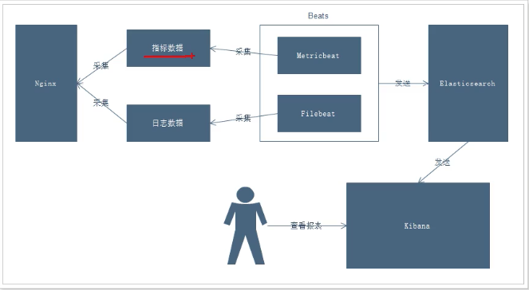
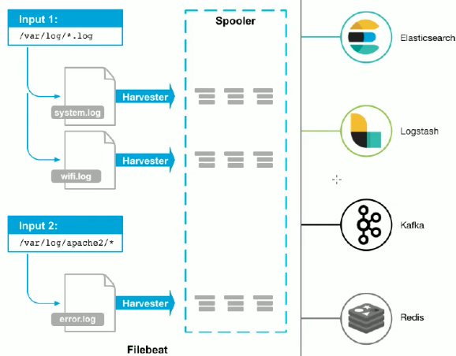

#### 项目需求

> `nginx` 是一个`web` 服务器，往往`nginx` 服务器会作为项目的访问入口，那么`nginx` 的性能保证就变得非常的重要，如果`nginx` 的运行出现了问题，就会对项目有较大影响， 所以需要对`nginx` 的运行有监控措施，事实掌握`nginx` 的运行情况，就需要收集`nginx` 的运行指标和分析`nginx` 的运行日志。

#### 业务流程



---

#### Docker 按照 nginx

> ```shell
> docker pull nginx
> 
> docker run -d -p 9400:80 --name nginx d1a364dc548d
> # 端口映射 0.0.0.0:9400->80/tcp
> # 0.0.0.0：9400 就可以访问了
> # nginx -t 查看 nginx 按照路径
> # 日志路径 /var/log/nginx/
> # 默认情况下日志输出都重定向到标准输出中了
> # 删除日志，重载就可以解决
> # rm -f /var/log/nginx/*
> # nginx -s reload
> # tail -f /var/log/nginx/access.log
> # 访问 nginx 就能看到滚动日志了
> ```
>
> 
>
> 在`nginx` 的`logs` 目录下有一个`access.log` 目录存放着 nginx 的访问日志。
>
> `filebeat` 就在这里获取访问日志。

#### Beats 采集一切数据


* `fileBeat`

> 日志采集器，用于转发和汇总日志文件。

`harvester`

* 负责读取单个文件的内容
* 如果文件在读取时被删除或者重命名，Filebeat 将继续读取文件

`prospector`

* `prospector` 负责管理`harvester`并找到所有要读取的文件来源
* 如果输入类型为日志，则查找器将查找路径匹配的所有文件，并为每个文件启动一个 `harvester`
* `filebeat` 目前支持2中`prospector`类型，`log` 和 `stdin`

`Filebeat`

* `Filebeat` 保存每个文件的状态并经常将状态刷新到磁盘上的注册文件(在目录`data/registry`)中
* 该状态用于记住 `harvest` 正在读取的最后偏移量，并确保发送的所有日志行
* 如果输出无法访问，`filebeat` 会跟踪最后发送的行，并在输出再次可用时继续读取文件
* 在 `filebeat` 运行时候，每个`prospector` 内存中也会保存的文件状态信息，当重新启动`filebeat` 时，将使用注册文件的数量来重建文件状态，`filebeat` 将每个`harvester` 在从保存的最后偏移量继续读取



##### 安装

> ```shell
> docker pull elastic/filebeat:7.5.1
> 
> # 临时启动
> docker run -d --name=filebeat elastic/filebeat:7.5.1
> 
> # 拷贝数据文件
> docker cp filebeat:/usr/share/filebeat /data/elk7/
> chmod 777 -R /data/elk/filebeat
> chmod go-w /data/elk/filebeat/filebeat.yml
> 
> # 以新的方式启动
> docker run -d \
>   --name=filebeat \
>   --restart=always \
>   -v /Users/xuxliu/Downloads/myProject/volume-data/elk/filebeat/filebeat:/usr/share/filebeat \
>   elastic/filebeat:7.5.1
> ```