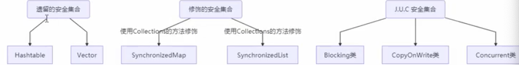

#### 线程安全的集合类概述

遗留的安全集合基本都是使用`sychronized` 效率低。

修饰的安全集合是将线程不安全的集合，编程一个线程安全的集合，只不过在调用集合类的方法的时候如`map.get` 使用`sychronized`  修饰

`J.U.C`  

* `Blicking`: 大部分实现基于锁，并提供用来阻塞的方法
* `CopyOnWrite`:  修改开销比较重
* `concurrent` 类的容器
  * 内部很多操作都是基于 `cas` 优化，一般可以提供较高吞吐
  * 弱一致性
    * 遍历时候弱一致性，如果在遍历的是内容发生改变，那么遍历的还是旧的内容
    * 求大小弱一致性，size 操作未必是100% 准确
    * 读取弱一致性                                                                                                                 

#### 主要看看 ConcurrentHashMap

> ConcurrentHashMap是并发效率更高的Map，用来替换其他线程安全的Map容器，比如Hashtable和Collections.synchronizedMap。
>
> 线程安全的容器只能保证自身的数据不被破坏，但无法保证业务的行为是否正确。错误的理解这里的线程安全，不恰当的使用ConcurrentHashMap，往往会导致出现问题。
>
> 

