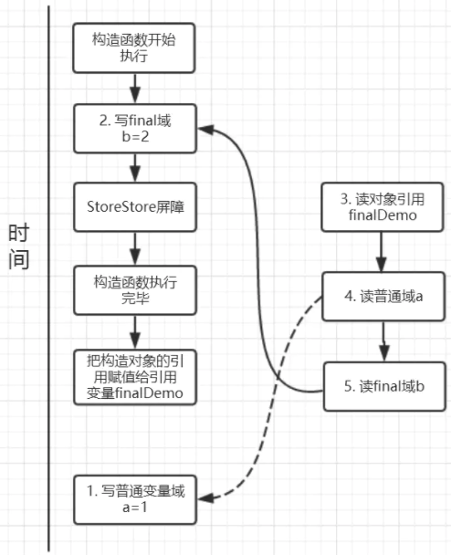
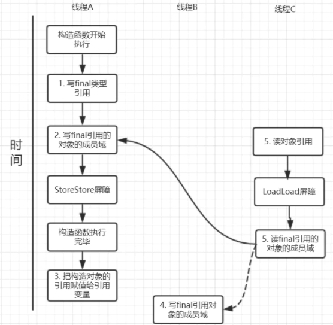

#### final 的使用场景

> `final` 可以修饰变量，方法和类，

#### final 修饰变量

##### 修饰成员变量

```java
public class FinalExample {
    private final  int a = 6;
    private final String str;
    private final static boolean b;
    private final double c;

    // 没有在构造器中，初始化代码中，声明时赋值
    // 报错
    private final char ch;

    {
        // 实例变量可以在初始化赋值初值
        str = "初始化代码块赋值";
    }

    static {
        // 类变量(静态变量) 可以在静态初始化块中复制
        b = true;

        // 非静态变量不可以在静态初始快中赋初值
        str = "非静态变量不可以在静态初始化块中赋初值";
    }

    public FinalExample() {
        // 实例变量可以在初始化中古初始
        c = 1.0;

        // 已经赋值了就不能在更改
        a = 10;
        c = 1.0;
    }

    public void a() {
        ch = 'a';
    }
}
```

有2种变量，在不同的时候/时机完成复制

类变量(static 修饰变量)

* 申明的时候复制
* 静态代码块中复制

实例变量

* 声明时候
* 实例方法中
* 构造方法


当final修饰基本数据类型变量时，不能对基本数据类型变量重新赋值，因此基本数据类型变量不能被改变。

而对于引用类型变量而言，它仅仅保存的是一个引用，final只保证这个引用类型变量所引用的地址不会发生改变，即一直引用这个对象，但这个对象属性是可以改变的。

**宏变量**

> 利用final变量的不可更改性，在满足一下三个条件时，该变量就会成为一个“宏变量”，即是一个常量。

1. 使用**final修饰符修饰；**
2. 在定义该final变量时就**指定了初始值；**
3. 该初始值在编译时就能够唯一指定。

#### 方法

**当父类的方法被final修饰的时候，子类不能重写父类的该方法**，比如在`Object`中，`getClass()`方法就是`final`的，我们就不能重写该方法，但是`hashCode()`方法就不是被`final`所修饰的，我们就可以重写`hashCode()`方法。

**1. 父类的final方法是不能够被子类重写的**

**2. final方法是可以被重载的**

#### 类

**当一个类被final修饰时，表名该类是不能被子类继承的**。


**不变类**

子类继承往往可以重写父类的方法和改变父类属性，会带来一定的安全隐患，因此，当一个类不希望被继承时就可以使用final修饰。

不变类的意思是创建该类的实例后，该实例的实例变量是不可改变的。满足以下条件则可以成为不可变类：

1. 使用private和final修饰符来修饰该类的成员变量
2. 提供带参的构造器用于初始化类的成员变量；
3. 仅为该类的成员变量提供getter方法，不提供setter方法，因为普通方法无法修改fina修饰的成员变量；
4. 如果有必要就重写Object类 的hashCode()和equals()方法，应该保证用equals()判断相同的两个对象其Hashcode值也是相等的。

---

#### 多线程中的 final

* final域的重排序规则**禁止对final域的写重排序到构造函数之外**

```java
public class FinalExample {
    private int a;  //普通域
    private final int b; //final域
    private static FinalExample finalDemo;

    public FinalExample() {
        a = 1; // 1. 写普通域
        b = 2; // 2. 写final域
    }

    public static void writer() {
        finalDemo = new FinalExample();
    }

    public static void reader() {
        FinalExample demo = finalDemo; // 3.读对象引用
        int a = demo.a;    //4.读普通域
        int b = demo.b;    //5.读final域
    }
}
```

1. JMM禁止编译器把final域的写重排序到构造函数之外；
2. 编译器会在final域写之后，构造函数return之前，插入一个storestore屏障。这个屏障可以禁止处理器把final域的写重排序到构造函数之外。

当前final 变量在声明时候或者 static 代码块中初始化，都不会有线程问题，这里只说在构造函数中初始化的`禁止重排序到构造函数之外` 的优化。

我们再来分析writer方法，虽然只有一行代码，但实际上做了两件事情：

1. 构造了一个FinalDemo对象；
2. 把这个对象赋值给成员变量finalDemo。



Final 的变量在构造函数中其的初始化，保证在构造函数执行完之前初始化完成。

**在对象引用为任意线程可见之前，对象的final域已经被正确初始化过了，而普通域就不具有这个保障**

#### final域为引用类型

**对final修饰的对象的成员域写操作**

针对引用数据类型，final域写针对编译器和处理器重排序除了上面的约束，另外**增加了这样的约束**：在构造函数内对**一个final修饰的对象的成员域的写入，与随后在构造函数之外把这个被构造的对象的引用赋给一个引用变量**，这两个操作是不能被重排序的。

```java
public class FinalExample {

    final int[] arrays;
    private FinalExample finalReferenceDemo;

    public FinalExample() {
        arrays = new int[1];  //1
        arrays[0] = 1;        //2
    }

    public void writerOne() {
        finalReferenceDemo = new FinalExample(); //3
    }

    public void writerTwo() {
        arrays[0] = 2;  //4
    }

    public void reader() {
        if (finalReferenceDemo != null) {  //5
            int temp = finalReferenceDemo.arrays[0];  //6
        }
    }
}
```

针对上面的实例程序，线程线程A执行wirterOne方法，执行完后线程B执行writerTwo方法，然后线程C执行reader方法。下图就以这种执行时序出现的一种情况来讨论

针对上面的实例程序，线程线程A执行wirterOne方法，执行完后线程B执行writerTwo方法，然后线程C执行reader方法。下图就以这种执行时序出现的一种情况来讨论



由于对final域的写禁止重排序到构造方法外，因此1和3不能被重排序。由于一个final域的引用对象的成员域写入不能与随后将这个被构造出来的对象赋给引用变量重排序，因此2和3不能重排序。