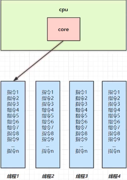
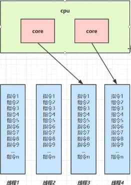
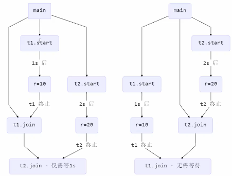
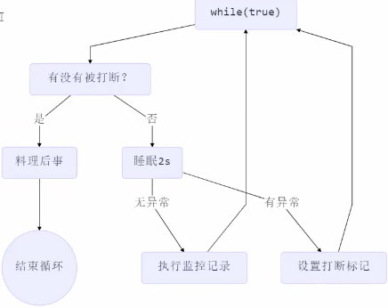

#### 主要内容

* 进程
* 线程
* 并发
* 并行

以及Java 并发工具，并发问题以及解决方案，同时也会讲解一些其他领域的并发

---

#### 为什么学习并发编程呢

> 并发线程其实很少使用到
>
> 不止止做一些CRUD，编程往下走，理解底层东西

----

#### 进程和线程

##### 进程和线程的概念

* 进程

> 程序由指令和数据组成，但是这些指令要运行，数据需要读写，就必须将**指令加载到CPU，数据加载到内存**，在指令运行过程中还需要使用到磁盘，网络等设备，进程就是用来加载指令，管理内存，管理IO 的
>
> 当一个程序被运行，从磁盘上加载这个程序代码到内存，就开启了一个线程
>
> 进程就是一个实例，大部分程序可以同时运行多个实例进程

* 线程

> 一个进程可以分为多个线程
>
> 一个线程就是一个指令流，将指令流中的一条条指令以一定的顺序给CPU 执行
>
> Java 中线程作为最小调度单位，进程作为资源分配的最小单位，在window 中进程是不活动的，知识作为线程的容器

* 二者对比

> 进程基本是独立的，而 线程是存在于进程中，是进程的一个自己
>
> 进程拥有共享的资源，如内存空间等，其内部的线程共享
>
> 进程间通信较为复杂
>
> * 同一个计算机的进程通信称为IPC(Inter-proceess communication)
> * 不同计算机之间的进程通信，需要通过网络，
>
> 线程通信简单，因为他们共享进程内存，一个例子是多个线程可以访问同一个共享变量
>
> 线程更加轻量，线程上限切换一般比进程上下文切换消耗低

##### 并行和并发的概念

* 二者定义

> 并发(concurrent) 是同一个时间对多事件处理能力
>
> > 如一个家庭主妇，打扫卫生，给孩子喂奶，一个人轮流交替做这么多事情
>
> 并行(parallel) 是同一个时间动手做多个事件的能力
>
> > 家庭主妇雇2个保姆，1个打扫卫生，1个给孩子喂奶
>
> 看看下面解释，JVM 角度解释就非常的清除了的。

* 并发

  

> 如上图，如果只有一个`cpu core` 线程实际还是**申请执行**的，操作系统中有一个组件叫做任务调度器，将 `cpu` 的实际片断分给不同的线程使用，知识由于`cpu`在线程间的切换非常快，使用的时候基本是无感的，总结就是一句话 **微观串行、宏观并行**

* 并行



> 并行就是真正的有多个 `cpu core` 
>
> 一般并行和并发都是同事存在的，如上2个核4个任务的情况
>
> 只有当n个核n个线程的时候可能才会有真正的并行

##### 线程的基本使用

* 异步调用

> 同步：程序运行需要等待返回结果，然后才能做下个事情
>
> > 多线程可以放方法执行变为异步的，比如读取磁盘文件。
>
> 异步：程序运行不需要等待返回结果，调用完，可以立马执行下一步操作

* 充分利用 cpu 资源

> 单核 cpu 下，多线程不能实际提高程序运行的效率，只是为了能够在不同的任务之间切换，不同线程轮流使用 cpu，不至于一个线程占用 cpu，别的线程没法干活
>
> 多核 cpu 可以并行跑多个线程，但能够提高程序运行效率还是分情况的
>
> 有的任务，经过精心设计，将任务拆分，并行执行，当然可以提高程序的运行效率，但不是所有计算任务都可以拆分。
>
> 也不是所有的任务都需拆分，任务的目的如果不同，拆分和效率没啥意义
>
> IO 操作不占用 cpu，只是我们一般烤文件使用的是阻塞IO，这时候相当于线程虽然不用 cpu，但是需要一直等待IO 结束，没能充分利用线程，所以才有后面的阻塞和非阻塞IO以及异步IO的优化

---

#### Java 线程

##### 创建启动线程

```java
// 创建线程的第一种方法
// Thread 代表一个线程
Thread thread = new Thread(() -> System.out.println("run sub thread"));
thread.setName("t1");
thread.start();
System.out.println("run main thread");

// 创建线程的第二种方法， 推荐方法，可以使用lambda 的方式创建
// Runnable 是一个 functionalInterface
// Runnable 是可运行的任务， 线程要执行的代码， 
Runnable runnable = () -> System.out.println("runable sub thread");
runnable.run();

@FunctionalInterface
public interface Runnable {
    public abstract void run();
}
```

##### Thread 和 Runnable 的区别

> ```java
> public Thread(Runnable target)
> ```
>
> 本质都是一样的，都是去执行了 runnable.run  方法,`Thread`是将线程和任务混合在一起执行了。
>
> `Runnable` 更容易和线程池等高级API 配合。
>
> 它脱离了Thread 基础关系，更灵活，Java 中推荐是组合优于继承的使用方式的。

##### 创建线程的第三种方式 FutureTask

> ```java
> public class FutureTask<V> implements RunnableFuture<V>
>   
> public interface RunnableFuture<V> extends Runnable, Future<V> 
>   
> public interface Future<V>{
>   boolean cancel(boolean mayInterruptIfRunning);
>   boolean isCancelled();
>   boolean isDone();
>   V get() throws InterruptedException, ExecutionException;
>   ...
> }
> 
> // FutureTask 可以接收 Runnable(无返回、无异常排除)、Callable(可返回，可异常跑出)
> @FunctionalInterface
> public interface Callable<V> {
>     V call() throws Exception;
> }
> 
> // 例子
> FutureTask<Integer> futureTask = new FutureTask<>(() -> {
>   System.out.println("futureTask callable sub thread");
>   return 100;
> });
> 
> // 需要借助 thread 执行， futureTask 中的任务抛到一个线程中去执行
> Thread thread1 = new Thread(futureTask);
> thread1.start();
> 
> // 等待 featureTask 执行结束并返回结果，阻塞
> Integer integer = futureTask.get();
> System.out.println(integer);
> ```

---

#### 查看进程的方法

* windows 

> 任务管理器
>
> tasklist 查看进程
>
> taskkill 杀死进程

* linux

> ps -fe 查看所有进程
>
> ps -fT -p <PID> 查看某个PID 的所有线程
>
> kill 杀死进程
>
> top 按照大写H 切换是否显示线程
>
> top H -p <PID> 查看某个PID 的所有线程

* Java

> jps 查看所有Java 进程
>
> jstack <PID> 查看某个PID 的所有线程状态 

---

#### 栈和栈帧

##### 栈

> 给线程使用

##### 栈帧

> 栈里面放的是栈帧，代表每一次方法的调用

在idea 中在2个线程的代码，断点设置为 `Thread` 模式，可以看到多个栈的信息。

##### 线程上下文切换

> 因为一下原因会导致 cpu 不在执行当前的线程，转而执行另外一个线程的代码
>
> * 线程的 cpu 时间用完
> * 垃圾回收
> * 有更高优先级的线程需要执行
> * 线程自已调用了 sleep yield wait join park synchronized lock  等方法
>
> 当线程上下文切换的时候，需要有操作系统保存当前线程的状态，并恢复到另一个线程，Java 中对应的概念就是程序计数器，它的作用就是记住下一条jvm 指令的执行地址，是线程私有的
>
> 状态包括程序计数器，虚拟机栈中每个栈帧的信息，局部变量操作数栈，返回地址等
>
> 上下文切换频繁会影响性能

---

#### 常用方法

##### start 和 run

```java
Thread t = new Thread(() -> System.out.println("running"));
t.run();

Thread t = new Thread(() -> System.out.println("running"));
t.start();
```

代码都是可以执行的，但是 `run` 方法的执行，是在 `main`线程调用了Thread 中的 `run` 方法，

而`start` 执行，那么Thread 中的 `run` 方法是有新的子线程的执行的

`start` 是不能被多次重复启动的(多此调用)。

##### 线程状态

```java
Thread t = new Thread(() -> System.out.println("running"));
System.out.println(t.getState()); // NEW
t.start();
System.out.println(t.getState()); // RUNNABLE CPU 调度执行
```

##### sleep 和 yield

`sleep` 将当前线程从 `Running` 进入 `Timed Wating` 状态

其他线程可以使用 `interrupt` 方法打断正在睡眠的进程，这时候 sleep 方法会跑出 `interruptedException`

睡眠结束之后的线程未必会立刻得到执行

`yield` 会让当前线程从 `Running` 进程 `Runnable` 状态，然后调度执行其他同等优先级的线程，如果这个时候没有相同优先级的线程，那么不能保证让当前线程暂停的效果

##### 线程优先级

##### Join

```java
private static int r=0;

System.out.println("开始 main");
new Thread(() -> {
  System.out.println("开始 subThread");
  System.out.println("结束 subThread");
  r = 10;
}).start();

System.out.println("main 结果为： " + r);
System.out.println("main 结束");
```

输出

main 结果为： 0
开始 subThread
结束 subThread
main 结束

如果要在主线程中获取子线程中修改后的r 的值呢

```java
System.out.println("开始 main");
Thread thread = new Thread(() -> {
  System.out.println("开始 subThread");
  System.out.println("结束 subThread");
  r = 10;
});

thread.start();
thread.join(); // 等待 thread 执行结束，然后在执行后续代码(main 线程)

System.out.println("main 结果为： " + r);
System.out.println("main 结束");
```

输出

开始 subThread
结束 subThread
main 结果为： 10
main 结束

*第二个例子 主线程等待2个 join*

```java
private static void test2() throws InterruptedException {
        Thread thread = new Thread(() -> {
            try {
                TimeUnit.SECONDS.sleep(1);
            } catch (InterruptedException e) {
                e.printStackTrace();
            }
            r = 10;
        });


        Thread thread2 = new Thread(() -> {
            try {
                TimeUnit.SECONDS.sleep(2);
            } catch (InterruptedException e) {
                e.printStackTrace();
            }
            r = 20;
        });

        long start = System.currentTimeMillis();
        thread.start();
        thread2.start();

        System.out.println("join begin");
        thread.join();
        System.out.println("t1 joined");
        thread2.join();
        System.out.println("t2 joined");
        long end = System.currentTimeMillis();
        System.out.println(end - start);
    }
```

输出

join begin
t1 joined
t2 joined
2001

这里运行程序总共花费2s，而不是3s是因为主线程等待的线程thread和thread2是并行执行的(join 之前已经start了)，而不是 thread 执行完之后 在执行thread2，

执行流程 t1.join()先左边的图，t2.join() 先那么是右边的图



> Join 还有一个方法
>
> ```java
> public final synchronized void join(long millis)
> ```
>
> 有一个等待时间，当时间等外，还没结果，那么久不等了，继续往下执行代码

#### Interupt

> 打断线程，打断 sleep、wait、join 的线程

```java
Thread sleep = new Thread(() -> {
  System.out.println("sleep");
  try {
    sleep(5000);
  } catch (InterruptedException e) {
    e.printStackTrace();
  }
});

sleep.start();
System.out.println("interrupt");

Thread.sleep(1000);

sleep.interrupt(); // 子线程被打断，主线程继续往下运行
System.out.println("打断标记"+ sleep.isInterrupted());
```

> 打断正常运行的线程
>
> ```java
> Thread thread2 = new Thread(() -> {
>             while (true) {
> 
>             }
>         });
> 
> thread2.start();
> Thread.sleep(1000);
> thread2.interrupt();
> ```
>
> 当主线程执行打断线程thread2的时候，其实线程 thread2 还是在运行的，而thread2是否继续运行是由自己控制的，主线程只是告诉 thread2 你被打断了，但是 thread2 还是可以继续执行的，一下方式可以让thread2 在主线程打断之后停止运行
>
> ```java
> Thread thread2 = new Thread(() -> {
>             while (true) {
>                 boolean interrupted = Thread.currentThread().isInterrupted();
>                 if (interrupted) {
>                     break;
>                 }
>             }
>         });
> 
> thread2.start();
> Thread.sleep(1000);
> thread2.interrupt();
> ```
>
> interrupt 可以优雅的退出程序。它只是告诉你被打断了，然后被打断的程序可以自己做决定是否停止，如果停止可以去做一些善后事情，然后在把自己结束。

#### 两阶段终止模式

> 在一个线程T1 中如何优雅的终止线程T2，这里的优雅是说给T2一个料理后事的机会
>
> *错误思路*
>
> * 使用线程对象 stop 方法停止线程，stop 方法会真正杀死线程，如果这个时候线程锁住了共享资源，那么当它被杀死之后，这个共享资源就没有机会在释放锁了，其他线程将永远无法获得锁
> * 使用  `System.exit(0)` 方法停止线程，目的仅仅是停止一个线程，**但这种方法会让整个线程都停止**
>
> 
>
> ```java
> private static class Terminator {
>         private Thread monitor;
> 
>         public void start() {
>             monitor = new Thread(() -> {
>                 while (true) {
>                     Thread thread = Thread.currentThread();
>                     boolean interrupted = thread.isInterrupted();
>                     if (interrupted) {
>                         System.out.println("料理后事");
>                         break;
>                     }
> 
>                     try {
>                         Thread.sleep(1000);
>                         System.out.println("继续监控");
>                     } catch (InterruptedException e) {
>                         thread.interrupt();
>                         e.printStackTrace();
>                     }
> 
>                 }
>             });
> 
>             monitor.start();
>         }
> 
>         public void stop() {
>             monitor.interrupt();
>         }
>     }
> 
> Terminator terminator = new Terminator();
> terminator.start();
> 
> Thread.sleep(3500);
> terminator.stop();
> ```
>
> 还有其他方式实现2阶段终止模式

#### interrupt 打断 park 方法

> ```java
> private static void test() throws InterruptedException {
>   Thread unpark = new Thread(() -> {
>     System.out.println("park,,,");
>     long l = System.currentTimeMillis();
>     LockSupport.park();
>     long l3 = System.currentTimeMillis();
> 
>     System.out.println(l3-l);
>     // 这里的输出就是主线程睡觉的时间，主线程执行 interrupt，将程序 park 打断，开始继续执行
> 
>     System.out.println("unpark");
>     System.out.println("打断状态" + Thread.currentThread().isInterrupted());
> 
>     System.out.println("park again,,,park打断之后在 park 是不可以的");
>     long l4 = System.currentTimeMillis();
>     LockSupport.park();
>     long l5 = System.currentTimeMillis();
>     System.out.println(l5-l4); // 输出 0
> 
>   });
> ```
>
> 如果将打断标记在设置为 true，那么久是可以继续在 park的
>
> ```java
> private static void test() throws InterruptedException {
>   Thread unpark = new Thread(() -> {
>     System.out.println("park,,,");
>     long l = System.currentTimeMillis();
>     LockSupport.park();
>     long l3 = System.currentTimeMillis();
> 
>     System.out.println(l3-l);
>     // 这里的输出就是主线程睡觉的时间，主线程执行 interrupt，将程序 park 打断，开始继续执行
> 
>     System.out.println("unpark");
>     System.out.println("打断状态" + Thread.currentThread().isInterrupted());
> 
>     // interrupted status of the thread is cleared by this method
>     System.out.println("park interrupt reset,,," + Thread.interrupted());
> 
>     System.out.println("park again,,,");
>     long l4 = System.currentTimeMillis();
>     LockSupport.park();
>     long l5 = System.currentTimeMillis();
>     System.out.println(l5-l4);
> 
>   });
> 
>   unpark.start();
> 
>   Thread.sleep(2000);
> 
>   unpark.interrupt();
> }
> ```

#### 不推荐使用的方法

> stop：2阶段停止替换
>
> suspend： 阻塞方法，wait 替换
>
> resume：恢复线程
>
> 三者都会到这线程死锁，程序终止之后，锁住的东西是释放不了的。

---

#### 主线程和守护线程

默认情况下Java 进程需要等待所有线程都运行结束，才会结束，有一种特殊的线叫做守护线程， 只要其它非守护线程运行结束了，即使守护线程的的代码没有执行完，也会强制结束

线程全部结束之后，程序(Java 进程)才会退出

如上代码，程序是进入不了断点的，因为字段从一直是循环在while 中的，

另外看debug 的线程中main 线程以及执行结束了，但是由于子线程Thread-0 还没有结束，所以程序一直还处于运行状态。

##### 守护线程

> 非守护线程结束，那么守护线程就立马结束，即使程序还没有执行结束

这个程序也是不会再断点处停留下来，子线程设置了守护线程，在主线程执行结束之后，守护线程还在whil 中执行，并没有执行到断点处，主线程一带执行结束，守护线程就立马退出了。

**垃圾回收器线程就是一种守护线程**，用户线程停止，那么垃圾回收器就会停止。

#### 线程的状态

##### 操作系统层面，将线程分为了5种

初始状态：仅仅是在语言层面创建了线程对象，还未于操作系统线程相关连(没有调研 .start() 方法)

可运行状态: 指该线程已经被创建(和操作系统线程关联)，可以由CPU 调度执行

运行状态: CPU 时间片运行中的状态，当CPU 时间片用完，会从【运行状态】转到【可运行状态】，会导致上下文切换

阻塞状态: 调用了阻塞API，如读写文件，线程放弃CPU时间，

终止状态: 线程以及执行完毕，生命周期以及结束，不会再转为其他状态

##### 从Thread.State 枚举值，将状态分为6中

NEW: 线程对象刚刚被创建，但是还没有执行 start()

RUNNABLE: 调用了 start 方法治好，RUNNABLE 覆盖看操作系统层面的 【可运行状态】【运行状态】【阻塞状态】

TIMED_WAITING:  调用 sleep 后的状态

BLOCKED WAITING TIMED_WAITING 是 Java API 中的阻塞状态的细分

TERMINATED: 线程代码运行结束

```
 public static void main(String[] args) {
         Thread t1 = new Thread(() -> {
             System.out.println("running");
         }); // NEW
 
         Thread t2 = new Thread(() -> {
             while (true) {
             }
         });
 
         t2.start(); // RUNNABLE
 
         Thread t3 = new Thread(() -> {
             System.out.println("running"); // TERMINATED
         });
         t3.start();
 
         Thread t4 = new Thread() {
             @Override
             public void run() {
                 synchronized (ManyThreadState.class) {
                     try {
                         Thread.sleep(100000); // TIMED_WAITING
                     } catch (InterruptedException e) {
                         e.printStackTrace();
                     }
                 }
             }
         };
         t4.start();
 
         Thread t5 = new Thread(() -> {
             try {
                 t2.join(); // WAITING
             } catch (InterruptedException e) {
                 e.printStackTrace();
             }
         });
         t5.start();
 
         Thread t6 = new Thread(){
             @Override
             public void run() {
                 synchronized (ManyThreadState.class) {
                     try {
                         Thread.sleep(100000); // BLOCK, 锁被 t4 拿走了
                     } catch (InterruptedException e) {
                         e.printStackTrace();
                     }
                 }
             }
         };
         t6.start();
 
         System.out.println("t1：" + t1.getState());
         System.out.println("t2：" + t2.getState());
         System.out.println("t3：" + t3.getState());
         System.out.println("t4：" + t4.getState());
         System.out.println("t5：" + t5.getState());
         System.out.println("t6：" + t6.getState());
     }
```

running t1：NEW t2：RUNNABLE t3：TERMINATED t4：TIMED_WAITING t5：WAITING t6：BLOCKED


一个程序多个线程本身是没有问题的

问题出在多个线程访问共享资源

- 多个线程读共享资源也没有问题
- 在多个线程对共享资源读写操作的时候发**送指令交错**，就会出现问题

一段代码块内如果存在对共享资源的多线程读写操作，这个代码块为**临界区**

**竞态条件**

多个线程在临界区内执行由于代码执行序列不停而导致结果无法预测


