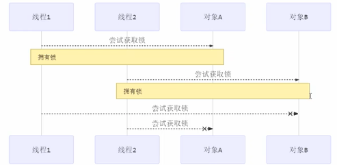
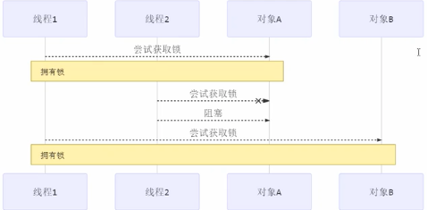
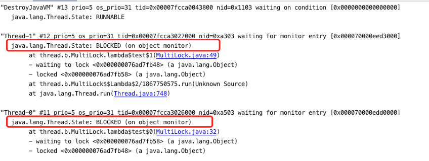
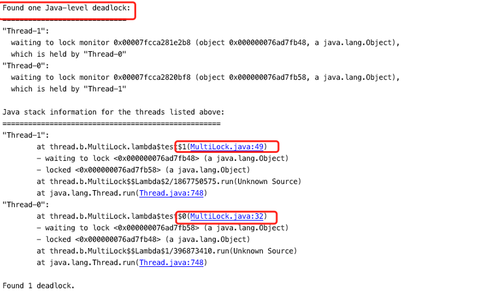

#### 一个例子

> 如在一个大屋子里，睡觉、学习、互不干涉
>
> 现在小南要学习，小女要睡觉，但如果只有一个房子(一个对象锁)的话，那么并发度很低，解决的方法是使用多个房间(多个对象锁)

```java
public class MultiLock {

    public static void main(String[] args) {
        BigRoom room = new BigRoom();
        new Thread(() -> room.sleep()).start();

        new Thread(() -> room.study()).start();
    }

    static class BigRoom {
        public void sleep() {
            synchronized (this) {
                System.out.println("sleep 2 hours");
                try {
                    Thread.sleep(2000);
                } catch (InterruptedException e) {
                    e.printStackTrace();
                }
            }
        }

        public void study() {
            synchronized (this) {
                System.out.println("study 1 hour");
                try {
                    Thread.sleep(1000);
                } catch (InterruptedException e) {
                    e.printStackTrace();
                }
            }
        }
    }
}
```

改进，多个房间

```java
public class MultiLock {

    public static void main(String[] args) {
        BigRoom room = new BigRoom();

        new Thread(() -> room.sleep()).start();

        new Thread(() -> room.study()).start();
    }

    static class BigRoom {
       // 这里定义多个房间(多把锁)
        private final Object studyRoom = new Object();
        private final Object sleepRoom = new Object();

        public void sleep() {
            synchronized (sleepRoom) {
                System.out.println("sleep 2 hours");
                try {
                    Thread.sleep(2000);
                } catch (InterruptedException e) {
                    e.printStackTrace();
                }
            }
        }

        public void study() {
            synchronized (studyRoom) {
                System.out.println("study 1 hour");
                try {
                    Thread.sleep(1000);
                } catch (InterruptedException e) {
                    e.printStackTrace();
                }
            }
        }
    }
}
```

好处：增强并发度

坏处：如果一个线程需要同时获得多把锁，容器发送死锁

#### 线程的活跃性

> 一个线程内代码，一直执行不完，一直在运行，活跃性有三种情况

##### 死锁

> 当一个线程同时获得多把锁，就容易发生死锁
>
> T1 线程获得A 对象的锁，接下来想获取B 对象的锁
>
> T2 对象获得了B 对象的锁，接下来想获得A 对象的锁
>
> 造成二者的锁都无法释放和获得
>
> 
>
> 顺序加锁的解决方法
>
> 

```java
public static void test() {
        Object studyRoom = new Object();
        Object sleepRoom = new Object();

        Thread thread = new Thread(() -> {
            synchronized (studyRoom) {
                System.out.println("locl studyRoom");

                try {
                    Thread.sleep(1000);
                } catch (InterruptedException e) {
                    e.printStackTrace();
                }

                synchronized (sleepRoom) {
                    System.out.println("locl sleepRoom");
                    System.out.println("lock  sleepRoom 后的操作");
                }
            }
        });

        Thread thread2 = new Thread(() -> {
            synchronized (sleepRoom) {
                System.out.println("locl sleepRoom");

                try {
                    Thread.sleep(1000);
                } catch (InterruptedException e) {
                    e.printStackTrace();
                }

                synchronized (studyRoom) {
                    System.out.println("locl studyRoom");
                    System.out.println("lock  studyRoom 后的操作");
                }
            }
        });

        thread.start();
        thread2.start();
    }
```

##### 定位死锁


第一步：如上发生死锁的代码在运行，然后通过 jps 查看线程的pid

第二步 `jstack 51039` 会将信息全部打印出来



根据上面的信息，就可以看出来，确实是都发生了`BLOCKED`  状态，却是在等待monitor 的释放

包括打印出来的信息会将deadlock 发生死锁的线程，以及发生死锁的地方



**哲学家就餐问题-死锁问题**


```java
static class Chopstick {
        String name;

        public Chopstick(String name) {
            this.name = name;
        }

        @Override
        public String toString() {
            return "Chopstick{" +
                    "name='" + name + '\'' +
                    '}';
        }
    }

    static class Philosopher extends Thread {
        Chopstick left;
        Chopstick right;

        public Philosopher(String name, Chopstick left, Chopstick right) {
            super(name);
            this.left = left;
            this.right = right;
        }

        @Override
        public void run() {
            while (true) {
                synchronized (left) {
                    String name = Thread.currentThread().getName();
                    System.out.println(name + " 左边筷子到手");
                    synchronized (right) {
                        System.out.println(name + " 左右筷子到手");
                        System.out.println(name + " 开始吃饭");
                        try {
                            Thread.sleep(1000);
                        } catch (InterruptedException e) {
                            e.printStackTrace();
                        }
                    }
                }
            }
        }
    }

Chopstick chopstick = new Chopstick("1");
Chopstick chopstick2 = new Chopstick("2");
Chopstick chopstick3 = new Chopstick("3");
Chopstick chopstick4 = new Chopstick("4");
Chopstick chopstick5 = new Chopstick("5");

new Philosopher("苏格拉底", chopstick,chopstick2).start();
new Philosopher("柏拉图", chopstick2,chopstick3).start();
new Philosopher("亚里士多", chopstick3,chopstick4).start();
new Philosopher("赫拉克利特", chopstick4,chopstick5).start();
new Philosopher("阿基米德", chopstick5,chopstick).start();
```

解决这个问题，需要在后续学到 `reentrantlock` 重入锁后解决

##### 活锁

> 2个线程互相改变对方的结束条件，最后谁也没办法结束

```java
public static void TestLiveLock() {

        new Thread(() -> {
            while (count > 0) {
                try {
                    Thread.sleep(1000);
                } catch (InterruptedException e) {
                    e.printStackTrace();
                }

                count--;
                System.out.println("Count--: " + count);
            }
        }).start();

        new Thread(() -> {
            while (count < 20) {
                try {
                    Thread.sleep(1000);
                } catch (InterruptedException e) {
                    e.printStackTrace();
                }

                count++;
                System.out.println("Count++: " + count);
            }
        }).start();
    }
```

可以设置一些随机的睡眠时间，可以防止程序一直运行下去

##### 饥饿

> 一个线程由于优先级太低，始终不能得到CPU 的调度执行，也不能结束

---

> 使用 `reentrantLock` 可以解决上面的三个活性问题

#### reentrantLock

* 可中断(`sychronized` 不能中断)
* 可以设置超时时间(一段时间内获取不到锁，那我就去做其他事情`sychronized`获取不到锁会一直等待)
* 可以设置为公平锁(设置公平可以防止线程饥饿问题): 先到先得，而不是随机去争抢
* 支持多个条件变量

和 `sychronized` 一样，都支持可重入

**基本语法**

```java
// 获得锁, 放在 try 内或者外都是一样的
reentrantlock.lock();
try {
  // 临界区
} finally {
  // 释放锁
  reentrantlock.unlock();
}
```

##### 可重入

> 是说同一个线程如果首次获得这把锁，那么因为他是这把锁的拥有者，因此有权利再次获得这把锁，如果是不可重入锁，那么第二次获得锁时候，自己也会被锁挡住。

```java
public class ReentrantLockTest {

    private static ReentrantLock lock = new ReentrantLock();

    public static void main(String[] args) {
        lock.lock(); // 相当于是 synchronized(obj)
        try {
            System.out.println(" -> m1");
            m1();
        } finally {
            lock.unlock();
        }
    }

    public static void m1() {
        lock.lock();
        try {
            System.out.println("m1 -> m2");
            m2();
        } finally {
            lock.unlock();
        }
    }

    public static void m2() {
        lock.lock();
        try {
            System.out.println("m2");
        } finally {
            lock.unlock();
        }
    }
}
```

##### 可打断

```java
Thread thread = new Thread(() -> {
  try {
/*
       如果没有竞争，那么次方法就会获取 lock 对象锁
       如果有竞争就会进入阻塞队列，可以被其他方法 interrupt 方法打断
       让你不要再往下等了
*/
    	System.out.println("尝试获得锁，，");
    	lock.lockInterruptibly(); // lock.lock() 是无法被打断的，会一直死等
  } catch (InterruptedException e) {
    	e.printStackTrace();
    	System.out.println("没有获得锁，被打断了，返回");
    	return;
  }

  try {
    	System.out.println("获得锁");
  } finally {
    	lock.unlock();
  }
}, "t1");

// 主线程获得锁
lock.lock();
thread.start();

try {
  System.out.println("主线程逻辑");
  Thread.sleep(1000);
} catch (InterruptedException e) {
  e.printStackTrace();
}

System.out.println("主线程逻辑执行结束");
System.out.println("主线程打断子线程");
thread.interrupt();
```

##### 锁超时

> 别的线程一直持有锁，其他线程尝试去获得锁，会有一个时间机制，超过这个时间，那么就放弃获得锁

```java
Thread thread = new Thread(() -> {
  System.out.println("尝试获得锁");
  try {
    if (!lock.tryLock(2, TimeUnit.SECONDS)) {
      System.out.println("2s 没还没有获得锁");
      return;
    }
  } catch (InterruptedException e) {
    // tryLock 也是可以被打断的
    e.printStackTrace();
  }

  try {
    System.out.println("获得锁");
  } finally {
    lock.unlock();
  }
}, "t1");

lock.lock(); // 主线程获得锁，
thread.start();
Thread.sleep(1000); // 主线程1s后释放锁
System.out.println("主线程1s后释放锁");
lock.unlock();
```

##### 使用ReentrantLock 解决哲学家问题

> 回顾下导致哲学家问题的原因： `sychronized` 在获取不到锁之后会一直在等待获得锁，那么使用 `ReentrantLock` 解决的思路是
>
> *当左手的筷子获取不到的时候，那么先将右手的筷子放下，让别人先获得下*

```java
static class Chopstick extends ReentrantLock {
  String name;

  public Chopstick(String name) {
    this.name = name;
  }

  @Override
  public String toString() {
    return "Chopstick{" +
      "name='" + name + '\'' +
      '}';
  }
}

static class Philosopher extends Thread {
  Chopstick left;
  Chopstick right;

  public Philosopher(String name, Chopstick left, Chopstick right) {
    super(name);
    this.left = left;
    this.right = right;
  }

  @Override
  public void run() {
    while (true) {
      if (left.tryLock()) {
        // System.out.println(getName() + " 获得左手的筷子");
        try {
          if (right.tryLock()) {
            // tryLock 获取锁，获取不到就走了，返回false，获取到锁返回 true
            // tryLock(time, timeUnit) 持续time 时间去获得锁，获取不到就走了
            try {
              System.out.println(getName() + " 获得左右手筷子， 可以吃饭了");
              eat();
            } finally {
              // System.out.println(getName() + " 释放右手筷子");
              right.unlock();
            }
          }
        } finally {
          //System.out.println(getName() + " 获得左手的筷子，并随后释放了左手筷子");
          left.unlock();
        }
      }
    }
  }

  private void eat(){
    try {
      Thread.sleep(1000);
    } catch (InterruptedException e) {
      e.printStackTrace();
    }
  }
}


Chopstick chopstick = new Chopstick("1");
Chopstick chopstick2 = new Chopstick("2");
Chopstick chopstick3 = new Chopstick("3");
Chopstick chopstick4 = new Chopstick("4");
Chopstick chopstick5 = new Chopstick("5");

new Philosopher("苏格拉底", chopstick, chopstick2).start();
new Philosopher("柏拉图", chopstick2, chopstick3).start();
new Philosopher("亚里士多", chopstick3, chopstick4).start();
new Philosopher("赫拉克利特", chopstick4, chopstick5).start();
new Philosopher("阿基米德", chopstick5, chopstick).start();
```

##### 公平锁

> `sychronized` 是不公平的，因为，当一个线程持有锁，其他线程就会去等待，当线程将锁释放，那么其他线程就会上去抢锁。
>
> 那么公平锁就是说
>
> *其他线程获得锁的机制是，线程谁先到到，那么谁就先获得锁(先入先得)*
>
> 公平锁本来是解决饥饿问题的，如上例子，使用`trylock` 就能很好解决饥饿问题，公平锁一遍没有必要，会降低并发度，请看后面讲解

##### 条件变量

> `sychronized` 也是有条件变量的，那个 `waitSet`  就是，当条件不满足的时候就进入到 `waitSet`  等待。
>
> `ReentrantLock` 的条件变量就比 `sychronized`  强大之处在于，支持多个条件变量，就好比
>
> * `sychronized`  是那些不满足条件的线程都在一个休息室中等待消息
> *  `ReentrantLock`  支持多个休息室，有专门的等烟的休息室，专门等早餐的休息室，唤醒时也是按照休息室来唤醒
>
> 使用流程
>
> * await: 前需要获得锁
> * await 执行后，会释放锁，进入 conditionObject 等待
> * await 的线程被唤醒/打断/超时 取重新竞争 lock 锁
> * 竞争 lock 锁成功后，从 await 后继续执行

```java
public class ReentrantLockTest {

    private static ReentrantLock rooms = new ReentrantLock();
    static Condition waitCigaretteSet = rooms.newCondition();
    static Condition waitTakeoutSet = rooms.newCondition();

    private static boolean hasCig = false;
    private static boolean ahsTakeout = false;

    public static void main(String[] args) throws InterruptedException {

        new Thread(() -> {
            String name = Thread.currentThread().getName();
            rooms.lock();
            try {
                System.out.println(name + " 有烟么？" + hasCig);
                while (!hasCig) {
                    System.out.println(name + " 没有烟，先歇会");
                    try {
                        waitCigaretteSet.await();
                    } catch (InterruptedException e) {
                        e.printStackTrace();
                    }
                }

                // 这里挑出 while 可能是给了烟，并将 waitCigaretteSet 中的线程唤醒
                // 也可能是调了 这个线程的 interrupt 方法导致出了锁终止
                System.out.println(name + " 有烟么？" + hasCig);
                if (hasCig) {
                    System.out.println(name + " 可以开始干活了");
                } else {
                    System.out.println(name + " 没法干活");
                }
            } finally {
                rooms.unlock();
            }
        }, "南哥").start();

        new Thread(() -> {
            String name = Thread.currentThread().getName();
            rooms.lock();
            try {
                System.out.println(name + " 外卖到了么" + ahsTakeout);
                while (!ahsTakeout) {
                    System.out.println(name + " 没有外卖，先休息");
                    try {
                        waitTakeoutSet.await();
                    } catch (InterruptedException e) {
                        e.printStackTrace();
                    }
                }

                System.out.println(name + " 外卖到了么" + ahsTakeout);
                if (ahsTakeout) {
                    System.out.println(name + " 外卖到了");
                } else {
                    System.out.println(name + " 外卖到了");
                }

            }finally {
                rooms.unlock();
            }
        }, "小女").start();


        new Thread(() -> {
            String name = Thread.currentThread().getName();
            rooms.lock();
            try {
                System.out.println(name + " 送外卖的");
                ahsTakeout = true;
                waitTakeoutSet.signalAll();
            } finally {
                rooms.unlock();
            }
        }, "送外卖的").start();

        new Thread(() -> {
            String name = Thread.currentThread().getName();
            rooms.lock();
            try {
                System.out.println(name + " 送烟的");
                hasCig = true;
                waitCigaretteSet.signalAll();
            } finally {
                rooms.unlock();
            }
        }, "送烟的").start();
    }
}
```

#### 一些模式

##### 同步模式之顺序控制

> 线程的固定运行顺序，同步控制

如现在要求先打印2然后在打印1线程

```java
public static void me() {
  Thread t1_ = new Thread(() -> {
    System.out.println("t1 ");
  });

  Thread t2 = new Thread(() -> {
    System.out.println("t2 ");
  });

  t1_.start();
  t2.start();
}
// 上面的代码如果不加控制，那么2个线程的执行顺序是无法控制的
```

**使用 wait/notify**

```java
public class ThreadSortRunMode {
    private static boolean t2Runned = false;

    public static void main(String[] args) {
        me();
    }

    public static void me() {
        Object lock = new Object();

        Thread t1_ = new Thread(() -> {
            synchronized (lock) {
                while (!t2Runned) {
                    try {
                        lock.wait();
                    } catch (InterruptedException e) {
                        e.printStackTrace();
                    }
                }
                System.out.println("t1 ");
            }
        });

        Thread t2 = new Thread(() -> {
            synchronized (lock) {
                System.out.println("t2 ");
                t2Runned = true;
                lock.notifyAll();
            }
        });

        t1_.start();
        t2.start();
    }
}
```

**使用 `await/singal` 实现**

**使用 `park/unpark` 实现**

```java
public static void me2() {
  Thread thread = new Thread(() -> {
    LockSupport.park();
    System.out.println("11");
  });


  Thread thread1 = new Thread(() -> {
    System.out.println("22");
    LockSupport.unpark(thread);
  });

  thread.start();
  thread1.start();
}
```

##### 交替执行/交替输出

> 线程1输出 a 5次，线程2输出 b 5次，线程3 输出c 5次，现在要求输出 abcabcabcabcabc

```java
static class WaitNotify {
        /*
            线程    输出内容  等待标记(表示那个线程可以执行)  下一个标记
              1        a       1                            2
              2        b       2                            3
              3        c       3                            1
         */
        private int runFlag;
        private int loopNumber;

        public WaitNotify(int runFlag, int loopNumber) {
            this.runFlag = runFlag;
            this.loopNumber = loopNumber;
        }

        // 打印方法
        public void print(String str, int waitFlag, int nextFlag) {
            for (int i = 0; i < loopNumber; i++) {
                synchronized (this) {
                    while (runFlag != waitFlag) {
                        try {
                            this.wait();
                        } catch (InterruptedException e) {
                            e.printStackTrace();
                        }
                    }
                    System.out.print(str);
                    runFlag = nextFlag;
                    this.notifyAll();
                }
            }
        }
    }

WaitNotify notify = new WaitNotify(1, 5);
new Thread(() -> notify.print("a", 1, 2)).start();
new Thread(() -> notify.print("b", 2, 3)).start();
new Thread(() -> notify.print("c", 3, 1)).start();
```

使用 `reentrantLock` 解决交替输出

```java
package thread.b;

import java.util.concurrent.locks.Condition;
import java.util.concurrent.locks.ReentrantLock;

public class ReentrantLockShunXuRun {


    private int runFlag;
    private int loopNumber;

    private ReentrantLock lock;
    private Condition condition;

    public ReentrantLockShunXuRun(int runFlag, int loopNumber) {
        this.lock = new ReentrantLock();
        this.runFlag = runFlag;
        this.loopNumber = loopNumber;
        this.condition = this.lock.newCondition();
    }

    public void print(String str, int waitFlag, int nextFlag) {
        for (int i = 0; i < loopNumber; i++) {
            lock.lock();
            try {
                while (waitFlag != runFlag) {
                    try {
                        this.condition.await();
                    } catch (InterruptedException e) {
                        e.printStackTrace();
                    }
                }

                System.out.print(str);
                this.runFlag = nextFlag;
                condition.signalAll();
                
            } finally {
                lock.unlock();
            }
        }
    }

    public static void main(String[] args) {
//

        ReentrantLockShunXuRun lock = new ReentrantLockShunXuRun(1, 5);
        new Thread(() -> lock.print("a", 1, 2)).start();
        new Thread(() -> lock.print("b", 2, 3)).start();
        new Thread(() -> lock.print("c", 3, 1)).start();

    }
}
```

* 使用 `reentrantLock` 解决交替输出， 使用多 `Condition`

```java
package thread.b;

import java.util.ArrayList;
import java.util.List;
import java.util.concurrent.locks.Condition;
import java.util.concurrent.locks.ReentrantLock;

public class ReentrantLockShunXuRun {


    private int runFlag;
    private int loopNumber;

    private ReentrantLock lock;
    private List<Condition> conditions;
    private int uniqueStrNum;

    public ReentrantLockShunXuRun(int runFlag, int loopNumber, int uniqueStrNum) {
        this.lock = new ReentrantLock();
        this.loopNumber = loopNumber;
        this.uniqueStrNum = uniqueStrNum;
        this.runFlag = runFlag;

        conditions = new ArrayList<>();
        for (int i = 0; i < this.uniqueStrNum; i++) {
            conditions.add(this.lock.newCondition());
        }
    }

    public void print(String str, int waitFlag, int nextRunFlag) {
        for (int i = 0; i < loopNumber; i++) {
            lock.lock();
            try {

                while (runFlag != waitFlag) {
                    try {
                        this.conditions.get(waitFlag - 1).await();
                    } catch (InterruptedException e) {
                        e.printStackTrace();
                    }
                }

                System.out.print(str);
                this.runFlag = nextRunFlag;
                this.conditions.get(this.runFlag - 1).signal();

            } finally {
                lock.unlock();
            }

        }
    }

    public static void main(String[] args) {
//

        ReentrantLockShunXuRun lock = new ReentrantLockShunXuRun(1,5, 3);
        new Thread(() -> lock.print("a", 1, 2)).start();
        new Thread(() -> lock.print("b", 2, 3)).start();
        new Thread(() -> lock.print("c", 3, 1)).start();

    }
}
```

---


