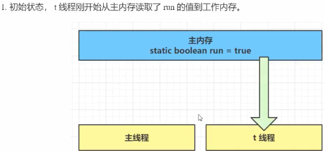
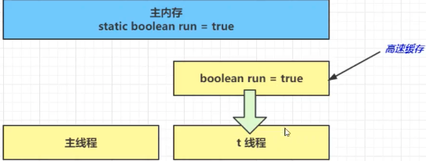
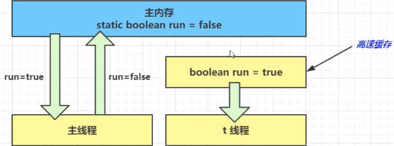

`Monitor` 主要关注的是访问共享变量时，保证临界区代码的原子性

这一章进一步学习共享变量在多线程间的【可见性】问题和多条指令执行时候的 【有序性】问题

#### *Java 内容模型*

> `JMM  Java Memry Model` 定义了生存、工作、内存抽象感念，底层对应着 `CPU` 寄存器，缓存，硬件内存，`CPU `指令优化等
>
> `JMM` 体现在一下几个方面
>
> * 原子性： 保证指令不会受到线程上下问切换的影响
> * 可见性：保证指令不会受到 `cpu` 缓存的影响
> * 有序性：保证指令不会受 `cpu` 指令并行优化的影响

##### **退不出的循环**

```java
public class Test1 {
    static boolean run = true;

    public static void main(String[] args) {
        new Thread(() -> {
            while (run) {

            }
        }).start();

        try {
            Thread.sleep(1000);
        } catch (InterruptedException e) {
            e.printStackTrace();
        }

        System.out.println("设置 false");
        run = false;
    }
}
```

上面的代码是停不下来的，主线程设置了 `false` 之后，子线程并没有感知到

看一下 `java` 内存模型角度分析上面的原因

主存： 所有共享信息存储地方 `static boolean run = true;` 就是主存中的

工作线程：线程工作私有的信息



2. `JIT` 编译器会将 `run` 的值从主存中缓存到自己的工作内存中的高速缓存来，减少对主存中 `run` 方法的访问

   

3. 但是 `main` 线程后面修改了 `run` 的值，并同步到主存，但是 `t` 是从自己的工作内存中高速缓存读取这个变量的，结果永远都是旧值

   

所以上面的代码会一直运行。

---

##### 解决上面的问题

给 `run` 变量上增加 `volatile` 修饰

> 子线程每次获取` run` 的值，不在从自己的高速缓存中获取，而是会去主内存中去获取

```java
public class Test1 {
    volatile static boolean run = true;

    public static void main(String[] args) {
        new Thread(() -> {
            while (run) {
            }
        }).start();

        try {
            Thread.sleep(1000);
        } catch (InterruptedException e) {
            e.printStackTrace();
        }

        System.out.println("设置 false");
        run = false;
    }
}
```

`volatile`  可以**修饰成员变量和静态成员变量，不能修饰局部变量(方法中的变量)，因为局部变量是线程私有的**

当然，使用 `sychronized` 也可以保证 `run` 的可见性

```java
public class Test1 {
  	static boolean run = true;
    static Object obj = new Object();
    public static void main(String[] args) {
        new Thread(() -> {
            while (true) {
                synchronized (obj) {
                    if (!run) break;
                }
            }
        }).start();

        try {
            Thread.sleep(1000);
        } catch (InterruptedException e) {
            e.printStackTrace();
        }

        System.out.println("设置 false");
        synchronized (obj) {
            run = false;
        }
    }
}
```

`sychronized`  需要创建 `Monitor` 是比较重的操作。

`volatile`  会更轻量。保证可见性的时候推荐 `volatile`  

---

##### 可见性 vs 原子性

上面的例子就是可见性的体现，它保证的是在多个线程之间，一个线程对 `volatile` 变量的修改对另外一个线程可见，不能保证原子性，仅用在一个写线程，多个读线程的情况。如 i++, 和 i--中，不能解决指令交错。

`sychronized`  既可以保证代码块的原子性，同时保证代码块内变量的可见性，就是其比较重量级。

---

##### 终止模式之两阶段终止模式

在一个线程 `t1` 中如何优雅的终止线程` t2`? 【优雅】是说给`T2` 一个料理后事的机会

```java
    private static class Terminator {
        private Thread monitor;

        public void start() {
            monitor = new Thread(() -> {
                while (true) {
                    Thread thread = Thread.currentThread();
                    boolean interrupted = thread.isInterrupted();
                    if (interrupted) {
                        System.out.println("料理后事");
                        break;
                    }

                    try {
                        Thread.sleep(1000);
                        System.out.println("继续监控");
                    } catch (InterruptedException e) {
                        thread.interrupt();
                        e.printStackTrace();
                    }

                }
            });

            monitor.start();
        }

        public void stop() {
            monitor.interrupt();
        }
    }
```

**使用 volatile **

```java
package thread.b;

public class TwoPhaseInterrupt2 {

    public static void main(String[] args) throws InterruptedException {
        Terminator terminator = new Terminator();
        terminator.start();

        Thread.sleep(1000);
        terminator.stop();
    }

    private static class Terminator {
        private Thread monitor;
        private volatile boolean stop = false;


        public void start() {
            monitor = new Thread(() -> {
                while (true) {
                    Thread thread = Thread.currentThread();
                    if (stop) {
                        System.out.println("料理后事");
                        break;
                    }

                    try {
                        Thread.sleep(500);
                        System.out.println("继续监控");
                    } catch (InterruptedException e) {
                      
                    }

                }
            });

            monitor.start();
        }

        public void stop() {
            stop = true;
            monitor.interrupt();
            // 如果不加这个，设置 true之后，再过一个 500ms才会结束
        }
    }
}

// 继续监控
// 料理后事
```

上面的代码，如果在调用的是

```java
terminator.start();
terminator.start();
```

那么在输出的时候都是双对双对的输出。

那么是否可以做到

```java
terminator.start();
terminator.start();
// 在第二次执行的 start 的是，直接就返回了 
```

```java
package thread.b;

public class TwoPhaseInterrupt3 {

    public static void main(String[] args) throws InterruptedException {
        Terminator terminator = new Terminator();
        terminator.start();
        terminator.start();

        Thread.sleep(1500);
        terminator.stop();
    }

    private static class Terminator {
        private Thread monitor;
        private volatile boolean stop = false;
        private volatile boolean start = false;


        public void start() {
            if (start) {
                return;
            }
            
            start = true;

            monitor = new Thread(() -> {
                while (true) {
                    Thread thread = Thread.currentThread();
                    if (stop) {
                        System.out.println("料理后事");
                        break;
                    }

                    try {
                        Thread.sleep(500);
                        System.out.println("继续监控");
                    } catch (InterruptedException e) {
                    }

                }
            });

            monitor.start();
        }

        public void stop() {
            stop = true;
            monitor.interrupt();
        }
    }
}
```

22 行到 26行会有线程问题，如果说是一个线程刚刚执行到了22行，突然一个另外一个线程执行到了26行，那么在回到第一个线程的是就退出程序了，也就是在第22行到26行的指令是不能错乱的

```java
package thread.b;

public class TwoPhaseInterrupt3 {

    public static void main(String[] args) throws InterruptedException {
        Terminator terminator = new Terminator();
        terminator.start();
        terminator.start();

        Thread.sleep(1500);
        terminator.stop();
    }

    private static class Terminator {
        private Thread monitor;
        private volatile boolean stop = false;
        private volatile boolean start = false;


        public void start() {
            synchronized (this) {
                if (start) {
                    return;
                }
                start = true;
            }


            monitor = new Thread(() -> {
                while (true) {
                    Thread thread = Thread.currentThread();
                    if (stop) {
                        System.out.println("料理后事");
                        break;
                    }

                    try {
                        Thread.sleep(500);
                        System.out.println("继续监控");
                    } catch (InterruptedException e) {
                    }

                }
            });

            monitor.start();
        }


        public void stop() {
            stop = true;
            monitor.interrupt();
        }
    }
}
```

这就是 `犹豫模式(Balking)`，在做一件事情的时候，发现这个事情已经有别人在做了，那么我就不继续做了。

#### 有序性

> `JVM` 在不影响结果的前提下，可以调整语句的执行顺序，而在单线程的情况下，这样的调整是没有问题的，但是在多线程的情况下会出现问题。

```java
int num = 0;

boolean ready = false;
// 线程1 执行此方法

public void actor1(I_Result r) {
	if(ready) {
		r.r1 = num + num;
	} else { 
  	r.r1 = 1;
	} 
}
// 线程2 执行此方法
public void actor2(I_Result r) {
	num = 2;
	ready = true; 
}
```

当2个线程分别执行上面的2个函数上述代码的结果可能有一下几种情况

* `r.r1 = 4`, 程序先执行了`actor2`，并且`ready=true`

* `r.r1 =`1 , 程序先执行了 `actor1`
* `r.r1=0`, 有可能在函数 `acctor2` 中发生了指令重排序，先执行了16行，还没有执行到15行的时候，然后又去执行了函数 `actor1`,很难出现

---

#### `volatile`

> `volatile` 的底层实现原理是内存屏障
>
> * 对 `volatile` 变量的写指令后加入写屏障
> * 对`volatile`变量的读指令前加入读屏障
>
> 使用于一个线程写，多个线程读的情况

*写屏障：保证在该屏障之前的，对共享变量的改动，都同步到主存当中*

```java
int num = 0;

boolean  volatile ready = false;
// 线程1 执行此方法

// 线程2 执行此方法
public void actor2(I_Result r) {
	num = 2;
	ready = true; 
}
// 保证ready之前的所有改动(赋值操作)同步到主存 当中
```

*读屏障：保证在该 屏障 之后，对共享变量的读取，加载的是主存中的最新数据，而不是缓存中的数据*

```java
public void actor1(I_Result r) {
	if(ready) {
		r.r1 = num + num;
	} else { 
  	r.r1 = 1;
	} 
}
```

*读写屏障如何保证有序性*

> 写屏障之前的代码不会发生指令重排
>
> 读屏障防止读屏障之后的代码不会发生指令重排
>
> 以上仅仅是保证本线程内指令的不重排序

在生成汇编代码时会在volatile修饰的共享变量进行写操作的时候会多出Lock前缀的指令（具体的大家可以使用一些工具去看一下，这里我就只把结果说出来）。我们想这个Lock指令肯定有神奇的地方，那么Lock前缀的指令在多核处理器下会发现什么事情了？主要有这两个方面的影响：

将当前处理器缓存行的数据写回系统内存；
这个写回内存的操作会使得其他CPU里缓存了该内存地址的数据无效

为了提高处理速度，处理器不直接和内存进行通信，而是先将系统内存的数据读到内部缓存（L1，L2或其他）后再进行操作，但操作完不知道何时会写到内存。如果对声明了volatile的变量进行写操作，JVM就会向处理器发送一条Lock前缀的指令，将这个变量所在缓存行的数据写回到系统内存。但是，就算写回到内存，如果其他处理器缓存的值还是旧的，再执行计算操作就会有问题。所以，在多处理器下，**为了保证各个处理器的缓存是一致的，就会实现缓存一致性协议**，每个处理器通过嗅探在总线上传播的数据来检查自己缓存的值是不是过期了，当处理器发现自己缓存行对应的内存地址被修改，就会将当前处理器的缓存行设置成无效状态，当处理器对这个数据进行修改操作的时候，会重新从系统内存中把数据读到处理器缓存里。因此，经过分析我们可以得出如下结论：

Lock前缀的指令会引起处理器缓存写回内存；
* 一个处理器的缓存回写到内存会导致其他处理器的缓存失效；
* 当处理器发现本地缓存失效后，就会从内存中重读该变量数据，即可以获取当前最新值。

这样针对volatile变量通过这样的机制就使得每个线程都能获得该变量的最新值。


**volatile 仅仅解决可见性和有序性，并不保证原子性**

##### 一Double-checked locking 的问题

```java
public final class Singleton{
  private Singleton(){}
  
  private static Singleton INSTANCE = null;
  
  public static Singleton getInstance() {
    synchronized(Singleton.class) {
      if (INSTANCE==null) {
        INSTANCE = new Singleton();
      }
    }
    return INSTANCE;
  }
}
```

上面代码有个问题就是，每次创建 `INSTANCE` 都需要进入同步块代码

```java
public final class Singleton{
  private Singleton(){}
  
  private static Singleton INSTANCE = null;
  
  public static Singleton getInstance() {
    if (INSTANCE==null){
        synchronized(Singleton.class) {
          if (INSTANCE==null) {
            INSTANCE = new Singleton();
          }
        }
      }
	    return INSTANCE;
    }
}
```

上面的修改，2次检查，懒惰实例化，用到才创建，但上面代码也还是有问题的，那就是7行代码没有收到保护，会发生 指令重排序问题。`INSTANCE;` 使用 `volatile` 可以上面的代码更加的安全。

##### happens-before

> 规定了对共享变量的写操对其他线程的读操作的可见，它是可见性和有序性的一套规则总结，抛开一下 `happens-before` 规则，`JMM`并不能保证一个线程对共享变量的写，对其他线程对该共享变量的读可见
>
> 变量都是指成员变量或静态成员变量

* 线程解锁 m 之前对变量的写，对于接下来对 m 加锁的其它线程对该变量的读可见

```java
static int x;
static Object m = new Object();
new Thread(()->{ 
    synchronized(m) {
      x = 10;
      } 
  },"t1").start();

new Thread(()->{ synchronized(m) {
			System.out.println(x); 
		}
},"t2").start();
```

* 线程对 volatile 变量的写，对接下来其它线程对该变量的读可见

```java
volatile static int x;
new Thread(()->{ x = 10; },"t1").start();
new Thread(()->{ System.out.println(x);},"t2").start();
```

* 线程 start 前对变量的写，对该线程开始后对该变量的读可见

```java
static int x;
x = 10;
new Thread(()->{ System.out.println(x);},"t2").start();
```

* 线程结束前对变量的写，对其它线程得知它结束后的读可见(比如其它线程调用 t1.isAlive() 或 t1.join()等待 它结束)

```java
 static int x;
Thread t1 = new Thread(()->{ x = 10;},"t1"); 
t1.start();
t1.join(); 
System.out.println(x);
```

---

#### 单例模式下的线程安全问题

> 单例模式有很多实现方法，饿汉、懒汉、静态内部类、枚举类，试分析每种实现下获取单例对象(即调用
> getInstance)时的线程安全，并思考注释中的问题 饿汉式:类加载就会导致该单实例对象被创建 懒汉式:类加载不会导致该单实例对象被创建，而是首次使用该对象时才会创建
>
> 饿汉式:类加载就会导致该单实例对象被创建 
>
> 懒汉式:类加载不会导致该单实例对象被创建，而是首次使用该对象时才会创建

```java
// 问题1:为什么加 final
// 防止子类中不适当覆盖父类方法，破坏方法安全

// 问题2:如果实现了序列化接口, 还要做什么来防止反序列化破坏单例 
// 反序列化的时候会生成一个 Singleton 对象，和单例中维护的单例对象不是同一个了
// 解决方法就是添加一个 readResolve 方法
// 反序列化中一旦发现 readResolve 返回对象，那么就使用这个方法返回的对象反序列化

public final class Singleton implements Serializable {
// 问题3:为什么设置为私有? 是否能防止反射创建新的实例?
// 私有，防止其他类无限创建，不能
private Singleton() {}
// 问题4:这样初始化是否能保证单例对象创建时的线程安全?
// 可以保证，类加载阶段加载的对戏是线程安全的

private static final Singleton INSTANCE = new Singleton();
// 问题5:为什么提供静态方法而不是直接将 INSTANCE 设置为 public, 说出你知道的理由 
// 1. 方法提供更好的封装性，获取这个变量还可以做一些其他操作，如改为懒惰方式获取
// 2. 提供泛型
// 3. 获取方法时候可以有更多的控制
  
public static Singleton getInstance() {
		return INSTANCE; 
  }
  
public Object readResolve() { 
		return INSTANCE;
	} 
}
```

##### 枚举实现

```java
// 问题1:枚举单例是如何限制实例个数的
// 定义上有几个变量那就有几个，反编译之后会有一个Singleton 的静态成员变量

// 问题2:枚举单例在创建时是否有并发问题
// 没有的，是静态成员变量，是在类加载的时候完成的

// 问题3:枚举单例能否被反射破坏单例
// 不能

// 问题4:枚举单例能否被反序列化破坏单例
// 枚举类默认都是由反序列化方法的，所以可以避免反序列化破坏静态变量

// 问题5:枚举单例属于懒汉式还是饿汉式
// 饿汉式

// 问题6:枚举单例如果希望加入一些单例创建时的初始化逻辑该如何做 
// 可以写构造方法的
enum Singleton {
	INSTANCE; 
}
```

##### 懒汉式

```java
public final class Singleton {
  
private Singleton() { }
  
private static Singleton INSTANCE = null;
// 分析这里的线程安全, 并说明有什么缺点
// 是线程安装的，但是锁的范围有点大
public static synchronized Singleton getInstance() {
		if( INSTANCE != null ){ 
    		return INSTANCE;	
		}
	
  	INSTANCE = new Singleton(); 
  	return INSTANCE;
	} 
}
```

##### double checked 

```java
  public final class Singleton {

  private Singleton() { }

  // 问题1:解释为什么要加 volatile ?
  // synchronized 修饰的 INSTANCE 涉及到的指令还是会重排序的
  private static volatile Singleton INSTANCE = null;

  	// 问题2:对比实现3, 说出这样做的意义 
    // 后续调用直接return，保证后续的调用没有进入同步代码块，性能高
  public static Singleton getInstance() {
  	if (INSTANCE != null) { 
    	return INSTANCE;
  	}
  	synchronized (Singleton.class) {
  	// 问题3:为什么还要在这里加为空判断, 之前不是判断过了吗
  	// 防止首次创建的时候线程问题
    // 创建的时候线程1进入到这里，发现是空的，然后去创建
    // 还没有 new 完之后，释放锁，这个时候线程2又进来了，这个时候 INSTANCE 是已经好了的
    // 如果没有这个判断，那么由会去创建一次
  	if (INSTANCE != null) { 
    		return INSTANCE;
  	}
  	INSTANCE = new Singleton(); 
    	return INSTANCE;
  	} 
  }
}
// t2
   
```

```java
public final class Singleton { 
  private Singleton() { }
	// 问题1:属于懒汉式还是饿汉式 
  // 懒汉式
  
  private static class LazyHolder {
			static final Singleton INSTANCE = new Singleton(); 
	}
	
  // 问题2:在创建时是否有并发问题
  // 没有LazyHolder 在类加载的时候就完成了创建
	public static Singleton getInstance() {
		return LazyHolder.INSTANCE; 
	}
}
```

