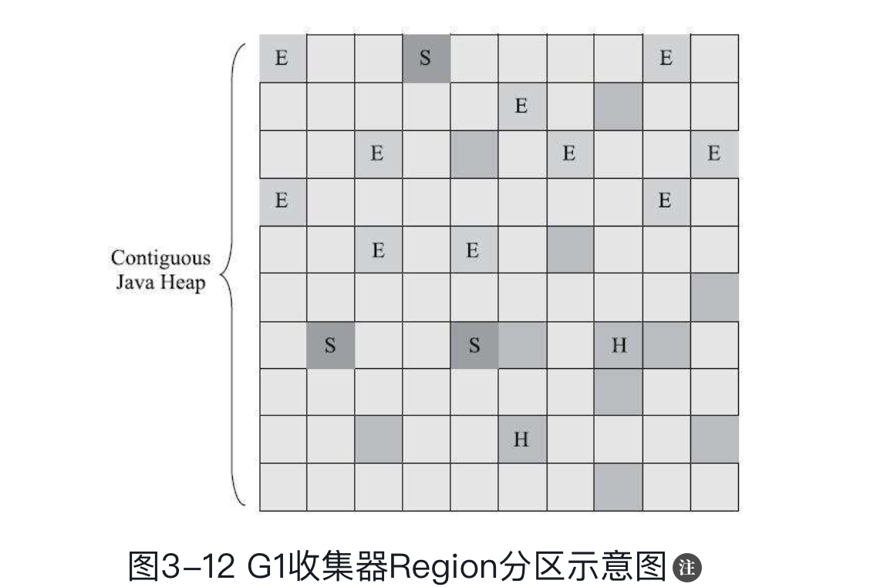

### Garbage First 收集器

是垃圾收集器技术发展历史上里程碑的结果，开创了收集器面向局部收集的设计思路和基于**Region**的内存布局形式。

**停顿时间模型**的收集器，停顿时间模型的意思是能够支持在一个长度为M毫秒的时间片断内，消耗在垃圾收集上的实际大概率不超过N毫秒的目标。实现这个目标首先应该是在思想上改变，在之前的收集器收集的目标基本是

> 整个新生代收集(Minor GC)
>
> 整个老年代收集(Major GC)
>
> 整个Java 堆(Full GC)

G1 跳出这种收集方式，，它可以面向堆内存任何部分来组成回收进行回收，衡量标准不再是它属于哪个分带，而是那块内存中存放的垃圾数量最多，回收收益最大，这就是G1 收集器的Mixed GC 模型

G1 也是遵循分代收集理论设计的，但是堆内存的布局和其他收集器有非常明显的差异，G1不在坚持固定大小以及固定数量的分代区域划分，而是把连续的Java，堆划分为多个大小相等的独立区域，每一个Region 都可以根据需要扮演新生代的 Eden 空间，Survivor 空间，或者老年代空间，收集器能够扮演不同角色的Region 采用不用的策略去处理。

Region 中海油一类特殊的 Humongous 区域，专门用来存储大对象， G1 认为只要大小超过一个Region 容量一半的对象即可判定为大对象每个Region 容量大小可以通过参数 `-XX:G1HeapRegionSize` 设定，超过这个大小的对象会被放置到连续的 `Humongous` 区域

G1 任然有新生代和老年代的感念，但是不再是固定的了，而是一系列东岱的集合，G1回去追踪各个Region 里面的垃圾堆积的价值大小，所谓大小就是回收所获得的空间大小 以及回收所需要时间的经验值，然后在后台维护一个优先级列表，每次根据用户设计允许的手机停顿时间(使用参数 `-XX:MaxGCPauseMillis` 指定，默认值是200毫秒)，优先处理回收价值收益最大的那些Region(Garbage First 名字的由来)

