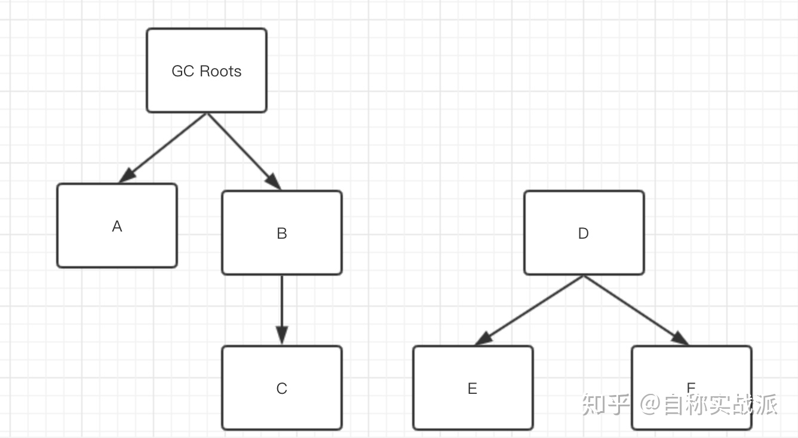
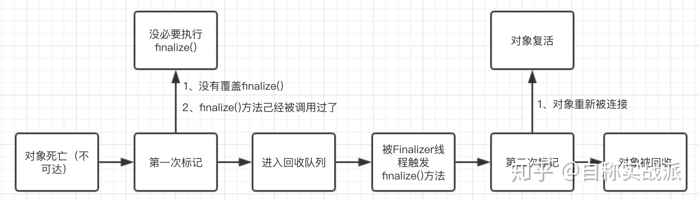
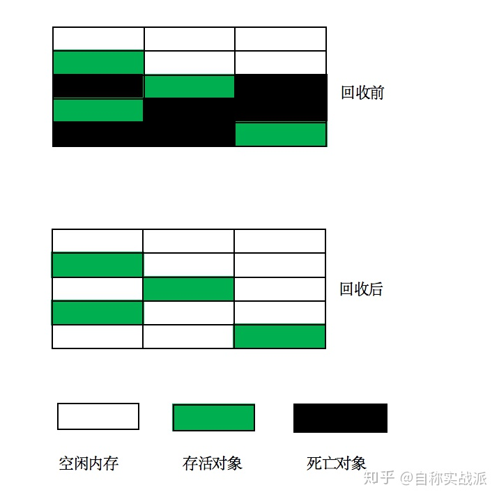
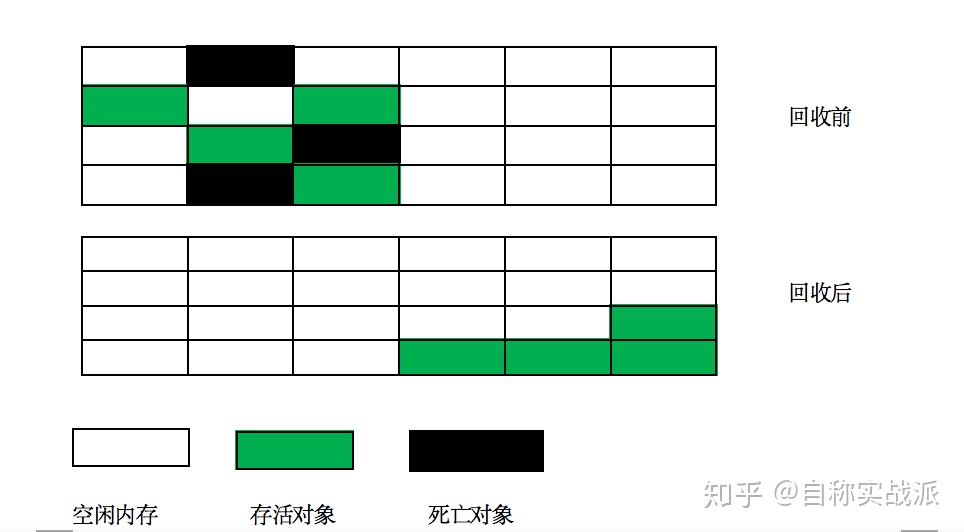
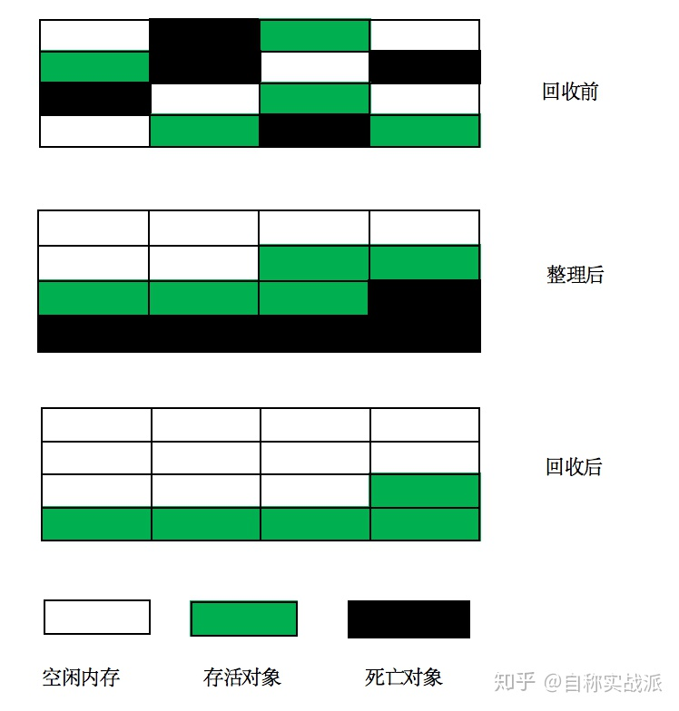
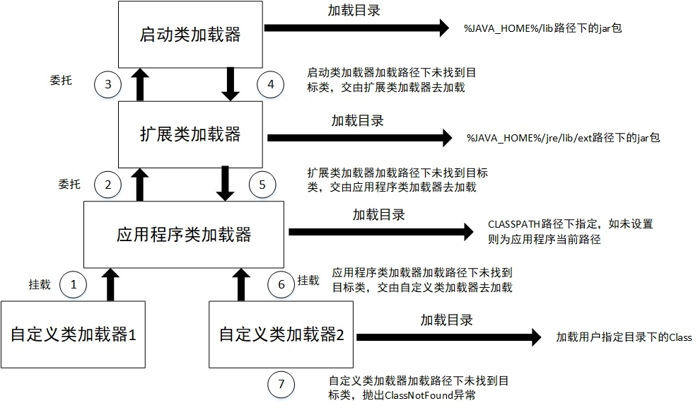

#### 什么是GC

`GC：garbage collection`   就是垃圾回收的意思，在开发中会创建很多对象，这些对象一股脑都扔进堆里面，如果这些对象只增加，不减少，那么堆的空间很快就会被耗完，

**所以我们需要把一些没有使用的对象清理掉。**

---

#### 对象已死么

所谓垃圾回收就是将哪些不再使用的对象找出来，然后清理掉，释放其占用的内存空间。

判断对象死亡(不再使用)的方法有两种方式

* 引用计数法
* 可达性分析

#### 引用计数法

给对象添加一个引用计数器，每当有一个地方引用该对象，这个计数器就 +1， 当引用失效时候，计数器就 -1，如果计数器为0，说明该对象不再被引用，成为死亡对象。

不过它有一个致命的缺点，那就是无法处理对象相互应用的情况。对象相互引用，那么它们二者的计数器不会等于0。

现在这种算法已经没有人在使用了。

#### 可达性分析

##### 什么是可达性分析

> 通过一些列的`GC root` 的对象作为起始点，从这些对象开始往下搜索，搜索所走过的路径称为引用链，当一个对象没有在这个引用链上相连，那么认为这个对象是不可达的，就是死亡的了。
>
> 
>
> DEF 虽然在相互使用，但是没有在GC ROOT 的引用链上，所以会被判断是死亡对象。

##### 什么是GC ROOT

> 就是将一些归为一类，然后起个名字叫`GC ROOT`，这些类有
>
> 1. 栈(栈帧中的本地变量表) 中引用的对象。
> 2. 方法区中类静态属性引用的对象
> 3. 方法区中常量引用的对象
> 4. 本地方法栈中JNI引用的对象。

##### 何谓引用

> 对象是否死亡，引用有4种
>
> * 强引用
>
> > 就是我们日常开发中的最常见的引用，如`String a = new String(a)`，只要强引用在，对象就不会被回收
>
> * 软引用
>
> > 有专门的申明，被软引用关联的对象在内存不足的时候会被回收
> >
> > `SoftReference<String> str = new SoftReference<String>("hello");`
> >
> > 这个特性特别适合做缓存
>
> * 弱引用
>
> > 也需要有专门的申明
> >
> > `WeakReference<String> str = new WeakReference<String>("hello");`
> >
> > 被弱引用申明的对象每次GC 都会被回收,最长使用的就是自动清理的集合或者队列
>
> * 虚引用
>
> > 虚引用是最弱的引用，需要用PhantomReference来声明，例如
> > `PhantomReference<String> phantom = new PhantomReference<>(new String("hello"), new ReferenceQueue<>());`
> >
> > 它完全**不会影响对象的生存时间**，唯一的作用是在对象被回收时发一个系统通知。

#### 对象的起死回生

对象在被判定为死亡后，并不会立刻被回收，而是要经过一个过程才会被回收。在这个回收过程中，死亡对象还有可能活过来。

上图是对象被回收的过程。一个对象要被回收，至少要经过**两次标记**。

如果对象在第二次标记之前重新连接上GC Roots，那么它将在第二次标记中被移出回收队列，从而复活。

#### 垃圾回收算法

直说思想，不涉及细节。

- 标记-清除算法
- 复制算法
- 标记-整理算法
- 分代回收算法

##### 标记-清除算法

最基本的算法，就是先标记，标记死亡对象，然后再清除，标记过程如上图，会经过2次标记。

主要的确定有：

* 效率低
* 会产生大量内存碎片

优点也有：就是简单、不需要对象移动

内存碎片是指内存的空间比较零碎，缺少大段的连续空间。这样假如突然来了一个大对象，会找不到足够大的连续空间来存放，于是不得不再触发一次gc。

##### 复制算法

把内存分为2块，假设为`A` 和 `B` 两个区域。

每次对象来之后均会放到`A` 区域，当`A` 区域满了之后，将存活的对象复制到`B` 区域中，然后清空`A` 区域。

接下来的对象就全部放在了`B` 区域，等`B` 区域满了，就把存活的对象复制到`A` 区域然后清空`B` 区域，就这样来回倒腾，完成垃圾回收。

**优点是不会有空间碎片**，**缺点是每次只用得到一半内存**。

**缺点是在对象存活率较高的场景下**（比如老年代那样的环境），需要复制的东西太多，**效率会下降**。

##### 标记-整理算法(mark-compact)

标记整理算法中的标记阶段和清理阶段，死亡随心并不会直接清理，而是将它们在内存中移动到一起，然后再清理

##### 分代回收算法

分代收集算法是目前大部分` JVM` 所采用的方法，其核心思想就是根据对象存活的不同生命周期将内存划分为不同的域（把堆内存分为新生代和老年代）。**老年代的特点是每次垃圾回收只有少量对象需要被回收**，**新生代的特点是每次垃圾回收时都有垃圾需要被回收**，因此可以根据不同区域选择不同的回收算法。

**新生代与复制算法**

目前大部分 `JVM` 的 `GC` 对于新生代都采用 `Copying` 算法，因为新生代中每次垃圾回收都会回收大部分对象，即要复制的对象比较少，通常并不是按照 1:1 来划分新生代。一般将新生代划分为一块较大的 `Eden` 区和两个较小的 `Survivor` 区（`From Survivor`、`To Survivor`），每次使用 `Eden` 区和其中一块 `Survivor` 区，当进行回收的时候，将该两块空间中还存活的对象复制到另外一块 `Survivor` 空间中。

**老年代与标记复制算法**

老年代因为每次只会回收少量对象，因而采用 Mark-Compact 算法。

1. Java 虚拟机提到过的处于方法区的永生代，它用来存储 class 类、常量、方法描述等，对永生代的回收主要包括废弃常量和无用的类。
2. 对象的内存分配主要在新生代的 Eden Space 和 Survivor Space 的 From Space（Space 目前存放对象的那一块），少数情况会直接分配到老年代。
3. 当新生代的 Eden 区和 From Survivor 区空间不足时会触发一次 MinorGC，进行 GC 后，Eden 区和 From Survivor 区的存活对象会被挪到 To Survivor，然后将 Eden 区和 From Survivor 进行清理。
4. 如果 To Survivor 没有足够存储某个对象，则将这个对象存储到老年代。
5. 在进行 GC 后，使用的便是 Eden 区和 To Survivor区了，如此反复循环。
6. 当对象在 Survivor 区躲过一次 GC 后，其年龄就会加 1。默认情况下年龄达到 15 的对象会被移到老年代中。

## **常见垃圾收集器**

- 新生代收集器：Serial、ParNew、Parallel Scavenge
- 老年代收集器：Serial Old、CMS、Parallel Old
- 堆内存垃圾收集器：G1

---

### 单例-双层检查

---

### 类加载

* 什么是类加载

> JVM 描述类的数据从 `class` 文件加载到内存中，并且对数据进行**校验**，**解析**，**和初始化**，最终形成能够被 `JVM` 直接使用的 `java` 类型。
>
> **加载**： 获取类的**二进制字节流**，将字节流代表的静态存储结构转化为方法区的运行时数据结构
>
> **校验**：确保`class` 文件的字节流中包含的信息符号当前虚拟机的要求，包括文件格式验证、元数据验证、字节码验证、符号验证等
>
> **准备**：为类变量**分配内存**并设置类变量初始值
>
> **解析**：常量池内的符号引用替换为直接引用
>
> **初始化**：执行类构造器

* 类加载什么时候触发

> 使用 new 关键字实例化对象
>
> 读取或者社会一个类静态变量的时候
>
> 调用类对应的静态方法的时候
>
> 对类进行反射调用的时候
>
> 初始化子类，父辈会先被初始化
>
> 虚拟机启动时候，定义了 main 方法的那个类先初始化

* 类加载过程

* 类加载器

> 类加载过程中的加载操作由类加载去完成。类加载器分为：
>
> - **启动类加载器/Bootstrap ClassLoader**：负责加载JAVA_HOME/lib目录中的所有类，或者加载由选项-Xbootcalsspath指定的路径下的类；
> - **扩展类加载器/ExtClasLoader**：负责加载JAVA_HOME/lib/ext目录中的所有类型，或者由参数-Xbootclasspath指定路径中的所有类型；
> - **应用程序类加载器/AppClassLoader**：负责加载用户类路径ClassPath下的所有类型
> - **自定义加载器**：所有继承抽象类java.lang.ClassLoader的类加载器

* 双亲委派模型

> 
>
> 双亲委派过程：当一个类加载器收到类加载任务时，立即将任务委派给它的父类加载器去执行，直至委派给最顶层的启动类加载器为止。如果父类加载器无法加载委派给它的类时，将类加载任务退回给它的下一级加载器去执行。
>
> 双亲委派模型最大的好处就是让Java类同其类加载器一起具备了一种带优先级的层次关系。举个例子来说明下：比如我们要加载顶层的Java类——java.lang.Object类，**无论我们用哪个类加载器去加载Object类，这个加载请求最终都会委托给启动类加载器（Bootstrap ClassLoader），这样就保证了所有加载器加载的Object类都是同一个类。如果没有双亲委派模型，就会出现 Wupx::Object 和 Huyx::Object 这样两个不同的Object类。**

