主要涉及到的内容

* 如何判断对象可以回收
* 垃圾回收算法
* 分代垃圾回收
* 垃圾回收器
* 垃圾回收调优

---

#### 如何判断对象回收

* 引用计数法

  对象内其他变量引用，记录引用次数，引用次数可以增加以及减少，当对象引用次数变为0，就可以使用`gc` 回收了。听上去很简单，但是有一个弊端，就是在处理循环引用的时候

  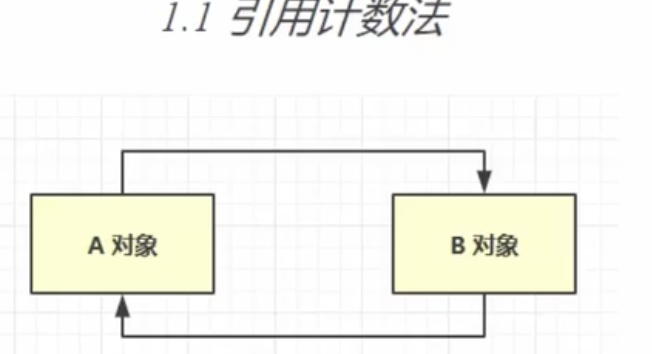

  当对象`A` 和 `B` 相互引用，但是没有对象引用他们两的时候，这两个对象在引用计数法的时候，是不能够回收的。造成内存泄露

  

  * 可达性分析算法

  **确定一系列根对象，可以理解为肯定不能当为垃圾的对象**，在垃圾回收的时候，会先对内存中的对象进行一次扫描，如果一个对象被根对象直接或者间接的引用，那么这个对象不能被回收，否则会被回收。

  **JAVA 虚拟机中的垃圾回收器采用可达性分析类探索所有存活的对象**

  **扫描器中的对象，看是否能够沿着 GC root 对象为起点的引用链找到该对象，找不到表示可以回收**

  **哪些对象 可以作为 GC root**

  * System class
  * Native Stack
  * Thread 相关的
  * Busy Monitor

  ---

  #### **Java 中的4中引用**

  1. 强引用
  2. 软引用
  3. 弱引用
  4. 虚引用
  5. 终结器引用

  

  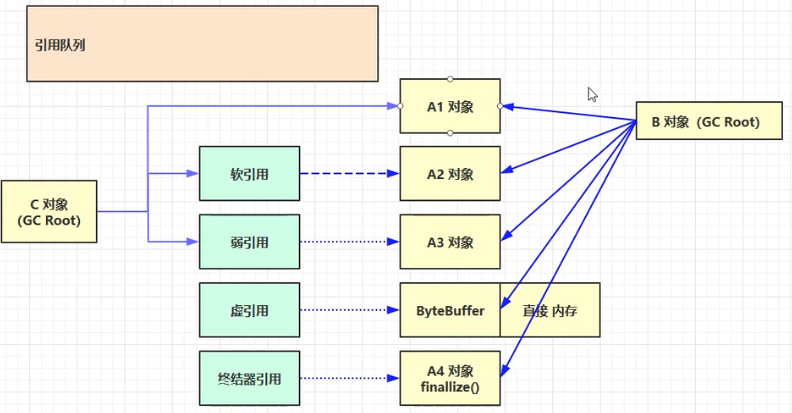

  如上，实线部分是强引用。

  而我们平时使用的引用基本都是属于强应用，如 new 一个对象，然后复制给变量就是属于强引用，沿着GC root 能够直接找到这个对象，那么就可以直接被回收的。

  

  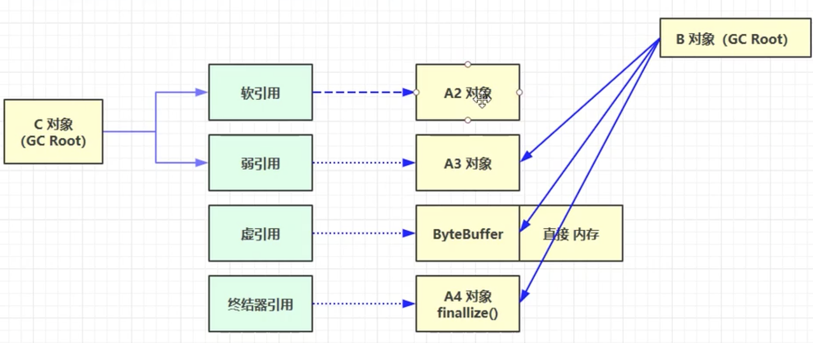

  上图中 `A1` 和 `A2` 被GC 间接引用，这个时候`A2` 对象没有被`B `对象引用了，这个时候当`A2` 满足条件：

  **垃圾回收的时候内存不够的时候** 将软引用引用的对象被回收调

  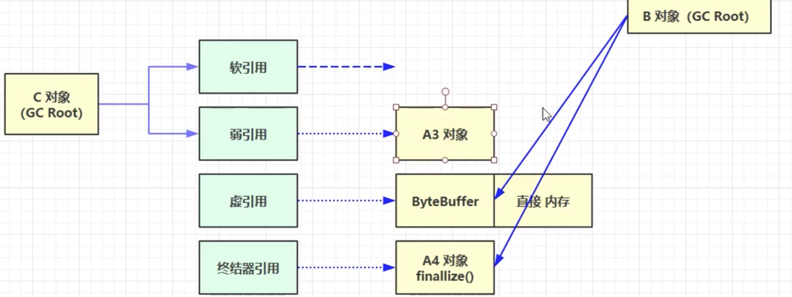

  而弱引用条件更加的宽松，只要没有强引用，当发生垃圾回收的时候都会被回收掉。

  当软引用和弱引用引用的对象被回收之后，软弱引用本身还是会占一定的内存的，这个时候回将这；两个他们均放置到一个引用队列中，进行进一步的回收

  当然这两种引用是可以不配合 引用队列实现回收的

  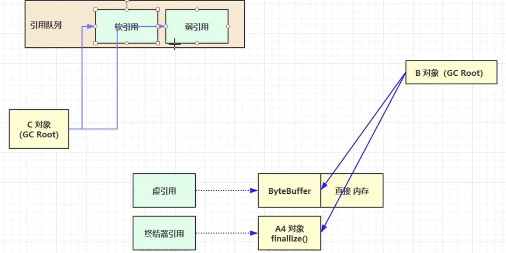

  

  虚引用和直接内存相关，当创建一个虚引用/终结器引用的时候二者都会去关联引用队列，当创建一个ByteBuffer 的时候同时会创建一个虚引用的 `Cleaner`并且 ByteBuffer 也会去创建一块直接内存，这块内存的地址也会直接传递给 `Cleaner`  当 `ByteBuffer` 的强引用断开之后，就会被回收掉，其分配的直接内存还是不能够被回收，这个时候虚引用会被放入到引用队列中去，然后在引用队列中会去执行虚引用的 `Cleaner`方法，该方法是有直接内存的地址的，然后去回收掉这块内存

  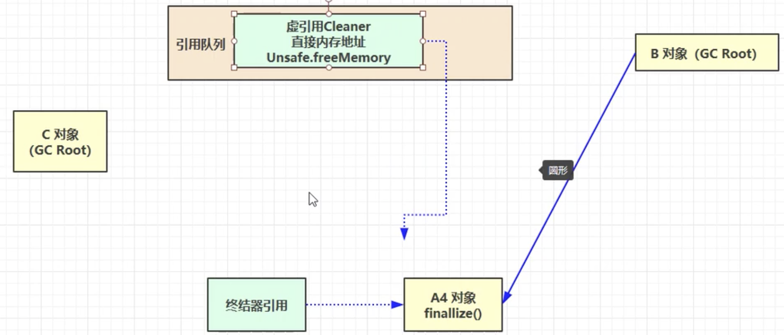

  终结器引用会更加熟悉，所有的 `Java` 对象都继承来 `Object` 而这个终极方法就是 `Object` 的一个方法，当前对象重写了这个方法，并且对象没有被强引用了，重写了这个方法，就是在垃圾回收的时候被调用，这个调用就是靠终极器引用的，这个时候终结器引用没有强引用的时候，终结器引用也会被放入到引用队列中，然后被一个低优先级线程调用，这个调用就会执行 `finallize()` 方法，但是这个方法工作效率低，先要入队，然后被一个低优先级的队列识别并调用，那么这个调用就可能会很少发生，毕竟是一个低优先级的线程

   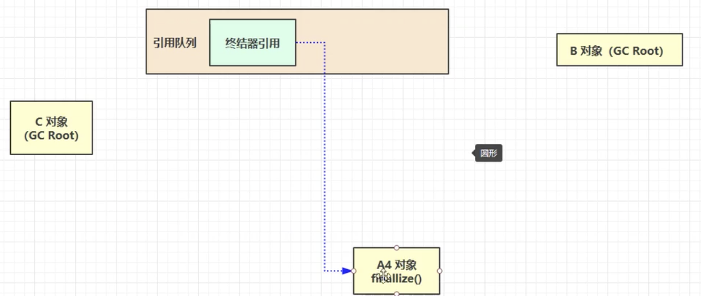

  **所以很少推荐使用 `finalize()` 去释放内存。**

  

  对5中引用的总结：

  * 强引用

    > 只有所有 GC Roots 对象都不通过 [强引用]引用该对象，该对象才能被垃圾回收

  * 软引用

    > 仅有软引用该对象时，在垃圾回收后，内存扔不足时会再次出现垃圾回收，回收软引用对象
    >
    > 可以配合引用队列来释放软件用自身
    >
    > 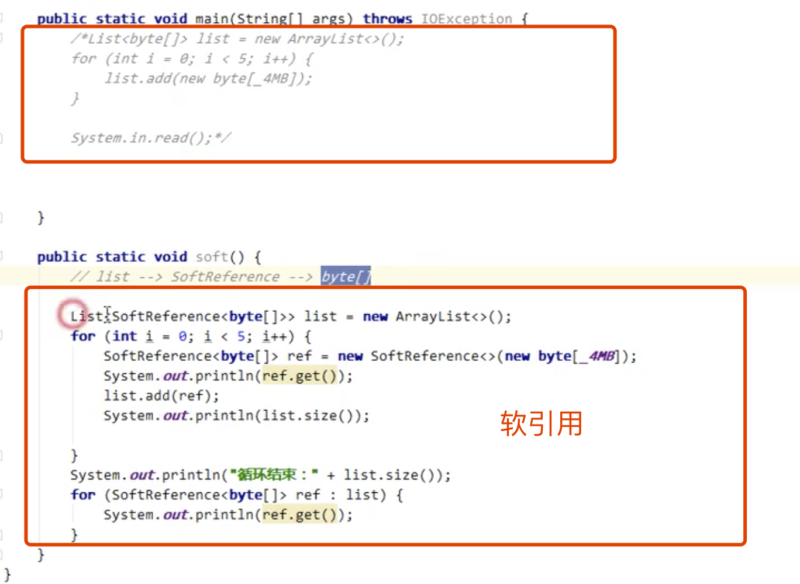
    >
    > 
    >
    > 上截图可以看出在创建的时候，发现内存不够了就会去执行垃圾回收，而在之间直接硬引用的时候回之间跑出内存溢出的问题，而在跑代码软引用的时候，过程会去回收 垃圾，然后继续执行下去。
    >
    > 所以在最后能够打印出的
    >
    > 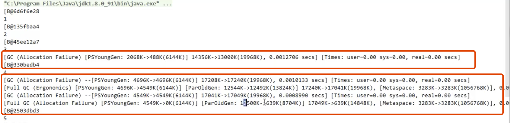
    >
    > 其能够执行的代价就是删除之前建立的对象，，只有最后一个数组才存在，之前创建的都被回收掉了。
    >
    > 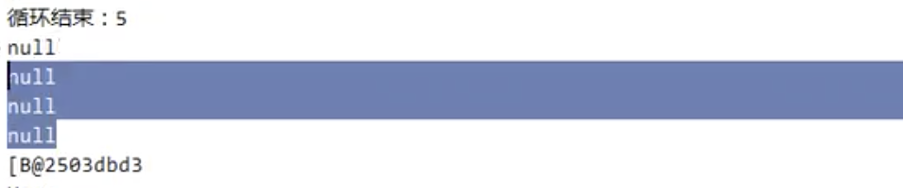
    >
    > 结合引用队列使用
    >
    > 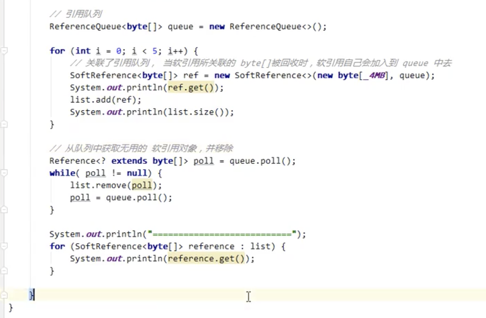
    >
    > 注意这里当软件用对象回收掉之后才会进入引用队列中

  * 弱引用

    > 仅有弱引用该对象时，在垃圾回收的时候，内存无论是否充足，都会回收弱引用对象
    >
    > 可以配合引用队列来释放弱引用自身
    >
    > 
    >
    > 

  * 虚引用

    > 必须噢诶和引用队列使用，主要配合 `ByteBuffer` 使用，当引用对象回收时，会将虚引用如对，由Reference Handler 线程调用虚引用相关方法释放之间内存

  * 终结器引用

    > 无需手动编码，但其内部噢诶和引用队列使用，在垃圾回收的时候，终结器引用入队，在有`Filalizer` 线程通过终结器引用找到被引用对象并调用它的 `fimalize` 方法，第二次`GC` 时候才会被回收引用对象

  ---

  #### 垃圾回收算法

  * 标记清除

    > 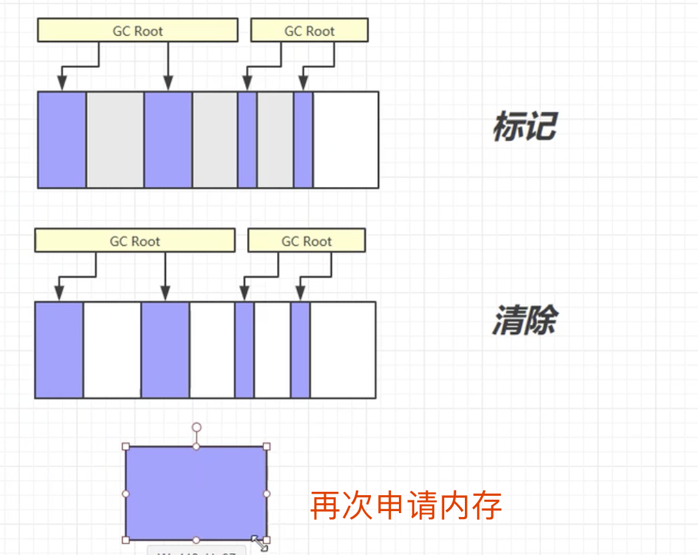
    >
    > 如上图，先识别出没有被 `GC root` 引用的对象，标记出来(灰色部分)，然后将这些区域清除掉(灰色变为了白色)，这种清除方式，首先记录出带清除的起始和终止的地址，然后清除，所以速度是比较快的。
    >
    > 但是容易产生内存碎片，如上图所示，清除之后，不会对空间进行进一步整理，如上在去请求一片较大的内存的时候就申请不下来了，其实这个时候内存中剩余的大小还是够的，只不过他们都不是连续的了。
    >
    > 

  * 标记整理

    > 就是在标记清除过程中，将清除了的内存后面的对象内存前移，解决第一个清除后内存不连续的(碎片)问题。
    >
    > 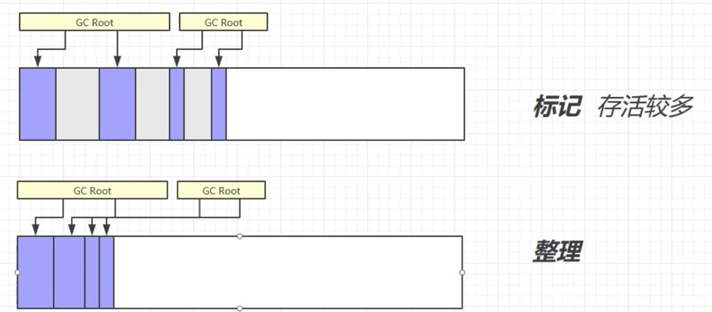
    >
    > 但其缺点是，由于整理涉及到内存的移动，效率低，其内存在移动的时候，会涉及到引用的地址的变化。其速度慢。

  * 复制

    > 将内存划分为大小一样的俩快区域，然后将`from` 区域中有对象的内存区域复制到 `to` 区域，在这个复制的过程中完成碎片的整理，复制完成之后，将`from` 区域清空，然后将 `to` 区域复制回`from`
    >
    > 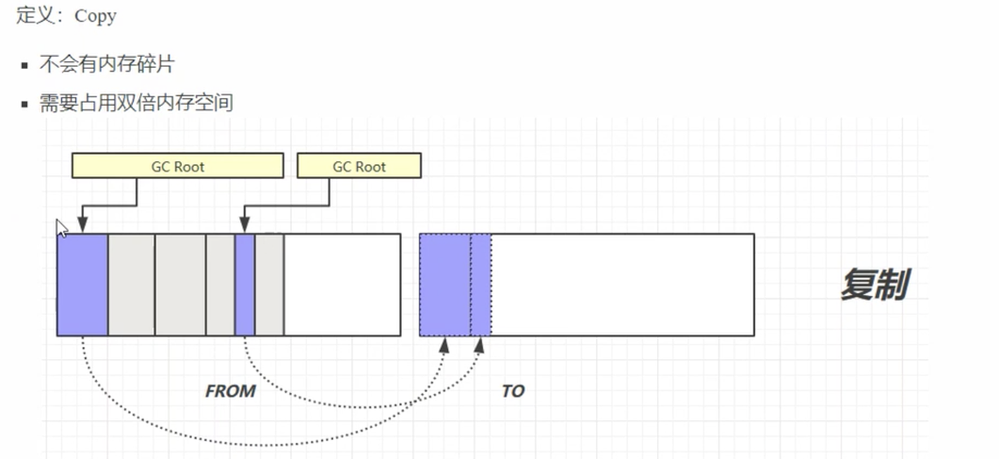

    ---

    **实际的垃圾回收机制，不会只使用一种算法，而是结合着几种算法使用**

    ---

    #### 分代回收

    将堆内存划分为2块：

    * 新生代

      > 新生代划分为
      >
      > * 伊甸园
      > * 幸存区From
      > * 幸存区 To
      >
      > 很频繁发生回收，

    * 老年代

      > 长时间使用的对象存放在这里，很久才发送一次

    在创建对象的时候，首先会将对象放在新生代的`伊甸园`区域，然后当这个区域内存占满之后，就会触发一次垃圾回收，这个区域的垃圾回收称为是 `Minor GC` 小的垃圾回收动作，回收后留下的对象会被移动到`幸存区TO`，然后在这个对象上寿命 += 1， 在对象移动到`幸存区`后会发生复制的操作，也就是上面所将到的 `复制` 过程，对象会在`幸存区TO` 和 `幸存区FROM` 之间发生复制，碎片整理的过程。

    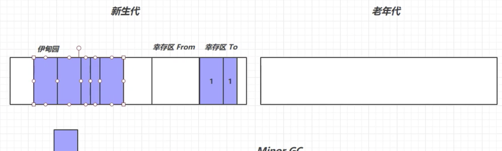

    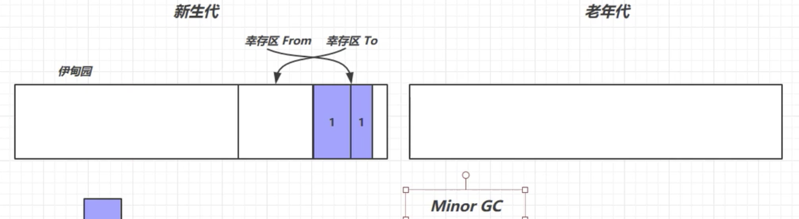

    然后伊甸园可以继续分配内存了。然后又经过一点时间，内存满了，然后继续回收，并且更新幸存区中的对象幸存年龄，这个时候幸存区中的对象也可以是被回收了的，或者年龄又增大了。

  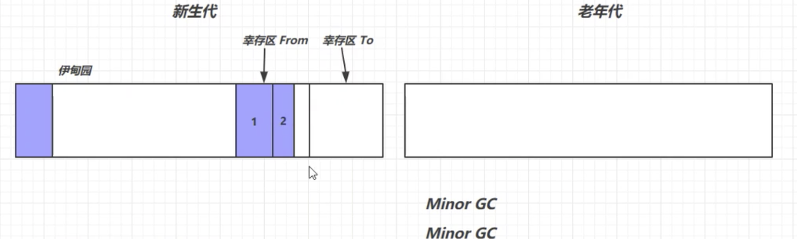

  然后实例是不会永远都在幸存区中待着的，当寿命超过一个阈值后(如：超过15次的回收依然存起)，那么就将这些对象放置到老年代区中，

  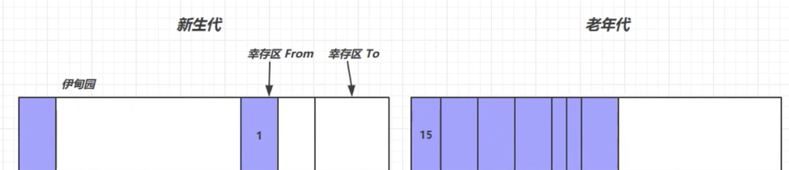

  当老年代中的内存也满了，那老年代也触发 `Full GC`的操作。

  

  * 对象首先分配在 `伊甸园区`
  * 新生代空间不够的时候，会触发  `Minor GC` 将`GC` 之后还留下的对象，复制算法复制到 `幸存区To` 中，发生 `TO` 和 `From`的交换，存活的对象的年龄加1，
  * minor gc 会引发 stop the world(这个时候会暂行用户的线程，当垃圾回收的线程执行结束之后，用户的线程才能开始再次执行，因为在垃圾回收的 过程中会发生对象存储内存地址的复制变化，如果这个时候多个线程在运行，那么就会造成混乱)
  * 当对象寿命超过阈值，就会晋升到老年代，最大寿命是15(4 bit)
* 老年代的空间不足时候先尝试`minor GC`，如果 `minor GC` 之后空间仍然不足，那么就会触发 `full GC`
  

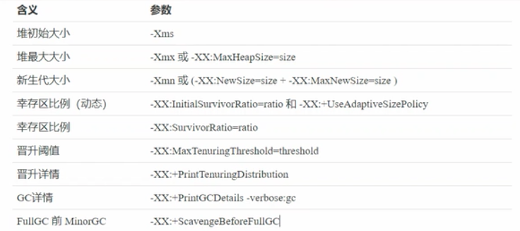

#### GC 一些参数


#### GC 分析，读懂GC  日志

  > 设置 ` -Xmx20m -Xmn10M -XX:+UseSerialGC -XX:+PrintGCDetails -verbose:gc`
  >
  > 代码
  >
  > ```java
  > public class rmbConverter {
  > 
  >     private static final int _512KB = 512 * 1024;
  >     private static final int _1MB = 1024 * 1024;
  >     private static final int _6MB = 1024 * 1024 * 6;
  >     private static final int _7MB = 1024 * 1024 * 7;
  >     private static final int _8MB = 1024 * 1024 * 8;
  > 
  >     public static void main(String[] args) throws IOException {
  >     }
  > }
  > ```
  >
  > 执行后打印出：
  >
  > ```java
  > Heap
  >  def new generation   total 9216K, used 3206K [0x00000007bec00000, 0x00000007bf600000, 0x00000007bf600000)
  >   eden space 8192K,  39% used [0x00000007bec00000, 0x00000007bef21848, 0x00000007bf400000)
  >   from space 1024K,   0% used [0x00000007bf400000, 0x00000007bf400000, 0x00000007bf500000)
  >   to   space 1024K,   0% used [0x00000007bf500000, 0x00000007bf500000, 0x00000007bf600000)
  >  tenured generation   total 10240K, used 0K [0x00000007bf600000, 0x00000007c0000000, 0x00000007c0000000)
  >    the space 10240K,   0% used [0x00000007bf600000, 0x00000007bf600000, 0x00000007bf600200, 0x00000007c0000000)
  >  Metaspace       used 3164K, capacity 4496K, committed 4864K, reserved 1056768K
  >   class space    used 346K, capacity 388K, committed 512K, reserved 1048576K
  > 
  > ```
  >
  > 这里先打印出`新生代 new generation`, 老年代 `tenured generation`， 以及元空间
  >
  > 根据配置，我们分配了20m的堆内存，以及10m新生代，但是这里看出只有9m最优的新生代空间，这是因为在这里的10m中有8m(80%) 分给了伊甸园，1M分给了幸存区FROM， 以及1M分给了幸存区TO，而幸存区TO 需要始终空着，不能用的，所以计算空间的时候抛开了这1M空间，所以是9M。
  >
  > 日志后面的16进制的是内存地址。
  >
  > 伊甸园最开始是有使用了的，也就是日志中的 `eden space 8192K,  39%`
  >
  > 修改代码
  >
  > ```java
  > public class rmbConverter {
  > 
  >     private static final int _512KB = 512 * 1024;
  >     private static final int _1MB = 1024 * 1024;
  >     private static final int _6MB = 1024 * 1024 * 6;
  >     private static final int _7MB = 1024 * 1024 * 7;
  >     private static final int _8MB = 1024 * 1024 * 8;
  > 
  >     public static void main(String[] args) throws IOException {
  >         ArrayList<byte[]> list = new ArrayList<>();
  >         list.add(new byte[_7MB]);
  >     }
  > }
  > ```
  >
  > 上面的伊甸园已经使用了`39%`的内存了，那么这里在加进去 `7M`，就会触发`GC`
  >
  > ```java
  > [GC (Allocation Failure) [DefNew: 3041K->519K(9216K), 0.0024866 secs] 3041K->519K(19456K), 0.0028386 secs] [Times: user=0.00 sys=0.00, real=0.00 secs] 
  > Heap
  >  def new generation   total 9216K, used 8097K [0x00000007bec00000, 0x00000007bf600000, 0x00000007bf600000)
  >   eden space 8192K,  92% used [0x00000007bec00000, 0x00000007bf366938, 0x00000007bf400000)
  >   from space 1024K,  50% used [0x00000007bf500000, 0x00000007bf581e18, 0x00000007bf600000)
  >   to   space 1024K,   0% used [0x00000007bf400000, 0x00000007bf400000, 0x00000007bf500000)
  >  tenured generation   total 10240K, used 0K [0x00000007bf600000, 0x00000007c0000000, 0x00000007c0000000)
  >    the space 10240K,   0% used [0x00000007bf600000, 0x00000007bf600000, 0x00000007bf600200, 0x00000007c0000000)
  >  Metaspace       used 3187K, capacity 4496K, committed 4864K, reserved 1056768K
  >   class space    used 348K, capacity 388K, committed 512K, reserved 1048576K
  > 
  > ```
  >
  > 上面的 `GC` 日志
  >
  > ```java
  > [GC (Allocation Failure) [DefNew: 3041K->519K(9216K), 0.0024866 secs] 3041K->519K(19456K), 0.0028386 secs] [Times: user=0.00 sys=0.00, real=0.00 secs] 
  > ```
  >
  > `GC => minor GC`,而发生 `full GC`，那么日志里就是 `Full GC`, 所以上面的日志表示发生了 `minor gc`
  >
  > 而且`DefNew` 表示发生在新生代的GC，回收前和后的以及总大小 分别为 3041K->519K(9216K)，然后是回收发送了的时间，还有堆的回收前后以及总大小分别为 3041K->519K(19456K)
  >
  > 继续修改代码，在存放 512k  到内存中，是可以放下的，所以不需要发生GC
  >
  > ```java
  > public class rmbConverter {
  > 
  >     private static final int _512KB = 512 * 1024;
  >     private static final int _1MB = 1024 * 1024;
  >     private static final int _6MB = 1024 * 1024 * 6;
  >     private static final int _7MB = 1024 * 1024 * 7;
  >     private static final int _8MB = 1024 * 1024 * 8;
  > 
  >     public static void main(String[] args) throws IOException {
  >         ArrayList<byte[]> list = new ArrayList<>();
  >         list.add(new byte[_7MB]);
  >         list.add(new byte[_512KB]);
  >     }
  > }
  > 
  > [GC (Allocation Failure) [DefNew: 3041K->519K(9216K), 0.0010331 secs] 3041K->519K(19456K), 0.0010552 secs] [Times: user=0.00 sys=0.00, real=0.00 secs] 
  > Heap
  >  def new generation   total 9216K, used 8609K [0x00000007bec00000, 0x00000007bf600000, 0x00000007bf600000)
  >   eden space 8192K,  98% used [0x00000007bec00000, 0x00000007bf3e6840, 0x00000007bf400000)
  >   from space 1024K,  50% used [0x00000007bf500000, 0x00000007bf581d38, 0x00000007bf600000)
  >   to   space 1024K,   0% used [0x00000007bf400000, 0x00000007bf400000, 0x00000007bf500000)
  >  tenured generation   total 10240K, used 0K [0x00000007bf600000, 0x00000007c0000000, 0x00000007c0000000)
  >    the space 10240K,   0% used [0x00000007bf600000, 0x00000007bf600000, 0x00000007bf600200, 0x00000007c0000000)
  >  Metaspace       used 3198K, capacity 4496K, committed 4864K, reserved 1056768K
  >   class space    used 354K, capacity 388K, committed 512K, reserved 1048576K
  > ```
  >
  > 伊甸园内存占用就比较多了。
  >
  > 继续存放
  >
  > ```java
  > public class rmbConverter {
  > 
  >     private static final int _512KB = 512 * 1024;
  >     private static final int _1MB = 1024 * 1024;
  >     private static final int _6MB = 1024 * 1024 * 6;
  >     private static final int _7MB = 1024 * 1024 * 7;
  >     private static final int _8MB = 1024 * 1024 * 8;
  > 
  >     public static void main(String[] args) throws IOException {
  >         ArrayList<byte[]> list = new ArrayList<>();
  >         list.add(new byte[_7MB]);
  >         list.add(new byte[_512KB]);
  >         list.add(new byte[_512KB]);
  >     }
  > }
  > 
  > [GC (Allocation Failure) [DefNew: 3041K->519K(9216K), 0.0011557 secs] 3041K->519K(19456K), 0.0011873 secs] [Times: user=0.00 sys=0.00, real=0.00 secs] 
  > [GC (Allocation Failure) [DefNew: 8527K->517K(9216K), 0.0054298 secs] 8527K->8128K(19456K), 0.0054523 secs] [Times: user=0.00 sys=0.00, real=0.01 secs] 
  > Heap
  >  def new generation   total 9216K, used 1195K [0x00000007bec00000, 0x00000007bf600000, 0x00000007bf600000)
  >   eden space 8192K,   8% used [0x00000007bec00000, 0x00000007beca9578, 0x00000007bf400000)
  >   from space 1024K,  50% used [0x00000007bf400000, 0x00000007bf4817c8, 0x00000007bf500000)
  >   to   space 1024K,   0% used [0x00000007bf500000, 0x00000007bf500000, 0x00000007bf600000)
  >  tenured generation   total 10240K, used 7610K [0x00000007bf600000, 0x00000007c0000000, 0x00000007c0000000)
  >    the space 10240K,  74% used [0x00000007bf600000, 0x00000007bfd6e9b0, 0x00000007bfd6ea00, 0x00000007c0000000)
  >  Metaspace       used 3198K, capacity 4496K, committed 4864K, reserved 1056768K
  >   class space    used 354K, capacity 388K, committed 512K, reserved 1048576K
  > ```
  >
  > 而且有对象以及晋升到了老年代

  * 直接晋升到 老年代 

  ```java
  public class rmbConverter {
  
      private static final int _512KB = 512 * 1024;
      private static final int _1MB = 1024 * 1024;
      private static final int _6MB = 1024 * 1024 * 6;
      private static final int _7MB = 1024 * 1024 * 7;
      private static final int _8MB = 1024 * 1024 * 8;
  
      public static void main(String[] args) throws IOException {
          ArrayList<byte[]> list = new ArrayList<>();
          list.add(new byte[_8MB]);
      }
  }
  ```

  如上代码在伊甸园里面是放不下去的，但是老年代是可以放进去的，所以对于伊甸园放不下的大文件，会之间进入到老年代，且不会发生垃圾回收

  ```java
  Heap
   def new generation   total 9216K, used 3371K [0x00000007bec00000, 0x00000007bf600000, 0x00000007bf600000)
    eden space 8192K,  41% used [0x00000007bec00000, 0x00000007bef4af18, 0x00000007bf400000)
    from space 1024K,   0% used [0x00000007bf400000, 0x00000007bf400000, 0x00000007bf500000)
    to   space 1024K,   0% used [0x00000007bf500000, 0x00000007bf500000, 0x00000007bf600000)
   tenured generation   total 10240K, used 8192K [0x00000007bf600000, 0x00000007c0000000, 0x00000007c0000000)
     the space 10240K,  80% used [0x00000007bf600000, 0x00000007bfe00010, 0x00000007bfe00200, 0x00000007c0000000)
   Metaspace       used 3252K, capacity 4496K, committed 4864K, reserved 1056768K
    class space    used 356K, capacity 388K, committed 512K, reserved 1048576K
  ```

  然后修改代码

  ```java
  public class rmbConverter {
  
      private static final int _512KB = 512 * 1024;
      private static final int _1MB = 1024 * 1024;
      private static final int _6MB = 1024 * 1024 * 6;
      private static final int _7MB = 1024 * 1024 * 7;
      private static final int _8MB = 1024 * 1024 * 8;
  
      public static void main(String[] args) throws IOException {
          ArrayList<byte[]> list = new ArrayList<>();
          list.add(new byte[_8MB]);
          list.add(new byte[_8MB]);
      }
  }
  ```

  这个时候 新生代和老年代都是放不下了的，所以会发生 heap outof memory

  ```java
  [GC (Allocation Failure) [DefNew: 3207K->527K(9216K), 0.0014736 secs][Tenured: 8192K->8718K(10240K), 0.0018148 secs] 11399K->8718K(19456K), [Metaspace: 3243K->3243K(1056768K)], 0.0033266 secs] [Times: user=0.00 sys=0.00, real=0.00 secs] 
  [Full GC (Allocation Failure) [Tenured: 8718K->8700K(10240K), 0.0014061 secs] 8718K->8700K(19456K), [Metaspace: 3243K->3243K(1056768K)], 0.0014268 secs] [Times: user=0.00 sys=0.00, real=0.00 secs] 
  Exception in thread "main" java.lang.OutOfMemoryError: Java heap space
  	at com.it.leetcode.huawei.rmbConverter.main(rmbConverter.java:29)
  ```

---

---

  #### 垃圾回收器

  * 串行
  
    * 单线程的
    * 堆内存较小，适合个人电脑
    
    
  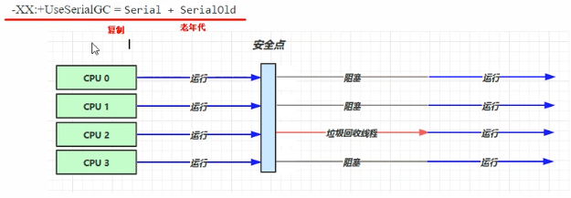
    
  使用串行的gc,需要给2个，第一个是新生代的GC方式，第二个是老年代的GC。在这个 适合，gc线程会将其他线程阻塞。
    
  
  
  * 吞吐量优先：单位时间内 stop the world 时间最短
  
    * 多线程
    * 适合堆内存较大场景，需要多核CPU支持
    * 适合服务器上的GC
  
  * 响应时间优先：单次垃圾回收 stop the world 的时间尽可能的短
  
    * 多线程
    * 适合堆内存较大场景，需要多核CPU支持
    * 适合服务器上的GC

---

---

  #### Garbage First 垃圾回收器简绍

  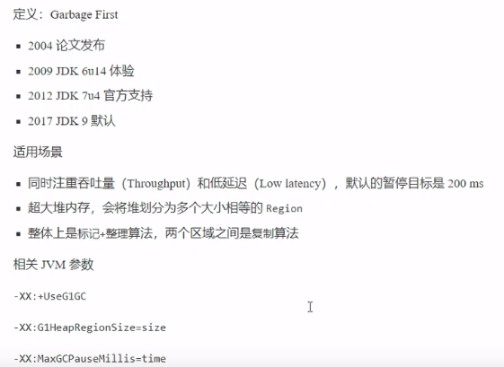

  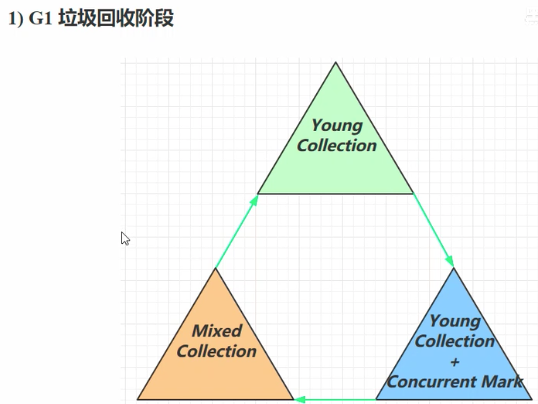

  混合收集：新生代 + 老年代混合收集

  * **Young Collection 阶段**

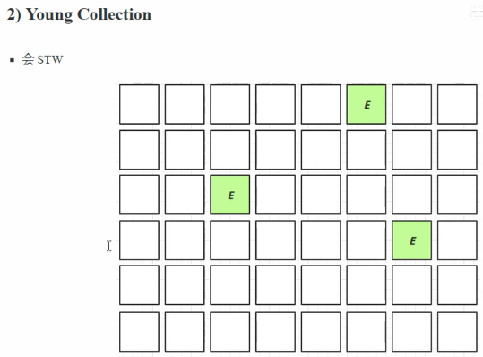

刚开始会将堆大小均分配为相同的区域，这些区域均可以为伊甸园、新生代、老年代等，新创建的对象会放到新创建的伊甸园。

然后当伊甸园区域逐渐被栈满，然后发送新生代的GC，且这个GC会发生STW。将新生代的对象放到幸存区也会有拷贝，复制过程。

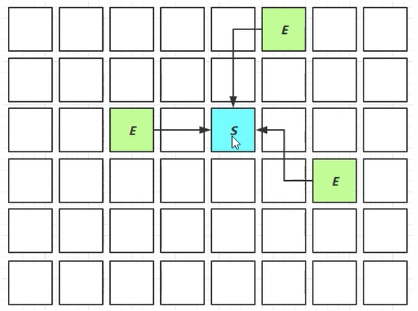

然后再工作一断时间，幸存区栈满，然后发生幸存区的GC，然后够年龄的对象会晋升到老年代。


* ​	**Young Collection + ConcurrencyMark(CM) 阶段**

  * 在 Young GC 的时候会进行 GC root 的初始化标记

  * 老年代占用堆内存比例达到阈值的时候，就会进行并发标记(不会STW)，并且参数控制

    `-XX:InitiatingHeapOccupancyPercent=percent（默认 45%）

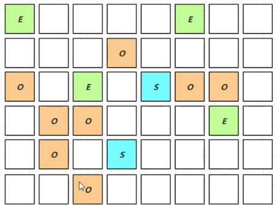

* **Mixed Collection**

  * 会对E/S/O进行全面的垃圾回收
  * 最终标记(Remark) 会STW
  * 拷贝存活(Evacuation) 会STW

   Garbage One 会根据最大暂停时间进行有选择的回收，挑出回收价值最高的区域(垃圾最多的区域)，进行回收，

  

* **Full GC**

> * SerialGC
>
>   * 新生代内存不足发生的垃圾收集 - minor gc
>   * 老年代内存不足发生的垃圾收集 - full gc
>
> * Parallel GC
>
>   * 新生代内存不足发生的垃圾收集 - minor gc
>   * 老年代内存不足发生的垃圾收集 - full gc
>
> * CMS
>
>   * 新生代内存不足发生的垃圾收集 - minor gc
>   * 老年代内存不足
>
> * G1
>
>   * 新生代内存不足发生的垃圾收集 - minor gc
>
>   * 老年代内存不足
>
>     (老年代占用堆内存比例达到阈值的时候，就会进行并发标记(不会STW)),如果回收垃圾的速度快于产生垃圾的速度，不会产生Full GC，反之，当低于的时候就会产生 Full GC

* **Young Collection 跨代引用问题**

> 新生代垃圾回收过程，找到根对象，根对象可达性分析，找到存活对象，存活对象复制到幸存区，新生代的根对象，而根对象有一部分来自于老年代，老年代存活对象比较多，如果遍历整个老年代找根对象，效率比较低，使用一种**卡表**的技术，就是将老年代再次细分为多个**卡**，如果一个卡中有老年代其中一个对象引用了新生代对象，那么会将这个卡标记为**脏卡**， 这样，将来就不需要遍历整个老年代，然后就只去找**脏卡**，就可了，如下，风红色就是脏卡区域。新生代这边会有一个**Rememberd Set**, 它会记录，外部对我的引用(也就是记录脏卡) ，
>
> 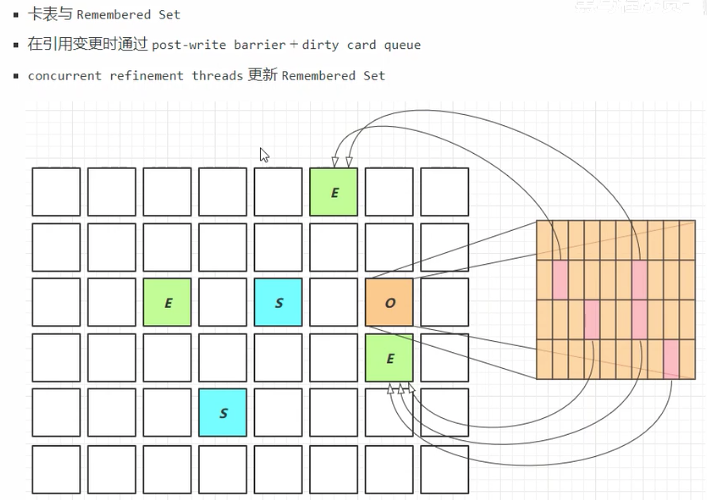

