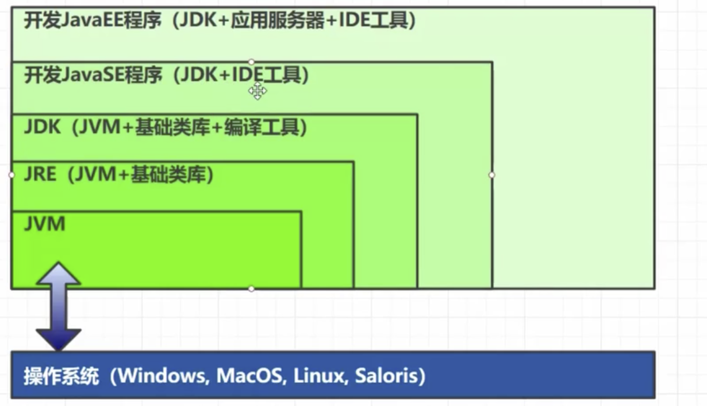
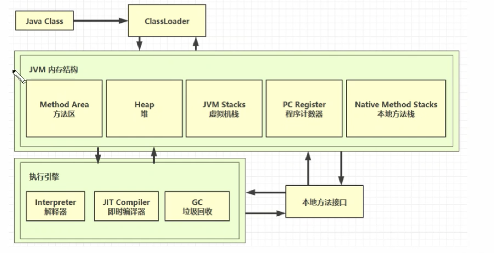

* 什么是JVM

  > Java 程序的运行环境(二进制字节码的运行环境)
  >
  > 好处：
  >
  > 1. 一次编写，到处运行
  > 2. 自动内存管理、垃圾回收功能
  > 3. 数组下标越界检查
  > 4. 多态
  >
  > ** 比较 **
  >
  > 
  >
  > JRE: java runtime environment
  >
  > JDK: java develpment kit

* 学习JVM

  > 面试
  >
  > 理解底层的实现原理
  >
  > 中高级程序员的必备技能

---

1. 源代码编译之后变为了 Java class
2. 然后经过类加载器进入到jvm
3. 在jvm中，方法区存放类，类创建的实例放在堆中，堆中的实例调用方法的时候会设计到虚拟机栈。程序计数器和本地方法栈的功能。
4. 方法在执行过程中，每行的功能是由执行引擎中的解释器逐行执行
5. 方法中热点代码(经常执行代码)，通过JIT及时编译器编译。
6. 对堆中不在引用的的对象镜像回收
7. 还有一些最底层的功能，JVM没有实现，需要调用本地操作系统去完成，也就是本地方法接口