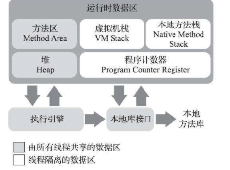

 Java 虚拟机所管理的内存将会包括如下部分：



* 程序计数器：

  > 当前线程所执行的字节码的行号指示器，在工作的时候通过改变这个计数器的值来选取下一条需要执行的字节码指令，它是程序控制流的指示器，分支、循环、跳转、异常处理线程恢复都依赖于它，**这里是每个线程独立的内存部分**

* 虚拟机栈

  > **也是线程私有的**，它的生命周期和线程相同，它描述的是Java 方法执行的线程内存模型，每个方法被执行的时候，虚拟机栈都会同步创建一个栈帧用于存储局部变量表方法出口灯信息，每个方法的调用至执行结束，都对应着一个栈帧在虚拟机栈中从入栈到出栈的过程，局部变量包括各类Java 虚拟机基本数据类型，对应引用，
  >
  > 而经常提到的**栈内存**就是这里所说的虚拟机栈，这个区域会跑出2类异常
  >
  > **StackOverFlowError* ** 栈调用太深
  >
  > **OutOfMemoryError**: 栈扩展时候无法申请足够多的内存

* 本地方法栈

  > 虚拟机使用本地方法服务

* 堆

  > 是虚拟机管理的内存中最大的一块，是**被所有线程共享的一块内存区域**， 几乎所有的对象实例都在这里分配内存，也是垃圾收集器管理的内存区域，(这里也会被称为是**GC 堆**)， 这里为了配合 垃圾回收器，这块区域也会被分为 新生代，老年代，Edien，存活区等，也会划分出线程私有的分配缓冲区(Thread Local Allocation Buffer, TLAB)等，但是无论如何划分，这块区域最本质的就是存放对象的实例
  >
  > 参数 
  >
  > ```java
  > XMX 和 -XMS 可以设定堆的大小
  > ```

* 方法区

  > 也是各个线程共享的内存区域，用户存储已被虚拟机加载的类型信息，常量、静态变量、及时编译器编译后缓存等信息，这部分区域在Java8之后已经放置到元区域了。

  * 运行时常量池

    > 是方法区的一部分，class 文件出了所有类的版本，字段，方法，接口等描述信息外，还有一项信息是常量池表，用于存放编译器生成的各种字面量与符号引用，这部分内存将在类加载后存放到方法区域的字符串常量池中。
    >
    > **将常量字符串放置到这个区域并不是代码编译时候放进去，而在运行时候也是可以的，可以调用 String类的 intern() 方法**
    >
    > 在Java6之前：
    >
    > > String::intern()是一个本地方法，它的作用是如果字符串常量池中已经包含一个等于此String对象的字符串，则返回代表池中这个字符串的String对象的引用；否则，会将此String对象包含的字符串添加到常量池中，并且返回此String对象的引用， 关于intern 的使用以及例子，在目录外侧的内存结构笔记中有记录说明
    > >
    > > ```java
    > >     public void testIntern() {
    > >         String s = new StringBuffer("java").append("scala").toString();
    > >         System.out.println(s.intern() == s);
    > > 
    > >         String s1 = new StringBuffer("ja").append("va").toString();
    > >         System.out.println(s1.intern() == s1);
    > >     }
    > > 
    > > 返回 true 和 false
    > > 第一个返回true 就是上面提到的规则，而后一个返回false 是因为java 在常量池中已经存在一个了，所以s1.intern() 拿到的就是这个，而 s1 是从堆中取出来的
    > > ```
    >
    > Java 7之后：
    >
    > 的intern()方法实现就不需要再拷贝字符串的实例到永久代了，既然字符串常量池已经移到Java堆中，那只需要在常量池里记录一下首次出现的实例引用即可，因此intern()返回的引用和由StringBuilder创建的那个字符串实例就是同一个
    >
    > ```java
    >     public void testIntern() {
    >         String s = new StringBuffer("java").append("scala").toString();
    >         System.out.println(s.intern() == s);
    > 
    >         String s1 = new StringBuffer("ja").append("vaaaaa").toString();
    >         System.out.println(s1.intern() == s1);
    >     }
    > 
    > 返回 true true， 因为都是从堆中取出数据
    > ```
    >
    > 

* 直接内存

  > 这并不是虚拟机运行时候数据区域的一部分，这部分内存会频繁的使用，尤其是设计带IO读取数据的时候，会大幅度提高性能，它会使用本地函数库之间分配对外内存，然后Java 堆里面 DirctByteBuffer 对象之间指向这块对外内存，也就是使用直接内存，可以在堆外开辟一块内存，而且这块内存是可以有虚拟机之间执行并能够访问的，就可以直接去读文件。
  >
  > 而不用这种方法读文件，那么会将文件先复制到本地内存，本地内存在复制到Java 堆内存，才能够被程序访问到。详细可以去看本笔记目录上一层中有通过看视频做过详细笔记。

---

#### 堆中对象的分配、布局、访问的全过程

* new 指令，查看是否需加载类

  > 遇到一个 new 指令时候，会先去检测指令的参数是否能在常量池中定位到一个类的符号引用，并且检查这个符号引用代表的类是否已经被加载、解析和初始化过，如果没有就先加载类，类加载完之后就可以确定新对象所需要的内存大小

* Java 堆分配内存大小

  > * 这块区域进行零值初始化，
  > * 然后对对象镜像必要的设置，如这个对象是哪个类的实例，如何才能找到类的元数据信息，对象的哈希码，对象的GC 分代年龄等信息，这些都将存放到对象头中
  >
  > 以上2步完成虚拟机角度一个新的对象产生了，但是对像才刚刚开始--构造函数，及执行Class 文件中的<init>() 方法，所有字段均默认为零值，

* 对象的内存布局

  > 可以划分为3部分
  >
  > * 对象头
  >   * 存储自身运行时数据，如 hashCode、GC 分代年龄、等
  >   * 类型执行，对象指向它的类型元数据的指针，Java 虚拟机通过这个执行来确定该对象是哪个类的实例
  > * 实例数据： 对象真正存储的有效信息，就是我们在类中定义的各种类型的字段内存
  > * 对齐填充：不是必然存在的，没有特别含义，仅仅是对象填充，起着占位符号的作用，它的大小必须是8字节的整数倍

* 对象的访问定位：

  > 对象创建出来之后，就是使用了，通过栈中的reference数据来操作堆上的具体对象，而对象的访问方式取决于虚拟机的实现，那么使用什么方式去定位方位堆中的对象的具体位置呢？有2中方式：
  >
  > * 句柄
  >
  >   > **句柄**: 一个唯一的整数,作为对象的身份id,区分不同的对象，和同类中的不同实例。程序可以通过句柄访问对象的部分信息。句柄不代表对象的内存地址,在Java中的任何东西都可以看做对象,存在一种标识符实际指向一个对象的句柄.
  >
  > * 直接指针： 更加快速

---

#### OutOfMemoryError 内存实战

虚拟机栈和本地方法栈会抛出两类异常

* 如果请求的栈深度大于虚拟机允许的最大深度，抛出 **StackOverflowError**
* 如果虚拟机的栈内存允许动态扩展，当扩展容量无法申请到足够的内存时，将抛出**OutOfMemoryError**

**HotSpot** 虚拟机选择不支持扩展，只会因为栈深度不够抛出第一种异常，或者在创建线程申请资源时候无法获得足够内存而导致第2中异常，不会出现运行时候的第二种异常

**-XSS 参数减少栈内存容量**

* 栈溢出

```java
    private int stackLength = 1;
    public void stackLeak() {
        stackLength += 1;
        stackLeak();
    }

    public void test_stack_over_flow(){
        /*
            虚拟机配置： -Xss160k
         */

        try {

            stackLeak();
        } catch (Throwable e) {
            e.printStackTrace();
        } finally {
            System.out.println("stack deepth: " + stackLength);
        }
    }

    public static void main(String[] args) {
        rmbConverter rmbConverter = new rmbConverter();
        rmbConverter.test_stack_over_flow();
    }

java.lang.StackOverflowError
stack deepth: 770
```

还有一种异常就是程序一开始调用的时候，也就是创建第一次的栈帧的时候，就会申请很大的内存(单个栈帧巨大)，这个时候也会报错误，第二种错误

* 方法区内存溢出

  > Java7 之后的版本中，将方法区放置到了堆中，所以如果不限制堆的大小，那么方法区几乎不会内存溢出。在JDK 8以后，永久代便完全退出了历史舞台，元空间作为其替代者登场