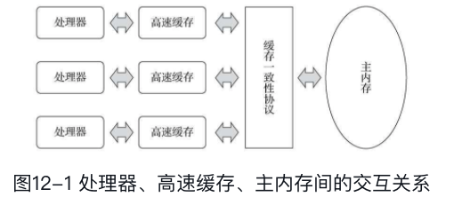
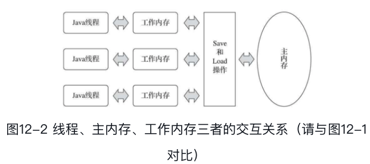

#### 计算资源的浪费

> IO操作以及数据通信的速度远远低于计算机的运算速度，并不希望处理器在大部分时间都处于等待其他资源的空闲状态，必须使用一些手段吧处理器的运算能力**压榨**出来。

#### 物理机器处理并发任务

> 在处理器的计算和内存的读写中间加了若干层的高速缓存机制，这个高速缓存的速度和处理器的速度相当
>
> 但是这样带来新的问题，那就是缓存一致性，多个处理器的计算任务都涉及到同一块内存时候如何缓存。
>
> 这个时候就出来了很多的协议，在处理各自的缓存数据的时候，都遵循这一协议。
>
> 而在Java 中有**内存模型**一词，可以理解为在特定的操作协议下，对特定的内存或者高速缓存进行读写访问过程的抽象。
>
> 

#### Java 内存模型

> Java 内存模型用来屏蔽各种硬件个操作系统的内存访问差异
>
> 内存模型规定了所有的变量都存储在主内存(main memory)中，然后每个线程还有自己的工作内存(working memory)，线程的工作内存中保存了被该线程使用的变量的主内存副本，线程对变量的所有操作都必须要在工作内存中进行，而不能直接读写主内存中的数据，不同的线程直接也无法直接访问对方工作内存中的变量，线程间变量值的传递均需要通过主内存来完成
>
> 
>
> 从定义的角度来看主内存主要对应于Java 堆中的对象实例数据部分，而工作内存则对应于虚拟机栈中的部分区域。

#### 内存间交互操作

> 专注于主内存和工作内存之间具体的交互协议，一个变量如何从主内存拷贝到工作内存，如何从工作内存同步回主内存。
>
> Java 内存模型规定以下的操作均是原子的、不可再分的
>
> * lock（锁定）：作用于主内存的变量，它把一个变量标识为一条线程独占的状态。
>
> * unlock（解锁）：作用于主内存的变量，它把一个处于锁定状态的变量释放出来，释放后的变量才可以被其他线程锁定。
> * read（读取）：作用于主内存的变量，它把一个变量的值从主内存传输到线程的工作内存中，以便随后的load动作使用。
> * load（载入）：作用于工作内存的变量，它把read操作从主内存中得到的变量值放入工作内存的变量副本中。
> * use（使用）：作用于工作内存的变量，它把工作内存中一个变量的值传递给执行引擎，每当虚拟机遇到一个需要使用变量的值的字节码指令时将会执行这个操作。
> * assign（赋值）：作用于工作内存的变量，它把一个从执行引擎接收的值赋给工作内存的变量，每当虚拟机遇到一个给变量赋值的字节码指令时执行这个操作。
> * store（存储）：作用于工作内存的变量，它把工作内存中一个变量的值传送到主内存中，以便随后的write操作使用。
> * write（写入）：作用于主内存的变量，它把store操作从工作内存中得到的变量的值放入主内存的变量中。
>
> 这8中基本操作必须满足
>
> * 不允许 read 和 load，store 和 write 操作之一单独出现，也就是不允许一个变量从主内存读取了但是工作内存不接受，或者工作内存发起了写但是主内存不接受的情况出现
> * 不允许一个线程丢弃它最近的 assign 操作，变量在工作内存中改变了之后必须把该变化同步会主内存
> * 不允许一个线程无原因的把数据从线程的工作内存同步会住内存中。
> * 一个新的变量只能在主内存中“诞生”，不允许在工作内存中直接使用一个未被初始化（load或assign）的变量，换句话说就是对一个变量实施use、store操作之前，必须先执行assign和load操作。
> * 一个变量在同一个时刻只允许一条线程对其进行lock操作，但lock操作可以被同一条线程重复执行多次，多次执行lock后，只有执行相同次数的unlock操作，变量才会被解锁。
> * 如果对一个变量执行lock操作，那将会清空工作内存中此变量的值，在执行引擎使用这个变量前，需要重新执行load或assign操作以初始化变量的值。
> * 如果一个变量事先没有被lock操作锁定，那就不允许对它执行unlock操作，也不允许去unlock一个被其他线程锁定的变量。
> * 对一个变量执行unlock操作之前，必须先把此变量同步回主内存中（执行store、write操作）。
>
> 以上的8操作实为麻烦，后来将Java 内存模型设计为
>
> * read
> * write
> * lock
> * unlock
>
> 4个操作，但是也仅仅是语言描述的不同，Java 内存的基础设计并没有改变

#### volatile

> 一个 volatile 的变量具有这样的特点
>
> * 对所有线程的可见性
>
>   > 但是这样的变量并不能保证原子性，如实现 i++ 这样的操作，编译器认为它是上它是3行代码， 如果要保证原子性，还需要使用 synchronized
>
> * 禁止指令重排序
>
>   > 程序在执行的时候，JVM 会对程序的执行顺序进行优化，肯定会保证输出结果一直，但是执行顺序却不能保证和写的代码顺序一致
>
> volatile变量读操作的性能消耗与普通变量几乎没有什么差别，但是写操作则可能会慢上一些，因为它需要在本地代码中插入许多内存屏障指令来保证处理器不发生乱序执行。不过即便如此，大多数场景下volatile的总开销仍然要比锁来得更低。我们在volatile与锁中选择的唯一判断依据仅仅是volatile的语义能否满足使用场景的需求。
>
> 基于上述的8条规则：
>
> * 每次线程使用 volatile 修饰的变量，必须是从主内存中去取
> * 每次线程更新 volatile 修饰的变量，必须要同步写会到主内存中
> * 使用volatile 修饰的变量不会被指令重排序优化，从而保证代码的执行顺序和程序的顺序的一致性

#### long 和 double 非原子性协定

> 上述规定的8中规则都是要具备原子性的，但是对于64位的数据类型（long和double），在模型中特别定义了一条宽松的规定：允许虚拟机将没有被volatile修饰的64位数据的读写操作划分为两次32位的操作来进行，即允许虚拟机实现自行选择是否要保证64位数据类型的load、store、read和write这四个操作的原子性，
>
> 如果有多个线程共享一个并未声明为volatile的long或double类型的变量，并且同时对它们进行读取和修改操作，那么某些线程可能会读取到一个既不是原值，也不是其他线程修改值的代表了“半个变量”的数值
>
> 不过这种情况在64为机器上是不会出现的非原子性访问

#### 原子性、可见性、有序性

> * 原子性
>
>   > 由于上述8中操作可以直接保证原子性，我们可以认为基本数据类型的访问读写均是具备原子性的(double 和 long 除外，知道这个事情就可以，无需为他担忧，这基本不会出现的)
>   >
>   > 如果是一个块代码需要原子性，那么需要同步块 synchronized 关键字。
>
> * 可见性
>
>   > 就是说一个线程修改了共享变量之后，其他程序能够立即知道这个修改，Java 内存模型通过将改变的值同步会主内存，其他线程读的时候在之间从主内存中读该变量，实现可见性
>   >
>   > 无论是 volatile 修饰的变量还是普通变量实现可见性都是一样的。
>   >
>   > 除了 volatile 之外还有 synchronized 和 final 字段也是可以实现可见性，synchronzed 实现可见性在同步块中在unlock 之前必须先把此变量同步会主内存中，保证下个线程看到的数据就是修改过了的，放置出现不一致
>   >
>   > 还有一个是final，它所在的类一旦被初始化之后，其他线程中可以看见final 字段的值
>
> * 有序性
>
>   > 如果在本线程内观察，所有的操作都是有序的

