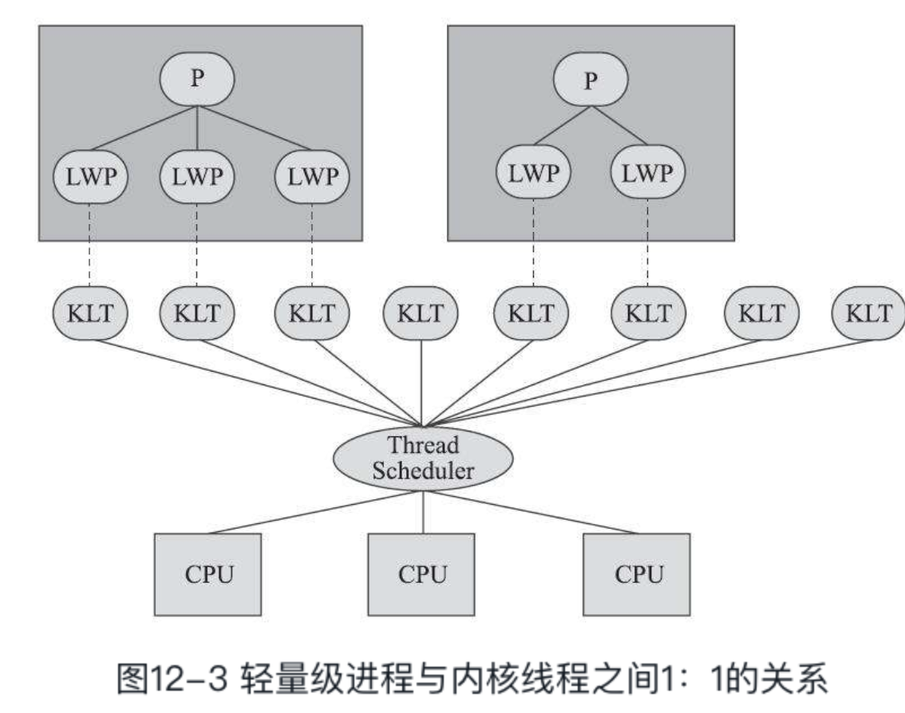
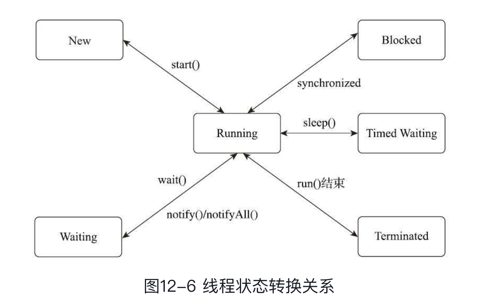

线程是比进程更轻量级的执行单位，线程的引入可以把一个进程的资源分配和执行调度分开，各个线程既可以共享进程资源，又可以独立调度。

java 每个已经调用过start()方法且还未结束的java.lang.Thread类的实例就代表着一个线程，注意到Thread类与大部分的Java类库API有着显著差别，它的所有关键方法都被声明为Native，

我们也先把Java的技术背景放下，以一个通用的应用程序的角度来看看线程是如何实现的。

---

#### 内核线程实现

内核线程（Kernel-Level Thread，KLT）就是直接由操作系统内核（Kernel，下称内核）支持的线程，这种线程由内核来完成线程切换，内核通过操纵调度器（Scheduler）对线程进行调度，并负责将线程的任务映射到各个处理器上。每个内核线程可以视为内核的一个分身，程序一般不会直接使用内核线程，而是使用内核线程的一种高级接口——轻量级进程（Light Weight Process，LWP）就是我们通常意义上所讲的线程，这种轻量级进程与内核线程之间1：1的关系称为一对一的线程模型

由于是基于内核线程实现的，所以各种线程操作，如创建、析构及同步，都需要进行系统调用。而系统调用的代价相对较高，需要在用户态（User Mode）和内核态（Kernel Mode）中来回切换因此轻量级进程要消耗一定的内核资源（如内核线程的栈空间），因此一个系统支持轻量级进程的数量是有限的。

“主流”商用Java虚拟机的线程模型普遍都被替换为基于操作系统原生线程模型来实现，即采用1：1的线程模型。

以HotSpot为例，它的每一个Java线程都是直接映射到一个操作系统原生线程来实现的，而且中间没有额外的间接结构，所以HotSpot自己是不会去干涉线程调度的（可以设置线程优先级给操作系统提供调度建议），全权交给底下的操作系统去处理，所以何时冻结或唤醒线程、该给线程分配多少处理器执行时间、该把线程安排给哪个处理器核心去执行等，都是由操作系统完成的，也都是由操作系统全权决定的。

##### Java 线程调度

线程调度是指系统为线程分配处理器使用权的过程，调度主要方式有两种，分别是

* 协同式（Cooperative Threads-Scheduling）线程调度

> 线程的执行时间由线程本身来控制，线程把自己的工作执行完了之后，要主动通知系统切换到另外一个线程上去，**最大好处是实现简单**，而且由于线程要把自己的事情干完后才会进行线程切换，切换操作对线程自己是可知的，所以一般没有什么线程同步的问题。
>
> **坏处也很明显**：线程执行时间不可控制，甚至如果一个线程的代码编写有问题，一直不告知系统进行线程切换，那么程序就会一直阻塞在那里

* 抢占式（PreemptiveThreads-Scheduling）线程调度。

> 每个线程将由系统来分配执行时间，线程的切换不由线程本身来决定，譬如在Java中，有Thread::yield()方法可以主动让出执行时间，但是如果想要主动获取执行时间，线程本身是没有什么办法的。在这种实现线程调度的方式下，线程的执行时间是系统可控的，也不会有一个线程导致整个进程甚至整个系统阻塞的问题。

#### Java使用的线程调度方式就是抢占式调度

> Java线程调度是系统自动完成的，但是我们仍然可以“建议”操作系统给某些线程多分配一点执行时间，另外的一些线程则可以少分配一点——这项操作是通过设置线程优先级来完成的。Java语言一共设置了10个级别的线程优先级（Thread.MIN_PRIORITY至Thread.MAX_PRIORITY）。在两个线程同时处于Ready状态时，优先级越高的线程越容易被系统选择执行。
>
> 线程优先级并不是一项稳定的调节手段，很显然因为主流虚拟机上的Java线程是被映射到系统的原生线程上来实现的，所以线程调度最终还是由操作系统说了算

#### Java 虚拟机的状态切换

> Java语言定义了6种线程状态在任意一个时间点中，一个线程只能有且只有其中的一种状态，并且可以通过特定的方法在不同状态之间转换。这6种状态分别是：
>
> 

#### 操作系统底层线程切换会涉及到哪些底层消耗

> * 响应中断，保护和恢复执行现场的成本
>
> 线程A -> 线程中断 -> 线程B
>
> 处理器要去执行线程A的程序代码时，并不是仅有代码程序就能跑得起来，程序是数据与代码的组合体，代码执行时还必须要有上下文数据的支撑。而这里说的“上下文”，以程序员的角度来看，是方法调用过程中的各种局部的变量与资源；以线程的角度来看，是方法的调用栈中存储的各类信息；而以操作系统和硬件的角度来看，则是存储在内存、缓存和寄存器中的一个个具体数值。物理硬件的各种存储设备和寄存器是被操作系统内所有线程共享的资源，当中断发生，从线程A切换到线程B去执行之前，操作系统首先要把线程A的上下文数据妥善保管好，然后把寄存器、内存分页等恢复到线程B挂起时候的状态，这样线程B被重新激活后才能仿佛从来没有被挂起过。**这种保护和恢复现场的工作，免不了涉及一系列数据在各种寄存器、缓存中的来回拷贝，当然不可能是一种轻量级的操作。**

##### 协程

> 多数的用户线程是被设计成协同式调度（Cooperative Scheduling）的,这时候的协程会完整地做调用栈的保护、恢复工作，所以今天也被称为“有栈协程”（Stackfull Coroutine），起这样的名字是为了便于跟后来的“无栈协程”（Stackless Coroutine）区分开。无栈协程不是本节的主角，不过还是可以简单提一下它的典型应用，即各种语言中的await、async、yield这类关键字。**无栈协程本质上是一种有限状态机，状态保存在闭包里，自然比有栈协程恢复调用栈要轻量得多，但功能也相对更有限。**
>
> 协程的主要优势是轻量，无论是有栈协程还是无栈协程，都要比传统内核线程要轻量得多。
>
> 协程在最初，甚至在今天很多语言和框架中会被设计成协同式调度，这样在语言运行平台或者框架上的调度器就可以做得非常简单。不过有不少资料上显示，既然取了“协程”这样的名字，它们之间就一定以协同调度的方式工作。

---

#### 线程安全

>  当多个线程同时访问一个对象时，如果不用考虑这些线程在运行时环境下的调度和交替执行，也不需要进行额外的同步，或者在调用方进行任何其他的协调操作，调用这个对象的行为都可以获得正确的结果，那就称这个对象是线程安全的。
>
> 这里注意几个地方：
>
> * 不考虑运行环境和调度
> * 不需要额外同步
> * 不同调用非进行其他的协调操作
>
> 以上可以看出，安全的代码具备一个共同的特征：
>
> **代码本身封装了所有必要的正确性保障手段（如互斥同步等），令调用者无须关心多线程下的调用问题，更无须自己实现任何措施来保证多线程环境下的正确调用**
>
> 而在现实场景中会弱化这个定义，将**调用这个对象的行为**限定为**单次调用**

#### Java 语言中的线程安全

> 这里讨论的线程安全，将以多个线程之间存在共享数据访问为前提。**因为如果根本不存在多线程，又或者一段代码根本不会与其他线程共享数据**，那么从线程安全的角度上看，程序是串行执行还是多线程执行对它来说是没有什么区别的。
>
> Java语言中各种操作共享的数据分为以下五类：不可变、绝对线程安全、相对线程安全、线程兼容和线程对立。安全程度由强到弱排序的。
>
> * 不可变
>
>   > 就是 final 修饰的变量
>
> * 绝对线程安全
>
> * 相对线程安全
>
>   > 就是通常意义上将的线程安全，**它需要保证对这个对象单次的操作是线程安全的**，我们在调用的时候需要保证对这个对象单词的操作是线程安全的，调用的时候不需要进行额外的保障措施，但是对于一些特定顺序的连续调用，就可能需要在调用端使用额外的同步手段来保证调用的正确性
>
> 虚拟机提供的同步和锁机制也起到了至关重要的作用，需要明白Java虚拟机线程安全措施的原理与运作过程自己再去思考代码如何编写就不是一件困难的事情了。
>
> * 互斥同步：synchronized
>
>   > 最常见也是最主要的并发正确性保障手段。同步是指在多个线程并发访问共享数据时，保证共享数据在同一个时刻只被一条（或者是一些，当使用信号量的时候）线程使用。
>   >
>   > 关于synchronized的直接推论：
>   >
>   > * 被synchronized修饰的同步块对同一条线程来说是可重入的。这意味着同一线程反复进入同步块也不会出现自己把自己锁死的情况。
>   > * 被synchronized修饰的同步块在持有锁的线程执行完毕并释放锁之前，会无条件地阻塞后面其他线程的进入。
>   >
>   > synchronized是Java语言中一个重量级的操作，有经验的程序员都只会在确实必要的情况下才使用这种操作

