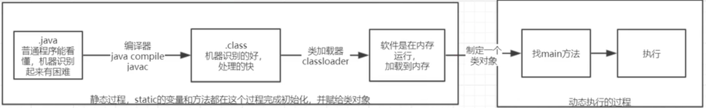

在 classLoader 之前代码都是在本地磁盘的，classLoader 之后就被加载到内存中了， 并将类放置到**方法区**这个时候方法区中就存在了一个类对象，可以理解类对象是加载进来类的一个说明书。如果类中包含着静态变量和静态方法，那么这些方法和变量在类初始化加载的时候就会完成，也就是这个时候方法区中的类对象是包含着这些静态变量和方法，静态变量和函数是属于类对象的，类对象可以直接调用，这些变量或者函数只有一份，所有对象都能拿到

除了基本类型int，byte 等变量是存放在栈中，其余的自定义的类实例，Double 等在栈中都是存放的是一个指针，这个指针指向内存中的一片区域(堆)。

**注意：类对象和对象的区别**

对象是根据类对象产生出来的。

---

