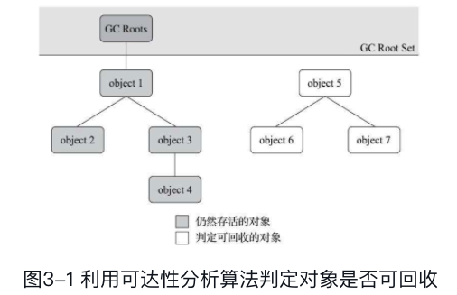
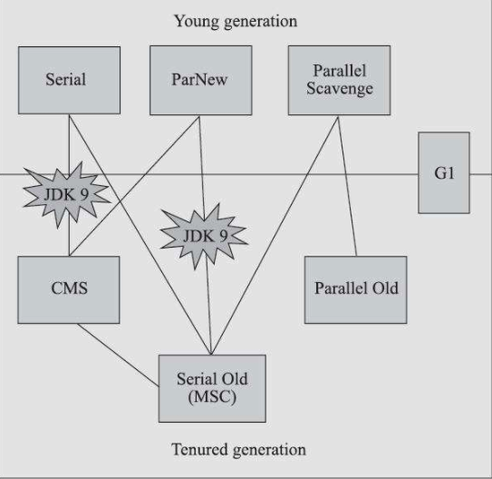
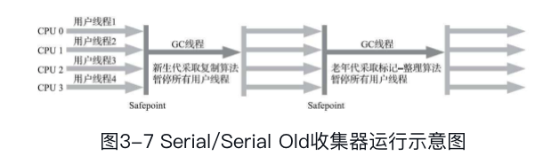
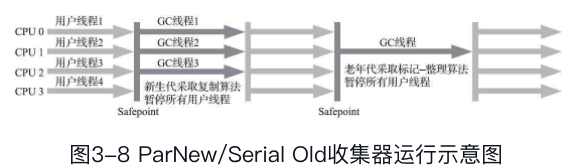
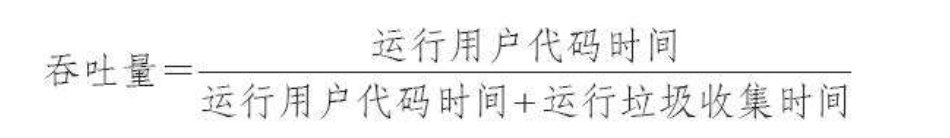
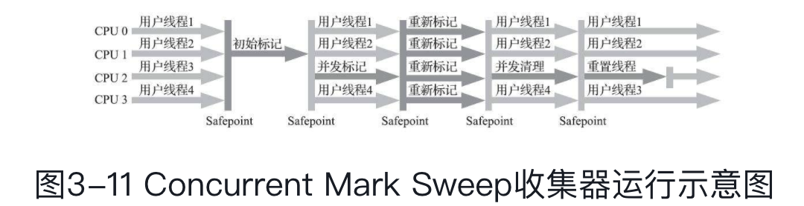

* 垃圾回收器需要完成3件事
  * 哪些内存需要回收
  * 什么时候回收
  * 如何回收

---

**程序计数器、虚拟机栈、本底方法**3个区域虽这线程而生，而灭，栈帧的进和出操作，每一个栈帧中分配多少内存基本上是在类结构确定下来时候就已知的了，所以这几个区域的内存分配和回收都具备确定性，这几个区域不需要不需要过多开来如何回收的问题，**当方法结束或者线程结束的时候，内存自然就回收了。**

但是堆和方法区有明显的不确定性：

* 一个接口实现的多个类内存可能会不一样，
* 一个方法所执行的不同条件分支所需要的内存也会不一样、

以上，只有处在运行时候，才能够知道程序究竟会创建那些对象，创建多少个对象，这部分内存的分配和回收是动态的，**垃圾回收器关注的就是这部分的回收**。

##### 什么时候回收

Minor GC是新生代GC，指的是发生在新生代的垃圾收集动作。由于java对象大都是朝生夕死的，所以Minor GC非常频繁，一般回收速度也比较快。

Major GC/Full GC 是老年代GC，指的是发生在老年代的GC，出现Major GC一般经常会伴有Minor GC，Major GC的速度比Minor GC慢的多。

触发MinorGC(Young GC)

虚拟机在进行minorGC之前会判断老年代最大的可用连续空间是否大于新生代的所有对象总空间

* 如果大于的话，直接执行minorGC

* 如果小于，判断是否开启HandlerPromotionFailure，没有开启直接FullGC

* 如果开启了HanlerPromotionFailure, JVM会判断老年代的最大连续内存空间是否大于历次晋升的大小，如果小于直接执行FullGC

* 如果大于的话，执行minorGC

触发FullGC

- 老年代空间不足

  如果创建一个大对象，Eden区域当中放不下这个大对象，会直接保存在老年代当中，如果老年代空间也不足，就会触发Full GC。为了避免这种情况，最好就是不要创建太大的对象。

- 持久代空间不足

  如果有持久代空间的话，系统当中需要加载的类，调用的方法很多，同时持久代当中没有足够的空间，就出触发一次Full GC

- 显示调用System.gc

#### 引用计数法

> 在对象中添加一个引用计数器，当有一个地方引用他，那么计数器就加一，引用失败则减去1，非常简单的判断对象是否存活的方法，但是主流的Java 虚拟机并没有采用这种方式，主要原因就是：
>
> * 需要配合大量额外处理，才能保证正确工作
> * 很难解决对象之间相循环引用问题

#### 可达性分析算法

> 这是Java 使用的判断对象是否存活的方法。其基本思想是：通过一系列的 **GC Roots** 的根对象作为起始节点集，从这些节点集合开始，根据引用关系向下搜索，搜索过程走过的路称为 **引用链(Referenc Chain)**, 如果某个对象到 **GC Roots** 间没有任何引用链相连，则证明此对象不可能在被使用

> 如上图，对象5、6、7都不在引用链上，所以他们3个会被全部回收掉，这里就不会用使用引用计数法中碰到的 循环应用的问题了。
>
> **GC Root 对象包括如下几种**
>
> * 栈帧中引用的对象、方法里面的参数、局部变量、临时变量
> * 方法区类静态属性引用的对象，如Java 类的引用类型静态变量
> * 方法区常量引用的对象，如字符串常量池
> * 本地方法栈中的JNI
> * Java 虚拟机内部的引用
> * 所有被同步锁持有的对象

#### 引用

> 无论上述谈到的计数法、还是可达性分析，都绕不开引用
>
> Java1.2 之后引用有如下几类：引用强度一次减弱
>
> * 强引用：
>
>   > 如果reference类型的数据中存储的数值代表的是另外一块内存的起始地址，就称该reference数据是代表某块内存.
>   >
>   > 是代码中普遍存在的引用赋值，只要强引用在，垃圾回收器就不会回收掉被引用的对象
>
> * 软引用
>
>   > 描述那些还有用，但是非必须的对象，当在系统发生溢出前，会先去将这些软引用进行二次回收，如果回收后还会发生溢出，然后才会抛出溢出
>
> * 弱引用
>
>   > 也是描述一些还有用但是非必须的对象，强度比软引用更加的弱，当发生垃圾回收的时候，无论目前内存是否够用，都会把这部分内存给回收掉，
>
> * 虚引用
>
>   > 也称为“幽灵引用”或者“幻影引用”，它是最弱的一种引用关系。一个对象是否有虚引用的存在，完全不会对其生存时间构成影响，也无法通过虚引用来取得一个对象实例。为一个对象设置虚引用关联的唯一目的只是为了能在这个对象被收集器回收时收到一个系统通知

#### 判断对象死亡的过程

> 可达性分析没有在引用链的对象不会直接将对象回收
>
> * 第一次标记
>
>   * 一次筛选
>
>     > 判断是否需要执行 finalize() 方法，如果没有覆盖或者该方法以及被执行，那么就不会再执行该方法，如果判断有必要执行该方法，那么会将该对象放置在一个 F-Queue 的队列中，并且会有另外一个线程去执行Queue 中的方法，finalize() 是对象最后逃生的机会，可以复写这个方法，然后在方法里面重新将自己(this) 赋值给引用链中的一个对象，那么在二次标记中将会被移除**即将回收**的集合
>
>     如果对象没有逃脱，那基本就真的被回收了
>
> Java 官方什么不要覆写 `finalize` 方法

#### 回收方法区

> 主要回收
>
> * 废弃的常量
>
>   > 常量不在被使用，就会被回收
>
> * 不在使用的类型
>
>   > 判断一个类型是否属于不在被使用的条件就比较苛刻
>   >
>   > * 类的所有实例，包括派生子类实例都被回收
>   > * 该类的类加载器被回收
>   > * 该类对应的java.lang.Class对象没有在任何地方被引用，无法在任何地方通过反射访问该类的方法。

---

### 分代收集理论

> 其实是一套符合直觉的经验法则
>
> 2个假设
>
> * 弱分代假设： 绝大多数对象都是朝生夕灭的
> * 强分代假说：熬过越多次垃圾收集过程的对象就越难以消亡
>
> 以上2条假设出发，将Java 堆分为不同的区域，对于大部分消灭的对象，那么统一放在同一个地方，经过一次回收，保留还活着的，而直接回收死掉的对象，而不是标记大量死掉的即将被回收的对象，这样回收操作就能以较少的代价进行回收。而剩下的对象，随着熬过的回收次数越多，那么他就将放到强分代区域中。
>
> 然后在不同的区域又会有一些
>
> * Minor GC: 新生代中的回收
> * Major GC:  老年代收集
> * Full GC : 收集整个Java 栈
> * Mixed GC： 收集整个新生代和部分老年代的垃圾收集

> 一般会将Java 堆划分为
>
> * 新生代(Young Generation)	
>
>   > 每次回收有大量对象死去，回收后剩余少量对象，少量对象将慢慢晋升到老年代中去了
>
> * 老年代(Old Generation)

#### 分代收集理论下的跨代引用假说

> 跨代引用相对于同代引用而言占极少数，针对跨代引用，，存在相呼应引用关系的两个对象，是应该倾向于同时消亡或者生存的，如老年代中一个对象引用了新生代，那么因为新生代对象被引用这无法被回收，熬过多此回收之后，那么这个新生代对象自然就晋升到了老年代
>
> 新生代中有一个记忆集，保存着那些老年代引用这新生代的对象。

##### 标记-清除算法

> 1. 标记需要回收对象
> 2. 清除未标记了的对象
>
> 缺点：
>
> 1. 执行效率不稳定，执行效率随着对象数量增长而降低
> 2. 空间碎片化问题，清除之后会有大量不连续的内存碎片

##### 标记-复制算法

> 称为是复制算法，解决标记-清除效率低的问题以及内存碎片的问题
>
> 这种方式会将内存按照容量划分为大小相等的2块，每次只使用其中的一块，然后当这块快要用完，将或者的对象复制到另外一块区域中，然后在把以及使用过的内存一次清理掉，使用这种方式，如果内存中活的对象比较多，那么会有大量的复制对象操作开销。
>
> 这里缺点也是非常明显的：
>
> * 复制对象开销在存活对象多的时候会比较大
> * 浪费空间，有一半空间划出来
>
> 但是以上的缺点在现实场景中是比较少见的，据统计新生代中 98% 的对象是熬不过第一轮垃圾回收的，所以不会存在很多的复制对象操作，还有就是没有必要将内存按照1:1 划分，内存是可以给少一点的。
>
> 所以Java 虚拟机大多数优先采用了这种收集算法去回收新生代

​	**Appel 式回收**

> 它将新生代划分为一块较大的 Eden 空间和两块较小的Survivor 空间，每次分配内存值使用Eden 和其中的一块，垃圾回收结束之后，将还存活的对象一次性复制到空余的那个 Survivor 区域，然后在直接清理掉Eden 和其中的一块Survivor区域。
>
> HopSpot 默认将新生代中80%划分为Eden， 两块 Survivor 个占10%内存区域，所以一开始的时候新生代中会有10%的区域是属于浪费掉了的。
>
> 当然并不能每次保证98%的对象会被回收，剩下的存活的对象能够放到Survivor中，当这些存活对象放不下的时候，会选择将这些对象防止到一个担保其他区域(Handle Promotion)

##### 标记-整理算法

> 老年代不会使用标记-复制算法，因为老年代每次回收都会有大部分的会存活下来。
>
> 和标记-复制是一样，先对对象进行标记，标记完之后会将存活的对象都想内存空间一侧移动，然后清理掉边界以外的内存。
>
> 但是老年代中每次回收都有大量的对象存活，移动存活对象并更新所有引用这些对象的地方是一个重操作，且这个过程中还会发生Stop the world 的事情(暂停用户线程)

---

#### 经典垃圾收集器

> 七种作用于不同分代的收集器，如果两个收集器之间存在连线，就说明它们可以搭配使用
>
> 从Serial到parallel 到GI 以及ZGC 垃圾回收更加的优秀，STW的时间也是越来越少，但是并没有完全清除掉STW

* Serial

> 最早期的收集器，单线程工作，只有一个处理器，收集垃圾的过程回去STW
>
> 特点：简单高效，额外内存消耗少，专心只做收集
>
> 

* ParNew

> 实质上是 Serial 的多线程并行版本
>
> 收集器除了支持多线程并行收集之外，其他与Serial收集器相比并没有太多创新之处，除了Serial收集器外，目前只有它能与CMS收集器配合工作。
>
> 

* CMS: 第一款真正并发的收集器

> 它首次实现了让垃圾收集线程与用户线程（基本上）同时工作。是一个老年代的收集器

* Parallel Scavenge 收集器

> 是新生代收集器，同样基于标记-复制算法实现的，并且能够并行多线程执行，但是它关注的地方不是竟可能的缩短垃圾收集时用户线程的停顿时间，而是达到一定程度的吞吐量：
>
> 
>
> 可以使用参数配值，使收集器尽力保证回收话费的实际不超过用户设定值。

* CMS（Concurrent Mark Sweep）

> 以获取最短回收停顿时间为目标的收集器，是基于标记-清除算法实现的。其运作过程为：
>
> 1. 初始标记：触发STW，仅仅标记GC root 能直接关联到的对象，速度快
> 2. 并发标记：从GC root 直接关联的对象开始遍历整个对象图的过程，
> 3. 重新标记：修正并发标记期间，因为用户程序继续运作而导致标记产生变动的那一部分对象的标记记录
> 4. 并发清除：清理掉标记阶段判断死亡的对象
>
> 由于在整个过程中耗时最长的并发标记和并发清除阶段中，垃圾收集器都和用户线程一起工作，所以CMS 收集器的内存收集过程与用户线程一起并发执行的
>
> 
>
> 所以它的特点：
>
> * 并发收集
> * 低停顿
>
> 会造成内存碎片，使得老年区不得不进行一次 Full GC

---

* Garbage First

> G1 收集器是垃圾回收器技术发展历史上的里程碑的成果，开创了收集器面向局部收集的设计思路和基于Region 的内存布局形式，在G1 之前的 各种收集器中其代码和HotSpot 的内存管理等系统均有着非常紧密的联系，**并不符合职责分离的设计**。
>
> 首先对**停顿时间建模**的收集器，停顿时间模型是说在一个长度为M毫秒的实际片断内，消耗在垃圾收集上的实际大概率不超过N毫秒这个目标
>
> 在G1 收集器之前，垃圾回收目标范围要么是整个新生代、要么 是整个老年代、要么就是整个 Java 堆，而G1 跳出这个樊笼，它可以面向堆内存任何部分来组成回收器镜像回收，衡量标准不再是它属于哪个分代，而是那块内存中存放的垃圾数量最多，回收收益最大，这就是G1收集器的Mixed GC 模式。
>
> G1 不在坚持固定大小以及固定数量的分代区域划分，而是把连续Java 堆划分为大小相等的独立区域，每个区域都可以根据需要，扮演新生代的Eden、Survivor 空间、或者老年代空间，收集器能够对扮演不同角色的Region 采用不同 的策略去处理，这样无论是新创建的对象 还是已经活了一段时间，熬过多次收集的旧对象都能获得很好收集结果。
>
> 此外还有Region 还有一类特殊的 Humongous 区域，专门存放大对象，G1 认为只要超过一个Region 容量一半的对象既可以判断为大对象，每个Region 的大小可以通过参数 -XX:G1HeapRegionSize 设置，取值1MB-32MB，超过大小的对象被存放在N个连续的 Humongous Region 之中，G1 的大多数行为都把 Humongous Region 作为老年代来看待
>
> 垃圾回收的时候，都是以Region 为最小单元进行回收，所以每次 得到的收益都是Region 的整数倍。
>
> 收益价值：回收 获取的的空间大小以及回收所需要时间的经验值，
>
> 然后在后台维护一个队列，根据用户设定所允许的停顿时间(-XX:MaxGCPauseMillis)优先处理回收价值收益最大的那些Region
>
> 跨区域引用：
>
> 每个Region 都维护这一个记忆集，它记录着别的Region 指向自己的指针。
>
> G1收集器的运作过程大致可划分为以下四个步骤：
>
> * 初始标记： 仅仅只是标记一下GC Roots能直接关联到的对象，这个阶段需要**停顿线程**，但耗时很短
> * 并发标记：从GC Root开始对堆中对象进行可达性分析，递归扫描整个堆里的对象图，找出要回收的对象，这阶段耗时较长，但可与用户程序并发执行
> * 最终标记：**对用户线程做另一个短暂的暂停**，用于处理并发阶段结束后仍遗留下来的最后那少量的记录。
> * 筛选回收：负责更新Region的统计数据，对各个Region的回收价值和成本进行排序，根据用户所期望的停顿时间来制定回收计划，可以自由选择任意多个Region构成回收集，然后把决定回收的那一部分Region的存活对象复制到空的Region中，再清理掉整个旧Region的全部空间。这里的操作涉及存活对象的移动，是**必须暂停用户线程**，由多条收集器线程并行完成的。
>
> G1收集器除了并发标记外，其余阶段也是要完全暂停用户线程的，换言之，它并非纯粹地追求低延迟，官方给它设定的目标是在延迟可控的情况下获得尽可能高的吞吐量

##### 设置G1 的允许停顿时间

> 它默认的停顿目标为两百毫秒，一般来说，回收阶段占到几十到一百甚至接近两百毫秒都很正常，但如果我们把停顿时间调得非常低，譬如设置为二十毫秒，很可能出现的结果就是由于停顿目标时间太短，导致每次选出来的回收集只占堆内存很小的一部分，收集器收集的速度逐渐跟不上分配器分配的速度，导致垃圾慢慢堆积。很可能一开始收集器还能从空闲的堆内存中获得一些喘息的时间，但应用运行时间一长就不行了，最终占满堆引发Full GC反而降低性能，所以通常把期望停顿时间设置为一两百毫秒或者两三百毫秒会是比较合理的。

> 从G1开始，最先进的垃圾收集器的设计导向都不约而同地变为追求能够应付应用的内存分配速率（Allocation Rate），而不追求一次把整个Java堆全部清理干净。这样，应用在分配，同时收集器在收集，只要收集的速度能跟得上对象分配的速度，那一切就能运作得很完美

> 缺点：G1无论是为了垃圾收集产生的内存占用（Footprint）还是程序运行时的额外执行负载（Overload）都要比CMS要高。

