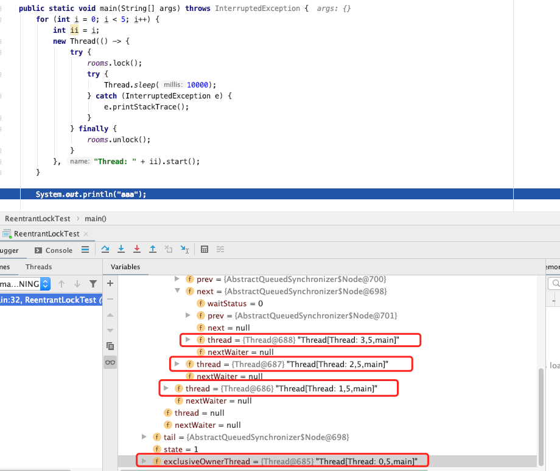
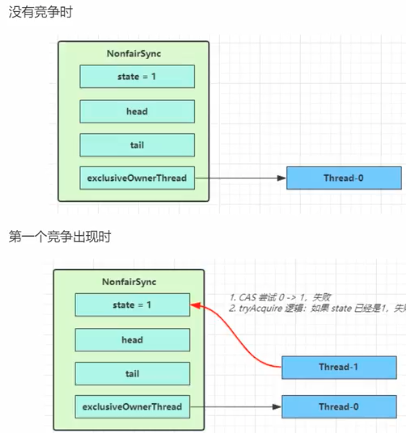

#### concurrent 包的结构层次

其中包含了两个子包：atomic以及lock，另外在concurrent下的阻塞队列以及executors,这些就是concurrent包中的精华


#### Lock 类

在Lock接口出现之前，java程序主要是靠synchronized关键字实现锁功能的，而java SE5之后，并发包中增加了lock接口，它提供了与synchronized一样的锁功能。虽然它失去了像synchronize关键字隐式加锁解锁的便捷性，但是却拥有了锁获取和释放的可操作性，可中断的获取锁以及超时获取锁等多种synchronized关键字所不具备的同步特性。

使用比较广泛的是 `ReentrantLock`

#### AQS

> `AbstractQueuedSynchronizer` 阻塞式锁和相关同步器工具的**框架**
>
> 同步器(`MySync`)是用来构建锁和其他同步组件的基础框架，它的**子类必须重写AQS的几个protected修饰的用来改变同步状态的方法**，其他方法主要是实现了排队和阻塞机制。**状态的更新使用getState,setState以及compareAndSetState这三个方法**。
>
> **锁是面向使用者，它定义了使用者与锁交互的接口，隐藏了实现细节；同步器是面向锁的实现者，它简化了锁的实现方式，屏蔽了同步状态的管理，线程的排队，等待和唤醒等底层操作**。锁和同步器很好的隔离了使用者和实现者所需关注的领域。
>
> **锁是面向使用者，它定义了使用者与锁交互的接口，隐藏了实现细节；同步器是面向锁的实现者，它简化了锁的实现方式，屏蔽了同步状态的管理，线程的排队，等待和唤醒等底层操作**。锁和同步器很好的隔离了使用者和实现者所需关注的领域。

##### 特点：

* 使用 `state` 属性来表示资源的状态，分独占模式和共享模式，子类需要定义如何维护这个状态，控制如何获取锁和释放锁
  * `getState` 获取 `state` 状态
  * `setState` 设置`state` 状态
  * `compareAndSetState`：乐观锁机制，设置 `state`状态
* 提供了基于`FIFO` 的等待队列，类似于`Monitor`的`EntryList`
* 条件变量实现等待，唤醒机制，支持多个条件变量

 子类主要实现这一的一些方法

* `tryAcquire`
* `tryRelease`
* `tryAcquireShared`
* `isHeldExeclusive`

#### 自定义锁

```java
package thread.b.chapt06;

import java.util.concurrent.TimeUnit;
import java.util.concurrent.locks.AbstractQueuedLongSynchronizer;
import java.util.concurrent.locks.Condition;
import java.util.concurrent.locks.Lock;

public class TestAqs {

    // 自定义一个不可重入锁
    static class MyLock implements Lock {
        // lock 中有比较多的方法
        // 而 aqs 已经帮助实现了大部分的方法
        // 值需要写几个重要的方式

        // 独占锁
        class MySync extends AbstractQueuedLongSynchronizer {
            @Override
            protected boolean tryAcquire(long arg) {
                if (compareAndSetState(0,1)) {
                    // 状态变为1，拿到了锁
                    // 然后设置当前线程为锁的拥有者
                    setExclusiveOwnerThread(Thread.currentThread());
                    return true;
                }
                return false;
            }

            @Override
            protected boolean tryRelease(long arg) {
                setState(0);
                // 状态变为1，拿到了锁
                // 然后设置当前线程为锁的拥有者
                setExclusiveOwnerThread(null);
                return true;
            }

            @Override
            protected boolean isHeldExclusively() {
                return getState() == 1;
            }

            public Condition newCondition() {
                return new ConditionObject();
            }
        }

        private MySync sync = new MySync();

        @Override // 加锁不成功，进入等待队列
        public void lock() {
            sync.acquire(1); // 独占锁
        }

        @Override // 可打断加锁
        public void lockInterruptibly() throws InterruptedException {
            sync.acquireInterruptibly(1);
        }

        @Override // 一次尝试加锁
        public boolean tryLock() {
            return sync.tryAcquire(1);
        }

        @Override
        public boolean tryLock(long time, TimeUnit unit) throws InterruptedException {
            return sync.tryAcquireNanos(1, unit.toNanos(time));
        }

        @Override
        public void unlock() {
            sync.release(1);
        }

        @Override
        public Condition newCondition() {
            return sync.newCondition();
        }
    }


    public static void main(String[] args) {
        MyLock myLock = new MyLock();

        new Thread(() -> {
            myLock.lock();

            try {
                System.out.println("11 locking.....");
                try {
                    Thread.sleep(2000);
                } catch (InterruptedException e) {
                    e.printStackTrace();
                }
            } finally {
                myLock.unlock();
            }
        }).start();

        new Thread(() -> {
            myLock.lock();
            System.out.println("加锁成功");
            myLock.lock();
            System.out.println("加锁成功");
            // 被阻塞主，代码跑不到这里
            try {
                System.out.println("22 locking.....");
            } finally {
                myLock.unlock();
            }
        }).start();
    }
}
```

#### 同步队列

当共享资源被某个线程占有，其他请求该资源的线程将会阻塞，从而进入同步队列。就数据结构而言，队列的实现方式无外乎两者一是通过数组的形式，另外一种则是链表的形式。AQS中的同步队列则是**通过链式方式**进行实现。

**Node 类**

是一个双向链表

```java
static final class Node {
        static final Node SHARED = new Node();
  			// 节点状态
        static final Node EXCLUSIVE = null;
        static final int CANCELLED =  1;
        static final int SIGNAL    = -1;
        static final int CONDITION = -2;
        static final int PROPAGATE = -3;

        volatile int waitStatus;
        // 前驱节点
        volatile Node prev;
        // 后续节点
        volatile Node next;

        volatile Thread thread;

        Node nextWaiter;

        final boolean isShared() {
            return nextWaiter == SHARED;
        }

        final Node predecessor() throws NullPointerException {
            Node p = prev;
            if (p == null)
                throw new NullPointerException();
            else
                return p;
        }

        Node() {}

        Node(Thread thread, Node mode) {     // Used by addWaiter
            this.nextWaiter = mode;
            this.thread = thread;
        }

        Node(Thread thread, int waitStatus) { // Used by Condition
            this.waitStatus = waitStatus;
            this.thread = thread;
        }
    }

```

##### 看看ReentrantLock  中的这个队列



Thread-0先获得锁后进行睡眠，其他线程（Thread-1,Thread-2,Thread-3）获取锁失败进入同步队列，同时也可以很清楚的看出来每个节点有两个域：prev(前驱)和next(后继)。

节点如何进行入队和出队是怎样做的了？实际上这对应着锁的获取和释放两个操作：获取锁失败进行入队操作，获取锁成功进行出队操作。

##### ReentrantLock 原理


```java
public ReentrantLock() {
  sync = new NonfairSync();
}
```

`ReentrantLock` 的默认构造器，是使用非公平锁

```java
static final class NonfairSync extends Sync
```

其锁的方式

```java
 final void lock() {
   if (compareAndSetState(0, 1))
     setExclusiveOwnerThread(Thread.currentThread());
   else
     acquire(1); 
 }
```



第一次竞争的时候，将`state` 设置为1，然后第一个竞争到来的时候尝试`state` 设置为0，失败

根据代码，进入`acquire`, 独占锁

```java
public final void acquire(int arg) {
  if (!tryAcquire(arg) &&
      acquireQueued(addWaiter(Node.EXCLUSIVE), arg))
    selfInterrupt();
}
```

然后又尝试获取一次锁，那么失败之后，就将新建一个`Node` 然后放到`queue` 中

也就是进入方法`addWaiter`，构造`Node` 双向队列

```java
private Node addWaiter(Node mode) {
  Node node = new Node(Thread.currentThread(), mode);
  // Try the fast path of enq; backup to full enq on failure
  Node pred = tail;
  if (pred != null) {
    node.prev = pred;
    if (compareAndSetTail(pred, node)) {
      pred.next = node;
      return node;
    }
  }
  enq(node); // Inserts node into queue, initializing if necessary
  return node;
}


private Node enq(final Node node) {
  for (;;) {
    Node t = tail;
    if (t == null) { // Must initialize，如果队列为空
      if (compareAndSetHead(new Node())) // 初始化一个头结点
        tail = head; // 初始化之后，进入到下一轮循环，下一轮循环中插入为节点，然后结束方法，并返回
    } else {
      node.prev = t; // 队列不为空，并将 node 插入到队列尾巴
      if (compareAndSetTail(t, node)) {
        t.next = node;
        return t; // 然后返回队列尾巴
      }
    }
  }
}
```

* 图中黄色表示`Node` 的 `waitStatus` 状态，其中0是默认的状态
* `Node` 的构建是懒惰的
* 其中第一个`Node` 是 `Dummy head` 用来占位，并不关联线程


然后紧接着它会在方法 `acquireQueued` 中挣扎一会

```java
    final boolean acquireQueued(final Node node, int arg) {
        boolean failed = true;
        try {
            boolean interrupted = false;
            for (;;) {
                // 如果当前node 的前驱节点是头节点
                final Node p = node.predecessor();
                // 也就是当前线程是第二个线程，那么它还有一次机会去争取下锁,可能恰好这个时候头结点释放了锁，那么它就可以获取到锁了
                // 也就是if 中的第二个判断
                if (p == head && tryAcquire(arg)) {
                    setHead(node);
                    p.next = null; // help GC
                    failed = false;
                    return interrupted;
                }
                // 获取不到，那么真正进去等待状态
                if (shouldParkAfterFailedAcquire(p, node) &&
                    parkAndCheckInterrupt())
                    interrupted = true;
            }
        } finally {
            if (failed)
                cancelAcquire(node);
        }
    }
```

上面的步骤梳理出来就是


所以在获取锁的过程主要有2次尝试

* 首次获取(获取失败，则开始准备进入队列)
* 进入队列之前，在尝试获取锁一次

释放锁

```java
public final boolean release(int arg) {
  if (tryRelease(arg)) { // 同步状态释放成功
    Node h = head;
    if (h != null && h.waitStatus != 0)
      unparkSuccessor(h);
    return true;
  }
  return false;
}


private void unparkSuccessor(Node node) {
  
  int ws = node.waitStatus;
  if (ws < 0)
    compareAndSetWaitStatus(node, ws, 0);

  Node s = node.next; // //头节点的后继节点
  if (s == null || s.waitStatus > 0) {
    s = null;
    for (Node t = tail; t != null && t != node; t = t.prev)
      if (t.waitStatus <= 0)
        s = t;
  }
  if (s != null) // 后继节点不为null时唤醒该线程
    LockSupport.unpark(s.thread);
    // 每一次释放锁都会唤醒队列中该节点的后继节点锁引用的线程，从而进一步可以作证
    // 锁的过程就是一个 FIFO(先进先出) 的过程
}
```

* **线程获取锁失败，线程被封装成Node进行入队操作，核心方法在于addWaiter()和enq()，同时enq()完成对同步队列的头结点初始化工作以及CAS操作失败的重试**;

* **线程获取锁是一个自旋的过程，当且仅当 当前节点的前驱节点是头结点并且成功获得同步状态时，节点出队即该节点引用的线程获得锁，否则，当不满足条件时就会调用LookSupport.park()方法使得线程阻塞**；

* **释放锁的时候会唤醒后继节点**

总体来说：**在获取同步状态时，AQS维护一个同步队列，获取同步状态失败的线程会加入到队列中进行自旋；移除队列（或停止自旋）的条件是前驱节点是头结点并且成功获得了同步状态。在释放同步状态时，同步器会调用unparkSuccessor()方法唤醒后继节点。**


#### Lock 可中断的获得锁

> 之前的笔记中知道 `sychronized` 在获得锁之后，只能是自己将临界区中的代码执行结束才可以释放锁，这里的`lock` 方式还可以做到获得锁被打断的方式，来看看其是如何实现的

```java
public final void acquireInterruptibly(int arg) throws InterruptedException {
  if (Thread.interrupted())
    throw new InterruptedException();
  if (!tryAcquire(arg))
    //线程获取锁失败
    doAcquireInterruptibly(arg);
}


private void doAcquireInterruptibly(int arg) throws InterruptedException {
  final Node node = addWaiter(Node.EXCLUSIVE);
  boolean failed = true;
  try {
    for (;;) {
      final Node p = node.predecessor();
      if (p == head && tryAcquire(arg)) {
        setHead(node);
        p.next = null; // help GC
        failed = false;
        return;
      }
      if (shouldParkAfterFailedAcquire(p, node) &&
          parkAndCheckInterrupt())
        throw new InterruptedException(); 
      // 这有这里和 acquireQueued 方法中的不一样
      // 当获取不到锁，那么进去队列，这个时候去检查是否有其他线程打断自己
      // 是在进入队列之前可被打断的
    }
  } finally {
    if (failed)
      cancelAcquire(node);
  }
}
```

---

##### ReentrantLock 原理

先回顾回顾`synchronized` 加锁，其支持重入，表示可以对共享资源重新加锁，即当前线程获取该锁之后还可以在获取，而不会阻塞，而释放的时候也是是自己执行完临界区的代码之后才去释放，如果自己不释放是不能被打断释放的。

`ReentrantLock`  的方法

* `lock`
* `trylock`
* `trylock(timeout)`
* `unlock`
* `newCondition`


主要看看`重入性原理` 

如果要支持锁的重入。那么需要解决2个问题

* 在线程获取锁的时候，如果该线程已经获取了锁，那么再次获取锁，直接获取成功
* 因为锁可以被获取n次，那么只有在释放的时候释放n次，那么锁才算是真正的可以被释放掉

```java
final boolean nonfairTryAcquire(int acquires) {
  final Thread current = Thread.currentThread();
  int c = getState();
  if (c == 0) { // 锁是空闲的
    if (compareAndSetState(0, acquires)) {
      setExclusiveOwnerThread(current);
      return true;
    }
  }
  else if (current == getExclusiveOwnerThread()) {
    int nextc = c + acquires; // 锁被占，占的那个线程恰好是自己,那么同部状态 += acquires
    if (nextc < 0) // overflow
      throw new Error("Maximum lock count exceeded");
    setState(nextc); // 设置新的状态
    return true;
  }
  return false;
}


protected final boolean tryRelease(int releases) {
  int c = getState() - releases; // 释放的时候，更新同步状态
  if (Thread.currentThread() != getExclusiveOwnerThread())
    throw new IllegalMonitorStateException();
  boolean free = false;
  if (c == 0) { 
    free = true; // 只有是同步状态为 0， 的时候才释放锁
    setExclusiveOwnerThread(null);
  }
  setState(c);
  return free;
}
```

#### 读写锁

* ReentrantReadAndWriteLock

在并发场景中用于解决线程安全问题，我们机会会高频率的使用和独占式锁，通常使用 java 提供的关键字 `synchronized` 或者 `reentrantlock`。但是他们都是独占式锁，也就是在同一时刻只有一个线程能够给获取锁，而子一些业务中大部分只是读数据，写数据很少，如果仅仅是读数据的话并不影响数据正确性，针对这种情况出现了**读写锁**，**读写所允许同一时刻被多个读线程访问，但是在写线程访问时，所有的读线程和其他的写线程都会被阻塞**。

当读操作远远高于写操作的时候，这时候使用读写锁，并没有写操作，不会去修改共享变量，从而不需要加锁，让`读-读`可以并发，提高性能

支持重入。

在分析该特性按照这样的方式分析`writelock` 和 `writelock`, `writelock` 和 `readlock` 之间，`readlock` 和 `readlock` 之间。

* 公平性选择：支持非公平性(默认)和公平的获取方式，吞吐量还是非公平由于公平
* 重入性：支持重入，连锁获取后还能再次获取，写锁获取之后还能够再次获取写锁，同时也能够获取读锁
* 锁降级：遵循获取写锁，获取读锁再释放写锁的次序，写锁能够升级为写锁。

要想能够彻底的理解读写锁必须能够理解这样几个问题：

1. 读写锁是怎样实现分别记录读写状态的
2. 写锁是怎样获取和释放的
3. 读锁是怎样获取和释放的

看看使用的例子

```java
/*
    多个读锁之间是不需要互斥的(读操作不会改变数据，如果上了锁，反而会影响效率)，
    写锁和写锁之间需要互斥，也就是说，如果只是读数据，就可以多个线程同时读，
    但是如果你要写数据，就必须互斥，

    三个线程读数据，三个线程写数据
 */
public class ReentrantReadWriterLockTest {
    private Object data = null;

    ReadWriteLock rwLock = new ReentrantReadWriteLock();

    public void get() {
        // 读上锁
        rwLock.readLock().lock();

        try {
            System.out.println(Thread.currentThread().getName() + " 准备数据");
            Thread.sleep(2000);

            System.out.println(Thread.currentThread().getName() + " 读出来的数据 " + data);
        } catch (InterruptedException e) {
            e.printStackTrace();
        } finally {
            rwLock.readLock().unlock();
        }
    }


    public void put(Object data) {
        rwLock.writeLock().lock();

        try {
            System.out.println(Thread.currentThread().getName() + " 准备写数据");

            Thread.sleep(2000);
            this.data = data;

            System.out.println(Thread.currentThread().getName() + " 写入数据: " + data);
        } catch (InterruptedException e) {
            e.printStackTrace();
        } finally {
            rwLock.writeLock().unlock();
        }
    }


    public static void main(String[] args) {
        final ReentrantReadWriterLockTest readWrite = new ReentrantReadWriterLockTest();

        for (int i = 0; i < 3; i++) {
            new Thread(() -> {
                readWrite.get();
            }).start();


            new Thread(() -> {
                readWrite.put(new Random().nextInt(8));
            }).start();
        }
    }
}

// 输出
// Thread-0 准备数据
// Thread-2 准备数据
// Thread-4 准备数据
// Thread-4 读出来的数据 null
// Thread-2 读出来的数据 null
// Thread-0 读出来的数据 null
// Thread-1 准备写数据
// Thread-1 写入数据: 0
// Thread-3 准备写数据
// Thread-3 写入数据: 2
// Thread-5 准备写数据
// Thread-5 写入数据: 0
```

从 65-67 行在执行`get` 数据之后，三个读程度均打印`准备数据`， 然后经过2s 之后均输出 `读出来的数据 null`， 也就是这三个线程是同时去读数据的，不是阻塞关系的。

而在写数据的时候，发现是阻塞的，在`Thread-1` 准备写数据 -> `然后写入数据` 然后是接下来 `Thread-1`完成准备数据。这里也看出来写数据是阻塞的，一个写完然后另外一个再写，`put` 方法体必须一气呵成执行完。

```java
public ReentrantReadWriteLock(boolean fair) {
  sync = fair ? new FairSync() : new NonfairSync(); // 建立一个同步器
  readerLock = new ReadLock(this); // readerLock 持有 同步器
  writerLock = new WriteLock(this); // writeLock 也持有 同步器
}
```

提供一个`数据容器类`内部分别使用读锁保护数据的`read` 方法，写锁保护数据的`write()`

* stampedLock

为了进一步优化读性能，特点是在使用读锁，写锁时候必须配合【戳】

乐观读：先获取一个读的【戳】，然后在真正读的时候去验证这个【戳】，如果验证成功，那么就可以直接读，如果发现戳改变了，那么就加一个`读锁`(锁)以保读正确

#### CoundownLatch

用来进行线程同步协作，等待所有线程完成待机室

其中构造参数用来初始化等待计数值，`await()` 用来等待计数归0，`countDown()` 用来计数建1.

CountDown 是倒计时的意思，Latch 是门栓的意思，**加起来的意思就是一个倒计时的门栓。**

它其实是作用于线程当中的，它就像一个门栓，一开始是关闭的，所有希望通过该门的线程都需要等待，然后开始倒计时，当倒计时一到，等待的所有线程都可以通过。

要注意的是，它是一次性的，打开之后就不能关上了。