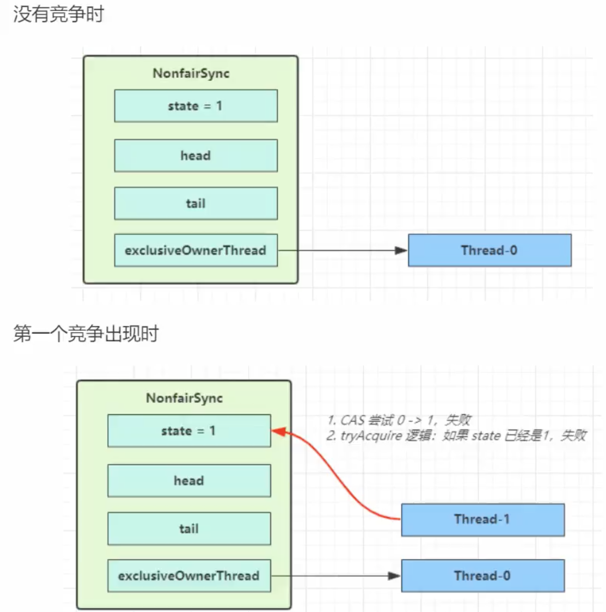

#### concurrent 包的结构层次

其中包含了两个子包：`Atomic`以及`Lock`，另外在 `concurrent`下的阻塞队列以及`executors`,这些就是`concurrent`包中的精华


#### Lock 接口

在`Lock`接口出现之前，`Java`程序主要是靠`Synchronized`关键字实现锁功能的，而 `java SE5`之后，并发包中增加了`Lock`接口，它提供了与`Synchronized`一样的锁功能。虽然它失去了像`Synchronize`关键字隐式加锁解锁的便捷性，**但是却拥有了锁获取和释放的可操作性，可中断的获取锁以及超时获取锁等多种**`Synchronized`关键字所不具备的同步特性。

使用比较广泛的是 `ReentrantLock`

```java
public interface Lock {

    /**
     * Acquires the lock.
     			如果锁没有被其他线程获取，那么 hold count 设置1，然后当前线程可以立马获取到锁
     			如果锁已经被当前线程获取，那么 hold count +1， 然后立马返回当前锁
     			如果锁已经被其他线程获取，那么当前线程会被 park(不可用)进入休眠，直到被其他线程唤醒获得锁
     */
    void lock();

    /**
     * Acquires the lock unless the current thread is
     * {@linkplain Thread#interrupt interrupted}.
     和 lock() 一样，只不过可以被打断的
     */
    void lockInterruptibly() throws InterruptedException;

    /**
     * Acquires the lock only if it is free at the time of invocation（调用）.
     */
    boolean tryLock();

    /**
     * Acquires the lock if it is free within the given waiting time and the
     * current thread has not been {@linkplain Thread#interrupt interrupted}.
     如果锁没有被其他线程获取，那么 hold count 设置1，然后当前线程可以立马获取到锁，返回 true
     如果锁已经被当前线程获取，那么 hold count +1， 然后立马返回当前锁，返回 true
     如果锁已经被其他线程获取，立马返回，返回 False
     */
    boolean tryLock(long time, TimeUnit unit) throws InterruptedException;

    /**
     * Releases the lock.
     */
    void unlock();

    /**
     * Returns a new {@link Condition} instance that is bound to this
     * {@code Lock} instance.
     */
    Condition newCondition();
}
```

而在实现上面的方法的时候就需要借助`AbstractQueuedLongSynchronizer` 这里实现了大部分的方法，只有少数的和业务逻辑相关的

#### AQS

> `AbstractQueuedSynchronizer` 阻塞式锁和相关同步器工具的**框架**
>
> 同步器(`Sync`)是用来构建锁和其他同步组件的基础框架，它的**子类必须重写AQS的几个protected修饰的用来改变同步状态的方法**，其他方法主要是实现了排队和阻塞机制。**状态的更新使用getState,setState以及compareAndSetState这三个方法**。
>
> **锁是面向使用者，它定义了使用者与锁交互的接口，隐藏了实现细节；同步器是面向锁的实现者，它简化了锁的实现方式，屏蔽了同步状态的管理，线程的排队，等待和唤醒等底层操作**。锁和同步器很好的隔离了使用者和实现者所需关注的领域。

##### 特点：

* 使用 `state` 属性来表示资源的状态，分独占模式和共享模式，子类需要定义如何维护这个状态，控制如何获取锁和释放锁
  * `getState` 获取 `state` 状态
  * `setState` 设置`state` 状态
  * `compareAndSetState`：乐观锁机制，设置 `state`状态
* 提供了基于`FIFO` 的等待队列，类似于`Monitor`的`EntryList`

```java
/**
     * Head of the wait queue
     */
private transient volatile Node head;

/**
     * Tail of the wait queue
     注意：队列中的头节点并不是要获取锁的节点，只是占位的摆设，真正要获取锁的节点是第二个节点，第二个节点获取到锁之后成为头节点并出队
     */
private transient volatile Node tail;

/**
     * The synchronization state.
     */
private volatile long state;
```


* 条件变量实现等待，唤醒机制，支持多个条件变量

 子类主要实现这一的一些方法

* `tryAcquire`
* `tryRelease`
* `tryAcquireShared`
* `isHeldExeclusive`

#### 自定义锁

```java
package thread.b.chapt06;

import java.util.concurrent.TimeUnit;
import java.util.concurrent.locks.AbstractQueuedLongSynchronizer;
import java.util.concurrent.locks.Condition;
import java.util.concurrent.locks.Lock;

public class TestAqs {

    // 自定义一个不可重入锁
    static class MyLock implements Lock {
        // lock 中有比较多的方法
        // 而 aqs 已经帮助实现了大部分的方法
        // 值需要写几个重要的方式

        // 独占锁
        class MySync extends AbstractQueuedLongSynchronizer {
            @Override
            protected boolean tryAcquire(long arg) {
                if (compareAndSetState(0,1)) {
                    // 状态变为1，拿到了锁
                    // 然后设置当前线程为锁的拥有者
                    setExclusiveOwnerThread(Thread.currentThread());
                    return true;
                }
                return false;
            }

            @Override
            protected boolean tryRelease(long arg) {
                setState(0);
                // 状态变为1，拿到了锁
                // 然后设置当前线程为锁的拥有者
                setExclusiveOwnerThread(null);
                return true;
            }

            @Override
            protected boolean isHeldExclusively() {
                return getState() == 1;
            }

            public Condition newCondition() {
                return new ConditionObject();
            }
        }

        private MySync sync = new MySync();

        @Override // 加锁不成功，进入等待队列
        public void lock() {
            sync.acquire(1); // 独占锁
        }

        @Override // 可打断加锁
        public void lockInterruptibly() throws InterruptedException {
            sync.acquireInterruptibly(1);
        }

        @Override // 一次尝试加锁
        public boolean tryLock() {
            return sync.tryAcquire(1);
        }

        @Override
        public boolean tryLock(long time, TimeUnit unit) throws InterruptedException {
            return sync.tryAcquireNanos(1, unit.toNanos(time));
        }

        @Override
        public void unlock() {
            sync.release(1);
        }

        @Override
        public Condition newCondition() {
            return sync.newCondition();
        }
    }


    public static void main(String[] args) {
        MyLock myLock = new MyLock();

        new Thread(() -> {
            myLock.lock();

            try {
                System.out.println("11 locking.....");
                try {
                    Thread.sleep(2000);
                } catch (InterruptedException e) {
                    e.printStackTrace();
                }
            } finally {
                myLock.unlock();
            }
        }).start();

        new Thread(() -> {
            myLock.lock();
            System.out.println("加锁成功");
            myLock.lock();
            System.out.println("加锁成功");
            // 被阻塞主，代码跑不到这里
            try {
                System.out.println("22 locking.....");
            } finally {
                myLock.unlock();
            }
        }).start();
    }
}
```

#### 同步队列

当共享资源被某个线程占有，其他请求该资源的线程将会阻塞，从而进入同步队列。就数据结构而言，队列的实现方式无外乎两者一是通过数组的形式，另外一种则是链表的形式。AQS中的同步队列则是**通过链式方式**进行实现。

**Node 类**

是一个双向链表

```java
static final class Node {
        static final Node SHARED = new Node();
  			
  			// 独占锁
        static final Node EXCLUSIVE = null;
  			// node(thread) 被 cancelled，可能的原因有 timeout 或者 interrupt
        static final int CANCELLED =  1;
        // node(thread) 经过 park 操作 已经或者马上被 blocked，
        static final int SIGNAL    = -1;
        // node(thread) currently on a condition queue
        static final int CONDITION = -2;
        static final int PROPAGATE = -3;

  			// 节点状态, 取值只能是上面的4个值 + 0 值，并修饰为 volatile 保证线程间的可见性
        // 默认取值为0. 不上上面的任何状态
        volatile int waitStatus;
        // 前驱节点
        volatile Node prev;
        // 后续节点
        volatile Node next;

        volatile Thread thread;

        Node nextWaiter;

        final boolean isShared() {
            return nextWaiter == SHARED;
        }

        final Node predecessor() throws NullPointerException {
            Node p = prev;
            if (p == null)
                throw new NullPointerException();
            else
                return p;
        }

        Node() {}

        Node(Thread thread, Node mode) {     // Used by addWaiter
            this.nextWaiter = mode;
            this.thread = thread;
        }

        Node(Thread thread, int waitStatus) { // Used by Condition
            this.waitStatus = waitStatus;
            this.thread = thread;
        }
    }

```

#### 成员方法

一下的几个方法均是需要用户去实现的

* `tryAcquire`
* `tryRelease`
* `tryAcquireShared`
* `isHeldExeclusive`

```java
protected boolean tryAcquire(long arg) {
        throw new UnsupportedOperationException();
}

protected boolean tryRelease(long arg) {
        throw new UnsupportedOperationException();
}

protected long tryAcquireShared(long arg) {
        throw new UnsupportedOperationException();
}

protected boolean isHeldExclusively() {
        throw new UnsupportedOperationException();
}
```

##### ReentrantLock  中的这个队列


Thread-0先获得锁后进行睡眠，其他线程（Thread-1,Thread-2,Thread-3）获取锁失败进入同步队列，同时也可以很清楚的看出来每个节点有两个域：prev(前驱)和next(后继)。

节点如何进行入队和出队是怎样做的了？实际上这对应着锁的获取和释放两个操作：获取锁失败进行入队操作，获取锁成功进行出队操作。

##### ReentrantLock 原理


```java
public ReentrantLock() {
  sync = new NonfairSync();
}
```

`ReentrantLock` 的默认构造器，是使用非公平锁

```java
static final class NonfairSync extends Sync
```

其锁的方式

```java
 final void lock() {
   if (compareAndSetState(0, 1))
     setExclusiveOwnerThread(Thread.currentThread());
   else
     acquire(1); 
 }
```


第一次竞争的时候，将`state` 设置为1，然后第一个竞争到来的时候尝试`state` 设置为0，失败

根据代码，进入`acquire`, 独占锁

```java
public final void acquire(int arg) {
  if (!tryAcquire(arg) &&
      acquireQueued(addWaiter(Node.EXCLUSIVE), arg))
    selfInterrupt();
}
```

然后又尝试获取一次锁，那么失败之后，就将新建一个`Node` 然后放到`queue` 中

也就是进入方法`addWaiter`，构造`Node` 双向队列

```java
// addWaiter 添加一个 Node
// 将该线程加入等待队列的尾部，并标记为独占模式； 返回新添加的任务的 Node
// 这里只做了 pred == null 情况
private Node addWaiter(Node mode) {
  Node node = new Node(Thread.currentThread(), mode);
  // Try the fast path of enq; backup to full enq on failure
  Node pred = tail;
  if (pred != null) {
    node.prev = pred;
    if (compareAndSetTail(pred, node)) {
      pred.next = node;
      return node;
    }
  }
  enq(node); // Inserts node into queue, initializing if necessary
  return node;
}

// 这里重新考虑了2种情况
// pred == null 情况 和 pred != null 情况
private Node enq(final Node node) {
  for (;;) {
    Node t = tail;
    if (t == null) { // Must initialize，如果队列为空
      if (compareAndSetHead(new Node())) // 初始化一个头结点，虚拟的
        tail = head; // 初始化之后，进入到下一轮循环，下一轮循环中插入为节点，然后结束方法，并返回
    } else {
      node.prev = t; // 队列不为空，并将 node 插入到队列尾巴
      if (compareAndSetTail(t, node)) {
        t.next = node;
        return t; // 然后返回队列尾巴
      }
    }
  }
}
```

* 图中黄色表示`Node` 的 `waitStatus` 状态，其中0是默认的状态
* `Node` 的构建是懒惰的
* 其中第一个`Node` 是 `Dummy head` 用来占位，并不关联线程


然后紧接着它会在方法 `acquireQueued` 中挣扎一会

线程自旋地以独占且不可中断的方式获取同步状态`acquire`，直到拿到锁之后再返回

```java
final boolean acquireQueued(final Node node, int arg) {
  boolean failed = true;
  try {
    boolean interrupted = false;
    for (;;) {
      // 如果当前node(新加入的结点，也是尾结点) 的前驱节点是头节点
      final Node p = node.predecessor();
      // 也就是当前线程是第二个线程，那么它还有一次机会去当前线程争取下锁,可能恰好这个时候头结点释放了锁，那么它当前线程就可以获取到锁了
      // 也就是if 中的第二个判断
      if (p == head && tryAcquire(arg)) {
        setHead(node);
        p.next = null; // help GC
        failed = false;
        return interrupted;
      }
      // 获取不到，那么真正进去等待状态，也就是在这里新加入的 Node/thread 就进入了等待，
      // 这里就进入了休眠，等待信号，被唤醒
      if (shouldParkAfterFailedAcquire(p, node) &&
          parkAndCheckInterrupt())
        interrupted = true;
    }
  } finally {
    if (failed)
      cancelAcquire(node);
  }
}

private static boolean shouldParkAfterFailedAcquire(Node pred, Node node) {
  // pred -> node
  int ws = pred.waitStatus; 
  if (ws == Node.SIGNAL) // -1
    /*
             * This node has already set status asking a release
             * to signal it, so it can safely park.
             等待一个信号，release 自己
             */
    return true;
  if (ws > 0) {
    /*
             * Predecessor was cancelled. Skip over predecessors and
             * indicate retry.
             */
    do {
      node.prev = pred = pred.prev;
      // 删除 pred 结点， 也就是当前 cancelled 状态的结点删除
      // 这里一路往前知道下一个 pred.waitStatus <= 0
    } while (pred.waitStatus > 0);
    pred.next = node;
  } else {
    /*
             * waitStatus must be 0 or PROPAGATE. Indicate that we
             * need a signal, but don't park yet. Caller will need to
             * retry to make sure it cannot acquire before parking.
             */
    compareAndSetWaitStatus(pred, ws, Node.SIGNAL);
  }
  return false;
}

private final boolean parkAndCheckInterrupt() {
  LockSupport.park(this);
  return Thread.interrupted();
}
```

上面的步骤梳理出来就是


所以在获取锁的过程主要有2次尝试

* 首次获取(获取失败，则开始准备进入队列)
* 进入队列之前，在尝试获取锁一次

释放锁

```java
public final boolean release(int arg) {
  if (tryRelease(arg)) { // 同步状态释放成功
    Node h = head;
    if (h != null && h.waitStatus != 0)
      unparkSuccessor(h);// 头结点开始唤醒线程
    return true;
  }
  return false;
}

protected final boolean tryRelease(int releases) {
  int c = getState() - releases;
  if (Thread.currentThread() != getExclusiveOwnerThread())
    throw new IllegalMonitorStateException();// 释放锁的前提是，现在线程是锁的拥有者
  boolean free = false;
  if (c == 0) {
    free = true;
    setExclusiveOwnerThread(null);
  }
  setState(c);
  return free;
}

private void unparkSuccessor(Node node) {
  
  int ws = node.waitStatus;
  if (ws < 0)
    compareAndSetWaitStatus(node, ws, 0);

  Node s = node.next; // //头节点的后继节点
  if (s == null || s.waitStatus > 0) {
    s = null;
    for (Node t = tail; t != null && t != node; t = t.prev)
      if (t.waitStatus <= 0)
        s = t;
  }
  if (s != null) // 后继节点不为null时唤醒该线程
    LockSupport.unpark(s.thread);
    // 每一次释放锁都会唤醒队列中该节点的后继节点锁引用的线程，从而进一步可以作证
    // 锁的过程就是一个 FIFO(先进先出) 的过程
}
```

* **线程获取锁失败，线程被封装成Node进行入队操作，核心方法在于addWaiter()和enq()，同时enq()完成对同步队列的头结点初始化工作以及CAS操作失败的重试**;

* **线程获取锁是一个自旋的过程，当且仅当 当前节点的前驱节点是头结点并且成功获得同步状态时，节点出队即该节点引用的线程获得锁，否则，当不满足条件时就会调用LookSupport.park()方法使得线程阻塞**；

* **释放锁的时候会唤醒后继节点**

总体来说：**在获取同步状态时，AQS维护一个同步队列，获取同步状态失败的线程会加入到队列中进行自旋；移除队列（或停止自旋）的条件是前驱节点是头结点并且成功获得了同步状态。在释放同步状态时，同步器会调用unparkSuccessor()方法唤醒后继节点。**


#### Lock 可中断的获得锁

> 之前的笔记中知道 `sychronized` 在获得锁之后，只能是自己将临界区中的代码执行结束才可以释放锁，这里的`lock` 方式还可以做到获得锁被打断的方式，来看看其是如何实现的

```java
public final void acquireInterruptibly(int arg) throws InterruptedException {
  if (Thread.interrupted())
    throw new InterruptedException();
  if (!tryAcquire(arg))
    //线程获取锁失败
    doAcquireInterruptibly(arg);
}


private void doAcquireInterruptibly(int arg) throws InterruptedException {
  final Node node = addWaiter(Node.EXCLUSIVE);
  boolean failed = true;
  try {
    for (;;) {
      final Node p = node.predecessor();
      if (p == head && tryAcquire(arg)) {
        setHead(node);
        p.next = null; // help GC
        failed = false;
        return;
      }
      if (shouldParkAfterFailedAcquire(p, node) &&
          parkAndCheckInterrupt())
        throw new InterruptedException(); 
      // 这有这里和 acquireQueued 方法中的不一样
      // 当获取不到锁，那么进去队列，这个时候去检查是否有其他线程打断自己
      // 是在进入队列之前可被打断的
    }
  } finally {
    if (failed)
      cancelAcquire(node);
  }
}
```

---

##### ReentrantLock 原理

先回顾回顾`synchronized` 加锁，其支持重入，表示可以对共享资源重新加锁，即当前线程获取该锁之后还可以在获取，而不会阻塞，而释放的时候也是是自己执行完临界区的代码之后才去释放，如果自己不释放是不能被打断释放的。

`ReentrantLock`  的方法

* `lock`
* `trylock`
* `trylock(timeout)`
* `unlock`
* `newCondition`


主要看看`重入性原理` 

如果要支持锁的重入。那么需要解决2个问题

* 在线程获取锁的时候，如果该线程已经获取了锁，那么再次获取锁，直接获取成功
* 因为锁可以被获取n次，那么只有在释放的时候释放n次，那么锁才算是真正的可以被释放掉

```java
final void lock() {
  if (compareAndSetState(0, 1)) 
    //没有竞争的时候：加锁成功
    // 如果出现竞争就不会进入到这里，因为状态已经被设置成了 1
    setExclusiveOwnerThread(Thread.currentThread()); // 设置 owner 线程
  else
    // 竞争时候进入分支
    acquire(1);
}

public final void acquire(int arg) {
  if (!tryAcquire(arg) // 再尝试获取锁
      && acquireQueued(addWaiter(Node.EXCLUSIVE), arg) // 获取失败逻辑
     )
    selfInterrupt();
}

// addWaiter(Node.EXCLUSIVE) 新建一个 Node， 并添加到队列中
// 对新添加的 Node 做最后挣扎，看是否能够获得锁

final boolean acquireQueued(final Node node, int arg) {
  boolean failed = true;
  try {
    boolean interrupted = false;
    for (;;) {
      final Node p = node.predecessor();
      if (p == head && tryAcquire(arg)) {
        // 如果当前结点的头结点是头结点，那么新添加的结点是第二位的(前一个是哑结点)，可以获得锁
        // 那么执行 tryAcquire 在去获得锁
        setHead(node);
        p.next = null; // help GC
        failed = false;
        return interrupted;
      }
      if (shouldParkAfterFailedAcquire(p, node) // 之前没有获得锁，那么这会判断是否应该是被 Park
          && parkAndCheckInterrupt()) // 如果判断应该被 Park，那么这里 Park 程序
        // 第一次执行到这里的时候只执行到了第一个方法，然后继续进入到下一次循环
        // 下一次循环中 shouldParkAfterFailedAcquire 返回true
        // 然后进入到 parkAndCheckInterrupt 将当前线程 park
        interrupted = true;
    }
    
  } finally {
    if (failed)
      cancelAcquire(node);
  }
}


private static boolean shouldParkAfterFailedAcquire(Node pred, Node node) {
  int ws = pred.waitStatus;
  if (ws == Node.SIGNAL)
    /*
    	waitStatus=SIGNAL(-1) 
    	前继结点是 -1 状态，返回 true 之后那后续应该是 park 当前 node
    	后续在进入到shouldParkAfterFailedAcquire 这个方法，那么会进入这个分支，返回true
    	是 -1 状态，那么当前 node 是有责任唤醒后续的 node
    */
    return true;
  if (ws > 0) {
    /*
      前继结点是 > 0 状态，是取消了，所以跳过这些 node
             */
    do {
      node.prev = pred = pred.prev;
    } while (pred.waitStatus > 0);
    pred.next = node;
  } else {
    /*
       首次进入，state 的默认值是0，会在这里将前驱结点置为 -1
             */
    compareAndSetWaitStatus(pred, ws, Node.SIGNAL);
  }
  return false;
}

private final boolean parkAndCheckInterrupt() {
  LockSupport.park(this);
  return Thread.interrupted();
}


// 经历过多个线程的 park，这个时候第一个线程仍然是占着锁，那么当第一个线程执行结束之后，开始释放锁，
public void unlock() {
  sync.release(1);
}

public final boolean release(int arg) {
  if (tryRelease(arg)) {
    Node h = head;
    if (h != null && h.waitStatus != 0)
      unparkSuccessor(h);
    return true;
  }
  return false;
}

private void unparkSuccessor(Node node) {
  /*
         * If status is negative (i.e., possibly needing signal) try
         * to clear in anticipation of signalling.  It is OK if this
         * fails or if status is changed by waiting thread.
         */
  int ws = node.waitStatus;
  if (ws < 0)
    compareAndSetWaitStatus(node, ws, 0);

  /*
         * Thread to unpark is held in successor, which is normally
         * just the next node.  But if cancelled or apparently null,
         * traverse backwards from tail to find the actual
         * non-cancelled successor.
         */
  Node s = node.next;
  if (s == null || s.waitStatus > 0) {
    s = null;
    for (Node t = tail; t != null && t != node; t = t.prev)
      if (t.waitStatus <= 0)
        s = t;
  }
  if (s != null)
    LockSupport.unpark(s.thread); 
    // 释放下一个 node， 并将 下一个线程 unpark
}

// 然后再之前的代码中
final boolean acquireQueued(final Node node, int arg) {
  boolean failed = true;
  try {
    boolean interrupted = false;
    for (;;) {
      final Node p = node.predecessor();
      if (p == head && tryAcquire(arg)) {
        setHead(node);
        p.next = null; // help GC
        failed = false;
        return interrupted;
      }
      if (shouldParkAfterFailedAcquire(p, node)
          && parkAndCheckInterrupt()) 
        interrupted = true;
    }
    
  } finally {
    if (failed)
      cancelAcquire(node);
  }
}

// 在代码 parkAndCheckInterrupt() 这里 park 了线程，当上面 upark 之后，这个方法中的 for 循环继续
// 在执行到 if (p == head && tryAcquire(arg)) 的时候 此时这个 Node 执行 tryAcquire 就获得了锁，
// 并此时将这个 node 的线程设置为空，也就是变成了 头结点。

// 如果在这个 node 执行 tryAcquire(arg) 竞争锁的时候，还有另外一个线程在竞争锁(非公平锁)
// 那么当前 node 也有可能再次被 park，看下面的图
```




---

#### 可重入原理

```java
protected final boolean tryAcquire(int acquires) {
  return nonfairTryAcquire(acquires);
}
  
final boolean nonfairTryAcquire(int acquires) {
  final Thread current = Thread.currentThread();
  int c = getState();
  if (c == 0) {
    // 首次获取 锁
    if (compareAndSetState(0, acquires)) {
      setExclusiveOwnerThread(current);
      return true;
    }
  }
  else if (current == getExclusiveOwnerThread()) {
    // 再次获取锁
    int nextc = c + acquires;
    // 状态累加
    if (nextc < 0) // overflow
      throw new Error("Maximum lock count exceeded");
    setState(nextc);
    // 因为是自己线程，所以不会有线程问题，继续在设置状态
    return true;
  }
  return false;
}

// 释放的时候
protected final boolean tryRelease(int releases) {
  int c = getState() - releases;
  if (Thread.currentThread() != getExclusiveOwnerThread())
    throw new IllegalMonitorStateException();
  boolean free = false;
  if (c == 0) {
    // 在执行 lock 的时候 状态累加到一定值
    // 这里必须也要调用 若干次 unlock，在这里状态累减
    // 最后等于 0 的时候，才真正释放当前线程
    free = true;
    setExclusiveOwnerThread(null);
  }
  setState(c);
  return free;
}
```

---

#### 可打断原理

先看看不可打断

```java
public final void acquire(int arg) {
  if (!tryAcquire(arg) &&
      acquireQueued(addWaiter(Node.EXCLUSIVE), arg)
     )
    // 获得了锁，并返回了 interrupted = true 状态，进入到下面的方法
    selfInterrupt();
}

final boolean acquireQueued(final Node node, int arg) {
  boolean failed = true;
  try {
    boolean interrupted = false;
    for (;;) {
      final Node p = node.predecessor();
      if (p == head && tryAcquire(arg)) {
        setHead(node);
        p.next = null; // help GC
        failed = false;
        return interrupted;
      }
      if (shouldParkAfterFailedAcquire(p, node) &&
          parkAndCheckInterrupt()) // 当在执行 parkAndCheckInterrupt 的时候倍打断，
        interrupted = true; 
      // 然后中断状态为 true， 这样就有进入到下次的 for 循环
      // 只有在下次 tryAcquire(arg) 的时候获取锁，那么才会返回 interrupted 状态
    }
  } finally {
    if (failed)
      cancelAcquire(node);
  }
}

private final boolean parkAndCheckInterrupt() {
  LockSupport.park(this); // 这里线程是可以打断的
  return Thread.interrupted(); // 返回线程的打断状态为 true
}

static void selfInterrupt() {
  Thread.currentThread().interrupt(); // 这个方法只是将线程的状态打断状态变为 true，什么作用多没有发生，
  // 所以对外而言是没有任何感知这个打断的, 所以是不可打断的
}
```

而对于打断的

```java
public final void acquireInterruptibly(int arg)
  throws InterruptedException {
  if (Thread.interrupted())
    throw new InterruptedException();
  if (!tryAcquire(arg)) 
    // tryAcquire 返回了 true
    doAcquireInterruptibly(arg);
}

private void doAcquireInterruptibly(int arg)
  throws InterruptedException {
  final Node node = addWaiter(Node.EXCLUSIVE);
  boolean failed = true;
  try {
    for (;;) {
      final Node p = node.predecessor();
      if (p == head && tryAcquire(arg)) {
        setHead(node);
        p.next = null; // help GC
        failed = false;
        return;
      }
      if (shouldParkAfterFailedAcquire(p, node) &&
          parkAndCheckInterrupt())
        // 这里一旦打断，就排除打断异常，对外是可感知的
        throw new InterruptedException();
    }
  } finally {
    if (failed)
      cancelAcquire(node);
  }
}
```

---

#### `await` 流程

调用 `await` 方法，进入到 `ConditionObject` 的 `addConditionWaiter` 流程，创建新的 `Node` 状态为-2(`Node.CONDITION`)  ，关联 `Thread-0` 加入等待队列尾部


最开始有一个大年持有锁的线程 `thread-0`，调用`await`，当前线程就进入到 `ConditionObject`的 `addConditionWaiter` 流程。

```java
public final void await() throws InterruptedException {
  if (Thread.interrupted())
    throw new InterruptedException();
  
  Node node = addConditionWaiter();
  
  int savedState = fullyRelease(node);
  int interruptMode = 0;
  while (!isOnSyncQueue(node)) {
    LockSupport.park(this);
    if ((interruptMode = checkInterruptWhileWaiting(node)) != 0)
      break;
  }
  if (acquireQueued(node, savedState) && interruptMode != THROW_IE)
    interruptMode = REINTERRUPT;
  if (node.nextWaiter != null) // clean up if cancelled
    unlinkCancelledWaiters();
  if (interruptMode != 0)
    reportInterruptAfterWait(interruptMode);
}

// 将当前的 Node 添加到 条件变量的双向列表中去
private Node addConditionWaiter() {
  Node t = lastWaiter;
  // If lastWaiter is cancelled, clean out.
  if (t != null && t.waitStatus != Node.CONDITION) {
    unlinkCancelledWaiters();
    t = lastWaiter;
  }
  // 新的结点，关联当前线程
  Node node = new Node(Thread.currentThread(), Node.CONDITION);
  // 新的结点，加到尾部
  if (t == null)
    firstWaiter = node;
  else
    t.nextWaiter = node;
  lastWaiter = node;
  return node;
}

// 结点对应的那个线程上的所有的锁都释放掉
final int fullyRelease(Node node) {
  boolean failed = true;
  try {
    // 锁状态，这里可能是多次 lock 后的累加状态
    int savedState = getState();
    // 通过 release 方法能够一次性全部释放累加的状态
    if (release(savedState)) {
      failed = false;
      return savedState;
    } else {
      throw new IllegalMonitorStateException();
    }
  } finally {
    if (failed)
      node.waitStatus = Node.CANCELLED;
  }
}

public final boolean release(int arg) {
  if (tryRelease(arg)) { 
    // 释放
    Node h = head;
    if (h != null && h.waitStatus != 0)
      unparkSuccessor(h);
    // 唤醒后续Node
    return true;
  }
  return false;
}

// 在最初的代码中，执行完上面的代码之后
public final void await() throws InterruptedException {
  if (Thread.interrupted())
    throw new InterruptedException();
  
  Node node = addConditionWaiter();
  
  int savedState = fullyRelease(node);
  int interruptMode = 0;
  while (!isOnSyncQueue(node)) {
    LockSupport.park(this); // 将自己 park 主
    if ((interruptMode = checkInterruptWhileWaiting(node)) != 0)
      break;
  }
  if (acquireQueued(node, savedState) && interruptMode != THROW_IE)
    interruptMode = REINTERRUPT;
  if (node.nextWaiter != null) // clean up if cancelled
    unlinkCancelledWaiters();
  if (interruptMode != 0)
    reportInterruptAfterWait(interruptMode);
}
```


#### 唤醒

```java
public final void signal() {
  if (!isHeldExclusively()) // 只有 owner 线程才有资格去 发信号
    throw new IllegalMonitorStateException();
  Node first = firstWaiter;
  if (first != null)
    // 对列头元素，总是从对首开始
    doSignal(first);
}

private void doSignal(Node first) {
  do {
    if ( (firstWaiter = first.nextWaiter) == null)
      // 指向下个 Node，
      // 执行 first = firstWaiter， transferForSignal(first)
      // 依次将 node 转到可以竞争锁的 双向链表中。
      lastWaiter = null;
    // 这些均是做一些清理工作，便于GC
    first.nextWaiter = null;
  } while (!transferForSignal(first) &&
           (first = firstWaiter) != null);
}


// transferForSignal, 将 node 转到可以竞争锁的 双向链表中。
final boolean transferForSignal(Node node) {

  if (!compareAndSetWaitStatus(node, Node.CONDITION, 0))
    return false;

  /*
		enq：node 结点加入到竞争 锁的队列中
         */
  Node p = enq(node);
  int ws = p.waitStatus;
  if (ws > 0 || !compareAndSetWaitStatus(p, ws, Node.SIGNAL)) // 状态改 -1
    LockSupport.unpark(node.thread);
  return true;
}
```

#### 读写锁

* ReentrantReadAndWriteLock

在并发场景中用于解决线程安全问题，我们机会会高频率的使用和独占式锁，通常使用 java 提供的关键字 `synchronized` 或者 `reentrantlock`。但是他们都是独占式锁，也就是在同一时刻只有一个线程能够给获取锁，而子一些业务中大部分只是读数据，写数据很少，如果仅仅是读数据的话并不影响数据正确性，针对这种情况出现了**读写锁**，**读写所允许同一时刻被多个读线程访问，但是在写线程访问时，所有的读线程和其他的写线程都会被阻塞**。

当读操作远远高于写操作的时候，这时候使用读写锁，并没有写操作，不会去修改共享变量，从而不需要加锁，让`读-读`可以并发，提高性能

支持重入。

在分析该特性按照这样的方式分析`writelock` 和 `writelock`, `writelock` 和 `readlock` 之间，`readlock` 和 `readlock` 之间。

* 公平性选择：支持非公平性(默认)和公平的获取方式，吞吐量还是非公平由于公平
* 重入性：支持重入，连锁获取后还能再次获取，写锁获取之后还能够再次获取写锁，同时也能够获取读锁
* 锁降级：遵循获取写锁，获取读锁再释放写锁的次序，写锁能够升级为写锁。

要想能够彻底的理解读写锁必须能够理解这样几个问题：

1. 读写锁是怎样实现分别记录读写状态的
2. 写锁是怎样获取和释放的
3. 读锁是怎样获取和释放的

看看使用的例子

```java
/*
    多个读锁之间是不需要互斥的(读操作不会改变数据，如果上了锁，反而会影响效率)，
    写锁和写锁之间需要互斥，也就是说，如果只是读数据，就可以多个线程同时读，
    但是如果你要写数据，就必须互斥，

    三个线程读数据，三个线程写数据
 */
public class ReentrantReadWriterLockTest {
    private Object data = null;

    ReadWriteLock rwLock = new ReentrantReadWriteLock();

    public void get() {
        // 读上锁
        rwLock.readLock().lock();

        try {
            System.out.println(Thread.currentThread().getName() + " 准备数据");
            Thread.sleep(2000);

            System.out.println(Thread.currentThread().getName() + " 读出来的数据 " + data);
        } catch (InterruptedException e) {
            e.printStackTrace();
        } finally {
            rwLock.readLock().unlock();
        }
    }


    public void put(Object data) {
        rwLock.writeLock().lock();

        try {
            System.out.println(Thread.currentThread().getName() + " 准备写数据");

            Thread.sleep(2000);
            this.data = data;

            System.out.println(Thread.currentThread().getName() + " 写入数据: " + data);
        } catch (InterruptedException e) {
            e.printStackTrace();
        } finally {
            rwLock.writeLock().unlock();
        }
    }


    public static void main(String[] args) {
        final ReentrantReadWriterLockTest readWrite = new ReentrantReadWriterLockTest();

        for (int i = 0; i < 3; i++) {
            new Thread(() -> {
                readWrite.get();
            }).start();


            new Thread(() -> {
                readWrite.put(new Random().nextInt(8));
            }).start();
        }
    }
}

// 输出
// Thread-0 准备数据
// Thread-2 准备数据
// Thread-4 准备数据
// Thread-4 读出来的数据 null
// Thread-2 读出来的数据 null
// Thread-0 读出来的数据 null
// Thread-1 准备写数据
// Thread-1 写入数据: 0
// Thread-3 准备写数据
// Thread-3 写入数据: 2
// Thread-5 准备写数据
// Thread-5 写入数据: 0
```

从 65-67 行在执行`get` 数据之后，三个读程度均打印`准备数据`， 然后经过2s 之后均输出 `读出来的数据 null`， 也就是这三个线程是同时去读数据的，不是阻塞关系的。

而在写数据的时候，发现是阻塞的，在`Thread-1` 准备写数据 -> `然后写入数据` 然后是接下来 `Thread-1`完成准备数据。这里也看出来写数据是阻塞的，一个写完然后另外一个再写，`put` 方法体必须一气呵成执行完。

```java
public ReentrantReadWriteLock(boolean fair) {
  sync = fair ? new FairSync() : new NonfairSync(); // 建立一个同步器
  readerLock = new ReadLock(this); // readerLock 持有 同步器
  writerLock = new WriteLock(this); // writeLock 也持有 同步器
}
```

提供一个`数据容器类`内部分别使用读锁保护数据的`read` 方法，写锁保护数据的`write()`

* stampedLock

为了进一步优化读性能，特点是在使用读锁，写锁时候必须配合【戳】

乐观读：先获取一个读的【戳】，然后在真正读的时候去验证这个【戳】，如果验证成功，那么就可以直接读，如果发现戳改变了，那么就加一个`读锁`(锁)以保读正确

#### CoundownLatch

用来进行线程同步协作，等待所有线程完成待机室

其中构造参数用来初始化等待计数值，`await()` 用来等待计数归0，`countDown()` 用来计数建1.

CountDown 是倒计时的意思，Latch 是门栓的意思，**加起来的意思就是一个倒计时的门栓。**

它其实是作用于线程当中的，它就像一个门栓，一开始是关闭的，所有希望通过该门的线程都需要等待，然后开始倒计时，当倒计时一到，等待的所有线程都可以通过。

要注意的是，它是一次性的，打开之后就不能关上了。