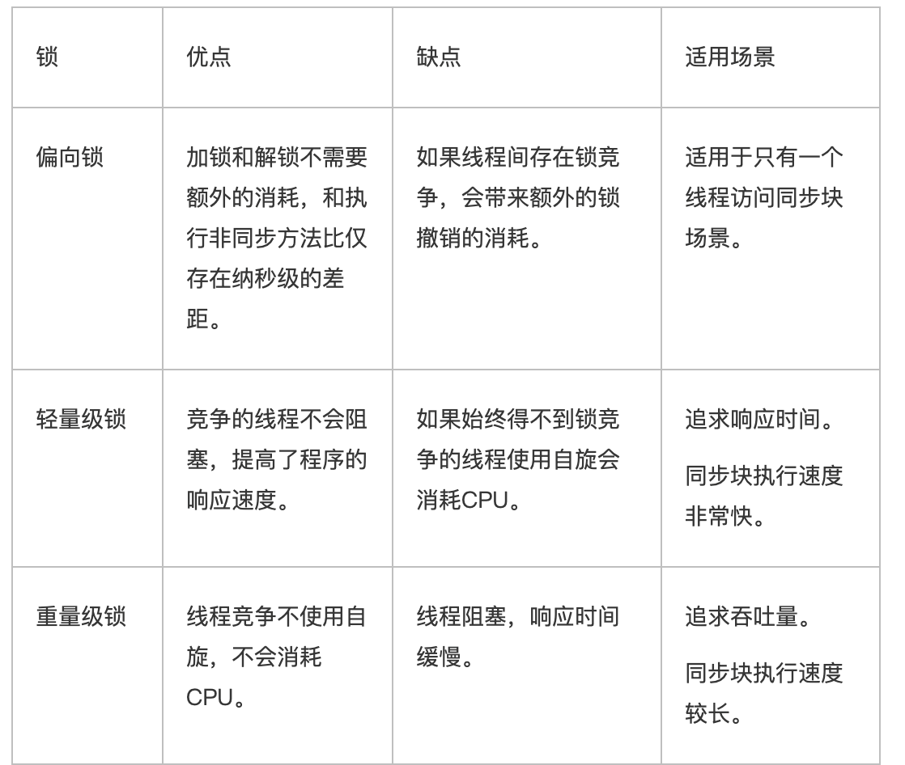

之前的学习中知道在多线程的时候，**发生线程问题主要是在进行线程上下文切换的时候，指令发现错位而导致的。**

而接近这样的问题**锁**是一个方法

---

#### 解决避免临界区的竞态条件发生，有多种方式

* 阻塞式的解决方案 `synchrized`， 对象锁
* 非阻塞式的解决方案 `原子变量`

#### `synchroized防止线程问题`

`synchroized` 俗称对象锁，它采用互斥的方式让同一个时刻最多只有一个线程持有[对象锁]，其他线程在想获得这个[对象锁]时候就会阻塞住，这样就能保证拥有锁的线程可以安全的执行临界区内的代码，不用担心线程上下文切换

```java
synchroized(对象) {
  临界区(受保护的代码区域), 这个区域中的代码是原子性的，
}
凡是会用到临界区的线程，都需要对对象进行加锁，这样才能保证原子性
```

* `synchronized(对象) `中的对象，可以想象为一个房间`(room)`，有唯一入口(门)房间只能一次进入一人 进行计算，线程 t1，t2 想象成两个人
* 当线程 t1 执行到 `synchronized(room)` 时就好比 t1 进入了这个房间，并锁住了门拿走了钥匙，在门内执行`count++ `代码
* 这时候如果 t2 也运行到了 `synchronized(room) `时，它发现门被锁住了，只能在门外等待，发生了上下文切 换，阻塞住了 

这点也恰好说明，`synchronized` 的效率低下(**可以是异常而解锁，也可以是执行完代码之后解锁**)

* 这中间即使 t1 的 `cpu` 时间片不幸用完，被踢出了门外(不要错误理解为锁住了对象就能一直执行下去哦)， 这时门还是锁住的，t1 仍拿着钥匙，t2 线程还在阻塞状态进不来，只有下次轮到 t1 自己再次获得时间片时才 能开门进入
* 当 t1 执行完 `synchronized{}` 块内的代码，这时候才会从 `obj` 房间出来并解开门上的锁，唤醒 t2 线程把钥 匙给他。t2 线程这时才可以进入 `obj` 房间，锁住了门拿上钥匙，执行它的 `count--` 代码

```java
public class SynchronizedM {
    private static class Room {
        private int counter = 0;

        public void increment() {
            synchronized (this) {
                counter++;
            }
        }

        public void decrease() {
            synchronized (this) {
                counter--;
            }
        }

        public int getCounter(){
            synchronized (this) {
                return counter;
            }
        }
    }

    static Object lock = new Object();

    public static void main(String[] args) throws InterruptedException {

        Room room = new Room();

        Thread thread = new Thread(() -> {
            for (int i = 0; i < 500; i++) {
                room.increment();
            }
        });

        Thread thread2 = new Thread(() -> {
            for (int i = 0; i < 500; i++) {
                room.decrease();
            }
        });

        thread.start();
        thread2.start();

        thread.join();
        thread2.join();

        System.out.println(room.getCounter());
    }
}
```

为什么使用`synchronized` 就能够防止`线程问题呢`。从`时序图` 来解释这个问题。


而加了 `sychronized `


`synchronized` 实际是用对象锁保证了**临界区内代码的原子性**，临界区内的代码对外是不可分割的，不会被线程切换所打断。

* 如果把 `synchronized(obj)` 放在 `for` 循环的外面，如何理解?-- 原子性

*  如果 `t1 synchronized(obj1)` 而 `t2 synchronized(obj2)` 会怎样运作?

  >  那就没有作用了，因为二者是使用2把不同的锁，保护共享资源，多个线程锁住的是同一个对象

* 如果 `t1 synchronized(obj)` 而 t2 没有加会怎么样?如何理解?

  >  和第二个情况差不多，可以参考时序图分析。

#### sychronized 方法加载到方法上

```java
class Test {
  public sychronized viod test(){}
}

// 等价于 Test 对象
class test {
  public viod test(){
    sychronized(this) {
      
    }
  }
}


class Test {
  public sychronized static viod test(){}
}

等价于锁住了类对象
class test {
  public viod test(){
    sychronized(Test.this) {
      
    }
  }
}
```

不加`synchronized `的方法，好比是不遵守规则的人，不去老实排队。破坏规则而行。

#### 题目线程八锁，synchronized 锁住了那个对象

第一题

```java
public class SynchronizedM2 {

    private static class Number {
        /*
            synchronized 锁住的是 Number 对象
         */
        public synchronized void a() {
            System.out.println("a");
        }

        /*
            synchronized 锁住的是 Number 对象
         */
        public synchronized void b() {
            System.out.println("B");
        }
    }
    public static void main(String[] args) {

        Number number = new Number();

        Thread thread = new Thread(() -> number.a());
        Thread thread1 = new Thread(() -> number.b());
        
        /*
            调用 number 的a 和 b 方法锁住的嗾使 number 对象
            切换下面的执行顺序，那么打印出来的东西是不一样的
         */

        thread1.start();
        thread.start();
    }
}
```

第二题

```java
public class SynchronizedM2 {

    private static class Number {
        /*
            synchronized 锁住的是 Number 对象
         */
        public synchronized void a() {
            try {
                Thread.sleep(1000);
            } catch (InterruptedException e) {
                e.printStackTrace();
            }
            System.out.println("a");
        }

        /*
            synchronized 锁住的是 Number 对象
         */
        public synchronized void b() {
            try {
                Thread.sleep(1000);
            } catch (InterruptedException e) {
                e.printStackTrace();
            }
            System.out.println("B");
        }

        public void c() {
            System.out.println("c");
        }
    }

    public static void main(String[] args) {

        Number number = new Number();

        Thread thread = new Thread(() -> number.a());
        Thread thread1 = new Thread(() -> number.b());
        Thread thread2 = new Thread(() -> number.c());

        /*
            调用 number 的a 和 b 方法锁住的嗾使 number 对象
            切换下面的执行顺序，那么打印出来的东西是不一样的
         */

        thread1.start();
        thread.start();
        thread2.start();
    }
}
```

这里c没有加锁，而a 和b都加了所，所以c 会首先直接就打印出来了，然后在是a 和 b 方法

第三题

```java
Number number = new Number();
Number number1 = new Number();

Thread thread = new Thread(() -> number.a());
Thread thread1 = new Thread(() -> number1.b());

thread.start();
thread1.start();
```

thread 和 thread1 分别锁了不同的对象，两个线程直接是没有互斥关系的

第五题

```java
public class SynchronizedM2 {

    private static class Number {
        /*
            synchronized 锁住的是 Number 类对象
         */
        public static synchronized void a() {
            System.out.println("a");
        }

        /*
            synchronized 锁住的是 Number 对象
         */
        public synchronized void b() {
            System.out.println("B");
        }

    }

    public static void main(String[] args) {

        Number number = new Number();

        Thread thread = new Thread(() -> number.a());
        Thread thread1 = new Thread(() -> number.b());

        thread.start();
        thread1.start();
    }
}
```

锁的对象是不同的，所以2个线程直接也是没有竞争关系的

第六题

```java
public class SynchronizedM2 {

    private static class Number {
        /*
            synchronized 锁住的是 Number 类对象
         */
        public static synchronized void a() {
            System.out.println("a");
        }

        /*
            synchronized 锁住的是 Number 对象
         */
        public synchronized void b() {
            System.out.println("B");
        }

    }

    public static void main(String[] args) {

        Number number = new Number();
 				Number number1 = new Number();
        Thread thread = new Thread(() -> number.a());
        Thread thread1 = new Thread(() -> number1.b());

        thread.start();
        thread1.start();
    }
}
```

也是没有竞争的

第七题

```java
public class SynchronizedM2 {

    private static class Number {
        /*
            synchronized 锁住的是 Number 类对象
         */
        public static synchronized void a() {
            System.out.println("a");
        }

        /*
            synchronized 锁住的是 Number 类对象
         */
        public static synchronized void b() {
            try {
                Thread.sleep(2000);
            } catch (InterruptedException e) {
                e.printStackTrace();
            }
            System.out.println("B");
        }

    }

    public static void main(String[] args) {

        Number number = new Number();
        Number number1 = new Number();

        Thread thread = new Thread(() -> number.a());
        Thread thread1 = new Thread(() -> number1.b());

        thread.start();
        thread1.start();
    }
}
```

2个线程的都是调用静态方法，都是 Number 的类对象，所以二者之间有竞争的

---

#### 变量的线程安全分析

##### 成员变量和静态变量是否线程安全

**共享的读写变了是线程不安全的。**

* 如果它们没有共享，则线程安全
* 如果它们被共享了，根据它们的状态是否能够改变，又分为2中情况
  * 如果只有读操作，则线程安全
  
  * 如果有读写操作，则代码是临界区，则需要考虑线程安全
  
    ```java
    package thread.b.chapt05;
    
    import java.util.ArrayList;
    import java.util.Arrays;
    
    public class CommonShareUnsafe {
        static class ThreadUnsafe {
    
            public static ArrayList<Integer> list = new ArrayList<>();
    
            public void method() {
                for (int i = 0; i < 10; i++) {
                    method2();
                    method3();
                }
    
            }
    
            public static void method2() {
                list.add(1);
            }
    
            public static void method3() {
                list.remove(0);
            }
        }
        public static void main(String[] args) {
            ThreadUnsafe threadUnsafe = new ThreadUnsafe();
            for (int i = 0; i < 100; i++) {
                new Thread(() -> {
                    threadUnsafe.method();
                }).start();
            }
    
            System.out.println((threadUnsafe.list));
    
        }
    }
    
    // 如果将上面的代码做简单变化，就是线程安全的了
    // 每个线程独享一份 list，就变成了局部变量内部变量，线程安全
    // 
    ...
            public void method() {
    				  public  ArrayList<Integer> list = new ArrayList<>();
                for (int i = 0; i < 10; i++) {
                    method2();
                    method3();
                }
            }
    ...
    ```
  

##### 局部变量是否线程安全

* 局部变量是线程安全的

  ```java
   public static void test1() { 
     int i = 10;
  	 i++; 
   }
  // i 是线程安全的
  ```

  每个线程调用 `test1() `方法时局部变量 i，会在每个线程的栈帧内存中被创建多份，因此不存在共享

* 但是局部变量引用的对象则未必
  * 如果对象没有逃离方法作用访问，则是安全的(变量在栈中，是线程独有的)
  * 如果对象逃离方法的作用范围(`return` 返回)，或者传到方法中，且这个方法是多个线程调用的，也就是发发发生了资源共享，则需要考虑线程安全问题

---

#### 场景线程安全类型

* `String`
* `Integer`
* `StringBuilder`
* `Random`
* `Vector`
* `Hashtable`
* `java.utils.concurrent `包下的类

他们的每个方法是原子的，

但是注意他们多个方法组合不是原子的

```java
HashTable table = new HashTable()
if (table.get('key') == null) {
  table.put('key', value) 
}
```

`get` 和 `put` 都是原子的，但是二者组合起来可能就会发生线程安全，如上面的3行代码和2行代码，可能会发生指令错乱。在2个线程执行上面的代码的是会发生


`String` 和 `Integer` 是不可变的，只能读不能改，所以是线程安全的。

如下的代码 `conn` 就是线程不安全的


因为上面的是`spring` 的`bean` 所以是单例的，当一个线程调用 `update` 的时候，刚刚创建了一个 `conn`但是另外一个线程这回拿走了锁，并且调用到了 `conn.close` 方法，当再回到之前的线程的时候那么`conn == null`

##### 外星方法

```java
public abstract class Test {
	public void bar() { // 是否安全
			SimpleDateFormat sdf = new SimpleDateFormat("yyyy-MM-dd HH:mm:ss"); 
  		foo(sdf);
	}
  
	public abstract foo(SimpleDateFormat sdf);
  
	public static void main(String[] args) { 
    new Test().bar();
	} 
}

// 上面的代码在多线程下第10行就会由问题出现，因为调用的 bar() 方法就不是线程安全的
// 其中 foo 的行为是不确定的，可能导致不安全的发生，被称之为外星方法
```

这也可以理解为什么 `String` 类被申明为 `final` 的就是防止子类修改`Strinig` 中的方法，从而导致`String` 的方法的行为发生改变，变为不安全的。

#### 经典的习题，回顾

##### 卖票

```java
package thread.b;

import java.util.ArrayList;
import java.util.List;
import java.util.Random;
import java.util.Vector;

public class SellTicket {

    static Random random = new Random();

    static class TicketWindow {
        private int count;

        public TicketWindow(int count) {
            this.count = count;
        }

        // sell 方法对共享变量读写，
        public int sell(int amount) {
            if (amount <= this.count) {
                this.count = this.count - amount;
                return this.count;
            }
            return 0;
        }
    }

    public static void main(String[] args) throws InterruptedException {


        TicketWindow window = new TicketWindow(1000);
        List<Integer> selloutAmount = new Vector<>();
        List<Thread> threads = new ArrayList<>();

        for (int i = 0; i < 400; i++) {
            Thread thread = new Thread(() -> {
                // 存在线程问题，多个线程访问同一个共享变量
                int sell = window.sell(randomAmount());
                try {
                    Thread.sleep(randomAmount()); // 增加指令混乱可能性
                } catch (InterruptedException e) {
                    e.printStackTrace();
                }
                // Vector.add 是安全的方法
                selloutAmount.add(sell);
            });

            // 这里不存在安全问题，因为只是在主程序中使用
            threads.add(thread);
            thread.start();
        }

        for (Thread thread : threads) {
            thread.join();
        }

        System.out.println("余票 " + window.count);
        System.out.println("卖出去的票 " + selloutAmount.stream().mapToInt(ii->ii).sum());
    }

    public static int randomAmount() {
        return random.nextInt(5) + 1;
    }
}

// 并没有复现出来问题 余票 + 卖出去的票 != 1000

// 修改
// sell 方法对共享变量读写，
public synchronized int sell(int amount) {
  if (amount <= this.count) {
    this.count = this.count - amount;
    return amount;
  }
  return 0;
}
```

##### 转账

```java
package thread.b;

import java.util.Random;

public class TranferMoney {

    static Random random = new Random();

    static class Account {
        private int money;

        public Account(int money) {
            this.money = money;
        }

        public void setMoney(int money) {
            this.money = money;
        }

        public int getMoney() {
            return money;
        }

        public void transfer(Account account, int amount) {
            if (this.money >= money){
                this.money = this.money - amount;
                account.setMoney(account.getMoney() + amount);
            }
        }
    }

    public static int randomAmount() {
        return random.nextInt(5) + 1;
    }

    public static void main(String[] args) throws InterruptedException {
        Account account1 = new Account(1000);
        Account account2 = new Account(1000);

        Thread thread = new Thread(() -> {
            for (int i = 0; i < 100; i++) {
                account1.transfer(account2, randomAmount());
            }
        });

        Thread thread2 = new Thread(() -> {
            for (int i = 0; i < 100; i++) {
                account2.transfer(account1, randomAmount());
            }
        });

        thread.start();
        thread2.start();

        thread.join();
        thread2.join();

        System.out.println("account1 " + account1.money);
        System.out.println("account2 " + account2.money);
        System.out.println("total " + (account1.money + account2.money));
    }
}

// account1 999
// account2 992
// total 1991
// 转来转去，总金额变少了

// 找到共享变量this.money
// 以及临界区 transfer 方法
// 且是2个 Account 上个两个临界区的
// 这里直接将 Account.class 锁住可以解决

... 
        public void transfer(Account account, int amount) {
            synchronized (Account.class) {
                if (this.money >= money){
                    this.money = this.money - amount;
                    account.setMoney(account.getMoney() + amount);
                }
            }
        }
...
```

---

#### synchronized 底层

`Java` 对象中会放着三部分数据

* `object Head(64bit)`
* `MarkHead(32bit)`
* `klass Word(32bit)`

`MarkHead(32bit)` 结构

* `hashcode` 是对象的`hashcode` 值

* `age`： `GC` 的分代年龄

* `biased_lock`： 是不是偏向锁
* `01`： 是锁的状态，可以是 `01/00/10/11`分别代表不同的锁


对象使用 `synchronized` ，那么就会给对象加一把锁。

##### Monitor


锁的监视器，也称为**管程**，每个`Java` 对象在对象头的`markword` 位置 都会有一个指针指向一个`Monitor` 对象(操作系统提供的)，如果使用 `synchronized` 给对象上锁(重量锁)之后，该对象头的`mark word` 中就被设置指向`Monitor `对象的指针。

1. 刚开始`Monitor` 中的 `Owner` 为`null`

2. 当 `thread2` 执行 `synchronized(obj)` 之后，将`Moniotor` 的所有这的 `Owner `设置为` thread2` ，` Monitor` 中只能有一个 `Owner`

3. 在`thread2` 上锁的过程中，如果有 `thread3 thread4` 也来执行 `synchronized(obj)`，这些线程就会进入到 `EntryList `并`BLOCKED`

4. 当 `thread2` 执行结束，那么`Owner` 就空出来了，然后在 `EntryList` 中的线程就会去**竞争** `Owner`，竞争出来的线程就是新的 `Owner`代码执行

5. 如果在锁里面抛出了异常，也是会将锁释放。
6. 所以使用  `synchronized`加锁之后，可以是异常而解锁，也可以是执行完代码之后解锁， 时间片用完不会释放锁，下次还是这个线程进入临界界区

`synchronized`的工作方式，是给对象添加一个 `monitor`，真正发挥锁机制的是这个`monitor`,而且这个`monitor` 是由操作系统提供的`Mutex Lock`来实现的，**而操作系统实现线程之间的切换这就需要从用户态转换到核心态**，这个成本非常高，状态之间的转换需要相对比较长的时间，这就是为什么`Synchronized`效率低的原因。

##### 轻量级锁/偏向锁

所做的优化就是减轻上面的**重量**

锁的状态总共有四种：**无锁状态、偏向锁、轻量级锁和重量级锁**。随着锁的竞争，锁可以从偏向锁升级到轻量级锁，再升级的重量级锁（但是锁的升级是单向的，也就是说只能从低到高升级，不会出现锁的降级）

轻量级锁并不是用来代替重量级锁的，它的**本意是在没有多线程竞争的前提下，减少传统重量级锁的性能消耗**，所**以轻量级锁使用的场景是线程交替执行同步代码块的情况下**，如果存在同一个时间多个线程访问同一个锁的情况下，就会导致锁膨胀为重量级锁。

```java
static final Object obj = new Object();
public static void method1() {
  sychronized(obj) {
    method2
    // 同步块
  }
}

public static void method2() {
  sychronized(obj) {
    // 同步块
  }
}
```

上面的代码加锁的过程如下：

创建锁记录对象，每个线程的栈帧都会包含一个锁记录的结构，内部可以存储锁定对象的 mark Word，当执行到第4行代码的时候


锁记录中的 `Object reference` 执向锁对象，并尝试使用 `cas` 替换`Object` 的 `MarkWord`， 将 `mw` 的值存入到锁记录中


其中`00`就是代表轻量级锁的状态(`mark word` 中的规定)，交换结果(注意交换的内容)，表示已经加锁


这个 时候对象中就放着栈 帧中的锁的地址，说明这个对象以及被一个线程多对应。

* cas 失败
  * 如果其他的线程已经持有了该 `Object`的轻量级锁，这个时候表明有竞争，那么就会进入锁膨胀过程 。

代码中执行到10 行的时候，对`object` 又进行了加锁，这也就是发生了**锁重入**


这个时候栈顶的栈帧中的锁记录就是`null`，因为交换会失败 ，本来就还是在同一个线程中，这个失败是可以的，这种情况叫做，**sychronized重入**(每个栈帧都有`lockRecord`并记录锁对象wm`地址，也就是会发生 `cas`，当发现`wm`已经被本线程的`lockreference`占用，那么设置为`null`)。

解锁的过程就比较简单，按照出栈，当锁记录为`null` 直接退出，如果锁记录不为空，那么 `cas`恢复 `mark word`

如果解锁 失败，那么久会锁膨胀 ，然后进入到 重量锁中。

##### 锁膨胀

如果在尝试加轻量级锁的过程是，`cas` 操作失败，这时候另外一种情况就是有其他线程为层次对象加上了轻量锁，产生了竞争，那么就会发送锁膨胀，然后就是升级为膨胀。


* 这个时候 `object`  会去申请` Monitor` 锁，让`Object` 指向重量级锁
* 然后自己进入到 `monitor` 的` EntryList`


当 `thread-0` 退出同步锁时候，使用`cas` 将 `mark word` 的值恢复 给对象头 ，这个时候回进入重量锁流程，安装`Monitor` 地址找到`Monitor` 对象，设置 `Owner` 为 `nul`l，唤醒`EntryList`中的`BLOCKED 线程`。

#### 自旋优化

当轻量锁升级重量锁的时候，暂时先不升，竞争的这个线程先等等 ，如果在等的这个过程中刚好对象被解锁了，那么竞争线程就刚刚好获得了锁对象，这个等待的过程就是 自旋优化。自旋是会占CPU的，而且这个过程也是智能的，如果在过去时间发生了的自旋优化，好几次都成功了的，那么后续就会多自旋几次。

#### 偏向锁

轻量级锁在没有竞争的时候，每次重入都需要执行`CAS` 操作。(并行9 图解，每次重入都会产生一个锁记录，并这个锁记录尝试去替换对象锁的`markword`，后续的替换替换的结果为`null`)。

`Java6` 中对轻量级锁做了经一部优化，只有第一层次 使用CAS 将线程ID设置到对象的`MARK Word` 头，之后发现这个线程ID 是自己的将表示没有竞争，不用重新`CAS`，以后只要不发生竞争，这个对象就归该线程所有。(从名字上理解，这个对象就偏向我这个线程)

`JVM` 默认是开启偏向锁的。

当有线程竞争的时候，偏向锁也会升级为重量锁

---




可以将`synchronized` 的`monitor` 理解为一个房间。

1.  `enter`:  多个线程进入到等待的房间
2. 其中一个线程获取到了这把锁，也就是可以进入到房间中了。
3. 如果进入房间的线程调用了`wait` 方法，那么该线程就如到`wait set`，释放了当前锁，也就是退出了房间，有其他线程可以再进入房间
4. 如果其他的线程调用了`notify` 那么就将 `wait set` 中的线程唤醒，然后`wait set` 中的线程会竞争进入房间/获得锁
5. 一个线程执行结果，出了这个房间，释放锁。

> 在第4步骤的时候，线程在调用`notify` 的时候一般会在临界区代码块的最后，执行完代码，释放锁，然后被唤醒的`wait set` 中的线程在次进入真枪锁

`monitor` 是操作系统的`mutex` 实现的，`Java` 线程是对操作系统线程的一个映射，每当挂起唤醒一个线程都需要有操作系统内核态，所以有了偏向锁和轻量锁的优化。

