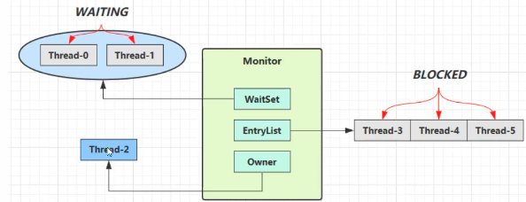

#### 原理



* `owner` 线程发现条件不满足，调用`wait` 方法，即可进入到 `waitSet` 中，并将线程的状态变为 `WAITING `
* `BLOCKED`  和 `WAITING` 的线程都处于阻塞状态， 不会占用 `cpu` 资源
* `BLOCKED` 线程会在` owner` 线程释放锁的时候被唤醒
* `WAITING` 线程会在`Owner` 线程调用 `notify` 或者 `notifyall `时候唤醒，但是唤醒并不意味着立即获得锁，扔需要进如 `EntryList` 重新竞争锁

#### API 简绍

* `Obj.wait() `进入 `object` 监视器的线程进入到 `waitset` 等待
* `obj.notify() `在 `object` 上正在 `waitSet `等待的线程中条一个唤醒
* `obj.notifyAll()` 在 `object` 上正在 `waitSet` 等待的所有线程都唤醒

它们是线程直接进行协作的手段，**都属于 `object` 对象的方法，必须获得此对象的锁，成为了 `owner `才能调用这几个方法**

```java
public class WaitAndNotify {
   static final Object lock =  new Object();
    public static void main(String[] args) throws InterruptedException {
        lock.wait();
    }
}
```

上面这段代码是会报错的(`IllegalMonitorStateException`)，因为lock 并不是owner, 下面的代码是正确的

```java
public class WaitAndNotify {
   static final Object lock =  new Object();
    public static void main(String[] args) throws InterruptedException {
        synchronized (lock) {
            lock.wait();
        }
    }
}
```

混合使用

```java
public class WaitAndNotify {
   static final Object lock =  new Object();
    public static void main(String[] args) throws InterruptedException {
        Thread t1 = new Thread(() -> {
            synchronized (lock) {
                System.out.println("t1 执行。。。");
                try {
                    lock.wait();
                } catch (InterruptedException e) {
                    e.printStackTrace();
                }
                System.out.println("t1 执行其他代码");
            }
        }, "t1");
        t1.start();

        Thread t2 = new Thread(() -> {
            synchronized (lock) {
                System.out.println("t2 执行。。。");
                try {
                    lock.wait();
                } catch (InterruptedException e) {
                    e.printStackTrace();
                }
                System.out.println("t2 执行其他代码");
            }
        }, "t2");

        t2.start();
        Thread.sleep(2000);
        System.out.println("main 获得锁。唤醒其他线程");
        synchronized (lock) {
//            lock.notify();
            lock.notifyAll();
        }
    }
}
```

`Wait() `表示无限制的等待下去

`wait(时间)` 时间范围内等待，如果这么长时间没有被唤醒那么向下执行

----

#### wait && notify 使用正确姿势

##### sleep 和 wait 区别

* `Sleep` 是` Thread` 方法，`wait` 是 `object` 方法
* `sleep`不需要强制和 `sychronized` 配合使用，而 `wait` 需要
* `sleep` 在睡眠的同时，不会释放对象锁，但是 `wait` 在等待的时候回释放对象锁
* 二者的状态是一样的，都是 `TIMEED_WAITING`

```java
synchronized(lock) {
  while(条件){
    lock.wait()
  }
}

synchronized(lock) {
  lock.notifyAll
}
```

使用`sleep`

```java
package thread.b;

public class Test13 {
    static final Object room = new Object();
    private static boolean hasCig = false;
    private static boolean ahsTakeout = false;

    public static void main(String[] args) {
        new Thread(() -> {
            synchronized (room) {
                System.out.println("【小南】" + "烟送到了么 " + hasCig);

                if (!hasCig) {
                    try {
                        System.out.println("【小南】没有烟，先歇会");
                        Thread.sleep(2000);
                        // sleep 不会释放锁，所以这里小南在等待的时候，其他线程是不能干活的
                        // 一直阻塞的
                    } catch (InterruptedException e) {
                        e.printStackTrace();
                    }

                    System.out.println("【小南】" + "烟送到了么 " + hasCig);
                    if (hasCig) {
                        System.out.println("【小南】" + "可以开始干活了");
                    }
                }
            }
        }, "小南").start();


        for (int i = 0; i < 5; i++) {
            new Thread(() -> {
                synchronized (room) {
                    System.out.println("【其他人】可以开始干活了");
                }
            }, "其他人").start();
        }

        try {
            Thread.sleep(1000);
        } catch (InterruptedException e) {
            e.printStackTrace();
        }

        new Thread(() -> {
            // 这里不能加 synchronized，如果开启 synchronized
            // 因为小南一直持有锁，这里送烟人是无法送烟到的
            System.out.println("【送烟人】烟送到了");
            hasCig = true;
        }).start();
    }
}
// 问题是在代码中
【小南】烟送到了么 false
【小南】没有烟，先歇会
【送烟人】烟送到了
【小南】烟送到了么 true
【小南】可以开始干活了
【其他人】可以开始干活了
【其他人】可以开始干活了
【其他人】可以开始干活了
【其他人】可以开始干活了
【其他人】可以开始干活了
```

`wait 和 notify` 修改上面代码

```java
package thread.b;

public class Test131 {
    static final Object room = new Object();
    private static boolean hasCig = false;
    private static boolean ahsTakeout = false;

    public static void main(String[] args) {
        new Thread(() -> {
            synchronized (room) {
                System.out.println("【小南】" + "烟送到了么 " + hasCig);

                if (!hasCig) {
                    try {
                        System.out.println("【小南】没有烟，先歇会");
                        room.wait(); // 会释放锁
                    } catch (InterruptedException e) {
                        e.printStackTrace();
                    }

                    System.out.println("【小南】" + "烟送到了么 " + hasCig);
                    if (hasCig) {
                        System.out.println("【小南】" + "可以开始干活了");
                    }
                }
            }
        }, "小南").start();


        for (int i = 0; i < 5; i++) {
            new Thread(() -> {
                synchronized (room) {
                    System.out.println("【其他人】可以开始干活了");
                }
            }, "其他人").start();
        }

        try {
            Thread.sleep(1000);
        } catch (InterruptedException e) {
            e.printStackTrace();
        }

        new Thread(() -> {
            synchronized (room) {
                System.out.println("【送烟人】烟送到了");
                hasCig = true;
                room.notify();
            }
        }).start();
    }
}
【小南】烟送到了么 false
【小南】没有烟，先歇会
【其他人】可以开始干活了
【其他人】可以开始干活了
【其他人】可以开始干活了
【其他人】可以开始干活了
【其他人】可以开始干活了
【送烟人】烟送到了
【小南】烟送到了么 true
【小南】可以开始干活了
  输出可以看出，小南在等待的时候，释放了锁，其他人可以干活
```

`wait 和 notify` 中的虚假唤醒问题

```java
package thread.b;

public class Test132 {
    static final Object room = new Object();
    private static boolean hasCig = false;
    private static boolean ahsTakeout = false;

    public static void main(String[] args) {
        new Thread(() -> {
            synchronized (room) {
                System.out.println("【小南】" + "烟送到了么 " + hasCig);

                if (!hasCig) {
                    try {
                        System.out.println("【小南】没有烟，先歇会");
                        room.wait();
                    } catch (InterruptedException e) {
                        e.printStackTrace();
                    }
										// 虚假唤醒，会执行完这里的代码
                    System.out.println("【小南】" + "烟送到了么 " + hasCig);
                    if (hasCig) {
                        System.out.println("【小南】" + "可以开始干活了");
                    } else {
                        System.out.println("【小南】" + "干不了活了");
                    }
                }
            }
        }, "小南").start();


        new Thread(() -> {
            synchronized (room) {
                System.out.println("【小女】" + "外卖送到了么 " + ahsTakeout);

                if (!hasCig) {
                    try {
                        System.out.println("【小女】外卖送到了么，先歇会");
                        room.wait();
                    } catch (InterruptedException e) {
                        e.printStackTrace();
                    }

                    System.out.println("【小女】" + "外卖送到了么 " + ahsTakeout);
                    if (ahsTakeout) {
                        System.out.println("【小女】" + "外卖送到了,开始干活");
                    } else {
                        System.out.println("【小女】" + "外卖没送到，干不了活了");
                    }
                }
            }
        }, "小女").start();

        try {
            Thread.sleep(1000);
        } catch (InterruptedException e) {
            e.printStackTrace();
        }

/*
  notify：虚假唤醒，这里可能会将 小南唤醒，但是唤醒之后小南线程的执行逻辑还是不正确的
  notifyAll：唤醒所有，但是唤醒的逻辑可能会满足不了，唤醒也没有如这里的 小南的烟还没有的
  这个时候不能使用 线程解决，应该是从代码逻辑上解决，如将小南线程if 条件边为 while 条件
*/
        new Thread(() -> {
            // 这里不能加 synchronized
            synchronized (room) {
                System.out.println("【送外卖的】送外卖");
                ahsTakeout = true;
                room.notifyAll();
                // 这里可能会将小南和小女任何一个叫醒，其实我们只想叫醒小女
                // 小南这里会存在虚假唤醒
            }
        }).start();
    }
}
```

`while` 解决虚假唤醒

```java
package thread.b;

public class Test133 {
    static final Object room = new Object();
    private static boolean hasCig = false;
    private static boolean ahsTakeout = false;

    public static void main(String[] args) {
        new Thread(() -> {
            synchronized (room) {
                System.out.println("【小南】" + "烟送到了么 " + hasCig);

                while (!hasCig) {
                    try {
                        System.out.println("【小南】没有烟，先歇会");
                        room.wait();
                    } catch (InterruptedException e) {
                        e.printStackTrace();
                    }
                }

                System.out.println("【小南】" + "烟送到了么 " + hasCig);
                if (hasCig) {
                    System.out.println("【小南】" + "可以开始干活了");
                } else {
                    System.out.println("【小南】" + "干不了活了");
                }
            }
        },"小南").start();


        new

    Thread(() ->

    {
        synchronized (room) {
            System.out.println("【小女】" + "外卖送到了么 " + ahsTakeout);

            if (!hasCig) {
                try {
                    System.out.println("【小女】外卖送到了么，先歇会");
                    room.wait();
                } catch (InterruptedException e) {
                    e.printStackTrace();
                }

                System.out.println("【小女】" + "外卖送到了么 " + ahsTakeout);
                if (ahsTakeout) {
                    System.out.println("【小女】" + "外卖送到了,开始干活");
                } else {
                    System.out.println("【小女】" + "外卖没送到，干不了活了");
                }
            }
        }
    },"小女").

    start();

        try

    {
        Thread.sleep(1000);
    } catch(
    InterruptedException e)

    {
        e.printStackTrace();
    }

/*
 notify：虚假唤醒，这里可能会将 小南唤醒，但是唤醒之后小南线程的执行逻辑还是不正确的
 notifyAll：唤醒所有，但是唤醒的逻辑可能会满足不了，唤醒也没有如这里的 小南的烟还没有的
 这个时候不能使用 线程解决，应该是从代码逻辑上解决，如将小南线程if 条件边为 while 条件
*/
        new

    Thread(() ->

    {
        // 这里不能加 synchronized
        synchronized (room) {
            System.out.println("【送外卖的】送外卖");
            ahsTakeout = true;
            room.notifyAll();
        }
    }).

    start();
}
}
```


