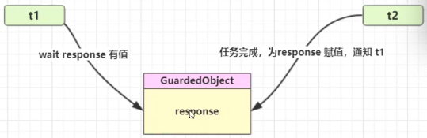
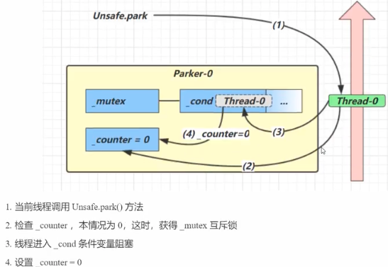
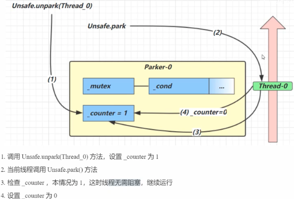

#### 同步模式之保护性暂停

> 就是`Guarded Suspension`，用在一个线程等待另一个线程的执行结果

#### 要点

* **如果有一个结果需要从一个线程传递到另外一个线程**，让他们关联到同一个 `GuardedObject`
* 如果有结果不断从一个线程到另外一个线程，那么可以使用消息队列(生产者/消费者)
* `JDK` 中 `join` 的实现，`Feature` 的实现，采用的就是此模式
* 因为要等待另一方的结果，因此归类到同步模式



```java
public class Test14 {
    private Object response;

    // 获取结果的方法
    public Object get() {
        synchronized (this) {
            while (response == null) {
                // 解决虚假唤醒
                try {
                    this.wait();
                } catch (InterruptedException e) {
                    e.printStackTrace();
                }
            }
            return response;
        }
    }

    public void complete(Object response) {
        synchronized (this) {
            this.response = response;
            this.notifyAll();
        }
    }

    public static void main(String[] args) {
        // 线程1等待线程2的下载结果
        Test14 test14 = new Test14();

        new Thread(() -> {
            System.out.println("t1 等待结果");
            Object o = test14.get();
            System.out.println("t1 获得结果");
            System.out.println(o);
        }).start();


        new Thread(() -> {
            System.out.println("t2 下载中。。。");
            try {
                Thread.sleep(2000);
            } catch (InterruptedException e) {
                e.printStackTrace();
            }

            test14.complete("t2 down load complete and return result");
        }).start();
    }
}
```

功能增强，增加解决死等问题，限制等待时间

```java
public class Test14 {
    private Object response;

    // 获取结果的方法
    public Object get(long timeout) {
        synchronized (this) {
            long begin = System.currentTimeMillis();
            long passTime = 0;
            while (response == null) {
                // 解决虚假唤醒
                try {
                    // 应该等待时间
                    long waitTime = timeout - passTime; // 这里逻辑有点秀啊
                    if (waitTime <= 0) {
                        System.out.println("等待时间到了，退出...");
                        break;
                    }
                    this.wait(waitTime);
                    System.out.println("被唤醒了，但是还没到拿到结果，且等待时间没到，继续等待： " + waitTime);
                    passTime = System.currentTimeMillis() - begin;
                    // 这里不能增加等待时间，因为就算加了等待时间，将这个线程唤醒
                    // 但是因为 response 还是 null，所以 while 中还是会进入到 等待
                } catch (InterruptedException e) {
                    e.printStackTrace();
                }
            }
            return response;
        }
    }

    public void complete(Object response) {
        synchronized (this) {
            this.response = response;
            this.notifyAll();
        }
    }

    public static void main(String[] args) {
        // 线程1等待线程2的下载结果
        Test14 test14 = new Test14();

        new Thread(() -> {
            System.out.println("t1 等待结果");
            Object o = test14.get(10000);
            System.out.println("t1 获得结果");
            System.out.println(o);
        }).start();


        new Thread(() -> {
            System.out.println("t2 下载中。。。");
            try {
                Thread.sleep(1000);
            } catch (InterruptedException e) {
                e.printStackTrace();
            }

            test14.complete("t2 down load complete and return result");
        }).start();
    }
}
// 可以通过 设置 test14.complete(null);
// 模拟虚假唤醒
```

#### Join

`join` 的方式就是保护性等待，不过`join`等待的是另外一个线程的结束，而不是等待另外一个线程返回结果

```java
public final synchronized void join(long millis)
    throws InterruptedException {
        long base = System.currentTimeMillis();
        long now = 0;

        if (millis < 0) {
            throw new IllegalArgumentException("timeout value is negative");
        }

        if (millis == 0) {
            while (isAlive()) {
                wait(0);
            }
        } else {
            while (isAlive()) {
                long delay = millis - now;
                if (delay <= 0) {
                    break;
                }
                wait(delay);
                now = System.currentTimeMillis() - base;
            }
        }
    }
```

上面的代码是 `join` 源代码，可以发现这里`join` 的实现就是我们上面的保护性暂停模式代码逻辑

---

#### GuardBox

```java
public class GuardTest {

    public static void main(String[] args) throws InterruptedException {
        for (int i = 0; i < 3; i++) {
            new People().start();
        }

        Thread.sleep(100);

        for (Integer integer : MailBox.getId()) {
            new Postman(integer, "内容 " + integer).start();
        }
    }

    static class GuardObject{

        private int id;

        public GuardObject(int id) {
            this.id = id;
        }

        public int getId() {
            return id;
        }

        private Object response;

        public Object get(long timeout) {
            synchronized (this) {
                long begin = System.currentTimeMillis();
                long passedTime = 0;

                while (response == null) {
                    long waitTime = timeout - passedTime;
                    if (waitTime <= 0) {
                        break;
                    }

                    try {
                        this.wait(waitTime);
                    } catch (InterruptedException e) {
                        e.printStackTrace();
                    }

                    passedTime = System.currentTimeMillis() - begin;
                }

                return response;
            }
        }

        public void complete(String mail) {
            synchronized (this) {
                this.response = mail;
                this.notifyAll();
            }
        }
    }

    // 中间解耦类，将 People 和 Postman 解耦
    static class MailBox {
        private static HashMap<Integer, GuardObject> box = new HashMap<Integer, GuardObject>();

        private static int id = 1;
        public static synchronized int generateId() {
            return id++;
        }

        public static GuardObject createGuardObj() {
            GuardObject object = new GuardObject(generateId());
            box.put(object.id, object);
            return object;
        }

        public static Set<Integer> getId() {
            return box.keySet();
        }

        public static GuardObject getObj(int id) {
            return box.remove(id);
        }
    }

    static class People extends Thread {
        @Override
        public void run() {
            GuardObject guardObject = MailBox.createGuardObj();
            System.out.println("收信前 People: " + guardObject.id);
            Object o = guardObject.get(5000);
            System.out.println("收到新 People: " + guardObject.id + "信内容：" + o);
        }
    }

    static class Postman extends Thread {
        private int id;
        private String mail;

        public Postman(int id, String mail) {
            this.id = id;
            this.mail = mail;
        }

        @Override
        public void run() {
            GuardObject obj = MailBox.getObj(this.id);
            System.out.println("Postman 送信：" + id + " 内容是： " + mail);
            obj.complete(this.mail);
        }
    }
}
```

上面的代码，需要`People` 和` Postman` 具有相同的数量， 且是同步的方式

保护性机制，通过 `MailBox` 使得`People` 和 `Postman`是一一对应的。因为在`new People` 的时候`new` 了三个 `MailBox`，而在使用的时候`Postman` 直接使用对应的 `MailBox`，也就是说一个`People` 和 `Postman` 对应了一个`MailBox`，所以说是 `People` 和 `Postman` 一一对应

---

#### 生产者消费者

这种模式下，线程两端的set 和 get 可以不一样，使用队列去维护，生产者只负责生产，不管如何消费，消费者只负责消费不管如何生产。是属于异步方式。

```java
package thread.b;

import java.util.LinkedList;

public class CustomerAndProducer {

    static final class Message {
        private int id;
        private String msg;

        public Message(int id, String msg) {
            this.id = id;
            this.msg = msg;
        }

        public int getId() {
            return id;
        }

        public String getMsg() {
            return msg;
        }
    }

    // java 线程之间的通信
    static class MessageQueue {
        private LinkedList<Message> list = new LinkedList<>();
        private int capacity;

        public MessageQueue(int capacity) {
            this.capacity = capacity;
        }

        // 获取消息
        public Message take() {
            System.out.println(Thread.currentThread().getName() + " 取一条消息");
            synchronized (list) {
                while (list.isEmpty()) {
                    System.out.println(Thread.currentThread().getName() + " 你要取内容的队列是空的");
                    try {
                        list.wait();
                    } catch (InterruptedException e) {
                        e.printStackTrace();
                    }
                }

                Message message = list.removeFirst();

                // 通知生产者，可以生产了
                list.notifyAll();
                return message;
            }
        }

        // 存入消息
        public void put(Message message) {
            System.out.println(Thread.currentThread().getName() + " 添加一个消息");
            synchronized (list) {
                while (list.size() == capacity) {
                    System.out.println(Thread.currentThread().getName() + " 你要取内容的队列已经满了");
                    try {
                        list.wait();
                    } catch (InterruptedException e) {
                        e.printStackTrace();
                    }
                }

                list.add(message);

                // 唤醒那些准备拿消息的消费者
                list.notifyAll();
            }
        }
    }

    public static void main(String[] args) {
        MessageQueue messageQueue = new MessageQueue(3);

        for (int i = 0; i < 3; i++) {
            int i1 = i;
            new Thread(() -> {
                messageQueue.put(new Message(i1, "内容" + i1));
            }, "生产者" + i).start();
        }

        new Thread(() -> {
            while (true) {
                try {
                    Thread.sleep(1000);
                } catch (InterruptedException e) {
                    e.printStackTrace();
                }
                Message message = messageQueue.take();
                System.out.println("获取消息 " + message.getMsg());
            }
        }, "消费者 1").start();

    }
}
```

---

#### park && unpark

```java
package thread.b;

import java.util.concurrent.locks.LockSupport;

public class ParkUnpark {

    /*
        LockSupport.park() 暂停当前线程
        LockSupport.unpark() 恢复某个线程的运行

     */
    public static void main(String[] args) {
        Thread t = new Thread(() -> {
            System.out.println("start,,,");
            try {
                Thread.sleep(1000);
            } catch (InterruptedException e) {
                e.printStackTrace();
            }

            System.out.println("park...");

            LockSupport.park(); // 对应的状态还是 WAIT 状态

            System.out.println("subThread resume");
        });

        t.start();
        System.out.println("主线程中将子线程重新启动");
        LockSupport.unpark(t);
    }
}
```

> 既可以在 `park` 之前调用，也可以在 `park` 之后调用
> 在 `park` 之前调用了 `unpark`，那么在线程未来 `unpark` 线程
>
> `unpark` 可以很精确的唤醒某个线程，而 `notify/notifyall` 并不能
>
> `wait notify/notifyall` 必须配合 `object monitor` 一起使用，
> 而 `park unpark` 不需要

##### 原理

> 每个线程都有一个 `Parker` 对象，由三部分组成
>
> 1. `_counter`
>
> 2. `_cond`
>
> 3. `_mutex`
>
> * 线程就像一个旅人，`Parker` 就像是他随身携带的背包，条件变量就好比背包中的帐篷，`_counter` 就好比背包中的备用干粮(0 为耗尽，1 为充足)
> * 调用 `park` 就是要看看需不需要停下来休息
>   * 如果备用干粮耗尽，那么钻进帐篷休息
>   * 如果备用干粮充足，那么不需要停留，继续前进(也就是先调用了`unpark` 在 `park` 之后会继续运行)
> * 调用 `unpark`, 就好比干粮充足
>   * 如果这时候线程还在帐篷，就唤醒让它继续前进
>   * 如果这时候线程还在运行，那么下次它调用 `park` 时候，仅仅消耗掉备用干粮，不需要停留继续前进
>     * 因为背包空间有限，多此调用 `unpark` 仅仅会补充一份备用干粮





