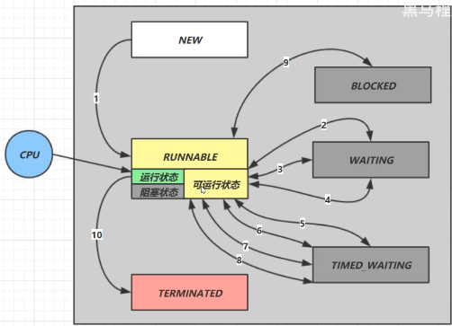

---

#### 先来回顾下之前学习到的各种线程上的API 方法

* wait/notify/notifyall
* LockSupport.park/unpark
* Sychronized/偏向锁和/轻量锁的优化
* join
* interrupt
* 了解Monitor 的概念
* 创建线程的3种方式
* 线程启动 start 和 run 区别
* 主线程和守护线程

##### 线程启动方法 Start 和 Run 方法的不同

> * .start 是启动了一个线程，将run 方法中的代码在新的线程中执行
> * .run 在主线程中执行run 方法中定义的代码

##### 线程优先级

> 在 cpu 时间片满负荷的时候，设置优先级并不会有任何效果
>
> 当cpu 的时间片比较轻松的时候，高优先级的代码会获得更大机会获得时间片

##### join

> 理解为什么要使用 join 
>
> > 主线程需要在子线程运行结束之后在运行，因为主线程需要子线程的运行结果
>
> ```java
> t1.start
> t2.start
> t1.join
> t2.join
> ```
>
> 当执行到第三行的时候，
>
> 主线程会先等待t1执行结束之后，这个时候t1,t2 线程都是已经跑起来了的，他们的状态都是RUNNING，t1,t2 和主线程这个时候的执行相互独立的，
>
> 但是主线程在第3行代码调用 join 那么主线程会停留在这里直到t1线程结束，
>
> 然后在运行到t2出，如果这个时候t2线程还没有结束，那么也要等待t2线程结束，主线程才能继续往下执行。

##### interrupt

> 用于打断 `sleep`/`wait`/`park` 方法
>
> 使得线程进入 `BLOCKED` 状态
>
> 其中如果程序的状态是 `isinterrupted=true`
>
> 那么在执行 `park` 方法是无效的

---



##### 6中状态的转换

* 情况1 **NEW -> RUNNABLE**

> 当线程刚刚被`new`出来，还没有调用 `start` 之前的状态是 `NEW`
>
> 调用 `start` 方法之后状态就变为了 `RUNNABLE`

* 情况2 **RUNNABLE <--> WAITING**

> 线程用 `sychronized(obj)` 获取了对象锁之后
>
> * 调用 `obj.wait` 线程会从 `RUNNABLE` 进入到 `WAITING`
> * 调用 `obj.notify/obj.notifyAll/interrupt` 时候
>   * 竞争锁成功，线程状态从 `WAIITING` 进入到 `RUNNABLE`
>   * 竞争锁失败，线程状态从 `WAITING`进入到 `BLOCKED`

* 情况3 **RUNNABLE <--> WAITING**

> 当前线程调用 `t.join` 方法，当前线程从 `RUNNABLE`  进入到 `WAITING`
>
> * 注意是当前线程在t线程对象的监示器上等待
>
> t 线程结束，或者调用当前线程的 `interrupt` 时候，当前线程从`WAITINIG` 进入到 `RUNNABLE`

* 情况4 **RUNNABLE <--> WAITING**

> 当前线程 `LockSupport.park`当前线程从 `RUNNABLE` 进入到 `WAITINIG`
>
> 当在调用 `LockSupport.unpark` 或者 `interrupt` 会让目标线程从 `WAITING` 进入到 `RUNNABLE`

* 情况5 **RUNNABLE <--> TIMED_WAITING**

> t 线程用 `synchronized(obj)` 获取了对象锁后
>
> * 调用 `obj.wait(long n)` 方法时，t 线程从 `RUNNABLE --> TIMED_WAITING`
>    t 线程等待时间超过了 n 毫秒，或调用 `obj.notify() ， obj.notifyAll() ， t.interrupt()` 时
>   * 竞争锁成功，t 线程从 `TIMED_WAITING --> RUNNABLE `
>   * 竞争锁失败，t 线程从 `TIMED_WAITING --> BLOCKED`

* 情况6 **RUNNABLE <--> TIMED_WAITING**

> 当前线程调用` t.join(long n)` 方法时，当前线程从 `RUNNABLE --> TIMED_WAITING` 注意是当前线程在t 线程对象的监视器上等待
>
> 当前线程等待时间超过了 n 毫秒，或t 线程运行结束，或调用了当前线程的` interrupt() `时，当前线程从 `TIMED_WAITING --> RUNNABLE`

* 情况7 **RUNNABLE <--> TIMED_WAITING**

> 当前线程调用 `Thread.sleep(long n)` ，当前线程从 `RUNNABLE --> TIMED_WAITING`
>
> 当前线程等待时间超过了 n 毫秒，当前线程从 `TIMED_WAITING --> RUNNABLE`

* 情况8 **RUNNABLE <--> BLOCKED**

> t 线程用 `synchronized(obj)` 获取了对象锁时如果竞争失败，从 `RUNNABLE --> BLOCKED`
>  持 obj 锁线程的同步代码块执行完毕，会唤醒该对象上所有 `BLOCKED` 的线程重新竞争，如果其中 t 线程竞争 成功，从` BLOCKED --> RUNNABLE` ，其它失败的线程仍然 `BLOCKED`

* 情况 9**RUNNABLE <--> TERMINATED **

> 当前线程所有代码运行完毕，进入 TERMINATED


