### 操作操作类

#### AtomicLong

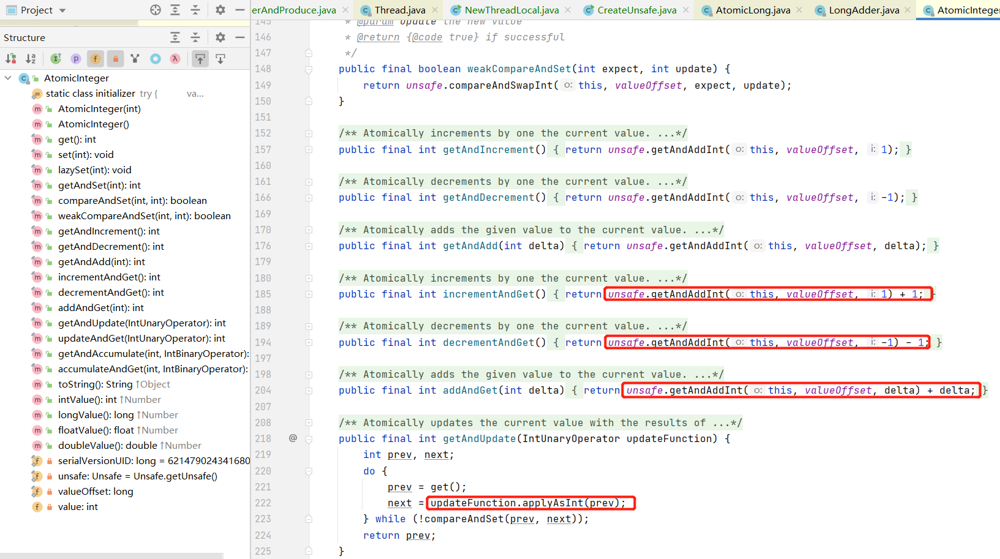

底层均是在调用`unsafe` 的接口。

---

#### LongAdder

`AtomicLong` 通过`CAS` 提供了非阻塞的原子性操作，相比阻塞同步器`synchronized` 性能要好很多，但是当在高并发大量线程时候会同步去竞争一个线程，更新一个原子变量，但由于只有一个线程的`cas` 会操作成功，造成大量其他线程竞争失败，这些线程会无限循环不断自旋尝试`CAS` 的操作，白白浪费`CPU` 资源。

> `AtomicLong` 的瓶颈是多个线程同时竞争一个变量产生。

`LongAdder` 的做法就是将一个变量分为多个变量，让同样多的线程去竞争多个资源

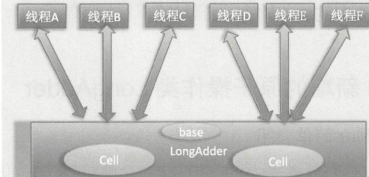

其原理如下：多个线程在修改值得时候，会去争夺多个`Cell` 修改`Cell` 中得值，每个`Cell` 中得初始值都是0，如果线程获取`Cell` 失败之后，会去争夺其他`Cell` 并修改。

当获取结果值得时候，将多个`Cell` 得值累加`base`， 然后返回。

`Cell` 得初值均是`null`(没有初始化，占内存)， 只有在使用得时候从`base` 获取然后初始化。

学习`LongAdder` 需要明白以下几个问题

* `LondAdder` 得结构是怎样得
* 当前线程应该访问`Cell`数组里面得哪一个`Cell` 元素。
* 如何初始化`Cell` 数组
* `Cell` 是如何扩容得
* 线程分配`Cell` 元素有冲突后如何处理
* 如何保证线程操作被分配得`Cell` 原子性


##### `LondAdder` 得结构是怎样得 & 如何保证线程操作被分配得`Cell` 原子性

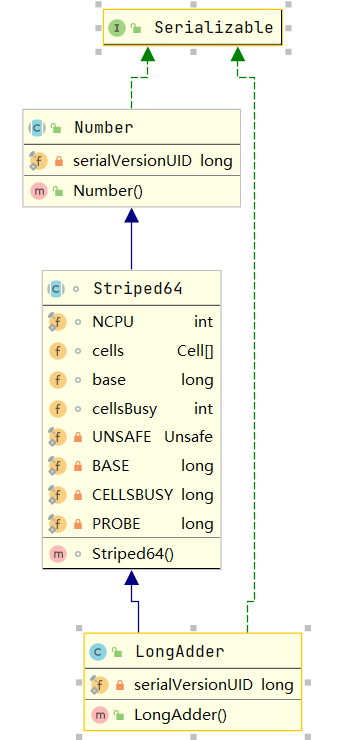

```java
@sun.misc.Contended static final class Cell {
    // 保证 cell 值得可见性
    volatile long value;
    Cell(long x) { value = x; }
    // 保证cell 值得原子性
    final boolean cas(long cmp, long val) {
        return UNSAFE.compareAndSwapLong(this, valueOffset, cmp, val);
    }

    // Unsafe mechanics
    private static final sun.misc.Unsafe UNSAFE;
    private static final long valueOffset;
    static {
        try {
            UNSAFE = sun.misc.Unsafe.getUnsafe();
            Class<?> ak = Cell.class;
            valueOffset = UNSAFE.objectFieldOffset
                (ak.getDeclaredField("value"));
        } catch (Exception e) {
            throw new Error(e);
        }
    }
}
```

##### `LongAdder` 中得其他方法

* 获取结果值

```java
public long sum() {
    Cell[] as = cells; Cell a;
    long sum = base;
    if (as != null) {
        for (int i = 0; i < as.length; ++i) {
            if ((a = as[i]) != null)
                sum += a.value;
        }
    }
    return sum;
}
```

这里再累加`cells` 得时候，并没有对其进行上锁，所以会有问题，获取结果值得时候，可能还有其他得线程在修改`cell`。

* 重置`Cell`

```java
public void reset() {
    Cell[] as = cells; Cell a;
    base = 0L;
    if (as != null) {
        for (int i = 0; i < as.length; ++i) {
            if ((a = as[i]) != null)
                a.value = 0L;
        }
    }
}
```

* add 方法，重要

```java
public void add(long x) {
    Cell[] as; long b, v; int m; Cell a;
    if ((as = cells) != null || !casBase(b = base, b + x)) { // 1
        // cells 为空，或者 cas 执行失败了，
        boolean uncontended = true;
        if (as == null || (m = as.length - 1) < 0 ||    // 2
           (a = as[getProbe() & m]) == null ||         // 3
           !(uncontended = a.cas(v = a.value, v + x))) // 4 cells 中存在，能拿到一个cell，然后对这个cell 做cas操作
           
            longAccumulate(x, null, uncontended);       // 5 cells为空，或者不为空，但是cas 执行失败了
    }
}

// 当前线程得 threadLocalRandom 获取一个随机数，值一开始是0，
static final int getProbe() {
    return UNSAFE.getInt(Thread.currentThread(), PROBE);
}

// getProbe 回答上面得第二个问题
// 以及对cell得操作都是 cas 操作，保证其得原子性，也再次回答第6个问题

final void longAccumulate(long x, LongBinaryOperator fn,
                          boolean wasUncontended) {
    int h;
    if ((h = getProbe()) == 0) {
        ThreadLocalRandom.current(); // force initialization
        h = getProbe();
        wasUncontended = true;
    }
    boolean collide = false;                // True if last slot nonempty
    for (;;) { // 无限循环
        Cell[] as; Cell a; int n; long v;
        if ((as = cells) != null && (n = as.length) > 0) { // 当前cell不为空， 以下得分支回答了扩容问题
            if ((a = as[(n - 1) & h]) == null) { // 获取cells 中最好哪个cell
                if (cellsBusy == 0) {       // Try to attach new Cell
                    Cell r = new Cell(x);   // Optimistically create
                    if (cellsBusy == 0 && casCellsBusy()) { 
                        // cellsBusy=0，说明当前 cells没有在扩容以及初始化
                        // casCellsBusy() 将 cellsBusy=1，表示要扩容了
                        boolean created = false;
                        try {               // Recheck under lock
                            Cell[] rs; int m, j;
                            if ((rs = cells) != null &&
                                (m = rs.length) > 0 &&
                                rs[j = (m - 1) & h] == null) {
                                rs[j] = r; // 扩容赋值
                                created = true;
                            }
                        } finally {
                            cellsBusy = 0; // 扩容完成
                        }
                        if (created)
                            break;
                        continue;           // Slot is now non-empty
                    }
                }
                collide = false;
            }
            else if (!wasUncontended)       // CAS already known to fail
                wasUncontended = true;      // Continue after rehash
            else if (a.cas(v = a.value, ((fn == null) ? v + x :
                                         // cell存在，那么更新，更新成功退出
                     fn.applyAsLong(v, x))))
                break;
            else if (n >= NCPU || cells != as)
                collide = false;            // At max size or stale
            else if (!collide)
                collide = true;
            else if (cellsBusy == 0 && casCellsBusy()) {
                // cell cas 执行时候发生了冲突，并且没有达到CPU个数，扩容
                try {
                    if (cells == as) {      // Expand table unless stale
                        Cell[] rs = new Cell[n << 1];
                        for (int i = 0; i < n; ++i)
                            rs[i] = as[i];
                        cells = rs;
                    }
                } finally {
                    cellsBusy = 0;
                }
                collide = false;
                continue;                   // Retry with expanded table
            }
            h = advanceProbe(h);
        }
        else if (cellsBusy == 0 && cells == as && casCellsBusy()) {
            // 完成初始化
            boolean init = false;
            try {                           // Initialize table
                if (cells == as) {
                    Cell[] rs = new Cell[2];
                    rs[h & 1] = new Cell(x);
                    cells = rs;
                    init = true;
                }
            } finally {
                cellsBusy = 0;
            }
            if (init)
                break;
        }
        else if (casBase(v = base, ((fn == null) ? v + x :
                                    fn.applyAsLong(v, x))))
            break;                          // Fall back on using base
    }
}
```

* `LondAdder` 得结构是怎样得

  > 附图

* 当前线程应该访问`Cell`数组里面得哪一个`Cell` 元素。

  > getProb 函数获得一个 index，然后从cells[inde] 拿到 cel

* 如何初始化`Cell` 数组

  > 首次操作cell时候，发现cells 是空得

* `Cell` 是如何扩容得

  > 发生冲突，以及cells 个数 < NCPU

* 线程分配`Cell` 元素有冲突后如何处理

  > 竞争其他cell，以及扩容

* 如何保证线程操作被分配得`Cell` 原子性

  > 其操作均是 cas 得，以及cell中得 value 均是 volitile 得。

---

#### LongAccumulator

`LongAdder` 是 `LongAccumulator` 得一个特列，其功能更加强大

```java
public LongAccumulator(LongBinaryOperator accumulatorFunction,
                       long identity) {
    this.function = accumulatorFunction;
    base = this.identity = identity;
}
```

当 `accumulatorFunction` 得为：

```java
(Long a, Long b) -> a + b
```

得时候，就相当于是`LongAdder`

```java
public void accumulate(long x) {
    Cell[] as; long b, v, r; int m; Cell a;
    if ((as = cells) != null ||
        (r = function.applyAsLong(b = base, x)) != b && !casBase(b, r)) {
        boolean uncontended = true;
        if (as == null || (m = as.length - 1) < 0 ||
            (a = as[getProbe() & m]) == null ||
            !(uncontended =
              (r = function.applyAsLong(v = a.value, x)) == v ||
              a.cas(v, r)))
            longAccumulate(x, function, uncontended);
    }
}
// 完成累加，都是在调用 function 函数，而不是在 a + b 这样得操作了。
```

---


### 并发List类

#### CopyOnWriteArrayList

> 并发的`List` 只有这一个类，是线程安全得，对其得操作都是底层一个复制数组(快照) 上进行得，也就是**写时复制 **

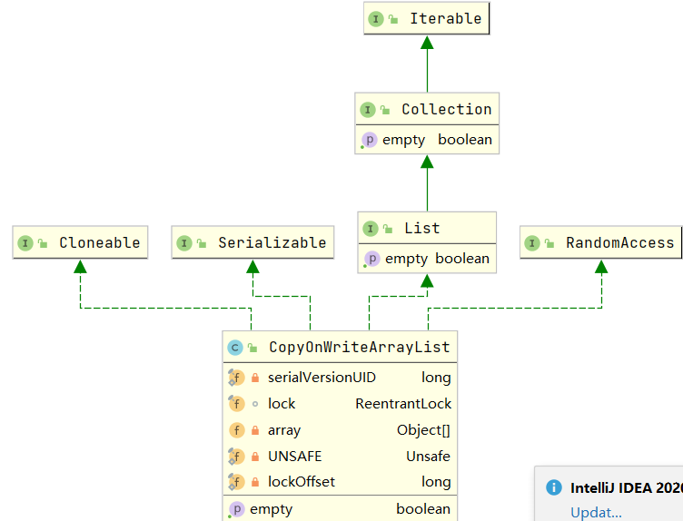

里面有一把独占锁 `lock`。

理解这个类需要知道几件事情

* 如何初始化 list，初始化得 list 元素个数为多少个，list 是由限大小得么

  > 无限大小得，初始化元素个数取决于初始化给得数组，如果不给那么初始化大小是0

* 如何保证线程安全，比如多个线程进行读写时如何保证是线程安全得

  > 加锁

* 如何保证使用迭代器遍历 list 时候得数据一致性

  > 本身是数据不一致性得，所以需要在获取数据得时候，不能再操作数组。

##### 几个主要方法

* add

```java
public boolean add(E e) {
    // 获取独占锁
    final ReentrantLock lock = this.lock;
    lock.lock();
    try {
        // 获取当前元素
        Object[] elements = getArray();
        int len = elements.length;
        // 复制当前元素到新数组
        Object[] newElements = Arrays.copyOf(elements, len + 1);
        // 新数组假如新值到末尾，这里看出CopyOnWriteArrayList 是无界得，新增元素添加到新数组
        newElements[len] = e;
        // 新数组替换旧数组
        setArray(newElements);
        return true;
    } finally {
        lock.unlock();
    }
}
```

* get

```java
private E get(Object[] a, int index) {
    return (E) a[index];
}

public E get(int index) {
    return get(getArray(), index);
}

```

获取数据得时候，分2步

1. 获取数组
2. 获取数组指定 index 值

整个过程是没有加锁得，所以会出现线程安全问题。

* set

```java
public E set(int index, E element) {
    final ReentrantLock lock = this.lock;
    lock.lock();
    try {
        Object[] elements = getArray();
        E oldValue = get(elements, index);

        if (oldValue != element) {
            int len = elements.length;
            Object[] newElements = Arrays.copyOf(elements, len);
            newElements[index] = element;
            setArray(newElements);
        } else {
            // Not quite a no-op; ensures volatile write semantics
            setArray(elements);
        }
        return oldValue;
    } finally {
        lock.unlock();
    }
}
```

* remove

```java
public E remove(int index) {
    final ReentrantLock lock = this.lock;
    lock.lock();
    try {
        Object[] elements = getArray();
        int len = elements.length;
        E oldValue = get(elements, index);
        int numMoved = len - index - 1;
        if (numMoved == 0)
            setArray(Arrays.copyOf(elements, len - 1));
        else {
            Object[] newElements = new Object[len - 1];
            System.arraycopy(elements, 0, newElements, 0, index);
            System.arraycopy(elements, index + 1, newElements, index,
                             numMoved);
            setArray(newElements);
        }
        return oldValue;
    } finally {
        lock.unlock();
    }
}
```

* 迭代器

```java
public Iterator<E> iterator() {
    return new COWIterator<E>(getArray(), 0);
}
```

##### 弱一致性

上面接口能看到当通过`get` 和 迭代器 `iterator` 获取数据得时候没有加锁，这个时候获取得数据是弱一致性得，也就是当获得数组后到从数组中拿数据，这个中间其他线程对数组得操作都是不可见得，这就是弱一致性。


### 锁得原理

#### LockSupport

> 一个工具类，其主要作用是挂起和唤醒线程，是创建锁和其他同步类得基础

`LockSupport` 类和使用它得线程都会关联一个**许可证**，在默认情况下调用`LockSupport` 类得方法得线程是不持有许可证得。

`LockSupport` 是使用`Unsafe` 实现得。

```java
public class LockSupportTest {
    public static void main(String[] args) {
        System.out.println("Begin park!");

        LockSupport.park();

        System.out.println("end park");
    }
}
```

默契情况下线程是不持有许可证得，所以程序只会输出 `Begin park`

调用`unpark(Thread thread)` 方法并且将当前线程作为参数时，调用 `park` 方法而被阻塞得线程会返回，以及其他线程调用了阻塞线程 得`interrupt` 方法，阻塞线程也会返回，但是不会抛出异常。

调用`unpark` 会有以下三种情况

* 没有许可证，直接调用

  > 让该线程持有许可证

* 之前调用了 park挂起得线程，然后在调用 unpark

  > 那么之前调用 park 得地方线程被唤醒

* 之前没有调用`park` 方法，然后调用`unpark` 方法，然后在调用`park` 

  > 线程立马返回
  >
  > ```java
  > public class LockSupportTest {
  >     public static void main(String[] args) {
  > 
  >         LockSupport.unpark(Thread.currentThread());
  >         
  >         System.out.println("Begin park!");
  > 
  >         LockSupport.park();
  > 
  >         System.out.println("end park");
  >     }
  > }
  > ```

其他几个例子

```java
public class LockSupportTest {
    public static void main(String[] args) {

        System.out.println("Begin park!");

        Thread thread = new Thread(() -> {
            System.out.println("Child Thread park self");
            LockSupport.park();
            System.out.println("Child Thread park self end");
        });
        
        thread.start();

        System.out.println("main thead unpark child thread");

        LockSupport.unpark(thread);
    }
}

// Begin park!
// main thead unpark child thread
// Child Thread park self
// Child Thread park self end
```


### AQS

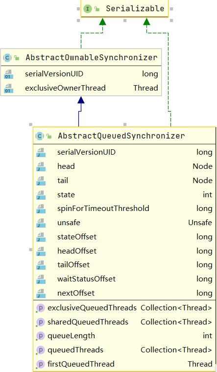

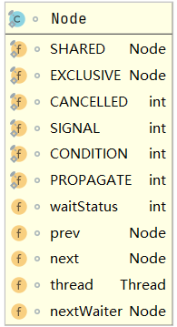


`AQS` 是一个FIFO得双向队列，其内部通过`head` 和 `tail` 记录队首和队尾元素，其`Node` 中存放着线程，

* `SHARED`: 标记线程是获取共享资源时被阻塞挂起后放入`AQS` 得
* `EXCLUSIVE` : 标记线程是获取独占锁资源时被挂起后放入`AQS` 得
* `waitStatus`: 记录当前线程等待状态，取值有
  * `CANCLLED`: 线程被取消了
  * `SIGNAL`: 线程需要被唤醒
  * `CONDITION`: 线程在条件队列中等待
  * `PROPAGATE`: 释放共享资源时候需要通知其他节点

是一个抽象父类，阻塞锁。

`AQS` 得 `state` 维持状态信息，不同得实现，会有不同得使用方法。线程同步得关键是对状态`state` 进行操作，根据 `stat` 判断释放属于一个线程。

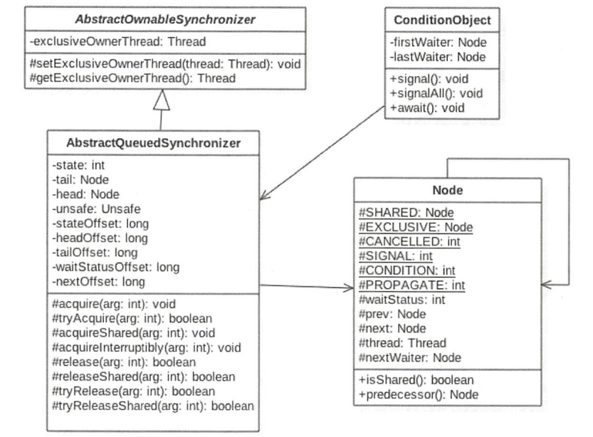

`AQS` 中得方法，`Node` 作用已提过，主要得方法均在`AQS` 中

* 独占锁方法

  * `acquire`
  * `acquireInterruptily`
  * `release`

  独占锁是和线程绑定得，一个线程获取到资源只会，就好标记为已经获取到锁，其他线程再去获取锁，会被阻塞。比如`ReentrantLock`

* 共享锁

  * `acquireShared`
  * `acquireSharedInterruptily`
  * `releaseShared`

  当一个线程获取到锁，另外一个线程再来获取锁，如果获取锁得条件满足，就会通过`cas` 方式获取锁，比如 `semaphore`

 其中`tryRelease/tryReleaseShared` 和 `tryAcquire/tryAcquireShared` 方法`AQS` 没有实现，需要子类实现，实现得时候主要逻辑获取锁和释放锁返回`true/false` 得逻辑，以及修改`state` 逻辑

* 提供了基于`FIFO` 的等待队列。

* 条件变量来实现等待，唤醒机制，支持多个条件变量


#### 几个方法

* `acquire`

```java
public final void acquire(int arg) {
    if (!tryAcquire(arg) && // 尝试获取
        acquireQueued(addWaiter(Node.EXCLUSIVE), arg)) 
        // 如果尝试获取失败，那么将当前线程封装为一个Node，将该Node 添加到等待队列中
        selfInterrupt();
}

//获取锁失败后，新增得node和已有得 node 串起来
private Node addWaiter(Node mode) {
    Node node = new Node(Thread.currentThread(), mode);
    // Try the fast path of enq; backup to full enq on failure
    Node pred = tail;
    if (pred != null) { // 当前得node 已经有了，也就是queue 中已有有只
        node.prev = pred;
        if (compareAndSetTail(pred, node)) { //并且将新 node 插入到queue中
            pred.next = node;
            return node;
        }
    }
    enq(node); // 如果 queue 是空，或者上面插入queu 失败，这里再次尝试插入
    return node;
}
```

* `release`

```java
public final boolean release(int arg) {
    if (tryRelease(arg)) {
        Node h = head; // 如果释放成功，取出等待队列中得线程
        if (h != null && h.waitStatus != 0)
            unparkSuccessor(h); // 如果释放成功，释放取出线程，重新去竞争锁
        return true;
    }
    return false;
}
```

#### 多条件变量

例如在使用`synchronized` 得时候，通过`wait` 和 `notify/notifyAll` 进行线程得唤醒和等待。在`AQS` 中也是通过`await` 和 `signal` 配合锁。例如`ReentrantLock`，它比`Synchronized` 更加强大得是，可以创建多个变量

#### 获取锁逻辑

```java
while(state 状态不允许获取) {
	if(队列中还没有此线程) {
		入队并阻塞
	}
}
当前线程出队
```

#### 释放锁

```java
if(state 状态允许了) {
	恢复阻塞的线程(s)
}
```


### ReentrantLock

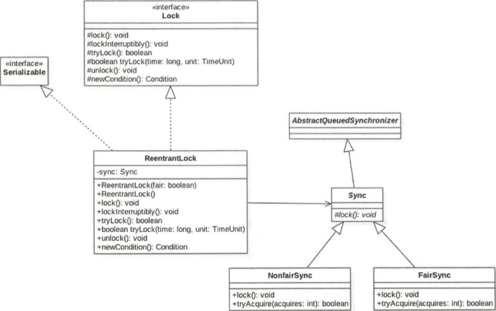

使用`AQS` 实现，通过参数实现`公平锁`

```java
public ReentrantLock() {
    sync = new NonfairSync();
}

public ReentrantLock(boolean fair) {
    sync = fair ? new FairSync() : new NonfairSync();
}
```

获取锁得时候通过`cas` 将 `state` 得值设置未`1`, 然后设置持有锁得线程未当前线程，如果该线程在没有释放锁得时候，再次获取锁，那么`state` 得值未2，在释放锁得时候，也必须是释放2此锁，当`state=0` 的时候，其他线程才能来竞争锁。

#### API

* `lock`

> `NoFairLock` 为例

> ```java
> public void lock() {
>     sync.lock();
> }
> 
> // NoFairLock
> final void lock() {
>     if (compareAndSetState(0, 1)) // 第一次尝试获取锁
>         // 获得锁成功，则将当前线程设置未锁的拥有者
>         setExclusiveOwnerThread(Thread.currentThread());
>     else
>         // 锁获得失败
>         acquire(1);
> }
> 
> public final void acquire(int arg) {
>     if (!tryAcquire(arg) && // 第二次尝试获取一次。tryAcquire 方法是由实现类实现的，AQS 没有实现
>         acquireQueued(addWaiter(Node.EXCLUSIVE), arg)) // 获取到锁，返回的是 interrupt 
>         // 然后重新做一次打断，也就是获取到锁之后，采取响应之前别得线程对该线程得打断
>         selfInterrupt();
> }
> 
> protected final boolean tryAcquire(int acquires) {
>     return nonfairTryAcquire(acquires);
> }
> 
> final boolean nonfairTryAcquire(int acquires) {
>     final Thread current = Thread.currentThread();
>     int c = getState();
>     if (c == 0) { // 锁没有被占用
>         if (compareAndSetState(0, acquires)) {
>             // 第三次尝试获取锁
>             setExclusiveOwnerThread(current);
>             return true;
>         }
>     }
>     else if (current == getExclusiveOwnerThread()) {
>         // 锁被占用，且占用锁的就是当前线程
>         int nextc = c + acquires; // 重入次数增加，重入锁，加锁
>         if (nextc < 0) // overflow // 判断超过上限
>             throw new Error("Maximum lock count exceeded");
>         setState(nextc);
>         return true;
>     }
>     return false;
> }
> 
> // ReentrantLock 的 tryAcquire 是在 FairSync/NoFairSync 中实现的
> // 返回新插入的队列的Node
> private Node addWaiter(Node mode) {
>     Node node = new Node(Thread.currentThread(), mode);
>     // Try the fast path of enq; backup to full enq on failure
>     Node pred = tail;
>     if (pred != null) {
>         // 队列不为空，插入一个新Node，持有当前线程，并插入到队列尾巴
>         node.prev = pred;
>         if (compareAndSetTail(pred, node)) {
>             pred.next = node;
>             return node;
>         }
>     }
>     enq(node);
>     return node;
> }
> 
> private Node enq(final Node node) {
>     for (;;) {
>         Node t = tail;
>         if (t == null) { // Must initialize
>             // 队列为空，新插入
>             if (compareAndSetHead(new Node()))
>                 tail = head;
>         } else {
>             node.prev = t;
>             // 队列不为空，插入到队列尾巴
>             if (compareAndSetTail(t, node)) {
>                 t.next = node;
>                 return t;
>             }
>         }
>     }
> }
> 
> // 经过前面三次尝试获取锁，均失败，在队列中新加一个节点Node，且该节点Node 持有当前竞争锁线程
> final boolean acquireQueued(final Node node, int arg) {
>     boolean failed = true;
>     try {
>         boolean interrupted = false;
>         for (;;) {
>             final Node p = node.predecessor(); // 获取前继节点
>             if (p == head && tryAcquire(arg)) {  // 第4次获取锁
>                 // 如果前继节点是头节点，那么在进行一次尝试获取锁，理解应该是当前持有锁的节点
>                 // 是当前线程的前一个节点， 那么有理由相信它可能块释放锁了
>                 // 也就是在 unlock 执行后，第二个节点获取到锁
>                 // 设置当前node 为头节点
>                 // 设置旧头节点为 null，断开节点
>                 setHead(node);
>                 p.next = null; // help GC
>                 failed = false;
>                 return interrupted;
>             }
>             // 前继节点 不是头节点，或者是头节点，当前线程进行一次锁没竞争到
>             if (shouldParkAfterFailedAcquire(p, node) &&
>                 // 这里会将p waitstatue 更新为-1，然后返回false，表示其去唤醒 node, 然后进行下一次循环
>                 parkAndCheckInterrupt()) // 将当前进行线程进行 park
>                 // 就算这里再 park 的时候，被其他线程打算唤醒，只是再次进入循环获取锁
>                 // 如果获取不 到锁，还会 park 住
>                 // 再这里 interrupted 并不起什么作用， 只有获取到锁之后，才会返回打断标记
>                 // 也就是只要它没有获取到锁，那么它就不会响应其他线程得打断
>                 interrupted = true;
>         }
>     } finally {
>         if (failed)
>             cancelAcquire(node);
>     }
> }
> // 一个线程经过4此竞争失败只会才会进入 park，被阻塞
> // shouldParkAfterFailedAcquire 会将每个node 的前继节点的 waitstatus 改为-1
> // 表示前一个节点有责任唤醒后一个节点
> ```
>
> 释放锁
>
> ```java
> public void unlock() {
>     sync.release(1);
> }
> 
> public final boolean release(int arg) {
>     if (tryRelease(arg)) {
>         // 释放锁之后
>         Node h = head;
>         if (h != null && h.waitStatus != 0)
>             unparkSuccessor(h);
>         return true;
>     }
>     return false;
> }
> 
> // 公平和非公平锁的方法是一样的
> protected final boolean tryRelease(int releases) {
>     int c = getState() - releases; // 重入锁，释放锁
>     if (Thread.currentThread() != getExclusiveOwnerThread())
>         // 必须是当前锁的拥有这，才能释放锁
>         throw new IllegalMonitorStateException();
>     boolean free = false;
>     if (c == 0) {
>         // 释放1次锁之后锁就不被占，表示当前线程只进入一次锁
>         free = true;
>         setExclusiveOwnerThread(null);
>     }
>     setState(c);
>     return free;
> }
> 
> private void unparkSuccessor(Node node) {
>     int ws = node.waitStatus;
>     if (ws < 0)
>         compareAndSetWaitStatus(node, ws, 0);
> 	
>     // 如果下一个锁是null，可能是被cancled 调的
>     // 这个时候从队列尾巴开始找一个不为 null 的节点
>     // 将该节点的线程 unpark
>     Node s = node.next;
>     if (s == null || s.waitStatus > 0) {
>         s = null;
>         for (Node t = tail; t != null && t != node; t = t.prev)
>             if (t.waitStatus <= 0)
>                 s = t;
>     }
>     if (s != null)
>         // 释放下一个锁
>         LockSupport.unpark(s.thread);
> }
> ```
>
> * 不可打断原理
> * 可重入原理
> * 公平非公平原理
>
> 这里就能体现非重入锁的关键，假如说是线程`A` 进来了，发现锁已经被占，且不是线程`A`  于是该线程进入到队列中，然后又来了线程`B`，该线程也去竞争锁，如果这个时候锁释放了那么线程`B` 就获取到了锁。
>
> 这就是非公平锁，明明A线程先到的，但是最后B线程获得了锁。
>
> 可短端unlock
>
> ```java
> public final void acquireInterruptibly(int arg)
>     throws InterruptedException {
>     if (Thread.interrupted())
>         throw new InterruptedException();
>     if (!tryAcquire(arg))
>         // 没有获得锁进入
>         doAcquireInterruptibly(arg);
> }
> 
> private void doAcquireInterruptibly(int arg)
>     throws InterruptedException {
>     final Node node = addWaiter(Node.EXCLUSIVE);
>     boolean failed = true;
>     try {
>         for (;;) {
>             final Node p = node.predecessor();
>             if (p == head && tryAcquire(arg)) {
>                 setHead(node);
>                 p.next = null; // help GC
>                 failed = false;
>                 return;
>             }
>             if (shouldParkAfterFailedAcquire(p, node) &&
>                 parkAndCheckInterrupt())
>                 // parkAndCheckInterrupt 返回 true，被打断，
>                 // 抛出异常，for 循环中断
>                 throw new InterruptedException();
>         }
>     } finally {
>         if (failed)
>             cancelAcquire(node);
>     }
> }
> ```
>
> 
>
> 公平锁
>
> ```java
> //if (compareAndSetState(0, acquires)) {
> //            第三次尝试获取锁
> //            setExclusiveOwnerThread(current);
> //            return true;
> //        }
> 
> protected final boolean tryAcquire(int acquires) {
>     final Thread current = Thread.currentThread();
>     int c = getState();
>     if (c == 0) {
>         if (!hasQueuedPredecessors() && // 和非公平锁比较，多了这个步骤，只有当前节点没有前驱(只允许头节点竞争锁)，那么才会竞争
>             // 也就是只有头节点才能去竞争
>             compareAndSetState(0, acquires)) {
>             setExclusiveOwnerThread(current);
>             return true;
>         }
>     }
>     else if (current == getExclusiveOwnerThread()) {
>         int nextc = c + acquires;
>         if (nextc < 0)
>             throw new Error("Maximum lock count exceeded");
>         setState(nextc);
>         return true;
>     }
>     return false;
> }
> }
> 
> public final boolean hasQueuedPredecessors() {
>     // 队列中有前驱节点
>     Node t = tail; 
>     Node h = head;
>     Node s;
>     return h != t &&
>         ((s = h.next) == null || s.thread != Thread.currentThread());
> }
> ```

* `tryLock`

> 能获得锁返回`true`，否则返回 `false`, 和 `lock` 不同的是，他不会被阻塞

* 多条件变量原理

> * `await`
>
> ```java
> public final void await() throws InterruptedException {
>     if (Thread.interrupted())
>         throw new InterruptedException();
>     // 将当前线程添加到条件变量队列尾巴
>     Node node = addConditionWaiter();
>     // 释放调当前线程得所有锁
>     int savedState = fullyRelease(node);
>     int interruptMode = 0;
>     while (!isOnSyncQueue(node)) {
>         LockSupport.park(this); // park 自己线程
>         if ((interruptMode = checkInterruptWhileWaiting(node)) != 0)
>             break;
>     }
>     if (acquireQueued(node, savedState) && interruptMode != THROW_IE)
>         interruptMode = REINTERRUPT;
>     if (node.nextWaiter != null) // clean up if cancelled
>         unlinkCancelledWaiters();
>     if (interruptMode != 0)
>         reportInterruptAfterWait(interruptMode);
> }
> 
> private Node addConditionWaiter() {
>     Node t = lastWaiter;
>     // If lastWaiter is cancelled, clean out.
>     if (t != null && t.waitStatus != Node.CONDITION) {
>         unlinkCancelledWaiters();
>         t = lastWaiter;
>     }
>     Node node = new Node(Thread.currentThread(), Node.CONDITION);
>     if (t == null)
>         firstWaiter = node;
>     else
>         t.nextWaiter = node;
>     lastWaiter = node; // 添加到尾巴
>     return node;
> }
> 
> final int fullyRelease(Node node) {
>     boolean failed = true;
>     try {
>         int savedState = getState();
>         // 一次性全部释放
>         if (release(savedState)) {
>             failed = false;
>             return savedState;
>         } else {
>             throw new IllegalMonitorStateException();
>         }
>     } finally {
>         if (failed)
>             node.waitStatus = Node.CANCELLED;
>     }
> }
> ```
>
> * `singal`
>
> ```java
> public final void signal() {
>     if (!isHeldExclusively())
>         // 不是锁得持有者，直接抛出异常
>         throw new IllegalMonitorStateException();
>     Node first = firstWaiter; // 条件变量中头元素/线程
>     if (first != null)
>         // 不为空
>         doSignal(first);
> }
> 
> private void doSignal(Node first) {
>     do {
>         // firstWaiter 指向下一个节点，如果下个节点为空，那么就没有元素了
>         if ( (firstWaiter = first.nextWaiter) == null)
>             lastWaiter = null;
>         first.nextWaiter = null; // 用于处理，线程拿出了 first
>     } while (!transferForSignal(first) &&
>              (first = firstWaiter) != null);
> }
> 
> final boolean transferForSignal(Node node) {
>     // CONDITION 状态(-1)变为0，竞争锁得队列中得线程状态
>     if (!compareAndSetWaitStatus(node, Node.CONDITION, 0))
>         return false;
> 	
>     // 将节点放到竞争锁队列中
>     Node p = enq(node);
>     int ws = p.waitStatus;
>     // 将 p 状态变为-1，ws > 0 被取消
>     if (ws > 0 || !compareAndSetWaitStatus(p, ws, Node.SIGNAL))
>         LockSupport.unpark(node.thread);
>     return true;
> }
> ```

### `ReentrantReadWriteLock`

> `ReentrantLock` 解决了线程安全的问题，`ReentrantReadWriteLock`锁主要是解决**读多多写少**的场景，它采用**读写分离**的策略，允许多个线程同时拥有锁。读读可以并发，提供性能
>
> 和`ReentrantLock` 不同的是，在`state` 的使用上。
>
> * 可重入
> * 读写分离：两把锁隔离，提供锁效率，读同步，读写互斥，写写互斥，读读不互斥
>
> 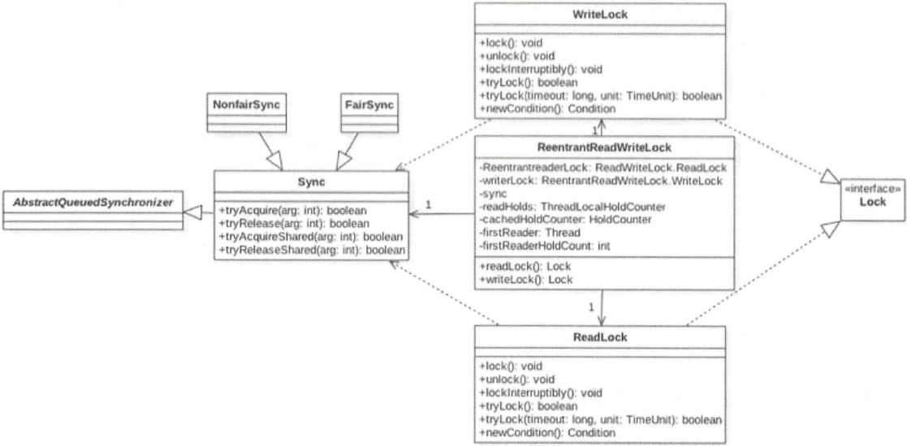
>
> `ReentrantReadWriteLock` 维护着读和写的状态，以及进入写锁的次数，一个state，高16位维护读状态，低16位维护写状态，以及进入写锁的次数。
>
> 读和写不一定需要保持独立，在**读数据的时候允许多个线程获得锁**，而**写数据的时候多个线程需要互斥**。
>
> **读锁不支持创建条件变量，写锁支持创建条件变量**
>
> **写锁可以降级为读锁，读锁不能升级为写锁**
>
> 都是对一把锁上锁，只不过两个内部类进行上锁逻辑
>
> ```java
> private final ReentrantReadWriteLock.ReadLock readerLock;
> /** Inner class providing writelock */
> private final ReentrantReadWriteLock.WriteLock writerLock;
> /** Performs all synchronization mechanics */
> ```
>
> 锁个数
>
> ```java
> static final int SHARED_SHIFT   = 16;
> // 共享锁(读锁)状态单位制 65536
> static final int SHARED_UNIT    = (1 << SHARED_SHIFT);
> 
> // 共享锁(读锁)线程最大 65535
> static final int MAX_COUNT      = (1 << SHARED_SHIFT) - 1;
> 
> // 排他锁(写锁)掩码
> static final int EXCLUSIVE_MASK = (1 << SHARED_SHIFT) - 1;写锁
> ```

* 写锁`API`

```java
public void lock() {
    sync.acquire(1);
}

public final void acquire(int arg) {
    if (!tryAcquire(arg) && // 写锁重写该方法
        acquireQueued(addWaiter(Node.EXCLUSIVE), arg))
        selfInterrupt();
}

// 获取写锁/排它锁当前重入次数
static int exclusiveCount(int c) { return c & EXCLUSIVE_MASK; }

protected final boolean tryAcquire(int acquires) {
    Thread current = Thread.currentThread();
    int c = getState();
    // 当前状态
    int w = exclusiveCount(c);
    if (c != 0) { // 当前状态不为0，表示读/写/共享/排他锁已经获取锁
        // (Note: if c != 0 and w == 0 then shared count != 0)
        if (w == 0 || current != getExclusiveOwnerThread())
            // 当前锁不是写锁获得的，是读锁，读锁不能升级为写锁，直接返回
            // 获取这当前获得写锁的是不当前线程，写写锁也是互斥，直接返回
            return false;
        if (w + exclusiveCount(acquires) > MAX_COUNT) 
            // 写锁获得锁后，重入次数是否到达上限
            throw new Error("Maximum lock count exceeded");
        // Reentrant acquire
        setState(c + acquires); // 重入获得写锁，更新 state 状态
        return true;
    }
    // 第一次进入获取写锁
    if (writerShouldBlock() ||
        !compareAndSetState(c, c + acquires))
        return false;
    setExclusiveOwnerThread(current);
    return true;
}
// 写锁是拍它性的，只有一个写线程获得锁

// 非公平锁，用于返回 false
final boolean writerShouldBlock() {
    return false; // writers can always barge
}
// 公平锁
final boolean writerShouldBlock() {
    return hasQueuedPredecessors();
}
```

* 读锁 lock

```java
public void lock() {
    sync.acquireShared(1);
}

// 记录每个线程的HoldCounter，因为readHolds是一个ThreadLocal变量，
// 所以不同的线程调用readHolds.get()会返回不同的值
//private transient ThreadLocalHoldCounter readHolds;

// 记录上一个【成功获取读锁】的线程。这节省了查询ThreadLocal变量的开销。
//private transient HoldCounter cachedHoldCounter;

// 记录第一个成功获取读锁的线程
//private transient Thread firstReader = null;
// 记录第一个成功获取读锁的线程的重入次数
//private transient int firstReaderHoldCount;

protected final int tryAcquireShared(int unused) {
/*
 * Walkthrough:
 * 1. If write lock held by another thread, fail.
      写锁被持有，返回-1，直接失败
 * 2. Otherwise, this thread is eligible for
      没有被写锁持有，那么是可以允许去获取写锁
 *    lock wrt state, so ask if it should block
      判断释放可以被阻塞，
 *    because of queue policy. If not, try
      如果不允许被阻塞，那么去通过cas获取写锁
 *    to grant by CASing state and updating count.
 *    Note that step does not check for reentrant
 *    acquires, which is postponed to full version
 *    to avoid having to check hold count in
 *    the more typical non-reentrant case.
 * 3. If step 2 fails either because thread
 *    apparently not eligible or CAS fails or count
 *    saturated, chain to version with full retry loop.
      如果读锁也获取不到，那么进行一次获取
 */
    Thread current = Thread.currentThread();
    
    int c = getState();
    
    if (exclusiveCount(c) != 0 &&
        getExclusiveOwnerThread() != current)
        // 排他锁不为0(写锁拿着锁)，以及锁所有者不是当前线程
        // 还有可能锁当前线程以及拿到了写锁，写锁是互斥的，这里也看出写锁是不能重入的
        return -1;
    
    // 写锁没有加锁获取当前获取写锁重入次数
    int r = sharedCount(c);
    
    if (!readerShouldBlock() && 
        r < MAX_COUNT &&
        compareAndSetState(c, c + SHARED_UNIT)) {
        // 读锁没到达上限
        if (r == 0) {
            // 第一次获取读锁
            firstReader = current;
            firstReaderHoldCount = 1;
        } else if (firstReader == current) {
            // 当前线程以及持有读锁，重入
            firstReaderHoldCount++;
        } else {
            // 其他线程获取写锁，
            HoldCounter rh = cachedHoldCounter;
            if (rh == null || rh.tid != getThreadId(current))
                cachedHoldCounter = rh = readHolds.get();
            else if (rh.count == 0)
                readHolds.set(rh);
            rh.count++;
        }
        return 1;
    }
    // 锁没有被写锁占着，也没有竞争到读锁
    return fullTryAcquireShared(current);
}

// 是否有前序节点
public final boolean hasQueuedPredecessors() {
    Node t = tail; // Read fields in reverse initialization order
    Node h = head;
    Node s;
    return h != t && // queue 不为空
        ((s = h.next) == null || s.thread != Thread.currentThread());
        // 第二个节点不为空，且第二个节点就是当前线程，那么当前线程就是由前驱节点的
}

// 记录着每个线程持有的写锁次数
static final class HoldCounter {
    int count = 0;
    // Use id, not reference, to avoid garbage retention
    final long tid = getThreadId(Thread.currentThread());
}

final int fullTryAcquireShared(Thread current) {
    /*
     * This code is in part redundant with that in
     * tryAcquireShared but is simpler overall by not
     * complicating tryAcquireShared with interactions between
     * retries and lazily reading hold counts.
     */
    HoldCounter rh = null;
    for (;;) {
        int c = getState();
        if (exclusiveCount(c) != 0) {
            // 当前锁被写锁占着
            if (getExclusiveOwnerThread() != current)
                // 写锁不是自己，直接返回
                return -1; // 其他线程持有写锁，读写锁是互斥的，直接返回
            // else we hold the exclusive lock; blocking here
            // would cause deadlock.
            // 自己持有写锁，那么还可以进行锁降级为读锁
        } else if (readerShouldBlock()) {
            // 非公平锁，直接返回 false
            // 公平锁，如果当前线程所在的节点还有前驱节点，那么 返回 false
            // Make sure we're not acquiring read lock reentrantly
            if (firstReader == current) {
                // assert firstReaderHoldCount > 0;
                // 当前线程是第一个读锁获取线程
            } else {
                if (rh == null) {
                    // cachedHoldCounter: 记录上一个【成功获取读锁】的线程。这节省了查询ThreadLocal变量的开销。
                    rh = cachedHoldCounter;
                    if (rh == null || rh.tid != getThreadId(current)) {
                        rh = readHolds.get();
                        if (rh.count == 0)
                            readHolds.remove();
                    }
                }
                if (rh.count == 0)
                    return -1;
            }
        }
        if (sharedCount(c) == MAX_COUNT)
            throw new Error("Maximum lock count exceeded");
        if (compareAndSetState(c, c + SHARED_UNIT)) {
            if (sharedCount(c) == 0) {
                firstReader = current;
                firstReaderHoldCount = 1;
            } else if (firstReader == current) {
                firstReaderHoldCount++;
            } else {
                if (rh == null)
                    rh = cachedHoldCounter;
                if (rh == null || rh.tid != getThreadId(current))
                    rh = readHolds.get();
                else if (rh.count == 0)
                    readHolds.set(rh);
                rh.count++;
                cachedHoldCounter = rh; // cache for release
            }
            return 1;
        }
    }
}

private void doAcquireShared(int arg) {
    final Node node = addWaiter(Node.SHARED);
    // 新建共享节点
    boolean failed = true;
    try {
        boolean interrupted = false;
        for (;;) {
            // 获得上个节点
            final Node p = node.predecessor();
            if (p == head) {
                // node 是老二，有资格去竞争锁
                int r = tryAcquireShared(arg);
                if (r >= 0) {
                    // 获得锁
                    setHeadAndPropagate(node, r);
                    p.next = null; // help GC
                    if (interrupted)
                        selfInterrupt();
                    failed = false;
                    return;
                }
            }
            if (shouldParkAfterFailedAcquire(p, node) &&
                parkAndCheckInterrupt()) // park
                interrupted = true;
        }
    } finally {
        if (failed)
            cancelAcquire(node);
    }
}

private void setHeadAndPropagate(Node node, int propagate) {
    Node h = head; // Record old head for check below
    setHead(node); // 替换头节点
    /*
         * Try to signal next queued node if:
         *   Propagation was indicated by caller,
         *     or was recorded (as h.waitStatus either before
         *     or after setHead) by a previous operation
         *     (note: this uses sign-check of waitStatus because
         *      PROPAGATE status may transition to SIGNAL.)
         * and
         *   The next node is waiting in shared mode,
         *     or we don't know, because it appears null
         *
         * The conservatism in both of these checks may cause
         * unnecessary wake-ups, but only when there are multiple
         * racing acquires/releases, so most need signals now or soon
         * anyway.
         */
    if (propagate > 0 || h == null || h.waitStatus < 0 ||
        (h = head) == null || h.waitStatus < 0) {
        Node s = node.next; // 获取当前节点得下一个
        if (s == null || s.isShared()) // 下一个节点是空或者是共享状态
            doReleaseShared(); //
    }
}

private void doReleaseShared() {
    /*
         * Ensure that a release propagates, even if there are other
         * in-progress acquires/releases.  This proceeds in the usual
         * way of trying to unparkSuccessor of head if it needs
         * signal. But if it does not, status is set to PROPAGATE to
         * ensure that upon release, propagation continues.
         * Additionally, we must loop in case a new node is added
         * while we are doing this. Also, unlike other uses of
         * unparkSuccessor, we need to know if CAS to reset status
         * fails, if so rechecking.
         */
    for (;;) {
        Node h = head;
        if (h != null && h != tail) {
            int ws = h.waitStatus;
            if (ws == Node.SIGNAL) {
                if (!compareAndSetWaitStatus(h, Node.SIGNAL, 0))
                    continue;            // loop to recheck cases
                unparkSuccessor(h);//头节点释放
            }
            else if (ws == 0 &&
                     !compareAndSetWaitStatus(h, 0, Node.PROPAGATE))
                continue;                // loop on failed CAS
        }
        if (h == head)                   // loop if head changed
            break;
    }
}
// 在进行释放得时候，只要是SHARED 类型得节点/线程，会连着全部唤醒直到遇到得是独占锁
// 者就是为什么写写锁可以并发得原因。
```


### Queue

> `JUC` 中提供了一系列场景的安全队列，按照实现方式的不同可以分为阻塞队列(锁实现)和非阻塞队列(CAS 实现)

*  阻塞队列

> 保证数据能够从一端按序进入，另一端按序出去
>
> 队列不能无限放元素，当队列满了，放入线程应该阻塞住
>
> 当队列元素为空，那么获取元素的线程应该阻塞，不获取元素，只有有元素之后再唤醒

* 分类

> 1. **ArrayBlockingQueue**: 基于数组的有界阻塞队列实现
> 2. **LinkedBlockingQueue**: 基于列表的无界阻塞队列
> 3. DelayQueue: 优先级对象实现的延迟无界阻塞队列
> 4. PriorityQueue
> 5. SynchronizedQueue: 单个元素的阻塞队列

#### `ConcurrentLinkedQueue`

> 面试题目
>
> * 原理
>
> * 为什么是非阻塞的
>
>   > 其实现的是非`BlockingQueue` 的接口，没有阻塞。是并发插入，要么成功，要么一直旋转直到成功。
>
> * 如何实现高并发下的，无阻塞，无锁的队列

> 内部的队列使用单向列表实现，2个`volatile` 类型的`Node` 节点分别存放队首和尾
>
> 其内部的操作均是调用`Unsafe`。
>
> 非阻塞无界队列

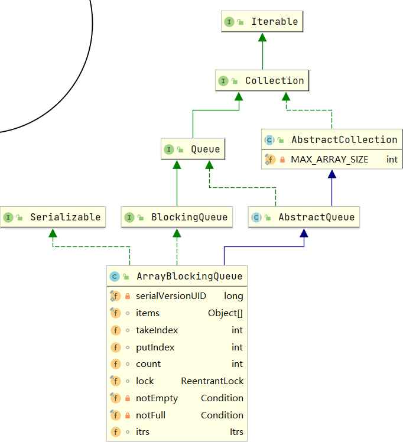

图中没有将Node 节点标出

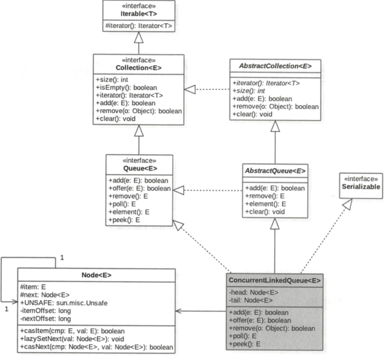

* `Node`

```java
private static class Node<E> {
        volatile E item;
        volatile Node<E> next;

        Node(E item) {
            UNSAFE.putObject(this, itemOffset, item);
        }

        boolean casItem(E cmp, E val) {
            return UNSAFE.compareAndSwapObject(this, itemOffset, cmp, val);
        }

        void lazySetNext(Node<E> val) {
            UNSAFE.putOrderedObject(this, nextOffset, val);
        }

        boolean casNext(Node<E> cmp, Node<E> val) {
            return UNSAFE.compareAndSwapObject(this, nextOffset, cmp, val);
        }

        // Unsafe mechanics

        private static final sun.misc.Unsafe UNSAFE;
        private static final long itemOffset;
        private static final long nextOffset;
....
}
```

* 构造函数

```java
public ConcurrentLinkedQueue() {
    head = tail = new Node<E>(null);
}

public ConcurrentLinkedQueue(Collection<? extends E> c) {
    Node<E> h = null, t = null;
    for (E e : c) {
        checkNotNull(e);
        Node<E> newNode = new Node<E>(e);
        if (h == null)
            h = t = newNode;
        else {
            t.lazySetNext(newNode); // 添加到尾巴
            t = newNode; // 为节点重新设置
        }
    }
    if (h == null)
        h = t = new Node<E>(null);
    head = h; // 更新 head
    tail = t; // 更新 tail
}
```

* offer

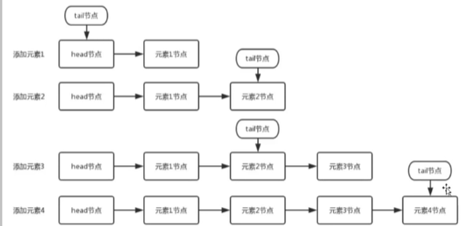

> ```
> Inserts the specified element at the tail of this queue.
> ```

```java
// 插入到尾node
public boolean offer(E e) {
    checkNotNull(e); // 1
    final Node<E> newNode = new Node<E>(e); // 2
    // 创建节点
    for (Node<E> t = tail, p = t;;) { 
        // 3 尾节点开始插入，p指向尾节点，
        Node<E> q = p.next;
        if (q == null) { 
            // 4 成立则说明 p 此时是尾节点，如果再q=p.next 复制完成后，此时恰好指向了poll，那么p=p 就会指向到7
            if (p.casNext(null, newNode)) { 
                // 多个线程的情况下，会再这里竞争, 如果竞争失败，则跳到代码3，这个时候q!=null
                // 这个时候 q=p.next 就是导致本线程失败的其他线程插进去的那个值，程序跳到 8
                // 还有一种情况会失败，
                // 5 这里只插入元素的关键，只有在这里才会返回
                
                if (p != t) 
                    // 不是每次插入尾巴节点，都会更新tail 节点
                    // 例如第一次插入一个元素，那么p=t的都指向倒数第二个节点
                    // 当再一次插入一个元素，q！=null, 然后指向到8，此时p指向尾巴
                    // 但是tail 还是指向倒数第二个节点
                    // 当第二次插入成功的时候，才会将 tail 更新到尾巴
                    casTail(t, newNode); 
                return true;
            }
        }
        else if (p == q) 
            // 7 p=p.next, 相当于p被删除，也就是在指向 poll 操作后会到这里分支，p 重新指向到 tail
            p = (t != (t = tail)) ? t : head;
        else
            // 8， 这里执行之后 p 往后走了一步，然后再进入到下一次循环
            // p != t 则将q赋值给p，p指针改变了
            p = (p != t && t != (t = tail)) ? t : q; // p 往后走一位
    }
}
```

* add

> ```
> Inserts the specified element at the tail of this queue
> ```

```java
public boolean add(E e) {
    return offer(e);
}
```

* poll

> ```
> Retrieves and removes the head of this queue
> ```

```java
public E poll() {
    restartFromHead: //1 goto 语句
    for (;;) { // 2
        for (Node<E> h = head, p = h, q;;) { // 只初始化，
            E item = p.item; // 3
 			// head 节点是一个哨兵，第一次的时候 item == null
            if (item != null && p.casItem(item, null)) { // 4， 拿出去的原子设置为null
                // 假如这个时候其他线程更好把p的item 给更新了，循环进入到下次cas
                if (p != h) // 5
                    // 正常情况会进入到这里，更新头
                    updateHead(h, ((q = p.next) != null) ? q : p);
                return item;
            }
            else if ((q = p.next) == null) { // 6
                // 完成 q 的赋值，q=null，那么这是一个 空 queue，返回 null
                updateHead(h, p);
                return null;
            }
            else if (p == q) // 7 当指向完6的时候，如果其他线程刚好也指向了poll，那么p就往后走以为，刚好就到了这里
                continue restartFromHead;
            else //8
                // p 往后走一步，此时p到达有元素的第一个位置，下次循环会进入5
                p = q;
        }
    }
}

final void updateHead(Node<E> h, Node<E> p) {
    if (h != p && casHead(h, p))
        h.lazySetNext(h);
}
```


### `LinkedBlockingQueue`

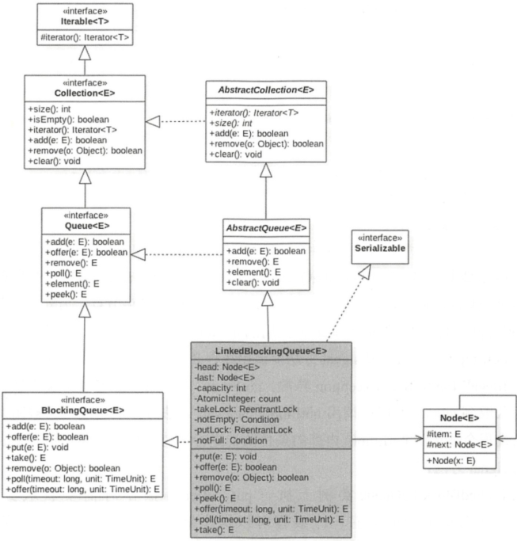

> 单向列表实现。
>
> 有2个`ReentrantLock` 分别控制入队和出对。
>
> 2个条件变量，
>
> 这是一个生产者消费者模型

```java
/** The capacity bound, or Integer.MAX_VALUE if none */
private final int capacity;

/** Current number of elements */
private final AtomicInteger count = new AtomicInteger();

/**
     * Head of linked list.
     * Invariant: head.item == null
     */
transient Node<E> head;

/**
     * Tail of linked list.
     * Invariant: last.next == null
     */
private transient Node<E> last;

/** Lock held by take, poll, etc */
private final ReentrantLock takeLock = new ReentrantLock();

/** Wait queue for waiting takes */
private final Condition notEmpty = takeLock.newCondition();

/** Lock held by put, offer, etc */
private final ReentrantLock putLock = new ReentrantLock();

/** Wait queue for waiting puts */
private final Condition notFull = putLock.newCondition();	
```

在进行`take/poll` 操作的时候需要获取到`takeLock` 保证同一个时刻只有一个线程可以操作。

在进行`put/offer` 操作的时候需要获取到`putLock` 保证同一个时刻只有一个线程可以操作。

是一个有界队列

```java
public LinkedBlockingQueue() {
    this(Integer.MAX_VALUE); // 有界队列
}

public LinkedBlockingQueue(int capacity) {
    if (capacity <= 0) throw new IllegalArgumentException();
    this.capacity = capacity;
    last = head = new Node<E>(null);
}
```

#### `apis`

* `offer`

> ```
> Inserts the specified element at the tail of this queue if it is
> 队列满返回false
> ```

> ```java
> public boolean offer(E e) {
>     if (e == null) throw new NullPointerException();
>     final AtomicInteger count = this.count;
>     if (count.get() == capacity)
>         return false;
>     int c = -1;
>     Node<E> node = new Node<E>(e);
>     final ReentrantLock putLock = this.putLock;
>     putLock.lock();
>     try {
>         if (count.get() < capacity) {
>             enqueue(node);  
>             c = count.getAndIncrement();
>             if (c + 1 < capacity)
>                 notFull.signal();
>                 // 立马存放的是执行 put 操作被阻塞的了线程
>                 // 唤醒之后，继续可以往队列中put 元素
>         }
>     } finally {
>         putLock.unlock();
>     }
>     if (c == 0)
>         // c 初始化=-1. 进入到这里，说明队列中有一个元素
>         signalNotEmpty();
>     return c >= 0;
> }
> 
> // 在take 元素的时候，需要先获取到锁，然后将 notEmpty 中的 await 的线程唤醒
> // 这些线程均是在之前调用 take，且队列为空的时候阻塞的
> private void signalNotEmpty() {
>     final ReentrantLock takeLock = this.takeLock;
>     takeLock.lock();
>     try {
>         notEmpty.signal();
>     } finally {
>         takeLock.unlock();
>     }
> }
> ```

* `put`

> 插入元素，如果队列满，那么等待队列有空间插入为止
>
> ```java
> public void put(E e) throws InterruptedException {
>     if (e == null) throw new NullPointerException();
>     // Note: convention in all put/take/etc is to preset local var
>     // holding count negative to indicate failure unless set.
>     int c = -1;
>     Node<E> node = new Node<E>(e);
>     final ReentrantLock putLock = this.putLock;
>     final AtomicInteger count = this.count;
>     putLock.lockInterruptibly();
>     try {
> 		// 队列满了，线程进入 notFull 条件变量，阻塞
>         while (count.get() == capacity) {
>             notFull.await();
>         }
>         // 被其他线程唤醒，元素进入队列
>         enqueue(node);
>         c = count.getAndIncrement();
>         if (c + 1 < capacity)
>             // 如果队列还没满，继续唤醒 notFull 中线程
>             notFull.signal();
>     } finally {
>         putLock.unlock();
>     }
>     if (c == 0)
>         signalNotEmpty(); // 唤醒 take 线程取数据
> }
> ```

* `poll`

> ```
> Retrieves and removes the head of this queue
> 不管队列是否为空，不为空获取queue 头元素，空返回null
> ```

> ```java
> public E poll() {
>     final AtomicInteger count = this.count;
>     if (count.get() == 0)
>         return null;
>     E x = null;
>     int c = -1;
>     final ReentrantLock takeLock = this.takeLock;
>     takeLock.lock();
>     try {
>         if (count.get() > 0) {
>             x = dequeue();
>             c = count.getAndDecrement();
>             if (c > 1)
>                 // 队列总还有只，可以唤醒 take 线程获取数据
>                 notEmpty.signal();
>         }
>     } finally {
>         takeLock.unlock();
>     }
>     // c 的值是插入前的队列当前大小，如果插入前队列已满，那么插入后队列
>     // 就有一个空位置了，这时候可以 唤醒 put 中的线程继续put 元素
>     if (c == capacity)
>         signalNotFull();
>     return x;
> }
> ```

* `take`

> 获取并删除头节点，如果queue 为空，那么等待queue 中存在数据
>
> ```java
> public E take() throws InterruptedException {
>     E x;
>     int c = -1;
>     final AtomicInteger count = this.count;
>     final ReentrantLock takeLock = this.takeLock;
>     takeLock.lockInterruptibly();
>     try {
>         // 队列为空，当前线程放到 notEmpty 条件变量中，直到其他线程将该线程唤醒
>         while (count.get() == 0) {
>             notEmpty.await();
>         }
>         x = dequeue();
>         c = count.getAndDecrement();
>         if (c > 1)
>             // 获取头元素之后，队列中还有值，唤醒notEmpty 等待获取值的线程
>             notEmpty.signal();
>     } finally {
>         takeLock.unlock();
>     }
>     if (c == capacity)
>         signalNotFull();
>     return x;
> }
> ```


### ArrayBlockingQueue

> 数组存放元素，下标获取头尾元素，使用的时候必须指定`array` 的大小
>
> 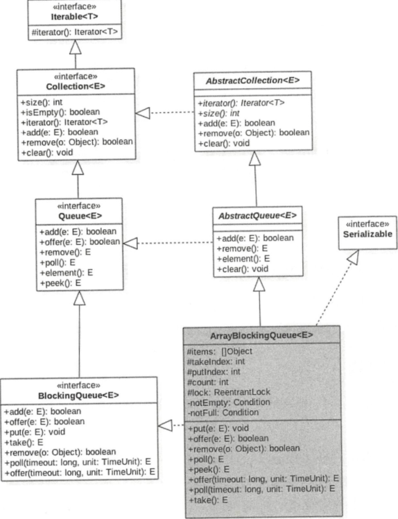
>
> ```java
> public ArrayBlockingQueue(int capacity) {
>     this(capacity, false);
> }
> 
> public ArrayBlockingQueue(int capacity, boolean fair) {
>     if (capacity <= 0)
>         throw new IllegalArgumentException();
>     this.items = new Object[capacity];
>     lock = new ReentrantLock(fair);
>     notEmpty = lock.newCondition();
>     notFull =  lock.newCondition();
> }
> ```

#### `apis`

> 和`LinkedBlockingQueue` 基本一致。

---


### 线程池

> 执行异步任务的时候线程池能提供比较好的性能，在不使用线程池得时候，每次使用线程都需要`new` 一个线程，使用完然后`close`，线程得创建和销毁都是由开销得，线程池就是优化这个开销得。

