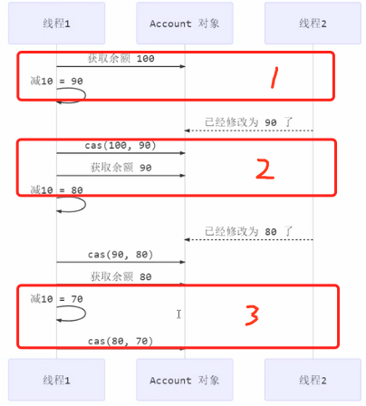

#### 主要内容

* CAS 和 `volatile`
* 原子整数
* 原子引用
* 原子累加器
* `Unsafe`

---

#### 一个例子

```java
import java.util.ArrayList;

public class TestAccound {

    interface Account {
        Integer getBalance();
        void withdraw(Integer amount);

        static void demo(Account account) {
            ArrayList<Thread> ts = new ArrayList<>();
            for (int i = 0; i < 1000; i++) {
                ts.add(new Thread(() -> {
                    account.withdraw(10);
                }));
            }

            long start = System.nanoTime();

            ts.forEach(Thread::start);
            ts.forEach(t -> {
                try {
                    t.join();
                } catch (InterruptedException e) {
                    e.printStackTrace();
                }
            });

            long end = System.nanoTime();
            System.out.println(account.getBalance() + " cost "
                    + (end - start)/1000_000 + " ms");

        }
    }

    static class AccountUnsafe implements Account{

        private Integer amount;
        public AccountUnsafe(Integer amount) {
            this.amount = amount;
        }

        @Override
        public synchronized Integer getBalance() {
            return amount;
        }

        @Override
        public synchronized void withdraw(Integer amount) {
            this.amount -= amount;
        }
    }

    public static void main(String[] args) {
        // 没有添加 synchronized  300 cost 78 ms
        // 添加 synchronized 之后 0 cost 70 ms
        AccountUnsafe accountUnsafe = new AccountUnsafe(10000);
        Account.demo(accountUnsafe);

    }
}
```

##### 使用CAS

```java
static class AccountCas implements Account {

        private AtomicInteger balance;

        public AccountCas(Integer balance) {
            this.balance = new AtomicInteger(balance);
        }

        @Override
        public Integer getBalance() {
            return balance.get();
        }

        @Override
        public void withdraw(Integer amount) {
            while (true) {
                int prev = balance.get();
                int next = prev - amount;

                if (balance.compareAndSet(prev, next)) {
                    break;
                }
            }
        }
    }

    public static void main(String[] args) {
        // 没有添加 synchronized  300 cost 78 ms
        // 添加 synchronized 之后  0 cost 70 ms
        // 使用 AtomicInteger     0 cost 81 ms
        AccountCas accountUnsafe = new AccountCas(10000);
        Account.demo(accountUnsafe);
    }
}
```

#### CAS 和 volatile

`cas(compara and swap)` 代码中并没有使用锁来保护共享变量，就实现了线程安全，那么是如何实现的呢？

```java
public void withdraw(Integer amount) {
  while (true) {
    int prev = balance.get();
    int next = prev - amount;
    // 比较并设置值， compareAndSet 比较和设置方法是原子的，
    if (balance.compareAndSet(prev, next)) {
      break;
    }
  }
}
```

##### 自旋锁实现 cas



* 如上线程1在第一更新的是持着值为`100`，去更新为`90`去更新`Account `对象，更新时候发现，值已经被线程2更新为`90`，由于值不一样，所以线程1就不去更新
* 于是线程1获取到`Account` 的最新值`90`，然后在去更新为`80`，发现`Account `的值又被更新成了`80`，和`90`不一样，所以又不去更新
* 第三次更新时候，取到最新的`Account` 值` 80`，并将其更新为`70`，更新的时候发现`Account` 确实是`80`，于是就更新为`70`

##### cas 和 volatile 配合

> 获取共享变量的时候，为了保证变量的可见性，需要使用 `volatile`，这样`cas` 借助`volatile` 才能读取到共享变量的最新值来实现【比较并交换】

#### 为什么无锁效率高

无锁情况下即使是重试失败，线程始终在告诉运行，没有停歇，只有在CPU 时间分配不到才会进行上下文切换，而`synchronized` 会让线程在没有获得锁的时候，发生上下文切换，进入阻塞，打个比喻

> 线程就好像告诉跑道上的赛车，高速运行的时候，一旦发送上下文切换，那么好比赛车要减速，熄火，被唤醒之后需要重新打火，启动，加速恢复到告诉运行，代价比较大
>
> 在无锁情况下，因为线程要保持运行，需要额外的CPU的支持，CPU 在这里就好比高速公路，没有额外的跑道，线程想高速运行也无从谈起，虽然不会进入阻塞，但是由于没有分到时间片，仍然会进入可运行状态，还是会导致上下文切换。
>
> **所以需要时在多核的`CPU` 才能发挥作用，且线程的个数是最好不超过核数，如果是在单核下`synchronized` 效率更高的**

#### CAS 特点

##### 适合场景

> 多核机器下，且线程个数不多余核数

##### 特点

* CAS 是基于乐观锁的思想：最乐观的估计，不怕别的线程来修改共享变量，就算修改了没关系，我吃亏点再重试下
* `synchronized` 是基于悲观锁的思想，最悲观的估计，得放着其他线程类修改共享变量，我上了锁你们都别想改，我改完了解开锁，你们才有机会
* CAS 体现的是无锁并发，无阻碍并发，请仔细体会下面2句话
  * 因为没有使用 `synchronized` ，所以线程不会陷入阻塞，这是效率提升的因素之一
  * 但如果竞争激烈(线程数多于cpu 核数)，可以想到重试必然频繁发生，反而效率得到影响

---

#### J.U.C

* `AtomicBoolean`
* `AtomicInteger`
* `AtomicLong`

```java
AtomicInteger atomicInteger = new AtomicInteger(0);
System.out.println(atomicInteger.getAndIncrement()); // i++
System.out.println(atomicInteger.incrementAndGet()); // ++i
System.out.println(atomicInteger.addAndGet(10)); // += 10

System.out.println(atomicInteger.updateAndGet(i->i * 2)); *= 2
```

使用`J.U.C` 的类实现上面的转账功能

```java
// 值记录变换的部分
static class AccountCas implements Account {

  private AtomicInteger balance;

  public AccountCas(Integer balance) {
    this.balance = new AtomicInteger(balance);
  }

  @Override
  public Integer getBalance() {
    return balance.get();
  }

  @Override
  public void withdraw(Integer amount) {
    balance.getAndAdd(amount * -1);
  }
}
```

##### 原子引用

* `AtomicReference`
* `AtomicMarkableReference`
* `AtomicStampedReference`

```java
static class DecimalAccountCas implements DecimalAccount {

  private AtomicReference<BigDecimal> balance;

  public DecimalAccountCas(BigDecimal balance) {
    this.balance = new AtomicReference<>(balance);
  }


  @Override
  public BigDecimal getBalance() {
    return balance.get();
  }

  @Override
  public void withdraw(BigDecimal amount) {
    while (true) {
      BigDecimal prev = balance.get();
      BigDecimal decimal = prev.subtract(amount);
      if (balance.compareAndSet(prev, decimal)) {
        break;
      }
    }
  }
}
public static void main(String[] args) {
  // 没有添加 synchronized  300 cost 78 ms
  // 添加 synchronized 之后  0 cost 70 ms
  // 使用 AtomicInteger     0 cost 81 ms
  // 使用 AtomicReference   0 cost 60 ms
  DecimalAccount.demo(new DecimalAccountCas(new BigDecimal("10000")));
}

AtomicReference<String> reference = new AtomicReference<>("A");
String s = reference.get();

// 直接使用
boolean compareAndSet = reference.compareAndSet(s, "C");
System.out.println(compareAndSet + " " + reference.get());
```

#### ABA 问题

> ```java
> reference.compareAndSet(s, "C");
> ```
>
> 假设原来`s` 的值为 `a` , 当 `s` 没有发生变化，那么上面的更新是可以成功的，但是如果`s` 从 `a` 更新到了`aa`然后又更新回了`a` 那么上面的更新还是可以更新成功的。
>
> 这就是`ABA` 问题

##### 解决 `ABA` 问题

> `AtomicMarkableReference` 会另外给一个`版本的信息`，每更新一次那么版本就 `+1`, 如果在版本不一致，那么就说明值发生变化。

---

#### 原子数组

> 保护数组中的元素

* `AtomicIntegerArray`
* `AtomicLongArray`
* `AtomicReferenceArray`

#### 字段更新器

> 多个线程访问同一个对象的属性的线程安全

* `AtomicIntegerFieldUpdater`
* `AtomicLongFieldUpdater`
* `AtomicReferenceInteger`

```java
public class Test5 {
  
  // 必须结合 volatile 一起使用
  private volatile int field;

  public static void main(String[] args) {

    AtomicIntegerFieldUpdater fieldUpdater = 			
      AtomicIntegerFieldUpdater.newUpdater(Test5.class, "field"); Test5 test5 
      		= new Test5();
		
    fieldUpdater.compareAndSet(test5, 0, 10); // 修改成功 field = 10

    System.out.println(test5.field);

    // 修改成功 field = 20 
    fieldUpdater.compareAndSet(test5, 10, 20); System.out.println(test5.field);
		// 修改失败 field = 20 
    fieldUpdater.compareAndSet(test5, 10, 30); 
    System.out.println(test5.field);
	} 
}
```

#### LongAdder

> 其设计非常精巧
>
> `LongAdder` 有几个关键域

#### 不可变类

* 不可变类的使用
* 不可变类设计
* 无状态类设计

`SimpleDateFormat` 是有线程问题的，现在有一个线程安全的时间格式类`DateTimeFormatt`

> 使用 `final` 修饰类，保证类不可以被基础，保证里面所有的方法都不会被修改/覆盖