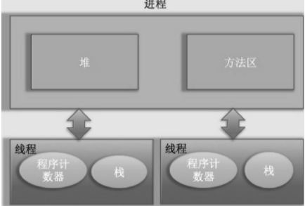
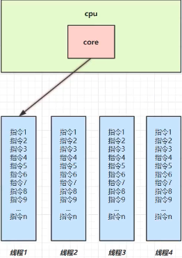
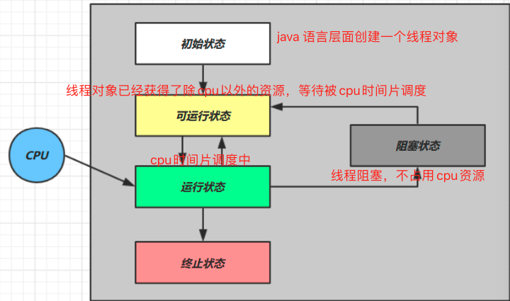
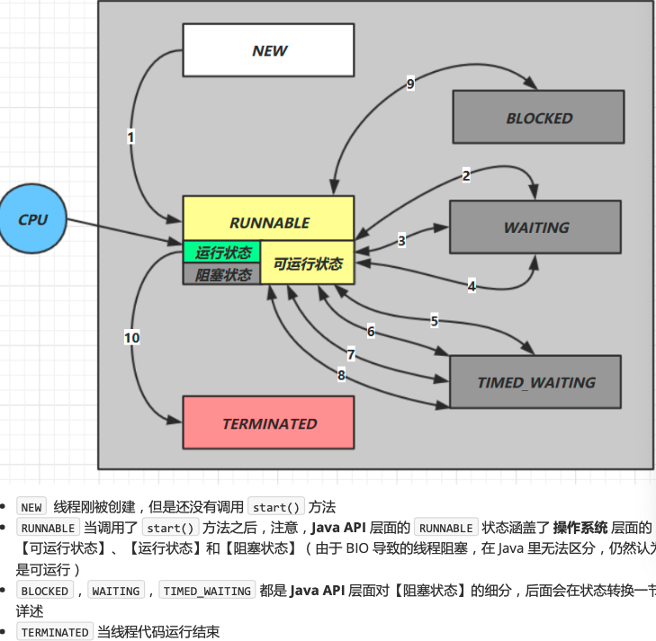
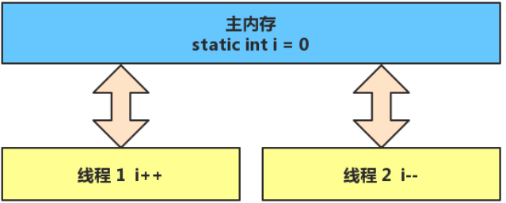

### *进程和线程*

#### 进程

> 程序由指令和数据组成，但是这些指令要运行，数据需要读写，就必须将指令加载到CPU，数据加载到内存，在指令运行过程中还需要使用到磁盘，网络等设备，进程就是用来加载指令，管理内存，管理IO 。
>
> 当一个程序被运行，从磁盘上加载这个程序代码到内存，就开启了一个进程
>
> 是系统进行资源分配和调度的基本单位。

#### 线程

> 一个线程就是一个指令流，将指令流中的一条条指令以一定的顺序给CPU 执行.
>
> 线程是CPU分配的基本单位

#### 线程和进程的关系

> 
>
> 一个进程中有多个线程，多个线程共享进程的堆和方法区资源，但是每个线程有自己的程序计数器和栈区域。
>
> **程序计数器**： 线程私有的，记录当前线程执行的指令地址。
>
> 因为在 `CPU` 时间片轮转的时候，会将当前线程先暂停，然后在去执行其他的线程，而再次执行当前先线程的时候需要接着上次执行的地方继续执行，而程序计数器就是记录着这些继续执行的地址。
>
> **栈**： 用于存储该线程的局部变量
>
> **堆**: 一个进程中最大的一块内存，堆是被进程中的所有线程共享的，是进程创建时分配的
>
> **方法区**: 存放JVM加载的类、常量及静态变量等信息。

### *并行和并发*

#### 并行

> 并发(concurrent) 是同一个时间对多事件处理能力。
>
> > 如一个家庭主妇，打扫卫生，给孩子喂奶，一个人轮流交替做这么多事情



> 如上图，如果只有一个`cpu core` 线程实际还是**申请执行**的，操作系统中有一个组件叫做任务调度器，将 `cpu` 的实际片断分给不同的线程使用，知识由于`cpu`在线程间的切换非常快，使用的时候基本是无感的，总结就是一句话 **微观串行、宏观并行**

#### 并发

> 并发(concurrent) 是同一个时间对多事件处理能力。
>
> > 家庭主妇雇2个保姆，1个打扫卫生，1个给孩子喂奶


---

### *创建线程的几种方式*

#### Runnable

```java
// 创建线程的第二种方法， 推荐方法，可以使用lambda 的方式创建
// Runnable 是一个 functionalInterface
// Runnable 是可运行的任务， 线程要执行的代码， 
Runnable runnable = () -> System.out.println("runable sub thread");
runnable.run();

@FunctionalInterface
public interface Runnable {
    public abstract void run();
}
```

#### Thread

```java
// 创建线程的第一种方法
// Thread 代表一个线程
Thread thread = new Thread(() -> System.out.println("run sub thread"));
thread.setName("t1");
thread.start();
System.out.println("run main thread");
```

> 当创建完thread对象后该线程并没有被启动执行，直到调用了start方法后才真正启动了线程，启动了但是还没有开始执行，而是处于就绪状态，这个就绪状态是指该线程已经获取了除CPU资源外的其他资源，等待获取CPU资源后才会真正处于运行状态。一旦run方法执行完毕，该线程就处于终止状态。
>
> 在方法内获取当前线程直接使用this就可以了，无须使用`Thread.currentThread()`方法
>
> 

#### FutureTask

```java
public class FutureTask<V> implements RunnableFuture<V>

public interface RunnableFuture<V> extends Runnable, Future<V> 

public interface Future<V>{
boolean cancel(boolean mayInterruptIfRunning);
boolean isCancelled();
boolean isDone();
V get() throws InterruptedException, ExecutionException;
...
}

// FutureTask 可以接收 Runnable(无返回、无异常排除)、Callable(可返回，可异常抛出)
@FunctionalInterface
public interface Callable<V> {
 V call() throws Exception;
}

// 例子
FutureTask<Integer> futureTask = new FutureTask<>(() -> {
System.out.println("futureTask callable sub thread");
return 100;
});

// 需要借助 thread 执行， futureTask 中的任务抛到一个线程中去执行
Thread thread1 = new Thread(futureTask);
thread1.start();

// 等待 featureTask 执行结束并返回结果，阻塞
Integer integer = futureTask.get();
System.out.println(integer);
```

### *Java 并发编程中的 API*

#### start 和 run 方法

> 在 `Thread` 中也可以调 `run` 方法的，
>
> ```java
> Thread t = new Thread(() -> System.out.println("running"));
> t.run();
> 
> Thread t = new Thread(() -> System.out.println("running"));
> t.start();
> ```
>
> 代码都是可以执行的，但是 `run` 方法的执行，是在 `main`线程调用了Thread 中的 `run` 方法，
>
> 而`start` 执行，那么Thread 中的 `run` 方法是有新的子线程的执行的
>
> `start` 是不能被多次重复启动的(多此调用)。

#### Sleep 和 yield

> * sleep
>
> > 1. 调用 `sleep` 会让当前线程从 `Running` 进入 `Timed Waiting` 状态(阻塞)
> > 2. 其它线程可以使用 `interrupt` 方法打断正在睡眠的线程，这时 `sleep` 方法会抛出 `InterruptedException`
> > 3.  睡眠结束后的线程未必会立刻得到执行
> > 4. 建议用`TimeUnit` 的 `sleep` 代替 `Thread` 的 `sleep` 来获得更好的可读性
>
> * yield
>
> > 1. 调用 yield 会让当前线程从 Running 进入 Runnable 就绪状态，然后调度执行其它线程
> > 2. 具体的实现依赖于操作系统的任务调度器

#### join

> 主线程中调用
>
> `t1.join()`
>
> 主线程中等待`t1`线程执行结束之后，主线程再继续往下执行。

#### interrupt

> 打断 `sleep`，`wait`，`join `的线程，这几个方法都会让线程进入阻塞状态
>
> `t1.interrupt();`

#### 不推荐使用的API

> * stop
> * suspend
> * resume

#### 主线程和守护线程

> 主线程没有结束，进程不会结束
>
> 除守护线程意外还有运行的线程，包括主线程和子线程，那么进程不会退出
>
> 如果主线程运行结束(包括子线程)，如果还有守护线程在运行，那么进程会结束
>
> 只要进程没有了除守护线程之外的线程，那么进程就会结束。
>
> ```java
> // 设置该线程为守护线程 
> t1.setDaemon(true); 
> ```
>
> 典型的 `Java GC` 就是一个守护线程。

### *线程状态*

线程状态有2种说法，一种是从操作系统角度出发有5种状态，还有就是从`Java` 语言角度出发有6种状态。

* 操作系统角度



* Java 代码角度



---

### *共享模型之管程*

#### 共享问题



> Java 内存模型如上，线程中的变量都是从主线程主内存中缓存来的，当多个线程对主内存中的值进行修改，竞争同一段代码，会导致这段代码的指令交错。指令交错导致结果无法预测。

* 临界区(Critical Section)

> * 一个程序运行多个线程本身是没有问题的
> * 问题出在多个线程访问**共享资源**
>   * 多个线程读共享资源其实也没有问题
>   * 在多个线程对共享资源**读写操作时候发送指令交错**，就出现了问题
> * 一段代码如果存在对共享资源的多线程读写操作，称这段代码为**临界区**

* 竞态条件

> 多个线程在临界区内执行，**由于代码的执行序列不同而导致结果无法预测**

#### synchronized

避免临界区的竞态条件发送，有多重方法可以达到

* 阻塞式的，就是使用 `synchronized` ，`Lock`
* 非阻塞式的，原子变量


#### Monitor

#### wait/notify

#### 状态的转换

#### Lock


