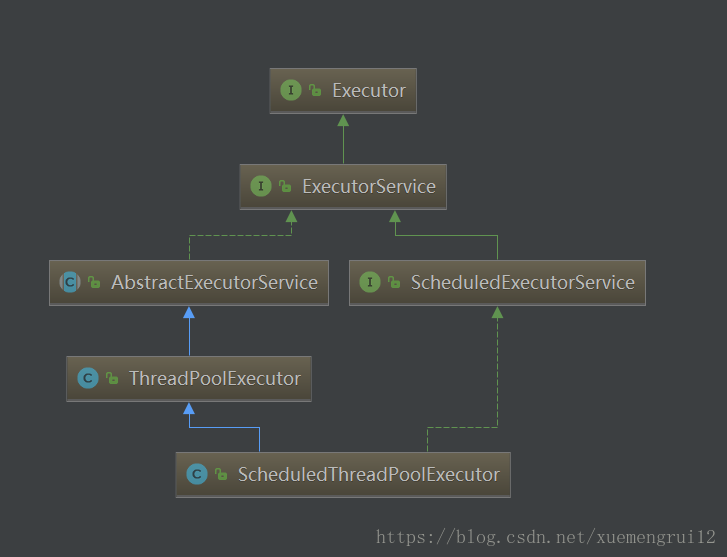

[参考文章](https://blog.csdn.net/xuemengrui12/article/details/78543543)

简单的创建多线程方式，创建一个线程（和后续的销毁）开销是非常昂贵的，因为JVM和操作系统都需要分配资源。而且创建的线程数也是不可控的，这将可能导致系统资源被迅速耗尽。为了能更好的控制多线程，JDK提供了一套Executor框架，其本质就是一个线程池，它的核心成员如下：1



* Executor：一个接口，其定义了一个接收Runnable对象的方法executor，其方法签名为executor(Runnable command)

* ExecutorService：是一个比Executor使用更广泛的子类接口，其提供了生命周期管理的方法，以及可跟踪一个或多个异步任务执行状况返回Future的方法
* AbstractExecutorService：ExecutorService执行方法的默认实现
* ScheduledExecutorServce：一个可定时调度任务的接口
* ScheduledThreadPoolExecutor：ScheduledExecutorService的实现，一个可定时调度任务的线程池
* ThreadPoolExecutor：表示一个线程池，可以通过调用Executors的静态工厂方法来创建一个拥有特定功能的线程池并返回一个ExecutorService对象

> 以上成员均在 `java.util.concurrent`包中, 是 `JDK`并发包的核心类。其中`ThreadpoolExecutor`表示一个线程池。 `Executors`类则扮演着线程池工厂的角色,通过 `Executors`可以取得一个拥特定功能的线程池。从 `UML`图中亦可知, `ThreadPoolExecutor`类实现了 `Executor`接口, 因此通过这个接口, 任何 `Runnable`的对象都可以被 `ThreadPoolExecutor`线程池调度。

**Executor框架提供了各种类型的线程池, 主要有以下工厂方法: **

> * public static ExecutorService newCachedThreadPool()
>
>   > 创建一个可缓存线程池，如果线程池长度超过处理需要，可灵活回收空闲线程，若无可回收，则新建线程，但是在以前构造的线程可用时将重用它们。对于执行很多短期异步任务的程序而言，这些线程池通常可提高程序性能
>
> * public static ExecutorService newFixedThreadPool(int nThreads)
>
>   > 创建一个可重用固定线程数的线程池，以共享的无界队列方式来运行这些线程，超出的线程会在队列中等待。
>
> * public static ScheduledExecutorService newScheduledThreadPool(int corePoolSize)
>
>   > 创建一个定长线程池，支持定时及周期性任务执行。

**计划任务**

> ScheduledExecutorService 可以根据时间需要对线程进行调度,ScheduledExecutorService并不一定会立即安排执行任务。它其实是起到了计划任务的作用，它会在指定的时间对任务进行调度。主要方法如下:
>
> * public ScheduledFuture<?> schedule(Runnable command,long delay, TimeUnit unit);
>
>   > 会在给定时间,对任务进行一次调度
>
> * public ScheduledFuture<?> scheduleAtFixedRate(Runnable comnand,long initialDelay,long period,TimeUnit unit);
>
> * public ScheduledFuture<?> scheduleWithFixedDelay(Runnable command,long initialDelay,long delay,TimeUnit unit)
>
>   > scheduleAtFixedRate( )和 scheduleWithFixedDelay( )会对任务进行周期性的调度。

```java
    private static void newCachedThreadPool() {
        ExecutorService exec = Executors.newCachedThreadPool();
        for (int i = 0; i < 5; i++) {
            exec.execute(new MyThread());
        }
        exec.shutdown();

        /*
            pool-1-thread-1 is running...
            pool-1-thread-4 is running...
            pool-1-thread-3 is running...
            pool-1-thread-2 is running...
            pool-1-thread-5 is running...
         */
    }

    private static void newSingleThreadExecutor() {
        ExecutorService exec = Executors.newSingleThreadExecutor();
        for (int i = 0; i < 5; i++) {
            exec.execute(new MyThread());
        }
        exec.shutdown();
        /*
            pool-1-thread-1 is running...
            pool-1-thread-1 is running...
            pool-1-thread-1 is running...
            pool-1-thread-1 is running...
            pool-1-thread-1 is running...

            结果依次输出，相当于顺序执行各个任务。
         */
    }


    private static void newScheduledThreadPool() {
        ScheduledExecutorService exec = Executors.newScheduledThreadPool(2);
        MyThread thread1 = new MyThread();

        // 将线程放入池中进行执行
        exec.execute(thread1);

        MyThread thread2 = new MyThread();
        exec.execute(thread2);

        // 使用延迟执行风格的方法
        exec.schedule(thread2, 1000, TimeUnit.MILLISECONDS);
        exec.shutdown();
    }

```

**使用 ThreadFactory 接口**

> 使用线程工厂就无需再手工编写对 new Thread 的调用了，从而允许应用程序使用特殊的线程子类、属性等等。

---

**Callable、Future和FutureTask**

> 我们知道创建线程的方式有两种，一种是实现Runnable接口，另一种是继承Thread，但是这两种方式都有个 缺点，那就是在任务执行完成之后无法获取返回结果，那如果我们想要获取返回结果该如何实现呢？
>
> 于是就有了Callable  和 Future 接口

```java
public interface Runnable {
    public abstract void run();
}


public interface Callable<V> { 
      V call() throws Exception; 
}
```

>  `Callable`需要和`Executor`框架中的`ExcutorService`结合使用，我们先看看`ExecutorService`提供的方法：

```java
// submit提交一个实现Callable接口的任务，并且返回封装了异步计算结果的Future。
<T> Future<T> submit(Callable<T> task);

// submit提交一个实现Runnable接口的任务，并且指定了在调用Future的get方法时返回的result对象。
<T> Future<T> submit(Runnable task, T result);

// submit提交一个实现Runnable接口的任务，并且返回封装了异步计算结果的Future。
Future<?> submit(Runnable task);
```

> 因此我们只要创建好我们的线程对象（实现Callable接口或者Runnable接口），然后通过上面3个方法提交给线程池去执行即可。还有点要注意的是，除了我们自己实现Callable对象外，我们还可以使用工厂类Executors来把一个Runnable对象包装成Callable对象。Executors工厂类提供的方法如下：

```java
public static Callable<Object> callable(Runnable task)
public static <T> Callable<T> callable(Runnable task, T result)
```

**Future**

> Future<V>接口是用来获取异步计算结果的，说白了就是对具体的Runnable或者Callable对象任务执行的结果进行获取(get()),取消(cancel()),判断是否完成等操作。我们看看Future接口的源码：

```java
public interface Future<V> {
    boolean cancel(boolean mayInterruptIfRunning);
  
    // 如果任务完成前被取消，则返回true。
    boolean isCancelled();
  
  	// 如果任务执行结束，无论是正常结束或是中途取消还是发生异常，都返回true。
    boolean isDone();
    // 获取异步执行的结果，如果没有结果可用，此方法会阻塞直到异步计算完成。
    V get() throws InterruptedException, ExecutionException;
  
  	// 获取异步执行结果，如果没有结果可用，此方法会阻塞，但是会有时间限制，如果阻塞时间超过设定的timeout时间，该方法将抛出异常。
    V get(long timeout, TimeUnit unit) throws InterruptedException, ExecutionException, TimeoutException;
}

// boolean cancel(boolean mayInterruptIfRunning);
如果任务还没开始，执行cancel(...)方法将返回false；如果任务已经启动，执行cancel(true)方法将以中断执行此任务线程的方式来试图停止任务，如果停止成功，返回true；当任务已经启动，执行cancel(false)方法将不会对正在执行的任务线程产生影响(让线程正常执行到完成)，此时返回false；当任务已经完成，执行cancel(...)方法将返回false。mayInterruptRunning参数表示是否中断执行中的线程。
通过方法分析我们也知道实际上Future提供了3种功能：
  （1）能够中断执行中的任务
  （2）判断任务是否执行完成
  （3）获取任务执行完成后额结果。
但是我们必须明白Future只是一个接口，我们无法直接创建对象，因此就需要其实现类FutureTask登场啦。
```

**FutureTask**

```java
public class FutureTask<V> implements RunnableFuture<V> {
}

public interface RunnableFuture<V> extends Runnable, Future<V> {
    void run();
}
```

> 分析：`FutureTask`除了实现了`Future`接口外还实现了`Runnable`接口，因此`FutureTask`也可以直接提交给`Executor`执行。 当然也可以调用线程直接执行（FutureTask.run()）。接下来我们根据FutureTask.run()的执行时机来分析其所处的3种状态：

状态


> 分析：
> （1）当FutureTask处于未启动或已启动状态时，如果此时我们执行FutureTask.get()方法将导致调用线程阻塞；当FutureTask处于已完成状态时，执行FutureTask.get()方法将导致调用线程立即返回结果或者抛出异常。
> （2）当FutureTask处于未启动状态时，执行FutureTask.cancel()方法将导致此任务永远不会执行。
> 当FutureTask处于已启动状态时，执行cancel(true)方法将以中断执行此任务线程的方式来试图停止任务，如果任务取消成功，cancel(...)返回true；但如果执行cancel(false)方法将不会对正在执行的任务线程产生影响(让线程正常执行到完成)，此时cancel(...)返回false。
> 当任务已经完成，执行cancel(...)方法将返回false。
> 最后我们给出FutureTask的两种构造函数

构造函数

```java
public FutureTask(Callable<V> callable) {
}
public FutureTask(Runnable runnable, V result) {
}
```

如何使用

> 我们现在需要计算一个数据，而这个数据的计算比较耗时，而我们后面的程序也要用到这个数据结果，那么这个时Callable岂不是最好的选择？我们可以开设一个线程去执行计算，而主线程继续做其他事，而后面需要使用到这个数据时，我们再使用Future获取不就可以了吗？下面我们就来编写一个这样的实例。

```java
class CallableDemo implements Callable<Integer> {

    private Integer sum;

    public CallableDemo() {
        this.sum = 0;
    }

    @Override
    public Integer call() throws Exception {
        System.out.println("Callable 开始计算了");
        Thread.sleep(2000);
        for (int i = 0; i < 200; i++) {
            sum = sum + 1;
        }
        return sum;
    }
}

    public static void main(String[] args) {
        ExecutorService singleThreadExecutor = Executors.newSingleThreadExecutor();
        CallableDemo callableDemo = new CallableDemo();

        Future<Integer> future = singleThreadExecutor.submit(callableDemo);

        singleThreadExecutor.shutdown();

        try {
            Thread.sleep(2000);
            System.out.println("主线程在做其他的事情");

            // 这里会阻塞等待 future get 结果
            if (future.get() != null) {
                System.out.println("feature.get(): ==> " + future.get());
            }else {
                System.out.println("feature.get(): ==> " + null);
            }
        } catch (InterruptedException | ExecutionException e) {
            e.printStackTrace();
        }

        System.out.println("主线程事情做完了");
    }

// FutureTask
 public static void main(String[] args) {
        ExecutorService singleThreadExecutor = Executors.newSingleThreadExecutor();
        CallableDemo callableDemo = new CallableDemo();

        FutureTask<Integer> futureTask = new FutureTask<>(callableDemo);

        singleThreadExecutor.submit(futureTask);

        singleThreadExecutor.shutdown();

        try {
            Thread.sleep(2000);
            System.out.println("主线程在做其他的事情");

            // 这里会阻塞等待 future get 结果
            if (futureTask.get() != null) {
                System.out.println("feature.get(): ==> " + futureTask.get());
            }else {
                System.out.println("feature.get(): ==> " + null);
            }
        } catch (InterruptedException | ExecutionException e) {
            e.printStackTrace();
        }

        System.out.println("主线程事情做完了");
    }
```

[参考文章](https://blog.csdn.net/javazejian/article/details/50896505)


