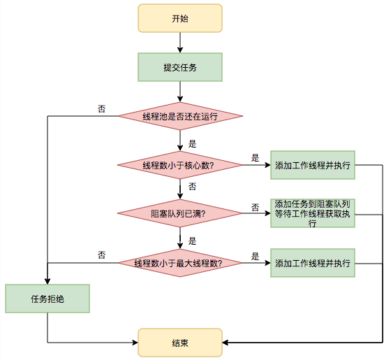

[参考内容](https://www.cnblogs.com/javazhiyin/p/10605511.html)

[美团出品](https://tech.meituan.com/2020/04/02/java-pooling-pratice-in-meituan.html)

#### 主要内容

* 三种创建线程池的方式，以及区别，以及对CPU 和 执行任务效率
* 提交任务策略
* 执行任务策略
* 拒绝任务策略
* `execute` 和方法`addWorker` 以及`worker`是关键逻辑

上篇中提到线程池的创建有一下几种方式

> ```java
> Executors.newSingleThreadExecutor();
> Executors.newCachedThreadPool();
> Executors.newFixedThreadPool(10);
> ```
>
> 三者的源码中使用构造函数是一致的。
>
> * `.newSingleThreadExecutor();`
>
> ```java
> new ThreadPoolExecutor(1, 1,
>          0L, TimeUnit.MILLISECONDS,
>          new LinkedBlockingQueue<Runnable>())
> ```
>
> 线程池中总共有一个线程，这个线程也是核心线程，后多提交的的任务存放在阻塞队列中
>
> * `.newCachedThreadPool`
>
> ```java
> new ThreadPoolExecutor(0, Integer.MAX_VALUE,
>                                       60L, TimeUnit.SECONDS,
>                                       new SynchronousQueue<Runnable>())
> ```
>
> 线程中没有核心线程，只有无数的非核心最大线程，每来一个线程那么使用一个线程，
>
> * `.newFixedThreadPool(10)`
>
> ```java
> new ThreadPoolExecutor(nThreads, nThreads,
>                                       0L, TimeUnit.MILLISECONDS,
>                                       new LinkedBlockingQueue<Runnable>())
> ```
>
> **`ThreadPoolExecutor`** 的构造函数是这样的
>
> ```java
> ThreadPoolExecutor(int corePoolSize,
>                               int maximumPoolSize,
>                               long keepAliveTime,
>                               TimeUnit unit,
>                               BlockingQueue<Runnable> workQueue)
> ```
>
> 固定的线程数，核心线程和总线程数一样的。
>
> `corePoolSize`: 核心线程数
>
> `maximumPoolSize`: 最大线程数
>
> `keepAliveTime`: 线程闲置数据，超过这个时间被回收
>
> `unit` 时间单位
>
> `workQueue`: 阻塞队列，当线程中没有闲置的线程，那么继续提交的任务是放在这个阻塞队列中的。
>
> *`.newFixedThreadPool(10)` 和 `.newSingleThreadExecutor()` 会有`OOM `的问题，当任务太多阻塞队列存放不下的情况，而`.newCachedThreadPool`  会有撑爆 `CPU` 的问题*


#### [剩下的内容主要分为](https://segmentfault.com/a/1190000039088014)

1. 线程池如何维护自身状态。
2. 线程池如何管理任务。
3. 线程池如何管理线程。

##### 线程池如何维护自身状态

```java
// 线程状态和线程数量，共32位，高3位表示线程状态，低29位表示线程数量
private final AtomicInteger ctl = new AtomicInteger(ctlOf(RUNNING, 0));
private static final int COUNT_BITS = Integer.SIZE - 3;
private static final int CAPACITY   = (1 << COUNT_BITS) - 1;

// 运行：111
// 可以提交新的任务，并且也能处理阻塞队列中的任务
private static final int RUNNING    = -1 << COUNT_BITS;
// 关闭：000
// 关闭状态，不再接受新提交的任务，但是可以继续处理阻塞队列中以及保存的任务
private static final int SHUTDOWN   =  0 << COUNT_BITS;
// 停止：001
// 不能接口新任务，也不处理队列中的任务，会中断正在处理的任务的线程
private static final int STOP       =  1 << COUNT_BITS;
// 整理：010
// 所有的任务都以及终止，workerCount(有效线程数)为0
private static final int TIDYING    =  2 << COUNT_BITS;
// 终止：011
// 在 执行 terminated() 方法之后进入该状态
private static final int TERMINATED =  3 << COUNT_BITS;

// 值越大，线程池越不活跃
```

内部有如下几个方法去获取线程状态

```java
private static int runStateOf(int c)     { return c & ~CAPACITY; } //计算当前运行状态
private static int workerCountOf(int c)  { return c & CAPACITY; }  //计算当前线程数量
private static int ctlOf(int rs, int wc) { return rs | wc; }   //通过状态和线程数生成ctl
```


**RUNNING**

1. 状态说明：线程池处在RUNNING状态时，能够接收新任务，以及对已添加的任务进行处理。
2. 状态切换：线程池的初始化状态是RUNNING。换句话说，线程池被一旦被创建，就处于RUNNING状态！

**SHUTDOWN**

1. 状态说明：线程池处在SHUTDOWN状态时，不接收新任务，但能处理已添加的任务。
2. 状态切换：调用线程池的shutdown()接口时，线程池由RUNNING -> SHUTDOWN。

**STOP**

1. 状态说明：线程池处在STOP状态时，不接收新任务，不处理已添加的任务，并且会中断正在处理的任务。
2. 状态切换：调用线程池的shutdownNow()接口时，线程池由(RUNNING or SHUTDOWN ) -> STOP。

**TIDYING**

1. 状态说明：当所有的任务已终止，ctl记录的"任务数量"为0，线程池会变为TIDYING状态。当线程池变为TIDYING状态时，会执行钩子函数terminated()。terminated()在ThreadPoolExecutor类中是空的，若用户想在线程池变为TIDYING时，进行相应的处理；可以通过重载terminated()函数来实现。
2. 状态切换：当线程池在SHUTDOWN状态下，阻塞队列为空并且线程池中执行的任务也为空时，就会由 SHUTDOWN -> TIDYING。

**TERMINATED**

1. 状态说明：线程池彻底终止，就变成TERMINATED状态。
2. 状态切换：线程池处在TIDYING状态时，执行完terminated()之后，就会由 TIDYING -> TERMINATED。


#### 任务执行机制

##### 任务调度

是线程池的如要入口，当用户提交一个任务，接下来这个任务将如何执行都是由这个阶段决定的，任务的调度均是`executor` 决定的，这也是线程池的核心运行机制。

主要完成的工作是：

检查线程线程池的运行状态、运行线程数、运行策略、决定接下来执行的流程

* 直接申请线程执行
* 缓冲到队列中执行
* 直接拒绝该任务

流程图如下：



1. 检查线程池运行状态，如果不是`RUNNING`  则直接拒绝。
2. 如果是在`RUNNING` 状态，那么当前线程数是否小于核心数，如果小于，也就是`workerCount < corePoolSize`，那么启动一个线程并执行任务。
3. 如果这个时候核心线程已满，`workerCount >= corePoolSize`, 且线程池内的阻塞队列没有满，那么将任务添加到阻塞队列中
4. 如果这个时候核心线程已满，`workerCount >= corePoolSize && workerCount < maximumPoolSize`,且线程池内的阻塞队列已满，则创建并启动一个线程，也就是非核心线程去执行任务。
5. 如果 `workerCount >= maximumPoolSize`， 并且阻塞队列已满，则更加拒绝策略处理该任务，默认的处理方式是直接抛出异常。

主要代码如下：

```java
public void execute(Runnable command) {
  if (command == null) throw new NullPointerException();
  int c = ctl.get();
  
  if (workerCountOf(c) < corePoolSize) { // 当前线程数小于核心线程数
    if (addWorker(command, true))
      return;
    c = ctl.get();
  }
  if (isRunning(c) && workQueue.offer(command)) { // 运行状态，且能将任务添加进去, offer 返回true
    int recheck = ctl.get();
    if (! isRunning(recheck) && remove(command)) // 再次检查，如果不是运行状态，那么删除队列中该任务
      reject(command);
    else if (workerCountOf(recheck) == 0)
      addWorker(null, false); // 如果任务运行没有在运行，那么提交一个空任务，去运行 queue 中的任务
  }
  else if (!addWorker(command, false)) // 拒绝策略，addWorker 第二个参数为 false 表示是非核心线程
    reject(command);   // 如果添加失败，那么直接拒绝
}

// 所以主主要的逻辑是在 addWorker 中，添加任务，并运行
```

##### 任务缓冲

线程池是采用生产者消费者模式，通过一个阻塞队列实现，队列中缓存任务，工作线程`Worker对象` 从队列中获取任务。

阻塞队列`BlockingQueue` 是一个支持两个附加操作的队列，在队列为空的时候，获取元素的线程会等待线程变为非空，当队列满的时候，存储元素的线程会等待队列可用，阻塞队列会长用于生产者和消费者模式，生产者是往队列中添加元素的线程，生产者是往队列中塞元素的线程，队列是一个存放元素的容器。


> **阻塞队列（BlockingQueue）**
>
> 是一个支持两个附加操作的队列。这两个附加的操作是：在队列为空时，获取元素的线程会等待队列变为非空。当队列满时，存储元素的线程会等待队列可用。阻塞队列常用于生产者和消费者的场景，生产者是往队列里添加元素的线程，消费者是从队列里拿元素的线程。

而在上面的介绍几种`ExecutorService` 各自有自己使用的阻塞队列

* `LinkedBlockingQueue<Runnable>()`

> 实现方式为单向链表，组成的有界队列，按照FIFO 的原则对元素进行排序，队列的默认长度是`Interger.MAX_VALUE` 所以默认创建的该队列有容量危险

* `SynchronousQueue<Runnable>()`

> 一个不存储元素的阻塞队列，每一个 `put` 操作都必须等待 `take` 操作，否则不能添加元素，支持公平和非公平锁，其使用的一个场景是在线程池中，`newCachedThreadQueuePool` 使用，更加需要(新来的任务) 创建新的线程，如果有空闲线程，则会重复使用。线程60s 之后会回收。

还有其他的 阻塞队列

* `ArrayBlockingQueue`

> 数组实现的有界阻塞队列，次队列按照FIFO 原色对元素进行排序

* `PriorityBlockingQueue`
* `DelayQueue`

##### 任务申请

在任务分配的阶段，任务的执行可能有两种情况

* 一种是任务直接由新创建的线程执行

> 线程初期创建的时候

* 线程从队列中获取任务然后执行

> 这种是线程获取任务的绝大多数情况

执行完任务的空闲线程还会从队列中申请任务，然后再去执行。

上面在任务调度源码中会将任务通过一个`addWork(command)` 的方法添加一个任务。这部分的代码主要地方

**增加线程**

```java
private boolean addWorker(Runnable firstTask, boolean core) {
  retry: // 新语法，后续执行到 break retry; 就会跳到这来，retry 可以是任意名字
  for (;;) {
    int c = ctl.get();
    int rs = runStateOf(c);

    // Check if queue empty only if necessary.
    if (rs >= SHUTDOWN && !(rs == SHUTDOWN && firstTask == null && !workQueue.isEmpty()))
      return false;

    for (;;) {
      int wc = workerCountOf(c);
      if (wc >= CAPACITY || wc >= (core ? corePoolSize : maximumPoolSize))
        return false;
      if (compareAndIncrementWorkerCount(c))
        break retry; // 调到 retry 位置，并不会在进入循环，也就是循环之后了
      c = ctl.get();  // Re-read ctl
      if (runStateOf(c) != rs)
        continue retry; // 调到 retry 位置，会再次进入循环
    }
  }
	
  // 以上的逻辑如下图
  boolean workerStarted = false;
  boolean workerAdded = false;
  Worker w = null;
  
    try {
            w = new Worker(firstTask); // 新任务包装为一个 Worker， worker 中有一个线程
            final Thread t = w.thread; // worker 中取出线程
            if (t != null) {
                final ReentrantLock mainLock = this.mainLock;
                mainLock.lock();
                try {
                    int rs = runStateOf(ctl.get());

                    if (rs < SHUTDOWN || (rs == SHUTDOWN && firstTask == null)) {
                        if (t.isAlive())  throw new IllegalThreadStateException();
                        workers.add(w); // 阻塞队列没有关闭，添加 worker, 是一个 HashSet<Worker>
                        int s = workers.size();
                        if (s > largestPoolSize)
                            largestPoolSize = s;
                        workerAdded = true;
                    }
                } finally {
                    mainLock.unlock();
                }
                if (workerAdded) {
                    t.start(); // 线程启动，也就是会去执行 worker 中的 run 方法， worker 中的run 方法持有worker
                    workerStarted = true;
                }
            }
        } finally {
            if (! workerStarted)
                addWorkerFailed(w);
        }
  // ...
}

// 添加一个 worker， 至于怎么运行，那么就是 worker 的事情了
```


`Worker` 类

```java
Worker(Runnable firstTask) {
  setState(-1); 
  this.firstTask = firstTask;
  this.thread = getThreadFactory().newThread(this); // worker 类中包装了一个线程，该线程是有线程工厂创建
}
```

在 `addWorker` 中执行了线程的 `start` 方法，`worker` 中的 `run` 方法是这样的

```java
public void run() {
  runWorker(this); //  worker 中的run 方法持有worker
}
```

`runWork`  的方法是这样的

```java
final void runWorker(Worker w) {
        Thread wt = Thread.currentThread();
        Runnable task = w.firstTask; // 取出任务
        w.firstTask = null;
        w.unlock(); // allow interrupts
        boolean completedAbruptly = true;
        try {
            while (task != null || (task = getTask()) != null) {
              		// 如果 task 不为空那么执行，否则执行 getTask() 从队列中获取任务，然后赋值 task，并且执行
                w.lock();// AQS 获得独占锁
                if ((runStateAtLeast(ctl.get(), STOP) || (Thread.interrupted() &&
                      runStateAtLeast(ctl.get(), STOP))) && !wt.isInterrupted())
                    wt.interrupt();
                    // 如果线程池已经STOP 状态，那么线程中断
                try {
                    beforeExecute(wt, task); // 一些用户自定义的方法
                    Throwable thrown = null;
                    try {
                        task.run(); // 任务在这里得到执行
                    } catch (RuntimeException x) {
                        thrown = x; throw x;
                    } catch (Error x) {
                        thrown = x; throw x;
                    } catch (Throwable x) {
                        thrown = x; throw new Error(x);
                    } finally {
                        afterExecute(task, thrown);
                    }
                } finally {
                    task = null;
                    w.completedTasks++;
                    w.unlock(); // 释放独占锁
                }
            }
            completedAbruptly = false;
        } finally {
            processWorkerExit(w, completedAbruptly); // 获取不到任务任务，主动回收自己
        }
    }
```

上面的代码中，`while` 中写的这个循环还是非常的高效的，看看`getTask()`如何从队列中获取任务的。


最终移除任务

```java
    private void addWorkerFailed(Worker w) {
        final ReentrantLock mainLock = this.mainLock;
        mainLock.lock();
        try {
            if (w != null)
                workers.remove(w); // 如果w 存在那么移除
            decrementWorkerCount();
            tryTerminate();
        } finally {
            mainLock.unlock();
        }
    }
```


```java
private Runnable getTask() {
        boolean timedOut = false; // Did the last poll() time out?

        for (;;) {
            int c = ctl.get();
            int rs = runStateOf(c);

            // Check if queue empty only if necessary.
            // 池子状态值大于等于 SHUTDOWN，也就是STOP/TERMINATED/TIDYING等
            // 或者queue 是空，那么直接返回空
            if (rs >= SHUTDOWN && (rs >= STOP || workQueue.isEmpty())) {
                decrementWorkerCount();
                return null;
            }

            int wc = workerCountOf(c);
					
            // Are workers subject to culling?
            boolean timed = allowCoreThreadTimeOut || wc > corePoolSize;
            // 如果允许核心线程timeout，并且线程数大于核心线程数
            // 减少核心线程数(回收线程)
            // 或者线程太多了，那也要回收线程
            if ((wc > maximumPoolSize || (timed && timedOut)) && (wc > 1 || workQueue.isEmpty())) {
                if (compareAndDecrementWorkerCount(c))
                    return null;
                continue;
            }

            try {
                // 在这里从队列中获取任务
                Runnable r = timed ?
                    workQueue.poll(keepAliveTime, TimeUnit.NANOSECONDS) :
                    workQueue.take();
                if (r != null)
                    return r;
                timedOut = true;
            } catch (InterruptedException retry) {
                timedOut = false;
            }
        }
    }
```


`getTask`这部分进行了多次判断，为的是控制线程的数量，使其符合线程池的状态。如果线程池现在不应该持有那么多线程，则会返回`null`值。工作线程`Worker`会不断接收新任务去执行，而当工作线程`Worker`接收不到任务的时候，就会开始被回收。

---

#### 拒绝策略

是在执行`execute` 的时候，当当前线程以及到最大线程数，队列中也无法在加入任务，那么就拒绝。

```java
final void reject(Runnable command) {
  handler.rejectedExecution(command, this);
}
```

会有4 种策略。

* `AbortPolicy`

抛出异常

```java
public static class AbortPolicy implements RejectedExecutionHandler {
  public AbortPolicy() { }

  // 抛出异常，异常中会有 任务的信息
  public void rejectedExecution(Runnable r, ThreadPoolExecutor e) {
    throw new RejectedExecutionException("Task " + r.toString() +
                                         " rejected from " +
                                         e.toString());
  }
}
```

* `DiscardPolicy`

扔掉任务，不会有任何信息返回

```java
    public static class DiscardPolicy implements RejectedExecutionHandler {
        public DiscardPolicy() { }
        public void rejectedExecution(Runnable r, ThreadPoolExecutor e) {
        }
    }
```

* `DiscardOldestPolicy`

丢掉队列中最前面的任务，然后重新提交新任务

```java
public static class DiscardOldestPolicy implements RejectedExecutionHandler {
        public DiscardOldestPolicy() { }

        public void rejectedExecution(Runnable r, ThreadPoolExecutor e) {
            if (!e.isShutdown()) {
                e.getQueue().poll(); // 取出队列中最前面的任务
                e.execute(r); // 重新提交新任务
            }
        }
    }
```

* `CallerRunsPolicy`

 提交任务的的线程执行

```java
public static class CallerRunsPolicy implements RejectedExecutionHandler {
        /**
         * Creates a {@code CallerRunsPolicy}.
         */
        public CallerRunsPolicy() { }

        public void rejectedExecution(Runnable r, ThreadPoolExecutor e) {
            if (!e.isShutdown()) {
                r.run(); // 调用的是 run 方法而不是 start 方法，所以线程的执行是由 任务的提交这调用的
            }
        }
    }
```

---

#### 面试考点

1. 创建线程池的五个方法。
2. 线程池的五个状态
3. execute执行过程。
4. runWorker执行过程。
5. [`execute` 和 `submit` 的异同](https://blog.csdn.net/guhong5153/article/details/71247266)

```java
execute提交的方式只能提交一个Runnable的对象，
且该方法的返回值是void，也即是提交后如果线程运行后，和主线程就脱离了关系了，当然可以设置一些变量来获取到线程的运行结果。并且当线程的执行过程中抛出了异常通常来说主线程也无法获取到异常的信息的，只有通过ThreadFactory主动设置线程的异常处理类才能感知到提交的线程中的异常信息。


submit提交的方式有如下三种情况
Future<T> submit(Callable<T> task);
提交一个 Callable 可以有返回值，返回一个Future对象，Future 对象可以获得执行结果
如果发生了异常，那么也可以通过 get 获得异常
  
可以提交一个 runnable
Future<?> submit(Runnable task);
调用get方法的时候，如果线程执行成功会直接返回null，如果线程执行异常会返回异常的信息
  
提交一个 runnable，同时给一个装 结果的参数
Future<T> submit(Runnable task, T result);
线程正常结束的时候调用Future的get方法会返回result对象，当线程抛出异常的时候会获取到对应的异常的信息。
```

