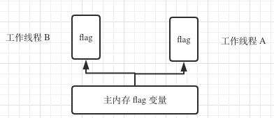
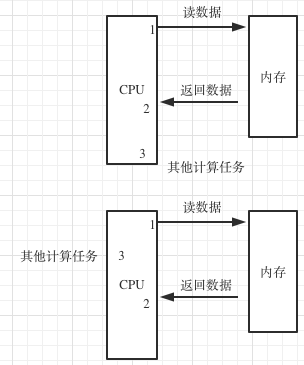
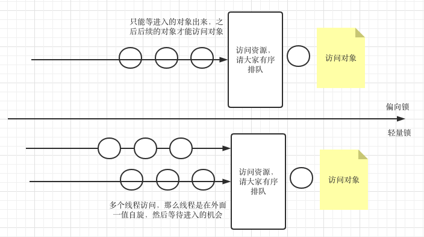
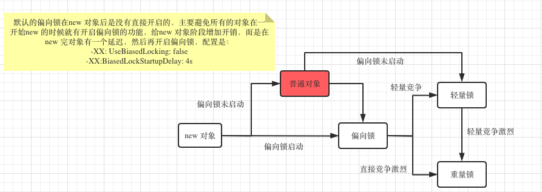

#### *JAVA 如何开启线程、怎么保证线程安全 ？*

##### 首先说下线程和进程

> 进程是操作系**统资源分配**的最小单元、线程是操作系统**任务分配**的最小单元，**线程属于进程。**

##### 如何开启线程

* 继承`Thread` 类型，重下`run` 方法
* 实现`Runnable` 实现 `run` 方法

##### 为什么是使用2中方式呢？

考虑但JDK 单继承、多实现的机制。

##### start 方法 和 run 方法区别

##### 还有其他的不大常用的方式

* `Callable` 接口，可以有返回值
* `FutureTask` 获取线程执行的返回值
* 通过线程池开启线程


#### *有了多线程，那么如何保证线程安全*

##### 什么是线程安全

> 多个线程对同一个共享资源进行操作的时候，发生的不可预测的结果。

##### 保证线程安全核心的思想就是

* 加锁

> 多个线程抢临界区的锁，谁获得锁，那么谁可以对这块代码的访问操作
>
> 每个对象都会在头部信息中加一把锁，表示这个对象是被当前那个线程所拥有
>
> Java 对象中会有三部分数据,对象头、实例数据(定义的各种变量、方法等)、填充数据
>
> 对象头 中会有2部分数据
>
> 1. markword：和当前对象运行状态的一些信息，如`hashcode/锁标准状态信息等`， 对象头中的锁信息就存储在这里
> 2. Classpointer: 执行方法去中存放的该类的一些类型数据

##### 那么如何加锁

* 使用`jvm`  提供的锁，`synchronized`
* `jdK`  实现的各种锁，使用`lock` 实现的各种锁。


#### *Volitile 和 Synchronized 有什么区别？ Volatile 能不能保证线程安全？ DCL(double check lock) 单例为什么加 Volatile*

##### `volatile 和 synchronized` 的区别

> 先以最简练的语句将二者的区别说明白。
>
> ` synchronized` 用于加锁，`volatile` 只是保持变量线程的可见性，通常适用于一个线程写，多个线程读的场景。
>
> 所以 **volatile 不能保证线程的安全，只保证变量的可见性，不能保证原子性**
>
> ```java
> public class TestA {
> 
>     public static boolean flag = true;
> 
>     public static void main(String[] args) {
> 
>         new Thread(() -> {
>             while (flag) {
> 
>             }
> 
>             System.out.println("new thread end");
>         }).start();
> 
>         try {
>             Thread.sleep(5 * 100);
>         } catch (InterruptedException e) {
>             e.printStackTrace();
>         }
> 
>         System.out.println("main thread ... ");
>         flag = false;
>     }
> }
> ```
>
> 如上的代码是一值运行的。
>
> ```java
> public class TestA {
> 
>     public static volatile boolean flag = true;
> 
>     public static void main(String[] args) {
> 
>         new Thread(() -> {
>             while (flag) {
> 
>             }
> 
>             System.out.println("new thread end");
>         }).start();
> 
>         try {
>             Thread.sleep(5 * 100);
>         } catch (InterruptedException e) {
>             e.printStackTrace();
>         }
> 
>         System.out.println("main thread ... ");
>         flag = false;
>     }
> }
> ```
>
> 如果加上 `volatile` 那么就是可以停止的。
>
> 上述两个代码中的不同在于，加上`volatile` 关键字修饰的变量，可以该变量立马感知到其修改。
>
> 那么如何给面试官解释上面的过程呢？ **画图**
>
> 1. `flag` 参数是在主线程中的
> 2. 而在工作线程中是有 `flag` 这个一个缓存变量
> 3. 每个线程在执行的时候都需要从主内存中读取变量放到自己的缓存变量中
> 4. 而这个时候线程 `A`  中对这个变量进行的修改，而线程`B` 是无法感知的，也就是在上述的代码中，主线程中将变量`flag` 修改为`false` 之后，子线程是无法感知的，所以`while` 循环是一值在运行的。
> 5. 而 `volatile` 的机制就是将该变化在现在中是立马可以感知的。
>
> 

##### *当然`volatile` 还有一个作用就是 放置指令重排*

**以单例的设计模式为列说明**

```java
public class TestA {

    private static TestA testA = new TestA();

    private TestA() { }

    private static TestA getInstance() {
        return testA;
    }
}
// 这是一个最简单的单例模式
// 这里有个问题就是，不管这个实例有没有用，在启动的时候就给创建出来
// 最好是能够用的时候再去加载
```

改进

```java
public class TestA {

    private static TestA testA;

    private TestA() { }

    private static TestA getInstance() {
        if (testA == null) // 这里会有线程问题，
            testA = new TestA(); 
       // 第一个问题已经判断了testA==null，并且走到了这里开始创建了
       // 但是呢又来了一个线程，刚好又到了 testA==null 判断条件，这个时候2个线程都会走到 testA = new TestA();  去创建
        return testA;
    }
}
```

改进，加锁

```java
public class TestA {

    private static TestA testA;

    private TestA() {
    }

    private static TestA getInstance() {
        if (testA == null)
            synchronized (TestA.class) {
                testA = new TestA();
            }
        return testA;
    }
}
```

当然这里还是不够完美的，因为当多线多个线程的时候，到达 `synchronized (TestA.class)`, 只有一个锁进入，并创建了对象`TestA`， 而其他的线程都是在外面等待的，当这个线程创建好了对象，并释放了锁，那么其他的需也会进入，去窗口对象，也就是这个时候还不是单例的。

这个时候再进行一次判断，就可以解决这个问题了。

```java
public class TestA {

    private static TestA testA;

    private TestA() {
    }

    private static TestA getInstance() {
        if (testA == null)
            synchronized (TestA.class) {
                if (testA == null) {
                    testA = new TestA();
                }
            }
        return testA;
    }
}
```

那么所谓指令重排就是，如下的例子



计算机的`CPU` 的速度是比`内存快的`， 所以在经过如上的计算的时候，`cpu` 向 `内存` 中读取数据的时候，数据返回会有一定的延迟，而这个时候`cpu` 后续要去做其他的事情，那么这个时候的发生指令重排，也就是在等待第一步返回数据的时候，`cpu` 会先去计算其他的任务，也就是步骤3。那么原来用户定义的执行步骤`1、2、3` 优化为`1、3、2`。

而`volatile` 就可以方式上述事情的发生。

也就是在`DDL` 中使用`volatile` 就是放置指令重排

```java
public class TestA {

    private static volatile TestA testA;
    private TestA() {
    }

    private static TestA getInstance() {
        if (testA == null)
            synchronized (TestA.class) {
                if (testA == null) {
                    testA = new TestA();
                }
            }
        return testA;
    }
}
```


### `JAVA`  线程锁机制是怎样的？ 偏向锁、轻量级锁、重量锁有什么区别，锁机制是如何升级的。

偏向锁是最轻量的，依次是轻量锁，最后是重量锁。

在对象的对象头上有一个`markword` 的标志位可以显示当前对象的锁是什么样的。

**偏向锁**

> 当一个对象只有一个进程使用的时候，加锁之后的就是一个偏向锁。

```java
public class TestA {

    public static void main(String[] args) {
        Object o = new Object();

        System.out.println(ClassLayout.parseInstance(o).toPrintable());
        // markword 标志位 00000001 表示无锁

        synchronized (o) {
            System.out.println(ClassLayout.parseInstance(o).toPrintable());
            // markword 标志位 10000000 表示轻量锁
        }
    }
}
```

##### 轻量锁(自旋锁/无锁)

> 当有较少的线程访问一个对象的时候，锁升级为轻量锁



那么如果轻量锁中竞争的线程太多了，那么就太耗资源了，毕竟那都是在哪里空转。这个时候就完全升级到重量锁。

##### 重量锁

这个时候所谓的重量锁就是涉及到操作系统了，操作系统介入管理这些竞争的线程，由操作系统去通知哪些线程进入。



在回答这个问题的时候，主要是将这里这个图解释清楚。

---

### 谈谈对 AQS 的理解，AQS 如何实现可重入锁。

`AQS` 是`JAVA` 线程同步的框架，是`JDK`· 中很多锁工具的核心实现框架。