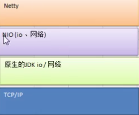
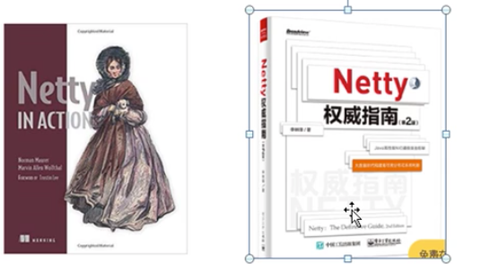
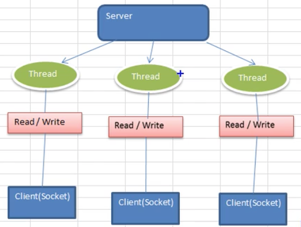
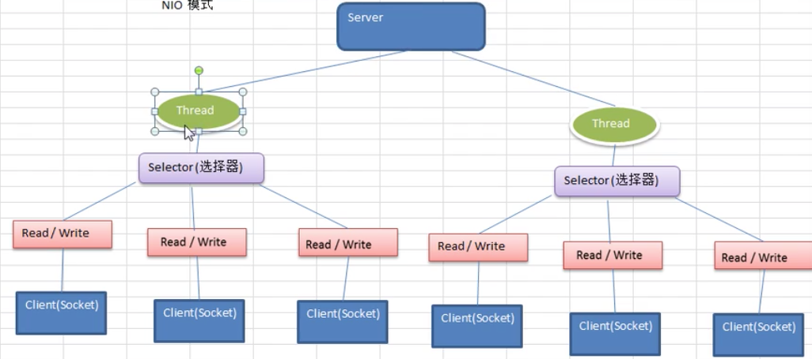

* 什么是Netty

  > Netty 是一个**异步的**(请求发给服务器后不需要等待请求的返回，请求发送方可以继续处理其他的事情，然后当请求处理结束之后，请求在返回的时候知道应该去调用请求发送方的回调函数(处理函数))，**基于事件驱动的**，用以快速开发高性能，高可靠性的网络IO 程序。
  >
  > Netty 主要针对在TCP 协议下，面向Client 端的高并发应用。
  >
  > Netty 本质是一个NIO 框架，适用于服务器通信相关的多重应用场景。
  >
  > **彻底理解Netty，需要先学习NIO**

* Netty JDK TCP 的关系

  > 

* 学习书籍推荐

  > 
  >
  > 第一步注重实战
  >
  > 第二本注重设计理念，但是它是Netty5 写的，而netty5 以及不维护了。

* I/O 模型

  > **I/O模型的简单理解**：I/O模型就是什么样的通道进行数据的发送和接受，很大程序上决定了程序通信的性能，所谓通道就是，比如客户端和服务端建立的通道是单通道还是双通道，是使用的同步的还是异步的、是否使用了缓存、是否是阻塞或者非阻塞的。
  >
  > **Java 中三种网络编程模型**
  >
  > * Java BIO: **同步并阻塞**，服务器实现模式为一个连接一个线程，客户端有连接请求的时候就需要启动一个线程进行处理。缺点：多少个请求就需要多少个线程
  >
  >   
  >
  > * Java NIO: **同步非阻塞**，服务器实现模式为一个线程处理多个请求(连接)，客户端发送的连接请求都会注册到多路复用器上，多路复用器轮询到连接有I/O 请求就进行处理
  >
  >   
  >
  >   
  >
  > * Java AIO：异步非阻塞，AIO 引入异步通道的感念，采用了Proactor 模式，简单化程序编写，有效的请求才启动线程，特点是先由操作系统完成后才通知服务端程序启动线程去处理，一般使用连接数较多且连接时间较长的应用

* 三种模型的使用场景

  > * BIO
  >
  >   连接数目较少，且固定的架构，这种方式对服务器资源要求较高，并发局限于应用中，程序简单理解JDK 1.4 以前支持
  >
  > * NIO
  >
  >   使用用连接数据较多且连接较短的架构，如聊天服务器，弹幕，编程复杂，JDK1.4 开始支持
  >
  > * AIO
  >
  >   连接数据多且连接比较长的架构，如相册服务器，充分调用OS 参与并发操作，编程复杂，JDK7 以上支持，AIO 使用的很少

