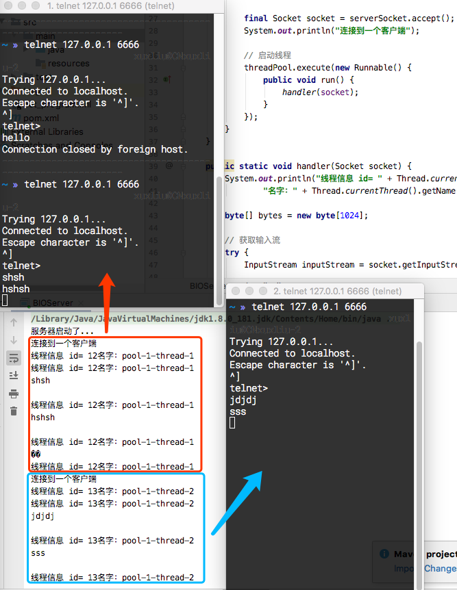
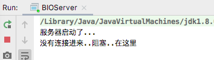
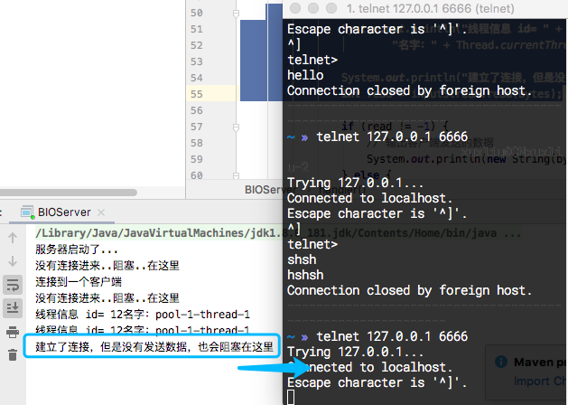
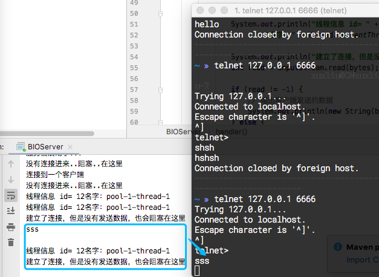

* 简绍

  > Java BIO 就是传统的java io 编程，其相关类和接口在java.io
  >
  > BIO(blocking I/O) 同步阻塞，服务器实现模式为一个连接一个线程，客户端有连接请求是服务器端就需要开启一个线程进行处理，如果这个连接不做任何事情会早不必要的线程开销，可以通过线程池机制改善情况

* 编程简单流程

  > 1. 服务端启动一个ServerSocker
  > 2. 客户端启动Socket 对服务器进行通信，默认情况下服务器端需要对每个客户建立一个线程与之通信
  > 3. 客户端发出请求后，先咨询服务器是否有线程响应，如果没有则会等待或者被拒绝
  > 4. 如果有响应，客户端线程会等待请求结束后，在继续执行
  >
  > 针对客户端和服务端分别流程为：
  >
  > **服务器端：**
  >
  > 1. 创建 `ServerSocket` 对象并且绑定地址（ip）和端口号(port)：` server.bind(new InetSocketAddress(host, port))`
  > 2. 通过 `accept()`方法监听客户端请求
  > 3. 连接建立后，通过输入流读取客户端发送的请求信息
  > 4. 通过输出流向客户端发送响应信息
  > 5. 关闭相关资源
  >
  > **客户端：**
  >
  > 1. 创建`Socket` 对象并且连接指定的服务器的地址（ip）和端口号(port)：`socket.connect(inetSocketAddress)`
  > 2. 连接建立后，通过输出流向服务器端发送请求信息
  > 3. 通过输入流获取服务器响应的信息
  > 4. 关闭相关资源

* 一个实例

  > 1. 使用BIO 模型编写一个服务器端，监听6666端口，当有客户端连接时，就启动一个线程与之通信
  > 2. 要求使用线程池机制改善，可以连接多个客户端
  > 3. 服务点可以接受客户端发送的数据(telnet 方式即可)
  >
  > ```java
  > import java.io.IOException;
  > import java.io.InputStream;
  > import java.net.ServerSocket;
  > import java.net.Socket;
  > import java.util.concurrent.ExecutorService;
  > import java.util.concurrent.Executors;
  > 
  > public class BIOServer {
  > 
  >     public static void main(String[] args) throws IOException {
  >         /**
  >          *  1. 创建一个线程池
  >          *  2. 如果有客户端连接，那么创建爱你一个线程，与之通信
  >          *
  >          */
  > 
  >         ExecutorService threadPool = Executors.newCachedThreadPool();
  > 
  >         ServerSocket serverSocket = new ServerSocket(6666);
  >         System.out.println("服务器启动了...");
  > 
  >         while (true) {
  >             // 监听等待客户端连接
  > 
  >             final Socket socket = serverSocket.accept();
  >             System.out.println("连接到一个客户端");
  > 
  >             // 启动线程
  >             threadPool.execute(new Runnable() {
  >                 public void run() {
  >                     handler(socket);
  >                 }
  >             });
  >         }
  >     }
  > 
  >     public static void handler(Socket socket) {
  >         System.out.println("线程信息 id= " + Thread.currentThread().getId() +
  >                 "名字：" + Thread.currentThread().getName());
  > 
  >         byte[] bytes = new byte[1024];
  > 
  >         // 获取输入流
  >         try {
  >             InputStream inputStream = socket.getInputStream();
  > 
  >             while (true) {
  >                 System.out.println("线程信息 id= " + Thread.currentThread().getId() +
  >                         "名字：" + Thread.currentThread().getName());
  > 
  >                 int read = inputStream.read(bytes);
  > 
  >                 if (read != -1) {
  >                     // 输出客户端发送的数据
  >                     System.out.println(new String(bytes, 0, read));
  >                 } else {
  >                     break;
  >                 }
  >             }
  >         } catch (IOException e) {
  >             e.printStackTrace();
  >         }
  >         finally {
  >             System.out.println("关闭连接");
  >             try {
  >                 socket.close();
  >             } catch (IOException e) {
  >                 e.printStackTrace();
  >             }
  >         }
  >     }
  > }
  > ```
  >
  > 使用 telnet 测试
  >
  > 
  >
  > 如上每一次建立一个 telnet (有多少个客户端)连接那么就会新的创建一个线程连接
  >
  > 然后修改代码，在测试阻塞的地方
  >
  > ```java
  > ...
  >   
  > System.out.println("没有连接进来..阻塞..在这里");
  > final Socket socket = serverSocket.accept();
  > System.out.println("连接到一个客户端");
  > 
  > ...
  >  
  >         while (true) {
  >                 System.out.println("线程信息 id= " + Thread.currentThread().getId() +
  >                         "名字：" + Thread.currentThread().getName());
  > 
  >                 System.out.println("建立了连接，但是没有发送数据，也会阻塞在这里");
  >                 int read = inputStream.read(bytes);
  > ...
  > ```
  >
  > 启动程序，但是并没有启动客户端
  >
  > 
  >
  > 启动客户端，但是不发送数据
  >
  > 
  >
  > 然后发送一条数据之后(完成一次处理客户端请求之后)，就继续则继续阻塞在这里
  >
  > 

* 问题总结

  > * **每个请求需要创建独立的线程**，与对应的客户端进行数据Read，业务处理，数据Write
  > * 当并发数较大的时候，需要创建爱你大量线程来处理连接，**系统资源占用较大**
  > * 连接建立之后，如果当前线程暂时没有数据可读，则现在就**阻塞**在Read 操作上，造成线程**资源浪费**
  
  线程池可以改善线程创建造成的浪费问题，但是仅仅是改善缓解，并没有从根本上解决问题。

