* 简绍

  > Java NIO Java non-blocking IO 是指JDK 提供的新的API，从JDK1.4 开始，Java 提供了一系列改进的输入/输出的新特性，被统称为 NIO(New IO)，**同步非阻塞**
  >
  > 面向缓冲(Buffer)的，基于通道(Channel)的 I/O 操作方法

* NIO 三大核心部分

  > * Channel：请求写到 Buffer 中
  > * Buffer
  > * Selector： 选择一个通道
  >
  > NIO 是面向缓冲区，或者面向块编程的，数据读取到一个它稍后处理的缓冲区，需要时刻在缓冲区中前后移动，这就增加处理过程中的灵活性，使用它可以提供非阻塞式的高伸缩网络
  >
  > 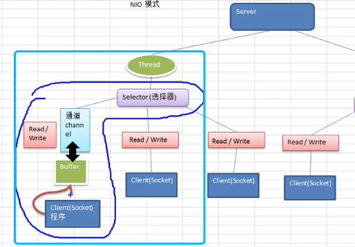
  >
  > 在客户端和服务端建立连接之后，发送的数据的过程中，就算数据还没有发送结束，那么服务端也是可以在做其他事情的。
  >
  > NIO 提供了与传统 BIO 模型中的 `Socket` 和 `ServerSocket` 相对应的 `SocketChannel` 和 `ServerSocketChannel` 两种不同的套接字通道实现

* NIO 和 BIO 的比较

  > BIO 是以流的方式处理数据，而NIO 是以块的方式处理数据，块I/0 的效率比流I/O 高很多
  >
  > BIO 是阻塞的，NIO 则是非阻塞的
  >
  > BIO 是基于字节流和字符流进行操作，而NIO 基于channel 和 Buffer 进行操作，数据总是从通道读取到缓冲区中，或者重缓冲区写入到通道中，Selector 用于监听多个通道的事件(如连接请求，数据到达等)，因此使用单个线程就可以监听多个客户端通道

* NIO 三大核心原理示意图

  > * 每个channel 对应一个buffer
  > * 一个 selector 会对应一个线程，一个线程对应多个channel(连接)
  > * 该图反映了又三个 channel 注册到了该Selector
  > * 程序切换到那个channel，是由事件决定的，这个事件就是非常重要的概念
  > * selector 会根据不同的事件，在各个通道上切换
  > * buffer 本质就是一个内存块，底层是一个数组
  > * 数据的读取是通过buffer，这个和BNIO 不同，BIO 中要么输入流或者是输出流，他不会是双向的，但是我们的NIO 的buffer是可以读也可以写，需要flip方法切换
  > * channel 是双向的，可以返回低等操作系统的情况，比如 linux 底层的操作咨询 通道就是双向的
  >
  > 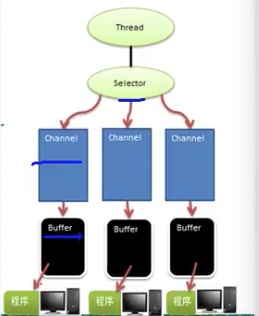

----

* 缓冲区

  > 缓冲区本质是一个可读写数据的内存块，可以理解为是一个**容器对象(含数组)**，该地下提供了一组方法， 可以更轻松的使用内存块，缓冲区对象内置了一些机制，能够跟踪和记录缓冲区的状态变化情况，Channel 提供从文件、网络读取数据的驱动，但是读取或者写入的数据必须经过Buffer
  >
  > 
  >
  > NIO 中 Buffer 是一个 顶层父类，它是一个抽象类，
  >
  > 重要的四个属性
  >
  > ```java
  > private int mark = -1; // 标志，很少去改动
  > private int position = 0; // 下一次要被读或者写的元素的索引
  > private int limit;    // 缓冲区的终点，超过和这个终点不能发生读和写
  > private int capacity; // 容量
  > 
  > IntBuffer intBuffer = IntBuffer.allocate(5);
  > // 输出
  > ```
  >
  > 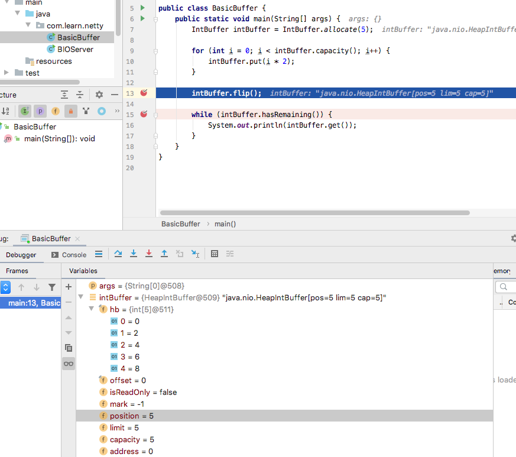
  >
  > 创建了5和容量的数组，容量为5，极限位置也是5，每插入一个元素，position 总是会指向到下一次可操作的位置。
  >
  > 而经过 flip() 之后 posotion 就会变为0. 后面while 循环中每一次读数据，position 指向下一位
  >
  > ByteBuffer 是Java 中的基本数据类型，都有一个Buffer 类型与之相对应， 最长用的自然就是 BuyeBuffer(二进制数据)

* Channel

  > NIO 通道类似于流，但有些区别如下:
  >
  > * 通道可以同时进行读写，而流只能读写或者只能写
  > * 通道可以实现异步读写数据
  > * 通道可以从缓冲区读数据，也可以写数据到缓存
  >
  > 从Channel 代码的角度来看
  >
  > * Channel 是 一个接口
  >
  >   ```java
  >   public interface Channel extends Closeable
  >   ```
  >
  > * 针对不同的用途，有不同的 Chanel，如FileChannel 用于传输数据，SocketChannel 用于TCP 协议通信
  >
  > 一个例子 本地写文件
  >
  > 
  >
  > 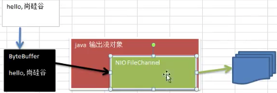
  >
  > 先将读到的数据读到 ByteBuffer 中，然后将数据留到Channel 中，最终通过底层的Java 底层流输出对象输出到文件中
  >
  > ```java
  > // 本地写文件
  > public class NIOFileChannel {
  >     public static void main(String[] args) throws IOException {
  >         String str = "fdsafdsafdsafdsafds";
  > 
  >         // 创建一个输出流 -> channel
  >         FileOutputStream out = new FileOutputStream("/Users/xuxliu/Ifoods/Java/net_program/src/main/resources/data/file1.txt");
  > 
  >         // 获取对于的 fileChannel, 这里他的真实类型是 FileChannelImpl
  >         FileChannel fileChannel = out.getChannel();
  >         // 创建一个缓冲区
  >         ByteBuffer byteBuffer = ByteBuffer.allocate(1024);
  >         // 写入到缓存
  >         byteBuffer.put(str.getBytes());
  >         // 翻转，开始读
  >         byteBuffer.flip();
  >         // 缓冲区写到通道
  >         fileChannel.write(byteBuffer);
  >         out.close();
  >     }
  > }
  > ```
  >
  > 例子： 文件中读数据
  >
  > 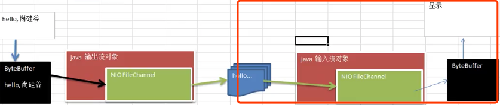
  >
  > ```java
  >     public static void main(String[] args) throws Exception {
  > 
  >         File file = new File("/Users/xuxliu/Ifoods/Java/net_program/src/main/resources/data/file1.txt");
  > 
  >         FileInputStream fileInputStream = new FileInputStream(file);
  > 
  >         FileChannel channel = fileInputStream.getChannel();
  > 
  >         ByteBuffer byteBuffer = ByteBuffer.allocate((int) file.length());
  > 
  >         // 通道中读数据到 Buffer
  >         channel.read(byteBuffer);
  > 
  >         // 字节转为String
  >         // 一次性返回 buffer 中内容(hb)
  >         System.out.println(new String(byteBuffer.array()));
  > 
  >         fileInputStream.close();
  >     }
  > ```
  >
  > 例子：拷贝文件
  >
  > 
  >
  > ```java
  > private void copy() throws IOException {
  >         FileInputStream fileInputStream = new FileInputStream(root + "file2.txt");
  >         FileChannel inputChannel = fileInputStream.getChannel();
  > 
  >         FileOutputStream fileOutputStream = new FileOutputStream(root + "file3.txt");
  >         FileChannel outputChannel = fileOutputStream.getChannel();
  > 
  >         ByteBuffer byteBuffer = ByteBuffer.allocate(512);
  > 
  >         // buffer 中从 channe 中读数据，写到 buffer 中
  >         while (true) {
  > 
  >             // 这里重要操作，clear 清空 buffer(重置关键属性)
  >             byteBuffer.clear();
  >             int read = inputChannel.read(byteBuffer);
  >             System.out.println("read=" + read);
  >             if (read == -1)
  >                 break;
  > 
  >             byteBuffer.flip();
  >             // buffer 中数据写到 输出 channel 中
  >             outputChannel.write(byteBuffer);
  >         }
  >      
  >         fileInputStream.close();
  >         fileOutputStream.close();
  >     }
  > ```
  >
  > 这里第14行的代码是不能少的，clear() 方法
  >
  > ```java
  >     public final Buffer clear() {
  >         position = 0;
  >         limit = capacity;
  >         mark = -1;
  >         return this;
  >     }
  > ```
  >
  > 就是讲buffer 中的状况reset，在程序执行的过程中，每次冲file2.txt 中读进来 512 byte 数据(我的文件里面只给了够45 byte 的数据)，一次会将 file2.txt 全部读进来，
  >
  > 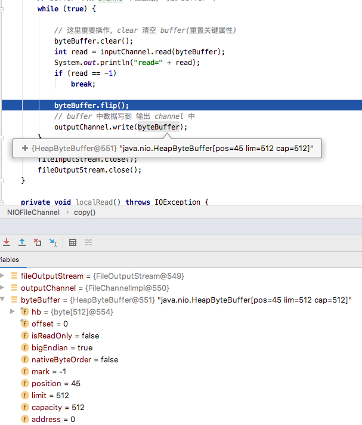
  >
  > 这个时候position=45 已经将数据读完，而 limit 和 capacity=512 这是预支的，正常的
  >
  > 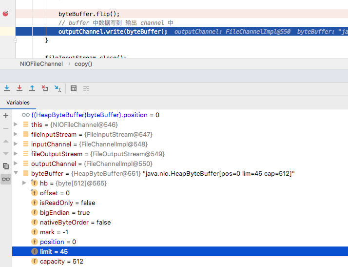
  >
  > flip 之后position 变为0，以及limit 变为 45，这里flip 之后是要去读，所以position=0，表示可以从0-45 读出这么多数据，然后执行完write，在回到下一次
  >
  > 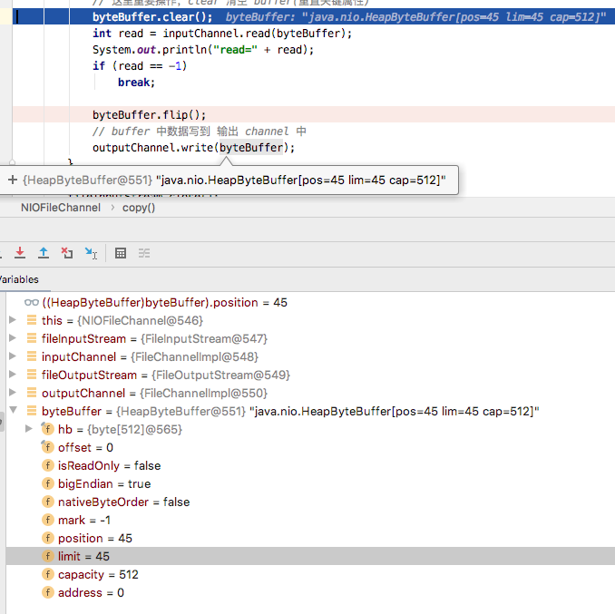
  >
  > 这个时候 position 由回到了之前的45，这样 position 已经到了limit最后，所以这个时候如果不 clear()， 那么就不会继续去读取了，所以read=0，而后续的操作中 read都会一直是0，不会是-1，也就不会退出循环，所以这里需要这个 clear，清空上一次的读取，继续读取去发现数据以及被读完了，所以才会返回-1，退出循环
  >
  > 例子：目标通道中复制数据到当前通道
  >
  > ```java
  > // 创建相关流
  > FileInputStream inputStream = new FileInputStream(root + "16.png");
  > FileOutputStream outputStream = new FileOutputStream(root + "16_copy.png");
  > 
  > // 获取channel
  > FileChannel inputChannel = inputStream.getChannel();
  > FileChannel outChannel = outputStream.getChannel();
  > 
  > // transferFrom channel 之间的拷贝
  > outChannel.transferFrom(inputChannel, 0, inputChannel.size());
  > 
  > inputChannel.close();
  > outChannel.close();
  > 
  > inputStream.close();
  > outputStream.close();
  > }
  > ```

* 使用Buffer Channle 注意事项

  > * ByteBuffer 支持类型化的 put 和 get，也就是说read 和 get 操作都需要有相同的数据类型
  >
  >   ```java
  >   public static void main(String[] args) {
  >           ByteBuffer buffer = ByteBuffer.allocate(64);
  >
  >           buffer.putInt(100);
  >           buffer.putLong(1);
  >           buffer.putChar('上');
  >           buffer.putShort((short) 4);
  >
  >           buffer.flip();
  >
  >           System.out.println(buffer.getInt());
  >           System.out.println(buffer.getLong());
  >           System.out.println(buffer.getChar());
  >           System.out.println(buffer.getShort());
  >       }
  >   ```
  >
  > * 可以将一个普通的Buffer 转为只读的 Buffer
  >
  >   ```java
  >   public static void main(String[] args) {
  >     ByteBuffer buffer = ByteBuffer.allocate(64);
  >
  >     buffer.putInt(100);
  >     buffer.putLong(1);
  >     buffer.putChar('上');
  >     buffer.putShort((short) 4);
  >
  >     buffer.flip();
  >
  >     // 得到一个只读的 buffer
  >     ByteBuffer onlyReadBuffer = buffer.asReadOnlyBuffer();
  >     System.out.println(onlyReadBuffer.getClass());
  >     // class java.nio.HeapByteBufferR
  >
  >     System.out.println(buffer.getInt());
  >     System.out.println(buffer.getLong());
  >     System.out.println(buffer.getChar());
  >     System.out.println(buffer.getShort());
  >
  >     onlyReadBuffer.putLong(12); // java.nio.ReadOnlyBufferException
  >   }
  >   ```
  >
  > * NIO 还提供了MappedByteBuffer，可以让文件直接在内存中进行修改，而如何同步到文件由NIO完成
  >
  >   ```java
  >       private void mappedByteBuffer() throws IOException {
  >           RandomAccessFile randomAccessFile = new RandomAccessFile(root + "file3.txt", "rw");
  >   
  >           FileChannel channel = randomAccessFile.getChannel();
  >   
  >           /**
  >            * MappedByteBuffer： 可以让文件之间在内存中修改，是操作系统级别的操作，文件不需要进行拷贝
  >            * READ_WRITE 使用读写模式
  >            * 参数2：0 可以直接修改的起始位置
  >            * 参数3：5 映射到内存的大小(不是索引位置)，可以将file1.txt 的多少个字节隐射到内存，这里可以修改的
  >            *       范围是[0-5)
  >            */
  >           MappedByteBuffer map = channel.map(FileChannel.MapMode.READ_WRITE, 0, 5);
  >   
  >           map.put(0, (byte) 'H');
  >           map.put(5, (byte) 'Y');
  >   
  >           randomAccessFile.close();
  >       }
  >   ```
  >
  > 
  >
  > * NIO 还支持多个 buffer 的读和写
  >
  >   ```java
  >   private void manyBufferScatteringAndGathering() throws IOException {
  >     /*
  >            * scattering: 将数据写入到buffer 时，可以采用buffer数组，依次写入（一个写完继续写下一个）
  >            * gethering: 从buffer 读取数据的时候，可以采用 buffer 数组，依次读取（一个读完读一个）
  >            *
  >            * 使用 serverSocketChannel 和 SocketChannel
  >            */
  >   
  >     ServerSocketChannel socketChannel = ServerSocketChannel.open();
  >   
  >     InetSocketAddress socketAddress = new InetSocketAddress(7000);
  >   
  >     //保定端口打平Socket，并启动
  >     socketChannel.socket().bind(socketAddress);
  >   
  >     //创建 buffer 数组
  >     final ByteBuffer[] byteBuffers = new ByteBuffer[2];
  >     byteBuffers[0] = ByteBuffer.allocate(5);
  >     byteBuffers[1] = ByteBuffer.allocate(3);
  >
  >
  >     SocketChannel accept = socketChannel.accept();
  >     int messageLength = 8; // 假设从客户端接收 8 个字节
  >     while (true) {
  >       int byteRead = 0;
  >       while (byteRead < messageLength) {
  >         // 返回读取到的字数
  >         long read = accept.read(byteBuffers);
  >         byteRead += read;
  >         System.out.println("byteRead=" + byteBuffers.length);
  >     
  >         Arrays.asList(byteBuffers)
  >           .stream()
  >           .map(byffer -> "position=" + byffer.position() + ", limit=" + byffer.limit())
  >           .forEach(System.out::println);
  >       }
  >     
  >       Arrays.asList(byteBuffers).forEach(Buffer::flip);
  >     
  >       long byteWrite = 0;
  >       while (byteWrite < messageLength) {
  >         long writeCnt = accept.write(byteBuffers);
  >         byteWrite += writeCnt;
  >       }
  >     
  >       //复位
  >       Arrays.asList(byteBuffers).forEach(Buffer::clear);
  >       System.out.println("byteRead:=" + byteRead + " byteWrite=" + byteWrite + ", messagelength" + messageLength);
  >     }
  >   }
  >
  >   ```

* Selector 

  > * Java 的 NIO 用非阻塞的IO 方式，可以用一个线程，处理多个的客户端连接，就会使用到Selector
  > * Selector 能够检测多个注册的通道上是否有事件发生(多个Channel 以时间的方式可以注册到同一个selector)，如果有事件发生，便获取事情然后针对每个事件进行对于的处理，这样就可以只使用一个单线程管理多个通道，也就是多个连接请求
  > * 只有在连接/通道真正有读写事件发生时候，才会进行读写，就大大减少了系统开心，并且不必为每个连接都创建一个线程，不用去维护多个线程
  > * 避免了多线程之间的上下文切换导致的开销
  >
  > 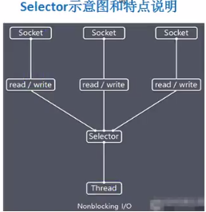
  >
  > * Netty 的IO 线程NioEventLoop 聚合了selector 选择器也叫多路复用器，可以同时并发处理成百上千个客户端连接
  > * 线程从某个客户端Socket 通道进行读写数据时候，若没有数据可用时候，该线程可以进行其他任务
  > * 线程通常将非阻塞IO 的空闲时间用户其他通道上执行IO 操作,所以单独的线程可以管理多个输入和输出通道。
  > * 由于读写操作都是非阻塞的，这就可以充分提升IO线程的运行效率，避免由于频繁I/O阻塞导致的线程挂起
  > * 一个I/O线程可以并发处理N个客户端连接和读写操作，这从根本上解决了传统同步阻塞I/O一个连接一个线程模型，架构的性能，弹性伸缩能力和可靠性都得到了极大的提升
  >
  > 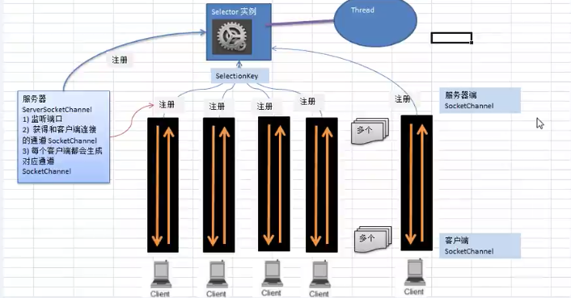
  >
  > 1. 当客户端连接时候，会通过ServerSocketChannel 得到SocketChannel
  >
  > 2. 将SocketChannel 注册到Selector 上, 一个selector 上可以注册多个SocketChannel
  >
  >    注册的接口为 register(Selector sel, int ops)
  >
  >    其中 ops 表示的是检测通道中发生的事件的类型，也就是此次注册，只关注管道中发生的该类事件
  >
  >    ```
  >    OP_READ、OP_WRITE、OP_CONNECT、OP_ACCEPT
  >    ```
  >
  > 3. 注册后返回一个 selectionKey，回和该selector 关联起来
  >
  > 4. selector 可以进行监听，使用的方法就是 select 方法，该方法返回当前发生了事情的通道个数
  >
  > 5. 进一步得到各个 SelectorKey(有事件发生)
  >
  > 6. 再通过SelectionKey反向获取SocketChannel，方法 channel()
  >
  > 7. 可以通过得到的cahnnel 完成，业务处理逻辑
  >
  > * NIO 非阻塞网络编程
  >
  > 1. 编写一个NIO 入门案例，实现服务器端和客户端之间的数据简单通信(非阻塞)
  > 2. 理解NIO非阻塞网络编程机制

* 群聊系统

  > * 编写一个NIO 群聊系统，实现服务器和客户端之间的数据简单通讯
  >
  > * 实现多人群聊
  > * 客户端：通过channel 可以无阻塞发送消息给其他所有用户，同时可以接受其他用户放的信息
  > * 目的：进一步理解NIO 非阻塞网络编程机制

* **零拷贝技术** 更少的复制

  > * 内存映射（mmap）
  > * sendFile
  >
  > Java 传统的IO 和网络编程的代码
  >
  > ```java
  > File file = new File("test.txt")
  > RandomAccessFile raf = new RandomAccessFile(file, "rw")
  >   
  > byte[] arr = new byte(int)file.length()
  > raf.read(arr)
  >   
  > Socket socket = new ServerSocket(8080).accept()
  > socket.getOutputStream().write(arr) 
  > ```
  >
  > 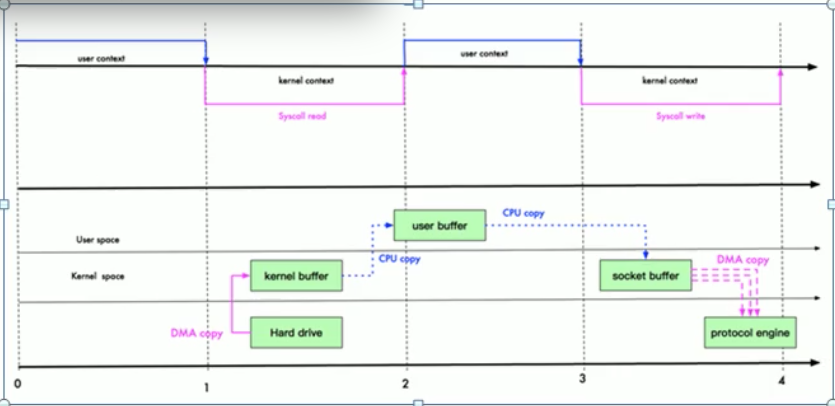
  >
  > 以上的过程中，从操作系统硬盘 -> 操作系统内核缓存 -> 用户缓存(用户对数据可以做一些操作) -> socket 缓存 -> 最后落回到协议引擎，这过程每步骤都会涉及到拷贝。而且从内核态到用户的态的切换也发生了4次。
  >
  > DMA（Direct memory access）
  >
  > **使用mmap**
  >
  > 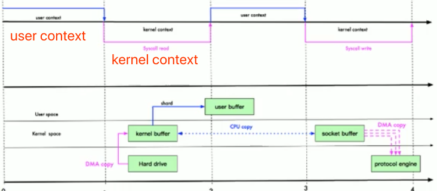
  >
  > 通过内存映射，**将文件映射到内核缓冲区，同时用户空间可以共享内核空间的数据**，用户已可以直接在内核缓存中操作数据，而不需要将数据从内核缓存中再复制到用户缓存中，然后内核缓存通过CPU 复制，直接将数据复制到 socket buffer 中，然后写入
  >
  > 使用内存映射减少了一次复制(没有做到零拷贝)
  >
  > **sendFile 优化**
  >
  > **所谓零拷贝技术不是说不发生拷贝，而是相对于操作系统而言，不发生CPU 拷贝**
  >
  > 在sendFile 2.4版本中
  >
  > 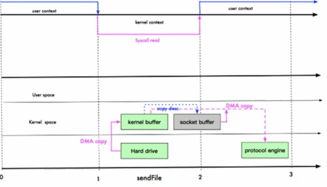
  >
  > 如上的方式，硬盘数据读到内核缓存中后，用户之间在这里完成操作，然后内核缓存数据可以直接写到协议引擎中，这里灰色的socket buffer 中只会涉及到很少数据的 cpu 拷贝，所以基本可以认为这是零拷贝
  >
  > **拷贝次数，变为了2次**
  >
  > mmp sendFile 区别
  >
  > > Mmap 适合小数据量读写，sendFile 适合大数据文件传输
  > >
  > > mmap 需要4次上下文切换，3次数据拷贝， sendFile 需要3次上下文切换，最少2次文件拷贝
  > >
  > > sendFile 可以利用DMA 方式减少CPU 拷贝，mmap 则不行(必须从内核拷贝到Socket 缓冲区)

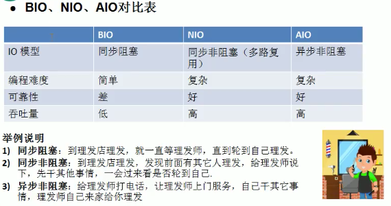

### NIO 为啥更好？

**相比于传统的 BIO 模型来说， NIO 模型的最大改进是：**

1. 使用比**较少的线程便可以管理多个客户端的连接**，提高了并发量并且减少的资源消耗（减少了线程的上下文切换的开销）
2. 在没有 I/O 操作相关的事情的时候，线程可以被安排在其他任务上面，以让**线程资源得到充分利用**。

### 使用 NIO 编写代码太难了

一个使用 NIO 编写的 Server 端如下，可以看出还是整体还是比较复杂的，并且代码读起来不是很直观，并且还可能由于 NIO 本身会存在 Bug。

很少使用 NIO，很大情况下也是因为使用 NIO 来创建正确并且安全的应用程序的开发成本和维护成本都比较大。