* 原生NIO 存在的问题

  > * NIO 的类库和API 繁杂，使用麻烦，需要熟练掌握 Selector、ServerSocketChannel、ByteBuffer 等
  > * 需要具备其他的额外技能，熟悉Java 多线程，网络编程等
  > * 开发工作量和难度大，
  > * JDK NIO 的bug

* 什么是Netty

  > 简单用 3 点概括一下 Netty 吧！
  >
  > 1. **Netty 是一个基于 NIO 的 client-server(客户端服务器)框架，使用它可以快速简单地开发网络应用程序。**
  > 2. 它极大地简化并简化了 TCP 和 UDP 套接字服务器等网络编程,并且性能以及安全性等很多方面甚至都要更好。
  > 3. 支持多种协议如 FTP，SMTP，HTTP 以及各种二进制和基于文本的传统协议。
  >
  > **Netty 成功地找到了一种在不妥协可维护性和性能的情况下实现易于开发，性能，稳定性和灵活性的方法。**
  >
  > Netty 是一步的，事件驱动的框架，快速开发高性能服务器和客户端
  >
  > 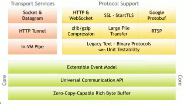
  >
  > Netty 是有JBoss 提供的一个Java 开源矿建，Netty 提供异步的，基于事件驱动的网络引用程序框架，用以快速开发高性能、高可靠的网络IO程序。
  >
  > Netty 帮助快速简单的开发出一个网络引用，相当于简化和流程化了NIO 的开发过程。
  >
  > Netty 是目前最流行的NIO 框架

* Netty 的架构设计

  > * 线程模型
  >   * 传统阻塞I/O模型
  >   * Reator 模式
  >   * 根据Reator 的数量和处理资源池线程的数量不同有3中典型的实现
  >     * 单Reator 单线程
  >     * 单Reator 多线程
  >     * 主从Reator 多线程
  >   * Netty 线程模型(Netty 主要基于主从Reator 多线程模型做了一定的改进，其中主从Reator 多线程模型有多个Reator)
  >
  > *  传统阻塞IO模型
  >
  >   > 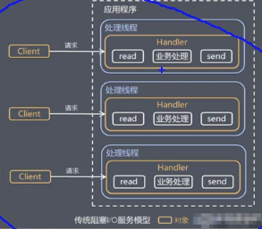
  >
  >   * 采用阻塞IO模式获取输入的数据
  >   * 每个连接都需要独立的线程完成数据的输入，业务处理，数据返回
  >   * 当并发数很大，就会创建大量的线程，占用很大系统资源
  >   * 连接创建后，如果当前线程暂时没有数据可读，该线程会阻塞在 read 操作上，造成线程资源浪费
  >
  > * Reator 模式: 基于传统阻塞IO服务模型的2个缺点，解决方案
  >
  >   > **基于IO 复用模型**，多个连接公用一个阻塞对象，应用程序值需要在一个阻塞对象等待，无序阻塞等待所有连接，无需阻塞等待所有连接，当某个连接有新的数据可以处理时候，操作系统通知引用程序，线程从阻塞状态返回，开始进行业务处理
  >   >
  >   > **基于线程池复用线程资源**，不必在为每个连接创建线程，将连接完成后的业务处理任务分配给线程进程处理，一个线程可以处理多个连接的业务。
  >   >
  >   > 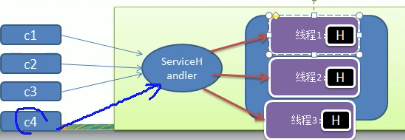
  >   >
  >   > IO 复用可以理解为分发
  >   >
  >   > 线程池复用，如将C1 请求发给线程1处理，然后当请求C4来的时候，刚好线程1处理完了，那么可以将C4 继续给线程1处理。
  >   >
  >   > **Reator 整理设计理念**
  >   >
  >   > 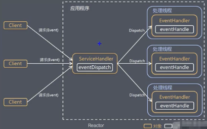
  >   >
  >   > * 通过一个或者多个输入同时传递给服务处理器ServiceHandler(基于事件驱动)
  >   > * 服务器的程序处理传入的多个请求，并将它们同步分配到相应的处理线程，所以Reator 模式也称为Dispator 模式，
  >   > * Reator 模式使用 IO 复用监听事件，收到事件后，分发给某个线程，这点就是网络服务器高并发处理的关键
  >   >
  >   > **核心组成部分**
  >   >
  >   > * 在单独的一个线程中运行，负责监听和分发事件，分发给适当的处理程序来对IO事件作出反应，如上图中的ServiceHandler
  >   > * Handler：处理IO事件完成的的实际事件，就是上襦中的EventHandler
  >   >
  >   > **典型的实现**
  >   >
  >   > * 单Reator 单线程
  >   >
  >   >   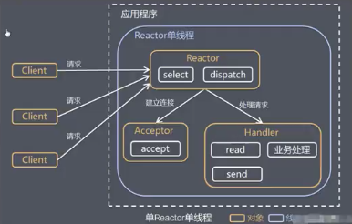
  >   >
  >   >   会有阻塞问题，服务器端使用一个线程通过多路复用搞定所有IO操作，但是连接多了将无法支撑，适合在客户端数量有限，业务处理快速，等场景
  >   >
  >   > * 单Reator 多线程
  >   >
  >   >   Reator 对象通过select 监控客户端请求事件，收到事件后，通过dispator 进行分发
  >   >
  >   >   如果建立连接请求，则右Acceptor 通过accept 处理连接请求，然后创建一个Handler 对象处理完成连接后的各种事件
  >   >
  >   >   如果不是连接请求，则reator分发调用连接对于的Handler 去处理，handler 只负责响应时间，不做具体的业务处理，通过read 读取数据之后，会分发给后面的 worker 线程池的某个线程池处理业务
  >   >
  >   >   worker线程池分配独立的线程池完成真正的业务，并将结果返回给handler
  >   >
  >   >   handler 收到响应后，通过send 将结果返回给client
  >   >
  >   >   **Dispatch: 只负责分发**
  >   >
  >   >   **Handler：只负责接收请求**
  >   >
  >   >   **Worker： 负责干具体的活**
  >   >
  >   >   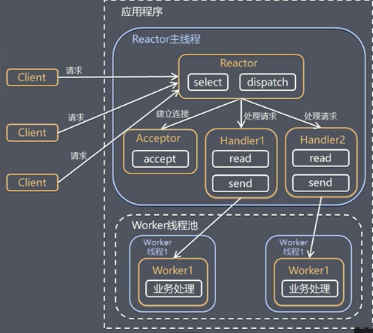
  >   >
  >   >   **优点**：可以充分的利用多核CPU 的处理能力
  >   >
  >   >   **缺点**：多线程数据共享和访问比较复杂，reator 处理多有的事件的监听和响应并且它在单线程运行，在高并发情况下容易出现性能瓶颈
  >   >
  >   > * 主从Reator 多线程： netty
  >   >
  >   >   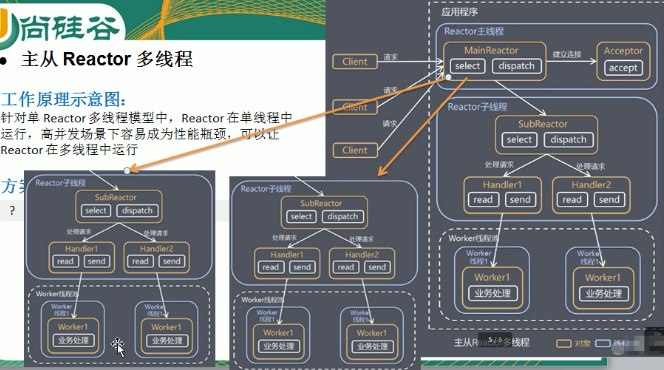
  >   >
  >   >   Reator 主线程：MainReator 对象通过select 监听连接事件，收到事件后，通过Acceptor 处理连接事件
  >   >
  >   >   当Acceptor 处理连接事件后，MainReator 将连接分配给subReator
  >   >
  >   >   SubReator 将连接加入到连接队列，进行监听，并创建Handler 进行各种事件处理，
  >   >
  >   >   当有新的事件发生时，subReator 就会调用对的handler 处理
  >   >
  >   >   handler 通过read 读取数据，分发给后面的 worker 线程处理
  >   >
  >   >   worker 线程池分配独立的 worker 线程进行业务处理，并返回结果
  >   >
  >   >   handler 收到响应的结果后，再通过send 将结果返回给client
  >   >
  >   >   Reator 主线程可以对应多个Reator子线程，及MainReator 可以关联多个SubReator

* Netty 模型

  > 抽象出2组线程池，
  >
  > * BossGroup
  >
  >   > 专门负责客户端的连接
  >
  > * WorkerGroup
  >
  >   > 专门负责网络的读写
  >
  > BossGroup 和 WorkGroup 的类型都是NIOEventLoopGroup，相当于是是个事件循环组，这个组中有多个事件循环，每个事件循环是NIOEventLoop
  >
  > NIOEventLoop 表示一个不断循环执行处理任务的线程，每个NIOEventLoop 都有一个selector，用于监听绑定在其上的socket 的网络通讯
  >
  > NIOEventLoopGroup 可以包含有多个线程，可以有多个 NIOEventLoop
  >
  > 每个 Boss NIOEventLoop 执行的步骤有3步
  >
  > 1. 循环accept 事件
  > 2. 处理accept 事件，和client 建立连接，生成NIOSocketChannel 并将其注册到某个WorkerNioEventLoop 上的selector
  > 3. 处理任务队列中的任务 runAllTasks
  >
  > WorkerGroup下的工作
  >
  > 每个Worker NIOEventLoop 循环执行的步骤，
  >
  > 1. 轮询read，write 事件
  >
  > 2. 处理i/o 事件，及read write 事件，在对应的NIOSocketChannel
  >
  > 3. 处理任务队列中的任务 runAllTasks
  >
  > **Pipeline**
  >
  > 处理器的机制，如拦截，过滤等
  >
  > 每个Worker NIOEventLoop 处理作业时候，会使用pipeline，pipeline 中包含了channel。pipeline 中会有很多的处理器，处理器可以是netty 自带的或者用户自定义的。
  >
  > 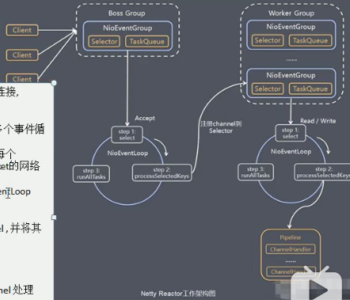
  >
  > 1. BossGroup： 负责接收请求
  >
  > 2. WorkGroup: 负责读取请求数据
  >
  > 3. Pipeline: 具体数据的处理逻辑handler

  * TaskQueue

  > 对于某些 在 Handler 中需要长时间处理的任务，可以将这些任务提交到对应的 TaskQueue 中异步执行
  >
  > TaskQueue 和 channel 有一个绑定关系
  >
  > 任务队列中的Task 有3中典型的使用场景
  >
  > * 用户程序自定义的普通任务
  > * 用户自定义定时任务
  > * 当前Reactor 线程调用Channel 中的各种方法

* Future

  > * 表示异步的执行结果，可以通过它提供的方法来检测执行是否完成，
  >
  > * ChannelFuture 是一个接口 interface ChannelFuture extend Future<Void> 可以添加监听器，当监听的事件发生的时候，就会通知到监听器，在netty 中有很多的实现
  >
  > * Future-Listener
  >
  >   当Future 对象刚刚创建的时候，处于非完成状态，使用者可以通过返回的ChannelFuture来获取操作执行的状态，注册监听函数来执行完成后的操作，常见的操作有
  >
  >   ​	isDone、isSuccess、getCause、isCancelled、addListener

* 一些核心模块

  > * Bootstrap ServerBootstrap
  >
  >   > Bootstrap 是引导，一个Netty 程序是由这里开始，主要作用是配置整个Netty 程序，串联各个组件，Netty 中 bootstrap 类是客户端程序的启动引导类，ServerBootstrap 是服务端启动引导类
  >   >
  >   > 常见的方法有
  >   >
  >   > * group(EventLoopGroup parentGroup, EventLoopGroup childGroup): 用户服务端，设置 2个 EventLoop
  >   > * group(EventLoopGroup group) 客户端类，设置一个 EventLoopGroup
  >   > * channel 设置一个服务器端的通道实现
  >   > * option: serverChannel 添加配置
  >   > * childOption:  给接收到的通道添加配置
  >   > * childHandler: 用来配置业务员处理类，对应的是workerGroup
  >   > * handler:  该handler 对应的是bossGroup
  >   > * bind: 用于服务器端绑定端口
  >   > * connection 用于客户端，连接服务器
  >
  >   Netty 中所有的IO 操作都是异步的，不能立刻得到消息是否被正确处理，但是可以过一会等它执行结束或者直接注册一个监听，具体的实现就是通过Future 和 ChannelFutures，当操作执行成功或者失败时候监听自动触发监听的事件
  >
  > * Selector
  >
  >   > Netty 基于 selector 对象实现IO 多路复用，通过selector 一个线程可以监听多个连接的Channel 事件
  >   >
  >   > 当向一个 selector 中注册 Channel 后，selector 内部的机制就可以自动不断的查询这些注册的channel 是否有就绪的IO 事件(读写网络连接等)，这样程序就可以很简单的使用一个线程高效的管理多个Channel
  >   >
  >   > ChannelHandler 是一个接口，处理IO 事件或拦截IO操作，并将其转发到其ChannelPipeline 中的下一个处理程序、
  >   >
  >   > ChannelHasndler 本身并没有提供很多的方法，因为这个接口有许多的方法需要实现，方法使用期间，可以继承他的子类
  >
  >   出栈OutBound 和 入栈 InBound 是相对于 客户端而言的，从客户端到服务端称为出栈
  >
  >   ```java
  >   继承 ChannelInboundHandlerAdapter 会需要重写几个方法，这些方法均是Channel 中的事件，当发生这些事件的时候，就会执行覆写的方法
  >   channelActive: 通道就绪事件
  >   channelInactive
  >   channelRead 通道读数据事件
  >   channelReadComplete: 通道读取完毕事件
  >   exceptionCaught: 通道内发生异常事件
  >   ```
  >
  > * ChannelPipeline 
  >
  >   > ChannelPipeline 是一个Handler 的集合，它会负责处理和拦截inBound 或者 outbound 的事件和操作，相当于一个贯穿 Netty 的链，(也可以理解：ChannelPipeline 是保存 ChannelHandler 的list 用于处理或者拦截 Channel 的入栈事件和出站操作)
  >   >
  >   > ChannelPipeline 实现了一种高级形式的或者过滤模式，使用户可以完全静止事件的处理方式，以及Channel 中的各个ChannelHandler 是如何处理相互交互
  >
  >   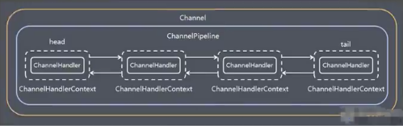
  >
  >   在Netty 中每个channel 都有且仅有一个 channelPipeline 与之对应，他们的组成关系如上图，
  >
  >   一个Channel 包含了一个ChannelPipeline，而ChannelPipeline 中又维护了一个由ChannelHandlerContext组成的双向链表，并且每个ChannelHandlerContext 中又关联这一个ChannelHandler
  >
  >   入栈事件和出站事件在一个双向链表中，入站事件会从链表head 往后传递到最后一个入站的handler，出站事件从链表的 tail 往前传递到最前一个出站的handler，两种类型的handler 互不干扰
  >
  >   一般而言 head 部是 client 而尾部是 tail
  >
  > * ChannelHandlerContext
  >
  >   > * 保存了Channel 相关的所有上下文信息，同时关联一个ChannelHandler 对象
  >   >
  >   > * ChannelHandlerContext 中包含一个具体的实际处理器ChannelHandler 同时
  >   >
  >   >   ChannelHandlerContext 中也绑定了对于的 pipeline  和 channel 的信息，方便对ChannelHandler 进行调用
  >   >
  >   > 常用方法
  >   >
  >   > * close: 关闭通道
  >   > * flush：刷新
  >   > * writeAndFlush：写并刷新
  >   >
  >   > ChannelOption
  >   >
  >   > * ChannelOption.SO_BACKLOG
  >   >
  >   >   对应TCP/IP 协议 listen 函数中的backlog 参数，用来初始化服务器可连接队列的大小，服务端处理客户端连接请求是顺序处理的，所以同一个世界只能处理一个客户端连接，多个客户端来的时候，服务端将不能处理的客户端连接请求放在队列中等待处理，backlog 参数指定了队列的大小
  >   >
  >   > * ChanelOption.SO_KEEPALIVE
  >   >
  >   >   一直保持连接活动状态
  >
  > * EventLoopGroup 和其实现类 NioEventLoopGroup
  >
  >   > EventLoopGroup 是一组 EventLoop 的抽象，Netty 为了更好的利用CPU 的资源，一般会有多个EventLoop 同时工作，每个EventLoop 维护者一个Selector
  >   >
  >   > EventLoopGroup 提供了next 接口，可以从组里安装一定规则获取其中一个EventLoop 来处理任务，在Netty 服务器端编程中，我们一般都需要提供2个EventLoopGroup， Boss 和 worker 的
  >   >
  >   > 通常一个服务端口既一个ServerSocketChannel 对应一个Selector 和 一个 EventLoop 线程，BossEventLoop 负责接收客户端的连接并将SocketChannel 交给WorkerEventLoopGroup 来进行IO 处理
  >   >
  >   > 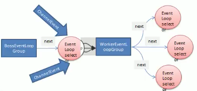
  >   >
  >   > BossEventLoopGroup 通常识一个单线程的EventLoop， EventLoop 维护者一个注册了ServerSocketChannel 的Selector 实例，BossEventLoop 不断轮询Selector 将连接事件分离出来。
  >   >
  >   > 通常是OP_ACCEPT 事件，然后将接收到的SocketChannel 交给WorkerEventGroup，WorkerEventGroup 会有next 选择其中一个 WorkerEventGroup 将这个SocketChannel 注册到其维护的Selector 并对后续的IO 事件进行处理
  >
  > * HeartBeat

* Protobuf 编码和解码

  > 数据在网络上的传输都是二进制字节码的，在发送数据时候需要编码，接收数据的时候需要解码。
  >
  > codec(编解码器)，有 decoder 和 encoder 组成
  >
  > 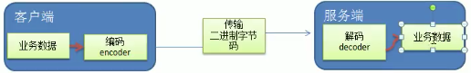
  >
  > Netty 本身提供一些codex
  >
  > * StringEncoder： 字符串数据进行编码
  > * ObjectDecoder： Java 对象编码
  >
  > Netty 本身自带的ObjectDecoder  和 ObjectEncoder 可以用来实现POJO 对象或各种业务员对象的编码和解码，底层使用的仍是Java 序列化技术，效率不高，存在如下问题：
  >
  > * 无法跨语言
  > * 序列化后体积大，是二进制的5被多
  > * 序列化性能太低
  >
  > Protohuf 解决上述的问题
  >
  > ---
  >
  > Protobuf 是一种更轻便高效的结构化数据存储格式，可以用于结构化数据串行化，或者序列化，适合做数据存储和**RPC 数据交换格式**
  >
  > * 高性能，高可靠性
  > * 自动生成代码
  >
  > 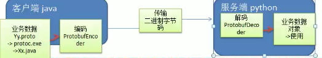
  >
  > 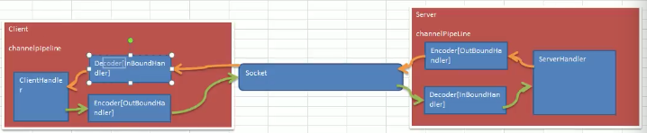

* Netty 提供的编解码器

  > * ReplayingDecoder
  >
  >   简化了ByteToMessageDecoder 类，使用这个类，我们不必调用readableByte 方法，参数S 指定了用户状态管理的类型，其中void 代表不需要状态管理
  >
  >   有局限性：并不止所有的ByteBuf都支持，会比较慢于 ByteToMessageDecoder

* TCP 粘包和拆包

* RPC

  > 远程过程调用，是一个计算机通信协议，该协议允许调用于另外一台计算机程序，而程序猿无序额外的位这个交互做编程。
  >
  > 两个活多个应用程序都分布在不同的服务器上，它门之间的调用都像是本地方法调用一样。
  >
  > 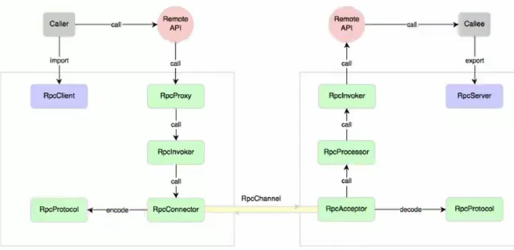
  >
  > 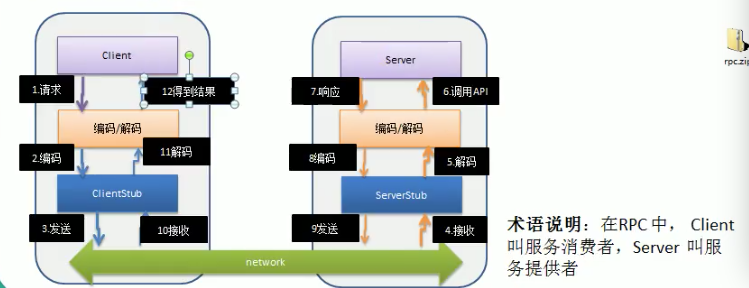
  >
  > 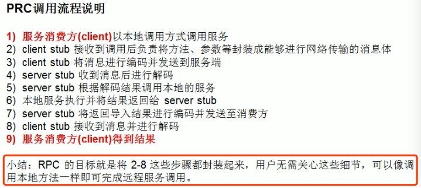
  >
  > 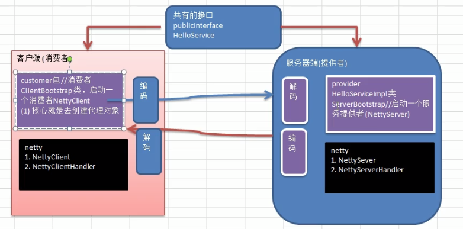
  >
  > 


