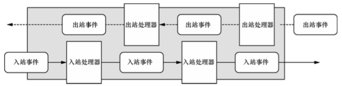
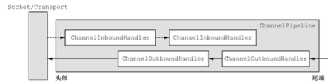
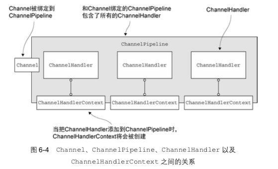

#### Netty 核心组件

* Channel
* 回调
* Future
* 事件和ChannelHandler

##### Channel

> 代表一个到实体(如一个硬件设备、一个文件、或者一个能够执行一个或者多个不同IO操作的程序组件)的开发连接，如读操作 和 写操作。
>
> 目前 可以将 Channel 看做是传入(入站)或者传出(出站)数据的载体，所以可以被打开或者关闭，连接或者断开连接。

#####  回调

> 就是 一个方法，一个指向已经被提供给另外一个方法的方法的引用，后者可以在合适的时候调用前者，是在操作完成之后通知相关方最常见的方式之一。
>
> Netty 内部使用回调处理事件，当一个回调被触发时，相关的实际可以被一个interfaceChannelHandler 的实现处理，当一个新的连接被建立时，ChannelHandler的channelActive 回调方法被调用，并打印出一条消息。

##### Future

> 提i供另外一种在操作完成时候通知应用程序的方式，这个对象可以看做是一个异步操作的结果占位符，它将在未来的某个时候完成。
>
> Netty 有提供 自己的ChannelFuture 实现，ChannelFuture 有一些额外的方法，可以使得我们能够注册一个或者多个ChannelFutureListener 实例，
>
> 每个Netty 的出站IO都返回一个ChannelFuture(都不会阻塞，也就是Netty是完全异步和事件驱动的)

##### 事件和ChannelHandler

> 接口族的父接口，负责接收并响应时间事件通知，用来定义响应入站事件的方法。
>
> Netty 使用不同的事件来通知我们状态的改变或者是操作的状态，这使得我们能够基于已经发生的事件来触发适当的动作，这些动作可能是
>
> * 记录日志
> * 数据转换
> * 流控制
> * 应用程序逻辑
>
> Netty 是一个网络编程框架，所以事件是按照它们出站入站数据流的相关性进行分类的。
>
> * 读数据
> * 用户事件
> * 等  
>
> 每个事件都可以分发给ChannelHandler类中的某个用户实现的方法，ChannelHandler 的实例类似于一种为 了响应特定事件而被执行的回调。
>
> 
>
> Netty 提供了很多开箱即用的ChannelHandler 的实现，如：HTTP和SSL/TSL 的ChannelHandler。

##### 选择器、事件和EventLoop

> Netty 通过触发事件将Selector 从应用程序中抽象出来，消除了所有本来将需要手动编写的派发代码，
>
> 在内部，将会为每个 Channel 分配一个 EventLoop，用以处理所有事件
>
> * 注册感兴趣的事件
> * 将事件派发给ChannelHandler
> * 安排进一步的动作。
>
> EventLoop 是一个线程驱动，其处理一个Channel 的所有IO事件。

---

#### Channel、EventLoop、ChannelFuture

Channel: 可以认为是Socket 的抽象

EventLoop: 可以认为是控制流、多线程处理、并发

ChannelFuture： 异步通知

> **Channel 接口**
>
> 基本的 I/O 操作(bind()、connect()、read()和 write())，Netty 的 Channel 接 口所提供的 API，大大地降低了直接使用 Socket 类的复杂性
>
> **EventLoop**:
>
> EventLoop 定义了 Netty 的核心抽象，用于处理连接的生命周期中所发生的事件
>
> 运行任务来处理在连接的生命周期内发生的事件是任何网络框架的基本功能。与之相应的编 程上的构造通常被称为事件循环，等待事件的到来。
>
> 一个 EventLoopGroup 包含一个或者多个 EventLoop;
> 一个 EventLoop 在它的生命周期内只和一个 Thread 绑定;
> 所有由 EventLoop 处理的 I/O 事件都将在它专有的 Thread 上被处理;
> 一个 Channel 在它的生命周期内只注册于一个 EventLoop;
> 一个 EventLoop 可能会被分配给一个或多个 Channel
>
> **ChannelFuture**
>
> Netty 中所有的 I/O 操作都是异步的。因为一个操作可能不会 立即返回，所以我们需要一种用于在之后的某个时间点确定其结果的方法。为此，Netty 提供了 ChannelFuture接口，其addListener()方法注册了一个ChannelFutureListener，以 便在某个操作完成时(无论是否成功)得到通知。
>
> **Channel建立连接，EventLoop 处理 连接消息，ChannelFuture消息处理完之后的回调**

#### ChannelHandler ChannelPipeline

> Netty 的主要组件是 ChannelHandler，它充当了所有 处理入站和出站数据的应用程序逻辑的容器
>
> 因为 ChannelHandler 的方法是 由网络事件(其中术语“事件”的使用非常广泛)触发的
>
> ChannelPipeline 提供了 ChannelHandler 链的容器
>
> 当 Channel 被创建时，它会被自动地分配到它专属的 ChannelPipeline。
>
> 
>
> ChannelHandler 安装到 ChannelPipeline 中的过程如下所示:
>
> 一个ChannelInitializer的实现被注册到了ServerBootstrap中 1;
>  当 ChannelInitializer.initChannel()方法被调用时，ChannelInitializer
>
> 将在 ChannelPipeline 中安装一组自定义的 ChannelHandler; ChannelInitializer 将它自己从 ChannelPipeline 中移除。
>
> 
>
> 如果一个消息或者任何其他的入站事件被读取，那么它会从 ChannelPipeline 的头部 开始流动，并被传递给第一个 ChannelInboundHandler。这个 ChannelHandler 不一定 会实际地修改数据，具体取决于它的具体功能，在这之后，数据将会被传递给链中的下一个 ChannelInboundHandler。最终，数据将会到达 ChannelPipeline 的尾端，届时，所有 处理就都结束了。
>
> 数据的出站运动(即正在被写的数据)在概念上也是一样的。在这种情况下，数据将从 ChannelOutboundHandler 链的尾端开始流动，直到它到达链的头部为止。在这之后，出站 数据将会到达网络传输层，这里显示为 Socket。通常情况下，这将触发一个写操作。
>
> 当 ChannelHandler 被添加到 ChannelPipeline 时，它将会被分配一个 ChannelHandlerContext，其代表了 ChannelHandler 和 ChannelPipeline 之间的绑定。
>
> 

#### 编码器和解码器

> 入站发生一次解码： 字节转为Java 对象
>
> 出站：Java 对象转为字节

#### ByteBuf类- Netty 的数据容器

> netty buffer 中不需要使用 flip 转换
> netty buffer 中维护了 readerIndex 和 writeIndex
> buffer.getByte(i) 读取的时候不会造成 readerIndex 的变化
> buffer.readByte() 会造成 readerIndex 的变化
> readerIndex 和 writerIndex 以及 capacity 将 buffer 分为三段
>
> readerIndex --> writerIndex 是可读的区域
> writerIndex --> capacity        可写的区域
>
> 名称以 read 或者 write 开头的 ByteBuf 方法，将会推进其对应的索引，而名称以 set 或 者 get 开头的操作则不会
>
> **使用模式**
>
> * 堆缓冲区:数据存储在 JVM 的堆空间中
> * 直接缓冲区:直接缓冲区对于网络数据传输是理想的选择，但是它们的分配和释放都较为昂贵
> * 复合缓冲区：
>
> **字节级操作**
>
> ```java
> byte b = buffer.getByte(i);
> ```
>
> **顺序访问索引**
>
> ```java
> 
> ```
>
> 

