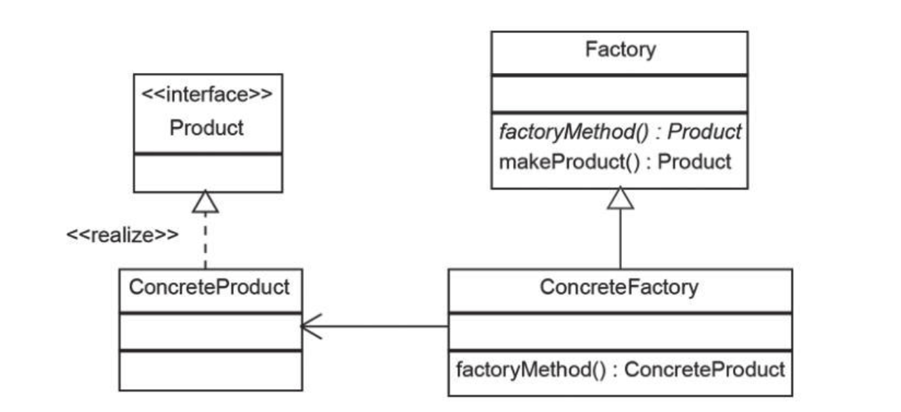
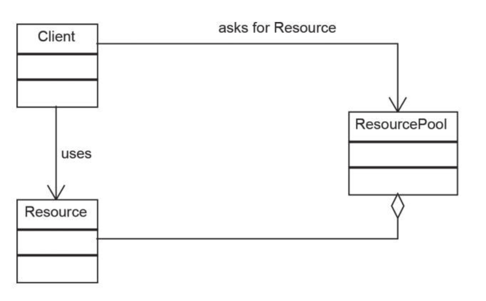

创建型设计模式：

* 单例
* 工厂
* 建造者
* 原先
* 对象池

这些模式都能够实现新对象的实例化，题号创建对象代码的灵活性和重用性

---

* 单例模式

> 确保一个对象只能创建一个实例
>
> 所有的构造器都被申明为私有的，然后通过静态方法实现全局访问获得单例实例

```java
public class SingleTon {
    private static SingleTon instance;
    private SingleTon() {
    }
    public static SingleTon getInstance() {
        if (instance == null) {
            instance = new SingleTon();
        }
        return instance;
    }
}

// 调用
SingleTon singleTon = SingleTon.getInstance();
```

> 以上的实现单例模式的方法在多线程的环境下回出现问题，如第一个线程刚好在创建的时候运行到第6行，然后有一个线程刚好也运行大这里，发现instance还是空的，所以这个时候两个线程会创建出2个实例。
>
> 解决这个问题，可以进行同步锁
>
> ```java
> public class SingleTon {
>     private static SingleTon instance;
>     private SingleTon() {
>     }
>     public static synchronized SingleTon getInstance() {
>         if (instance == null) {
>             instance = new SingleTon();
>         }
>         return instance;
>     }
> }
> ```
>
> 同步意味着**延迟** 还有一种方式是在实例化静态成员的方式来确保一个类只有一个实例，便面了同步锁，以及null的判断
>
> ```java
> public class SingleTon {
>     private static SingleTon instance = new SingleTon();
>     private SingleTon() {
>     }
>     public static SingleTon getInstance() {
>         return instance;
>     }
> }
> ```

* 工程模式

> 用于实现逻辑的封装，并通过公共的接口提供对象的实例化服务，在添加新的类时只需要做少量的修改。
>
> **简单模式**
>
> ```java
> interface Vehicle{
> }
> 
> class Truck implements Vehicle {
> }
> 
> class Car implements Vehicle {
> }
> 
> class Bike implements Vehicle {
> }
> public class Factory {
>     public enum Type{
>         Bike, Car, Truck
>     }
> 
>     public static Vehicle create(Type type) {
>         if (type.equals(Type.Car))
>             return new Car();
>         if (type.equals(Type.Bike))
>             return new Bike();
>         if (type.equals(Type.Truck))
>             return new Truck();
>         else return null;
>     }
> }
> ```
>
> 工厂类逻辑非常简单，只负责Vehicle类的实例化，符合单一职责原则；用户只调用Vehicle接口，这样做可以减少耦合，符合依赖倒置原则；但是当增加一个新的Vehicle类时，需要对VehicleFactory类进行修改，这样就打破了开闭原则。可以使用2中方式解决这个问题
>
> * 使用反射机制，但在某些情况下，反射机制并不适用。比如，反射机制需要运行时权限，这在某些特定环境中是无法实现的。反射机制也会降低程序的运行效率，在对性能要求很高的场景下应该避免使用这种机制。
> * 注册产品对象并向每个产品添加newInstance方法，该方法返回与自身类型相同的新实例。
>
> ```java
> interface Vehicle{
>     Vehicle newInstance();
> }
> 
> class Truck implements Vehicle {
>     @Override
>     public Vehicle newInstance() {
>         return new Truck();
>     }
> }
> 
> class Car implements Vehicle {
>     @Override
>     public Vehicle newInstance() {
>         return new Car();
>     }
> }
> 
> class Bike implements Vehicle {
>     @Override
>     public Vehicle newInstance() {
>         return new Bike();
>     }
> }
> public class Factory {
>     public enum Type{
>         Bike, Car, Truck
>     }
> 
>     private Map<Type, Vehicle> factory = new HashMap();
> 
>     public void registryVehicle(Type type, Vehicle vehicle) {
>         factory.put(type, vehicle);
>     }
>     public  Vehicle create(Type type) {
>         return factory.get(type).newInstance();
>     }
> }
> ```
>
> * 工厂方法模式
>
> 

> 工厂类被抽象化，用于实例化特定产品类的代码被转移到实现抽象方法的子类中。这样不需要修改就可以扩展工厂类。
>
> ```java
> interface Vehicle{
>     Vehicle newInstance();
> }
> 
> class Truck implements Vehicle {
>     @Override
>     public Vehicle newInstance() {
>         return new Truck();
>     }
> }
> 
> class Car implements Vehicle {
>     @Override
>     public Vehicle newInstance() {
>         return new Car();
>     }
> }
> 
> class Bike implements Vehicle {
>     @Override
>     public Vehicle newInstance() {
>         return new Bike();
>     }
> }
> 
> 
> abstract class VehicleFactory {
>     protected abstract Vehicle createVehicle(String size);
> 
>     public Vehicle orderVehicle(String size, String color) {
>         Vehicle vehicle = createVehicle(size);
>         vehicle.setColor(color);
>         return vehicle;
>     }
> }
> 
> class CarFactory extends VehicleFactory {
> 
>     @Override
>     protected Vehicle createVehicle(String size) {
>         if (size.equals("small")) {
>             return new Car();
>         }
>         if (size.equals("big")) {
>             return new Truck();
>         }
>         return Bike::new;
>     }
> }
> public class Factory {
>     public enum Type{
>         Bike, Car, Truck
>     }
> 
>     private Map<Type, Vehicle> factory = new HashMap();
> 
>     public void registryVehicle(Type type, Vehicle vehicle) {
>         factory.put(type, vehicle);
>     }
>     public  Vehicle create(Type type) {
>         return factory.get(type).newInstance();
>     }
> }
> ```
>
> 注意上述中Factory 之间的继承关系。市场调查显示卡车的需求量很大，因此我们建一个卡车工厂（TruckFactory）。这个时候就之间创建一个工厂，而 不需要修改已存在的工厂了。

* 原型模式

> 实际上它只是一种克隆对象的方法, 使用的时候继承 closeable 接口，并实现，克隆一个和当前一某一样的对象出来。

* 对象池模式

> 共享这些创建成本高昂的对象，这称为对象池模式。
>
> 

> ResourcePool（资源池类）：用于封装逻辑的类。用来保存和管理资源列表。
>
> Resource（资源类）：用于封装特定资源的类。资源类通常被资源池类引用，因此只要资源池不重新分配，它们就永远不会被回收。
>
> Client（客户端类）：使用资源的类。
>
> ```java
> public Resource acquireResource() {
>         
>         if (available.size() <= 0) {
>             Resource e = new Resource();
>             inuse.add(e);
>             return e;
>         }else {
>             return available.remove(0);
>         }
>     }
>     
>     public void releaseResource(Resource resource) {
>         available.add(resource);
>     }
> ```
>
> 当客户端需要新资源的时候，会向资源池申请，资源池类检查后获取第一个可使用资源并返回给客户端。
>
> 当客户端释放的时候，资源会重新回到资源池，以便重复使用
>
> 这种典型使用场景是**数据库连接池**

