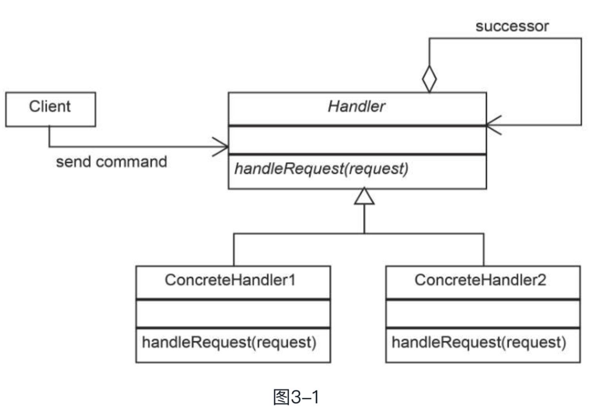

行为型模式

此类模式关注**对象交互、通信和控制流**，大多数行为型模式都基于组合和委托而不是继承，

* 责任链
* 命令
* 解释器
* 迭代器
* 观察者
* 中介者
* 备忘录
* 状态
* 策略
* 模板方法
* 空对象
* 访问者

---

* 责任链模式

计算机用来处理信息，有多重不同的方式来组织和处理信息，就像前文了解到应该赋予一个类单一的职责，从而使得类容易维护和扩展。

有这么一个场景，需要对一批用户端来的数据进行不同的操作，那么需要使用不同得的类负责不同的操作，而不是使用一个类集成所有的操作，这样做到代码松耦合且简洁。

这些类称为处理器，第一个处理器接收请求，如果需要执行操作则执行一次调用，如果不需要则将请求转给第二个处理器。也就是需要则处理，否则将请求转到下一个处理器。



* Client 客户端实例化一个处理器的链，然后在第一个对象中调用handleRequest 方法
* Handler: 处理器，这是一个抽象类，提供给所有实际处理器进行继承，它拥有一个 handleRequest 方法，用来接收需要处理的请求
* ConcretHandler: 具体处理器，这是一个实现了 handleRequest 方法的具体类，每一个具体处理器都维持一个引用，它指向链中下一个具体处理器，需要检查它自身是否能处理这个请求，不能就将请求传递给链中的下一个具体的处理器。

> 在上个项目上确实是有场景使用到这个设计模式的，pipeline 输入列的校验，每个参数有不同的类型，不同的类型有不同的校验规则，那么当一个算子输入列进来的时候，先判断参数的类型，然后根据类型去判断是使用当前校验规则呢，还是下一个校验规则。

主要逻辑代码如下：

```java
    protected Handler successor;
    public void setSuccessor(Handler successor) {
        this.successor = successor;
    }
    public void handleRequest(Request request) {
        if (canHandle(request)) {
            // handle code
        }else {
            successor.handleRqquest();
        }
    }
```

客户端在调用链头之前建立处理器链。

---

* 命令模式

> 在OOP编程中，一个很重要的事情就是设计能够使得代码从耦合，如我们需要开发一个复杂的程序，用来绘制如 点、线、圆、矩形等图像，为了能够让代码能够实现所有的类的形状，需要实现很多操作来处理菜单操作，为了让程序可维护，需要创建一个统一的方法来定义所有的命令，这样做便能将所有实现细节隐藏在程序之中(这个程序实际上就是客户端)
>
> * 提供统一的方法来封装命令和其他所需要的参数来执行一个动作
> * 允许处理命令