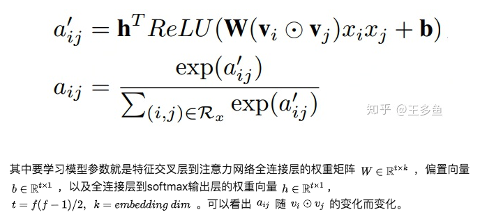

* 论文主要思想

> FM 构建的交叉特征中，不是所有的交叉特征都是有用的，没用的交叉特征就是噪声，通过引入**注意力机制**给重要的交叉特征较大权重，不重要的交叉特征小的权重。

* 模型结构

​	**Sparse Input**：输入稀疏特征；

​	**Embedding Layer**：对输入的特征进行Embedding编码；

​	**Pair-wise Interaction Layer**：两两特征交叉；

​	**Attention-based Pooling**：基于注意力机制的网络层；

​	**Prediction Score**：输出预测得分；

* 公式

