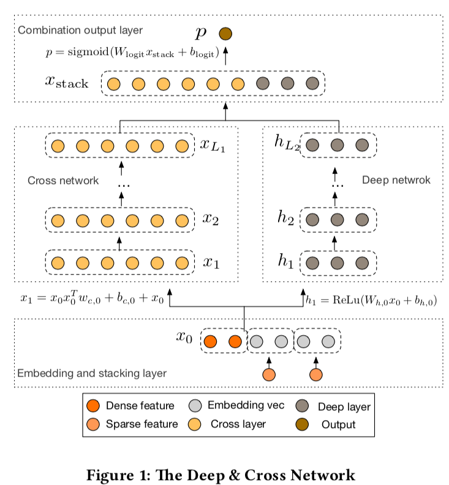
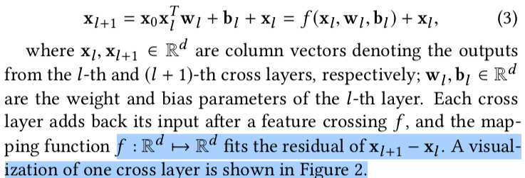
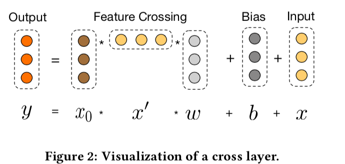

* Abstract

  Identifying effective feature interactions has been the key to the success of many prediction models

  > DNN 隐式学习所有的组合，在学习所有类型的交叉特征方面不一定有效。
  >
  > DCN: 每一次显示构建交叉特征。

* Introduction

  > 1. exploring unseen or rare cross features is the key to making good predictions
  > 2. 交叉特征是累计做出来的，受层数影响
  > 3. DNN 使用残差网络
  > 4. The features learned by DNNs, on the other hand, are implicit and highly nonlinear

* Main Contribution

  > 1. automatic feature learning with both sparse and dense inputs
  > 2. a novel cross network that **explicitly applies** feature crossing at each layer, efficiently learns predictive cross features of **bounded degrees,**
  > 3. thehighest polynomial degree increases at each layer and is **determined by layer depth**. The network consists of all the cross terms of degree up to the highest

* DCN

  > A DCN model starts with an embedding and stacking layer, followed by a cross network and a deep network in parallel. These in turn are followed by a final combination layer which combines the outputs from the two networks
  >
  > 

* Cross Netowrk

  >  The key idea of our novel cross network is to apply explicit feature crossing in an efficient way
  >
  > 

* High-degree Interaction Across Features

  > 

* Deep Network

  > The deep network is a fully-connected feed-forward neural network

* Combination Layer

  > The combination layer concatenates the outputs from two networks and feed the concatenated vector into a standard logits layer.

* FM 模型的推广

  > The cross network shares the spirit of parameter sharing as the FM model and further extends it to a deeper structure.
  >
  > Therefore, the cross network extends the idea of parameter sharing from a single layer to multiple layers and high-degree cross-terms.

bounded degrees ?

